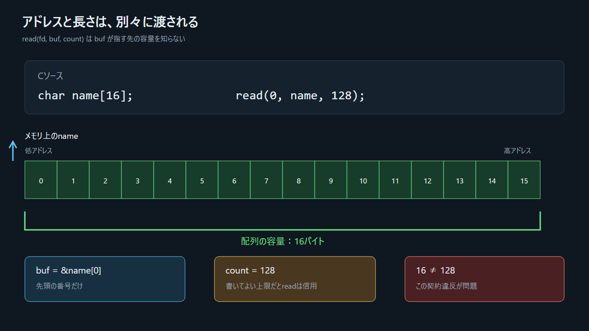

## 2.1 プロセスとスレッドを分ける

プロセスは、実行中のプログラムに、仮想アドレス空間、ファイル記述子、権限などを結び付けたOS上の実行単位である。スレッドはその中の実行の流れで、各スレッドは個別のレジスタ状態とスタックを持つ。

この資料は単一スレッドだけを扱う。「プロセスの`RIP`」と簡略に言う場合も、正確には「実行中のスレッドの`RIP`」を指す。

## 2.2 メモリは番号付きのバイト列

メモリの各バイトには番号がある。その番号がアドレスである。ポインタはアドレスを値として保持する変数である。

```c
char name[16];        // 16バイトの配列
char *p = name;       // pはname[0]のアドレスを持つ
```



> 図: 先頭アドレスと長さは別の情報である。ポインタ単体には配列の大きさが入っていない。

`read(STDIN_FILENO, name, 128)`の第2引数は書き込み先の先頭アドレス、第3引数は最大書き込み数である。`read`に渡される情報に「`name`は16バイト」は含まれない。

## 2.3 仮想アドレス空間の全体


> 図: 図のスタックは上が高アドレス、下が低アドレス。x86-64では通常、使用領域が低アドレス側へ広がる。

| 領域 | 今回の例 | 主な用途 |
|---|---|---|
| 命令領域 | `win`, `greet`, `read_name`, `main` | CPUが命令として取得する |
| 読み取り専用データ | `"YOU WIN"`, `"Goodbye"` | 定数文字列 |
| ヒープ | 本例では未使用 | 動的に確保するオブジェクト |
| 共有ライブラリ | `puts`, `printf`, `read`, `exit` | 外部関数の実装 |
| スタック | `name[16]`, 保存されたフレーム情報、戻り先 | 関数呼び出しに伴う一時状態 |

C言語の仕様が「すべての局所変数をスタックに置く」と定めているわけではない。コンパイラは最適化によってレジスタだけに置いたり、変数自体を消したりできる。このビルド条件では、観察しやすくするため`name`がスタック上に置かれる。

## 2.4 ページと権限

仮想メモリはページ単位で管理され、主に読み取り、書き込み、実行の権限を持つ。

```text
命令領域       読取=可  書込=不可  実行=可
読取専用データ 読取=可  書込=不可  実行=不可
ヒープ/スタック  読取=可  書込=可    実行=通常不可
```

同じバイト列でも、CPUがデータとして読むか、命令位置から命令として取得するかで意味が変わる。ただし実行権限のないページからの命令取得はOSが停止させる。
