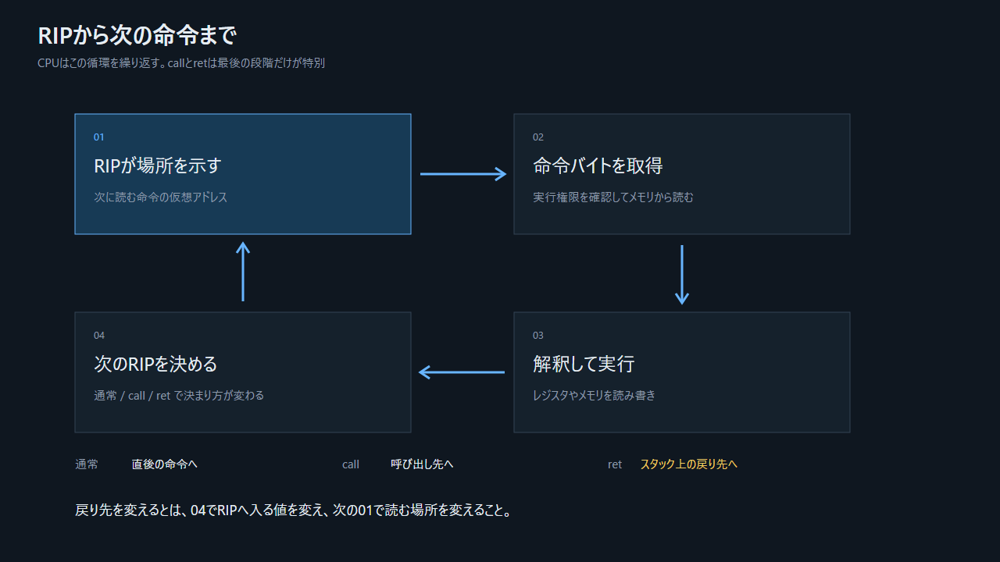

## 3.1 レジスタは複数ある

| 種類 | 主なレジスタ | 本編での役割 |
|---|---|---|
| 汎用 | `RAX`, `RBX`, `RCX`, `RDX`, `RSI`, `RDI`など | 値、アドレス、関数の引数を運ぶ |
| スタック位置 | `RSP` | 現在のスタック先頭を指す |
| フレーム基準 | `RBP` | このビルドでは関数内の配置を追う基準 |
| 命令位置 | `RIP` | 次に取得する命令の仮想アドレス |
| 状態 | `RFLAGS` | 比較結果や制御フラグ |

`RIP`は「実行中の命令そのもの」ではなく、次に命令として読む場所を指す状態である。

## 3.2 命令実行の論理モデル



> 図: これはアーキテクチャ上の見える因果のモデルであり、内部実装の時間順序をそのまま表すものではない。

1. CPUが`RIP`の仮想アドレスを参照する。
2. 仮想アドレスがページテーブルによって物理メモリ側の位置へ対応付けられる。実機ではTLBやキャッシュが高速化する。
3. CPUが命令バイトを取得し、命令と操作対象を解釈する。
4. 計算、レジスタ更新、メモリ書き込みなどを行う。
5. 通常命令なら次の命令へ、分岐や`call`/`ret`なら指定された場所へ`RIP`が移る。

重要点は一つだけである。CPUはCの関数名や`if`文を直接理解しない。現在の`RIP`が示す場所から命令を取り続ける。

## 3.3 三つの基本操作

```asm
mov rsi, rax        ; RAXの64ビット値をRSIへ複製
lea rax, [rbp-16]   ; RBP-16というアドレスをRAXへ入れる
mov eax, [rbp-4]    ; RBP-4が指すメモリの4バイトをEAXへ読む
```

`mov DWORD PTR [rbp-4], edi` に続けて `mov eax, DWORD PTR [rbp-4]` のように一度メモリを経由するコードは、最適化を切ったコンパイルで現れやすい。C上の変数をスタック上の位置として忠実に表すためで、機械語の必須動作ではない。最適化すれば`mov eax, edi`相当にまとまることがある。
