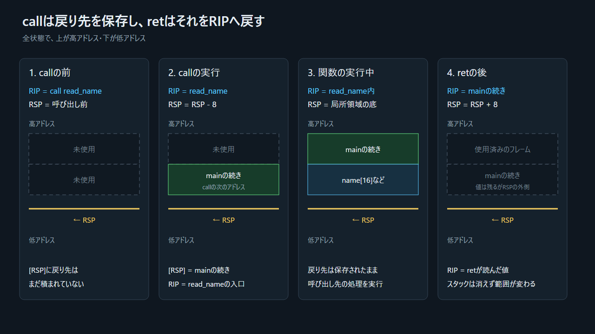

## 4.1 なぜ戻り先を保存するのか

`main`の途中で`read_name`へ移ったCPUは、`read_name`の後に`main`のどこへ戻ればよいかを覚えておく必要がある。`read_name`が`greet`を呼ぶと、その戻り先も必要になる。

```text
main の続きの位置
  └─ read_name の実行中に保存
       greet 呼び出し後は、その戻り先も追加で保存
```

後から呼ばれた`greet`が先に戻り、次に`read_name`が戻る。「後から入れたものを先に出す」スタックは、この入れ子構造と相性がよい。

## 4.2 `RSP`、`call`、`ret`

x86-64で`RSP`は現在のスタック先頭を指す。ここで「先頭」は最後に積んだ値の位置であり、図の上端とは限らない。

```text
call target:
  RSP = RSP - 8
  [RSP] = callの次の命令アドレス
  RIP = target

ret:
  RIP = [RSP]
  RSP = RSP + 8
```

`[RSP]`は「`RSP`が指すメモリの内容」を意味する。`call`は戻り先をスタックへ書き、`ret`はそれを命令位置として読み戻す。



> 図: スタック全体は残したまま、`RSP`より外側になった部分だけを薄く示す。

## 4.3 スタックフレームと`RBP`

このビルドでは、関数の入口で呼び出し元の`RBP`を保存し、新しい`RBP`を基準に局所領域を参照する。

```text
高アドレス
┌──────────────────────┐
│ mainへの戻り先    │  [RBP+8]
├──────────────────────┤
│ 保存されたRBP     │  [RBP]
├──────────────────────┤  ← RBP
│ name[8..15]          │
├──────────────────────┤
│ name[0..7]           │  ← RBP-16
└──────────────────────┘  ← RSP
低アドレス
```

局所配列`name`と戻り先は論理的に関係ないデータだが、この実行ファイルでは同じスタック上に連続して置かれる。この物理的な近さが後で効く。
