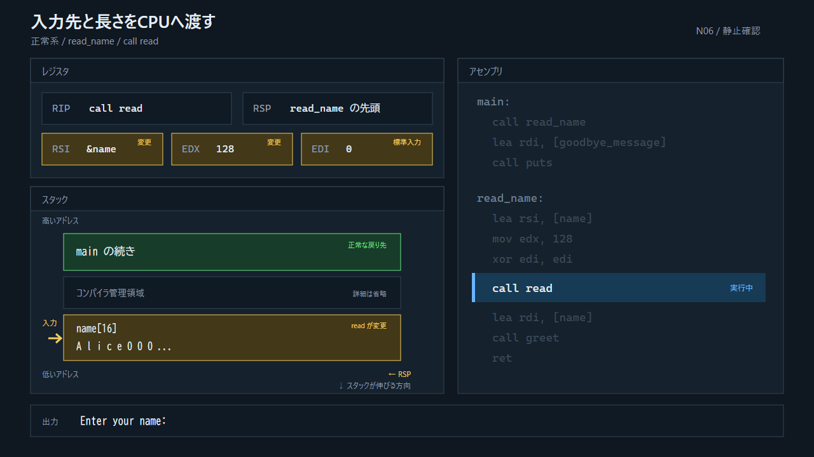

## 5.1 理解用に絞ったアセンブリ

最初は動作の核だけを読む。これはバイナリの完全な逆アセンブリではない。省いた命令は補遺Aに載せる。

```asm
main:
    call read_name
after_read_name:
    call puts_goodbye

read_name:
    reserve name[16]
    call puts_prompt
    rdi = STDIN_FILENO
    rsi = &name[0]
    rdx = 128
    call read
    rdi = &name[0]
    call greet
    ret

greet:
    call printf_hello
    ret

win:
    call puts_you_win
    call exit_0
```

アセンブリに`reserve`や`rdi =`という本物の命令はない。これは複数命令の意味を一行で示した疑似表記である。一行一行の精密な対応より、「どの状態がどの命令で変わるか」を優先する。

## 5.2 正常系の16状態



> 図: 右の命令を1行ずつ進め、左のレジスタとスタック全体の変化を追う。操作できない場合は正常系の予備動画を使う。

見失ったときは次の五点だけを確認する。

1. `RIP`は現在どの関数の命令を指しているか。
2. `RSP`はスタックのどの行を指しているか。
3. 今のスタック先頭の戻り先はどこか。
4. `name[16]`に実際に書かれたのは何バイトか。
5. 次の`ret`でどの値が`RIP`へ入るか。

## 5.3 `read`の「最大」と「実際」

`read(fd, buf, count)`は、最大`count`バイトを`buf`から書き込む。実際の書き込み数は戻り値で返る。常に`count`と同じ量を読むわけではない。

```text
正常デモ:
  配列容量       16バイト
  readの最大値  128バイト
  実際の入力        5バイト  "Alice"
```

`name`は初期化時に0で埋められているので、5バイト後に0が残る。`printf`の`%.15s`は最大15文字までしか読まない。これは表示側の境界外読みを防ぎ、デモの観測を安定させるためである。`read`側の境界外書き込みは直っていない。

## 5.4 正常系の出口

```text
call read_name
  → mainの続きをスタックへ保存
  → nameの確保
  → 5バイトだけ書き込む
  → greetを呼ぶときは、read_nameの続きを別に保存
  → greetのretでread_nameの続きへ戻る
  → read_nameのretでmainの続きへ戻る
  → Goodbyeを表示
```

ここまでは異常はない。正しい戻り先が保存され、その値が`ret`で`RIP`へ戻る。
