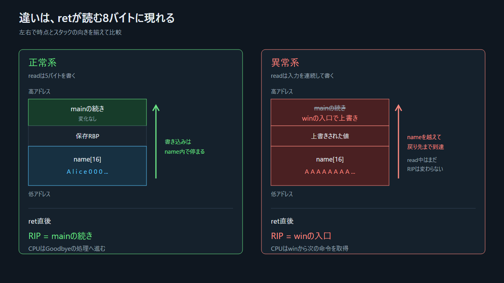

## 6.1 問題は一行にある

```c
char name[16] = {0};
read(STDIN_FILENO, name, 128);
```

`name`に書けるのは16バイトである。しかし`read`へ渡す最大値は128バイトである。Cのポインタに配列長は付随しないため、`read`は第3引数を信用する。

つまり、本質は「文字列が長い」ではない。書き込み先の容量と、書き込み関数へ渡した長さの契約が食い違っている。

## 6.2 書き込みと`ret`は別の時点

```text
時点T1: readがバイトを連続して書く
          name[0..15]
          → 保存RBP
          → 保存された戻り先

時点T2: greetなど後続処理が動く

時点T3: read_nameの終了処理がスタック先頭を戻り先へ合わせる

時点T4: retがその8バイトをRIPへ入れる
```

書き込んだ瞬間に分岐が起きるのではない。その時点では、後で読まれる制御データが壊れただけである。関数が戻るとき、初めて壊れた値が命令位置に使われる。

## 6.3 正常系と異常系を同じ時点で比べる



> 図: 違いは「長い入力」だけではない。`ret`が読む位置の8バイトが、正しい戻り先から別のアドレスへ変わっている。

| 時点 | 正常系 | 異常系 |
|---|---|---|
| `read`前 | `name`は16バイト、戻り先は`main`の続き | 同じ |
| `read`後 | 5バイトだけ変化 | `name`、保存RBP、戻り先まで変化 |
| `ret`直前 | スタック先頭は正しい戻り先 | スタック先頭は書き換えられた値 |
| `ret`後 | `RIP = mainの続き` | `RIP = 書き換えられたアドレス` |
| 命令取得 | `Goodbye`へ進む | 例では`win`から取得する |
