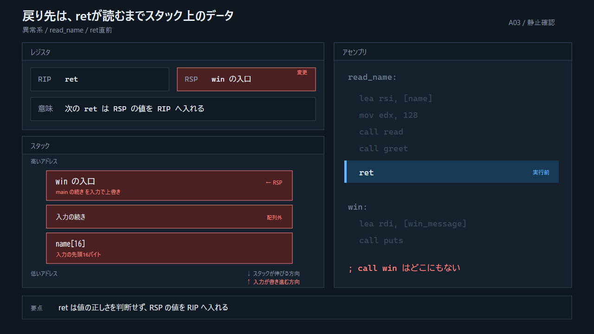
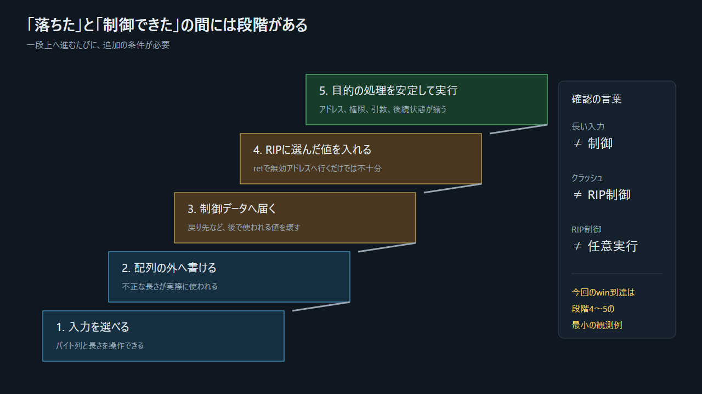

## 7.1 異常系を一行ずつ追う



> 図: スタックの底から高アドレス側までを残し、`RSP`より外側は破線と低彩度で示す。

```text
長い入力が到着する
  → readは先頭アドレスから連続して書く
  → name[16]を超える
  → 保存された戻り先がwinのアドレスに変わる
  → read_nameの後始末がRSPを戻り先の位置へ戻す
  → retが[RSP]をRIPへ入れる
  → RIPがwinを指す
  → CPUはwinの先頭から命令を取得する
  → YOU WINを表示し、exit(0)で終了する
```

`win`が`exit(0)`を呼ぶのは、`win`には本来の`call win`がなく、正式な呼び出し元への戻り先が用意されていないからである。デモは制御遷移を確認した後、不定な`ret`をせず終わる。

## 7.2 クラッシュと制御奪取は違う

| 到達段階 | 言えること |
|---|---|
| 長い入力を与えた | 入力条件を作った |
| 配列の外へ書いた | 境界外書き込みが起き得る |
| プロセスが落ちた | 何らかの重要状態を壊した可能性がある |
| 戻り先が変わった | 制御データ破壊を確認した |
| 選んだアドレスが`RIP`へ入った | 命令位置を制御した |
| 目的の処理が安定して動いた | 有用な制御遷移を実現した |



> 図: 下の段階が確認できても、自動的に上の段階まで到達するわけではない。

たとえば戻り先が`0x4141414141414141`のような無効アドレスになれば、多くの場合は不正アクセスで停止する。それは脆弱性の強い徴候だが、選んだ命令へ制御を移せた証明ではない。

## 7.3 バイト順はどこで効くか

x86-64は複数バイトの数値を低位バイトから低アドレスへ置く。これをリトルエンディアンと呼ぶ。例えば数値`0x401196`を8バイトとして保持すると、低アドレス側から`96 11 40 00 00 00 00 00`の順になる。

これは「なぜ戻り先が`RIP`へ入るか」の原因ではない。アドレス値をメモリ上のバイト列として解釈するときの表現規則である。
