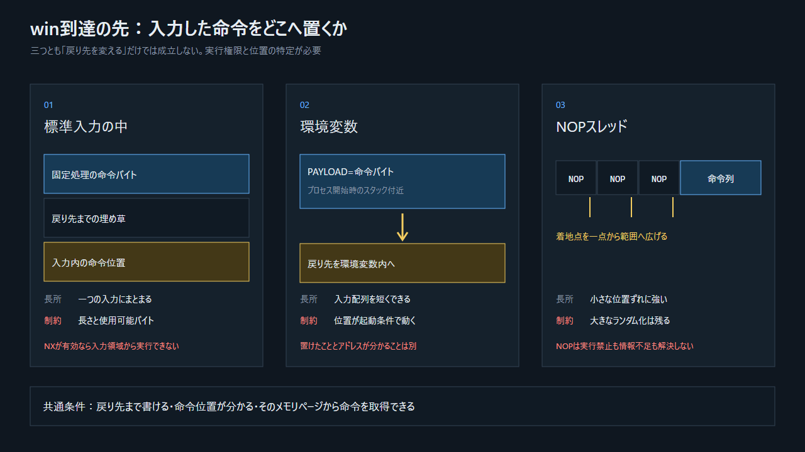

## 8.1 今回の`win`は「既存コードへの遷移」

今回のデモは、実行ファイルにもとから存在する`win`へ移る。新しい命令を発明したわけではない。これは「戻り先を通じて`RIP`の値を選べる」ことの最小の証明である。

## 8.2 制御移転後の三つの方向

> 図: どの方法も、到達可能なアドレス、ページ権限、レジスタとスタックの状態に制約される。

1. **既存関数へ移る**：今回の`win`のように、已にあるひとまとまりの処理へ移る。
2. **書き込んだ命令列へ移る**：入力領域や環境変数に命令バイトを置き、そのアドレスへ移る古典的な考え方。実行不可ページで止まる。
3. **既存の命令片を組み合わせる**：実行可能領域にある短い命令列と`ret`を連ね、スタックに次の位置を並べる。これが戻り指向プログラミング（ROP）の入口である。

入力中の命令位置が正確に分からない場合、多数のNOPの後ろに目的の命令を置く古典的な緩和法がある。NOPは実質的な処理をせず次へ進む命令なので、NOPのどこかへ着地すれば後方の命令列へ流れる。詳細は補遺Bへ移す。

## 8.3 防御の後でも残る条件

`RIP`を一度変えられただけで、何でもできるわけではない。

- 目的地のアドレスを知っているか。
- そのページに実行権限があるか。
- 関数が期待する引数とスタック整列が準備されているか。
- カナリやシャドウスタックが先に異常を検出しないか。
- プロセスが安定して次の処理を継続できるか。

この制約が、単なるメモリ破壊と、安定したコード実行を分ける。
