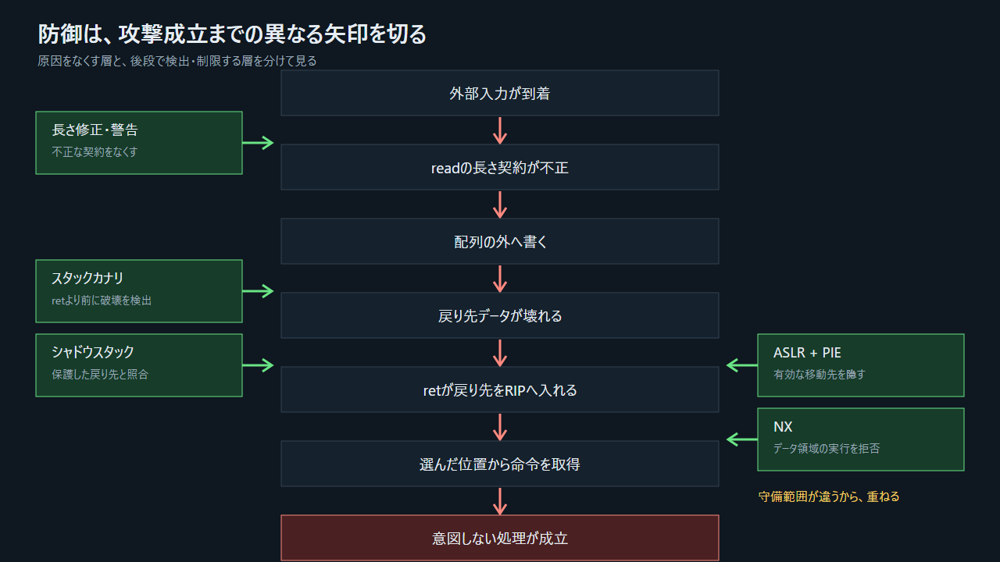

# 9. 現代の防御はどの因果を切るのか



> 図: 防御は全て同じことをするのではない。それぞれが異なる段階で因果を切る。

## 9.1 長さの契約を直す

```c
ssize_t n = read(STDIN_FILENO, name, sizeof name - 1);

if (n < 0) {
    perror("read");
    exit(1);
}

name[n] = '\0';
```

書き込み可能量は`sizeof name`から導き、C文字列用の終端0を一バイト残す。`read`の失敗と実際の読み取り数も扱う。これは「戻り先を守る」より前に、境界外書き込み自体を発生させない修正である。

コンパイラ警告、静的解析、AddressSanitizerなども、開発中にこの契約違反を見つける層として働く。

## 9.2 スタックカナリ

コンパイラは、局所配列と戻り先の間に予測しにくい監視値を置ける。関数が戻る前にその値を検査し、変化していれば`ret`の前に終了する。

```text
高アドレス
│ 戻り先              │
│ 保存RBP              │
│ カナリ             │ ← 関数終了前に照合
│ name[16]            │
低アドレス
```

カナリは境界外書き込み自体を防がない。戻り先へ到達するような上書きを検出する。別の不具合から監視値が漏れる、または上書きがカナリを通らない場合は保護の前提が弱まる。したがって単独の完全防御ではない。

## 9.3 NX：書ける領域を命令として読ませない

NX（実行不可属性）は、スタックやヒープを通常は実行不可にする。入力バイトをそのまま命令として取得しようとする古典的な方法は、ここで停止する。

NXは`RIP`の変更自体を防がない。もとから実行可能な命令領域へ移る`win`やROPは、NXの守備範囲の外である。

## 9.4 ASLRとPIE：移り先を予測しにくくする

ASLRはスタック、ヒープ、共有ライブラリなどの配置を実行ごとに変化させる。実行ファイル本体も位置独立実行形式（PIE）でビルドされれば、コード領域の基準位置もランダム化対象になる。

ASLRだけで非PIEのメイン実行ファイルの命令位置まで必ず変わるとは限らない。また、別のメモリ開示で実際のアドレスが漏れれば、予測しにくさが弱まる。

## 9.5 シャドウスタックと制御フロー保護

ハードウェア支援のシャドウスタックは、戻り先を通常のスタックと保護された別領域の両方で管理する。`ret`時の戻り先が一致しなければ異常とする。

実際に効かせるにはCPU、OS、ローダ、実行ファイル側の対応が必要である。対応CPUであるだけで自動的に有効になるわけではない。

## 9.6 多層化する理由

```text
ソース修正      → 境界外書き込みを起こさない
警告/サニタイザ → 開発中に見つける
カナリ         → 戻り先へ届く上書きをret前に検出
NX               → データ領域からの命令取得を拒否
ASLR + PIE       → 遷移先アドレスを予測しにくくする
シャドウスタック → 通常スタックの戻り先だけが変わったことを検出
```

一つの防御がすべてを止めるわけではない。異なる前提に依存する防御を重ねることで、一つの想定外がそのまま制御奪取へつながるのを防ぐ。
