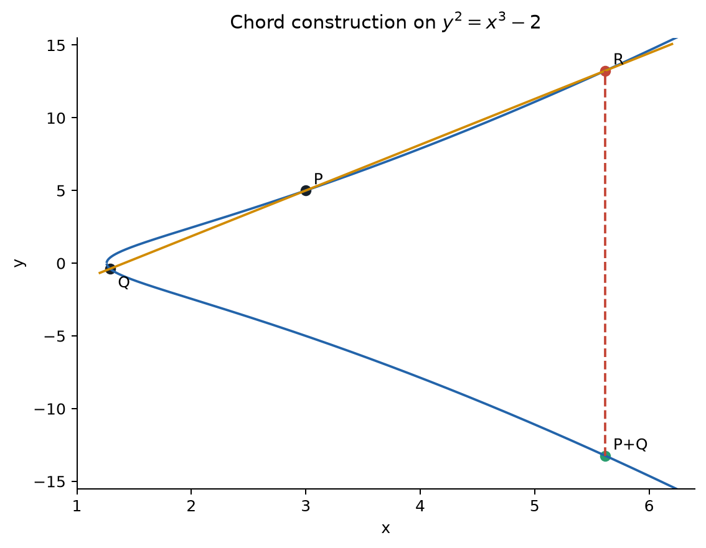
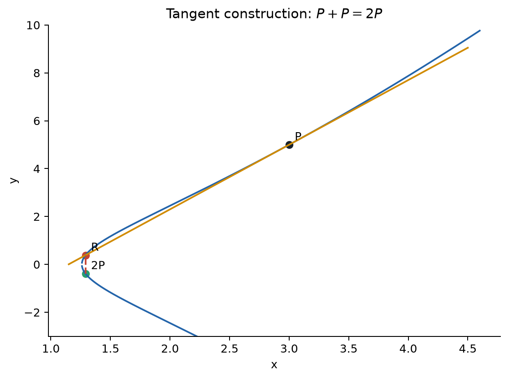

## 1.0 なぜ実数解や整数解ではなく、有理数解なのか

同じ方程式でも、どの数の範囲で解を探すかによって問題の性格は変わる。実数上では曲線は連続な図形になり、主な問いは枝の形や連結性である。整数点は離散的だが、直線の傾きや交点を計算すると割り算が現れ、整数の範囲からすぐ外へ出る。有理数は整数より広く、しかも加減乗除で閉じている。したがって、有理点二つを通る直線を引き、その交点を計算する操作は有理数の世界に留まる。

つまり $\mathbb Q$ は、Diophantine 方程式の離散的な難しさを残しながら、曲線の幾何的操作を代数として実行できる自然な舞台である。整数点も重要だが、まず有理点群を理解し、その中で整数座標を持つ点を探す方が構造を利用できる。

最初に扱う方程式は

$$
E_1:\qquad y^2=x^3-2
$$

である。整数を少し代入すると、$x=3$ で右辺は $27-2=25$ だから

$$
P=(3,5)
$$

が見つかる。では、これ以外の有理点はあるだろうか。

分母を $1000$ まで許して全探索する、という方針は本質的でない。有理数の分子・分母には上限がなく、一点も見つからなかったとしても「存在しない」とは結論できないからである。必要なのは候補を増やす探索ではなく、既知の解から新しい解を**正確に作る仕組み**である。

## 1.1 直線と三次曲線は三点で交わる

曲線上の異なる二点

$$
P=(x_1,y_1),\qquad Q=(x_2,y_2)
$$

を通る直線の傾きを

$$
m=\frac{y_2-y_1}{x_2-x_1}
$$

とする。この直線は $y=m(x-x_1)+y_1$ である。これを

$$
y^2=x^3+Ax+B
$$

へ代入すると

$$
\{m(x-x_1)+y_1\}^2=x^3+Ax+B
$$

となる。右辺から左辺を引けば、$x$ の最高次数が3の方程式である。その三根を $x_1,x_2,x_3$ とすると、$x^2$ の係数を比較して

$$
x_1+x_2+x_3=m^2,
$$

したがって

$$
x_3=m^2-x_1-x_2
$$

を得る。係数が有理数で、二根 $x_1,x_2$ が有理数なら、残る $x_3$ も有理数である。三番目の交点を $R=(x_3,y_3)$ とし、それを $x$ 軸に関して反転した点を

$$
P+Q=(x_3,-y_3)
$$

と定める。反転は単なる見栄えの選択ではない。「一直線上の三交点の和を単位元 $\mathcal O$ とする」規則を採用すると、第三交点 $R$ について

$$
P+Q+R=\mathcal O
$$

でなければならない。したがって $P+Q=-R$ となり、$y$ 座標の符号を反転する操作が強制される。この約束により、後で導入する無限遠点が単位元になり、垂直に並ぶ $P,-P$ の和も $\mathcal O$ になる。

{fig-alt="曲線上の二点を通る直線、第三交点、その反転としての和"}

## 1.2 一点しかないときは接線を使う

$Q$ を $P$ に近づけると、割線の傾きは接線の傾きへ近づく。方程式を暗黙微分すると

$$
2y\frac{dy}{dx}=3x^2+A,
$$

ゆえに $y_P\ne0$ なら

$$
m=\left.\frac{dy}{dx}\right|_P
=\frac{3x_P^2+A}{2y_P}.
$$

この接線と曲線の第三交点を反転して $2P=P+P$ とする。

主例では $A=0$, $P=(3,5)$ だから

$$
m=\frac{3\cdot3^2}{2\cdot5}=\frac{27}{10}.
$$

先ほどの根と係数の関係で $x_1=x_2=3$ と置けば

$$
\begin{aligned}
x_{2P}
&=m^2-2x_P\\
&=\left(\frac{27}{10}\right)^2-6\\
&=\frac{729}{100}-\frac{600}{100}\\
&=\frac{129}{100}.
\end{aligned}
$$

反転後の $y$ 座標は

$$
\begin{aligned}
y_{2P}
&=m(x_P-x_{2P})-y_P\\
&=\frac{27}{10}\left(3-\frac{129}{100}\right)-5\\
&=\frac{27}{10}\cdot\frac{171}{100}-\frac{5000}{1000}\\
&=\frac{4617-5000}{1000}\\
&=-\frac{383}{1000}.
\end{aligned}
$$

したがって

$$
2P=\left(\frac{129}{100},-\frac{383}{1000}\right).
$$

実際、両辺を通分すれば

$$
\left(-\frac{383}{1000}\right)^2
=\left(\frac{129}{100}\right)^3-2
=\frac{146689}{1000000}
$$

である。整数点から、分母を持つ新しい点が幾何学的操作だけで現れた。

{fig-alt="点 P における接線と、第三交点の反転として得られる 2P"}

さらに同じ公式で $3P=P+2P$ を作れる。正確な値は

$$
3P=
\left(
\frac{164323}{29241},
-\frac{66234835}{5000211}
\right).
$$

分母は急速に大きくなる。しかしこれは丸め誤差ではなく、すべて正確な有理数である。「分数を総当たりする問い」は「点を足して生成する問い」へ変わった。

なお「楕円曲線」という名称は、実グラフが楕円形だからではない。歴史的には楕円の弧長から生じる**楕円積分**を逆に解く楕円関数と、複素数上のこの曲線が結びついたことに由来する。

## 1.3 どの三次式でもよいわけではない

短 Weierstrass 形

$$
E:y^2=x^3+Ax+B
$$

に対して $F(x,y)=y^2-x^3-Ax-B$ と置く。曲線が交差したり尖ったりする特異点では

$$
F=0,\qquad F_x=-3x^2-A=0,\qquad F_y=2y=0
$$

が同時に成り立つ。$F_y=0$ から $y=0$、残り二式から

$$
x^3+Ax+B=0,\qquad 3x^2+A=0
$$

となる。つまり三次多項式とその導関数が共通根を持つ場合、すなわち重根がある場合に特異になる。これを係数だけで表した条件が

$$
4A^3+27B^2\ne0
$$

である。楕円曲線の判別式を

$$
\Delta=-16(4A^3+27B^2)
$$

とする規約では、非特異条件は $\Delta\ne0$ である。主例の判別式は $-1728$ で、特異点を持たない。

## ここまでで分かったこと

三次曲線では、直線との交点を数える三次方程式が、新しい有理点を作る。接線を使えば一点からでも点を増やせる。

## まだ分からないこと

この「加法」は本当に単位元・逆元・結合則を持つのか。また、作った点はいつか元へ戻るのか、無限に増えるのか。

## 次に必要になる発想

縦線と曲線の「第三交点」が見えない問題を解決し、曲線を群として閉じる。

## 理解確認

1. $P=(x,y)$ が無限位数なら、なぜ $P,2P,3P,\ldots$ は無限個の異なる点か。
2. 二点の座標が有理数なら第三交点も有理数になる理由を、三次方程式の根で説明せよ。

**解答。** 1. $mP=nP$（$m>n$）なら $(m-n)P=\mathcal O$ となり、$P$ が有限位数になって矛盾する。2. 三次方程式の根の和が有理係数で表され、既知の二根を引けば第三根も有理数になる。
