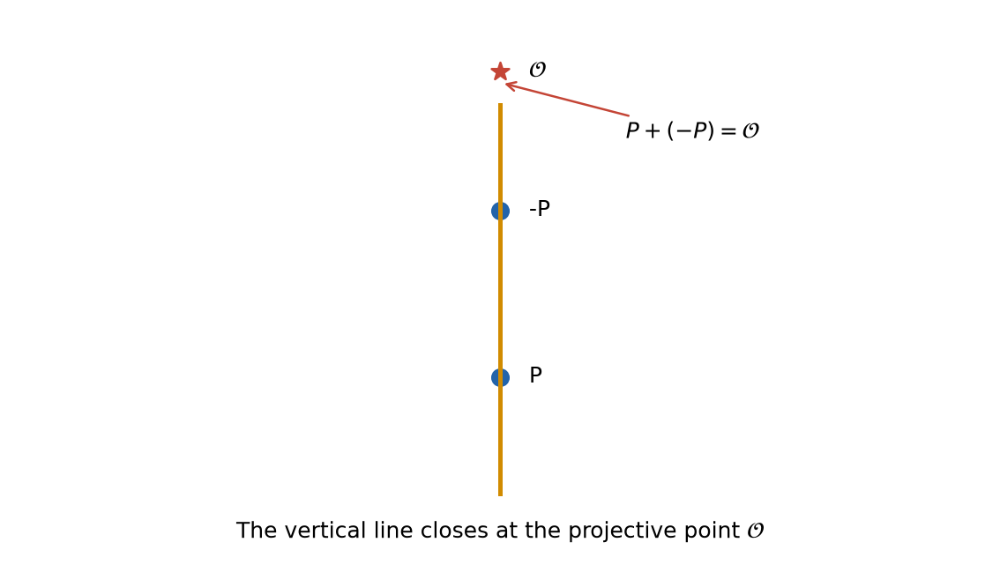

曲線は上下対称だから、$P=(x,y)$ に対し $-P=(x,-y)$ も曲線上にある。二点を結ぶ直線は垂直で、通常の $xy$ 平面では第三交点がない。ここで単位元になる点 $\mathcal O$ が必要になる。

## 2.1 射影化は人工的な付け足しではない

射影平面では、ゼロでない三つ組を比例まで同一視する：

$$
[X:Y:Z]\sim[\lambda X:\lambda Y:\lambda Z]\qquad(\lambda\ne0).
$$

$Z\ne0$ なら $x=X/Z, y=Y/Z$ として通常の平面へ戻れる。なぜ $Z=0$ が「無限遠」なのかも、直線で確認できる。たとえば傾き $m$ の平行線 $y=mx+b$ は、射影化すると

$$
Y=mX+bZ
$$

となる。$Z=0$ では切片 $b$ が消え、すべての平行線が同じ方向点 $[1:m:0]$ を通る。$Z=0$ は、有限位置では交わらない平行線の方向を記録する境界なのである。

短 Weierstrass 方程式を次数3で斉次化すると

$$
Y^2Z=X^3+AXZ^2+BZ^3.
$$

無限遠を表す $Z=0$ を代入すると $X^3=0$、したがって $X=0$ であり、残る点は比例を除けばただ一つ

$$
\mathcal O=[0:1:0]
$$

である。平行線や垂直線も射影平面では無限遠で閉じる。$\mathcal O$ は計算の穴を埋める便宜的記号ではなく、射影曲線にもともと含まれる点である。

{fig-alt="垂直線が射影的な無限遠点 O で閉じ、P と -P の和が O になる模式図"}

## 2.2 群の公理

弦接法で次が成り立つ。

- **閉性**：有理点から作った和は有理点である。
- **単位元**：$P+\mathcal O=P$。
- **逆元**：$P+(-P)=\mathcal O$。
- **可換性**：$P,Q$ を通る直線は順序によらないので $P+Q=Q+P$。
- **結合則**：$(P+Q)+R=P+(Q+R)$。

最後の結合則だけは図から明らかでない。座標公式を二度ずつ代入して両辺を比較する直接証明は可能だが、計算は長い。そこで、なぜ概念的な証明があるのかを三段階で説明する。

1. 曲線上の有限個の点へ整数の重みを付けた形式和を divisor（因子）という。たとえば $[P]+[Q]-[R]-[\mathcal O]$ である。形式和の加法は、係数を足すだけなので最初から結合的である。
2. 曲線上の有理関数は、零点を正、極を負に数えた因子を作る。直線が曲線と $P,Q,R$ で交わるという事実は、因子の世界では「$[P]+[Q]+[R]$ は基準となる三点分と同値」という関係になる。この同値関係で割った群が Picard 群である。
3. 点 $P$ を $[P]-[\mathcal O]$ へ送ると、弦接法の $P+Q=-R$ が Picard 群の加法と一致する。滑らかな種数1曲線では、この対応が曲線と次数0部分 $\operatorname{Pic}^0(E)$ を一対一にする。後者はすでに結合的な群なので、曲線上の加法も結合則を継承する。

$\operatorname{Pic}^0(E)$ を幾何学的に表す対象を Jacobian と呼ぶ。種数1で基点 $\mathcal O$ を持つ場合、Jacobian は曲線 $E$ 自身になる。本教材ではこの同一視を定理として使うが、結合則を別の専門語で済ませているのではなく、**直線の交点関係を、結合則が明らかな形式和の加法へ移した**ことが要点である。

「なぜ三次曲線が特別か」への短い答えもここにある。滑らかな平面三次曲線の種数は1で、基点を選ぶと曲線自身が群になる。次数2の滑らかな曲線は種数0で、点があれば有理パラメータ表示へ向かう。次数4以上では一般に種数が上がり、二点と直線だけで閉じた加法を曲線自身に入れることはできない。ただし、その Jacobian には別の群構造がある。

## ここまでで分かったこと

$E(\mathbb Q)$ は無限遠点を含む可換群である。点の加法は人工的な作図規則ではなく、種数1の曲線の幾何に根差している。

## まだ分からないこと

この群は有限か無限か。無限なら、点を記述するのに無限個の出発点が要るのか。

## 次に必要になる発想

「すべての点」を有限個の生成元へ圧縮する Mordell–Weil 定理を見る。

## 理解確認

1. 三交点を $P,Q,R$ とするとき、なぜ和を第三交点 $R$ そのものではなく $-R$ と定めるのか。
2. $Z=0$ が平行線の方向を表すことを、$Y=mX+bZ$ から説明せよ。

**解答。** 1. 一直線上の三交点の和を $\mathcal O$ とする規則から $P+Q=-R$ が従う。2. $Z=0$ では切片 $b$ が消え、同じ傾き $m$ の全直線が $[1:m:0]$ を共有する。
