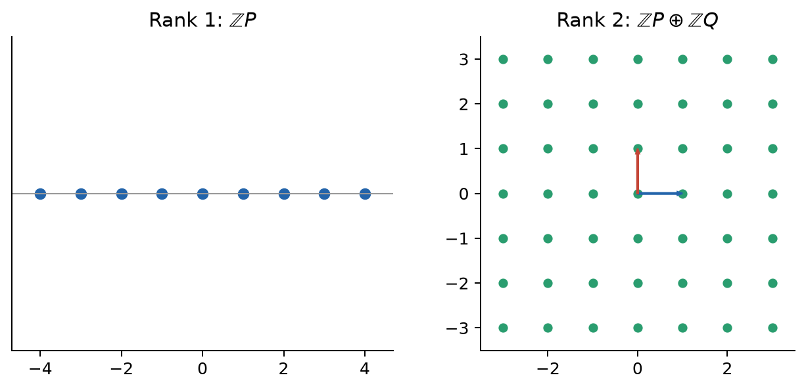

Mordell–Weil 定理は、$\mathbb Q$ 上の楕円曲線について

$$
E(\mathbb Q)\cong E(\mathbb Q)_{\mathrm{tors}}\oplus\mathbb Z^r
$$

と主張する。左辺はすべての有理点。右辺の $E(\mathbb Q)_{\mathrm{tors}}$ は、ある $n\ge1$ で $nP=\mathcal O$ となる有限位数点の有限群である。$\mathbb Z^r$ は $r$ 個の独立な無限位数点が作る自由部分で、$r$ を**代数的 rank（階数）**という。

- $r=0$：自由部分がなく、有理点は torsion 点だけなので有限。
- $r=1$：一つの方向 $P$ があり、$nP$（$n\in\mathbb Z$）が無限個の点を作る。
- $r=2$：独立な $P,Q$ があり、$mP+nQ$ が二次元格子のように並ぶ。

{fig-alt="rank 1 の一次元格子と rank 2 の二次元格子"}

rank は有理点の個数ではない。$r=1$ も $r=2$ も点の集合としては可算無限だが、独立な生成方向の数が違う。また rank は実グラフ上での点の「密度」そのものでもない。密度は実位相での配置に関する概念で、rank は抽象群の自由生成元数である。rank が分かるだけでは全有理点は分からず、torsion 部分と自由部分の具体的な生成元も必要である。

## 3.1 主例と対照例

主例 $E_1:y^2=x^3-2$ は

$$
E_1(\mathbb Q)\cong\mathbb Z,
$$

であり、$(3,5)$ が自由部分の生成元、torsion は自明である。LMFDB の曲線ラベルは [1728.o3](https://www.lmfdb.org/EllipticCurve/Q/1728/o/3)、導手は $1728$、代数的・解析的 rank はともに1である。

一方、よく似た

$$
E_0:y^2=x^3-x=x(x-1)(x+1)
$$

では

$$
\mathcal O,\quad(0,0),\quad(1,0),\quad(-1,0)
$$

が有理点で、$y=0$ の三点はそれぞれ自分自身が逆元だから位数2である。実際には

$$
E_0(\mathbb Q)\cong(\mathbb Z/2\mathbb Z)^2,
$$

自由部分はなく rank 0 である。LMFDB ラベルは [32.a3](https://www.lmfdb.org/EllipticCurve/Q/32/a/3) である。似た三次式なのに、一方は無限個、他方は4点だけである。では rank は方程式のどこに隠れているのか。

## 3.2 torsion を探すことと rank を求めることは違う

Nagell–Lutz 定理は、整数係数の短 Weierstrass 方程式に対し、非自明な torsion 点の座標が整数で、$y=0$ または $y^2\mid\Delta$ となることを述べる。候補を有限個へ絞るのに有効だが、無限位数点の存在を決める rank 問題そのものは解かない。Mazur の定理は $E(\mathbb Q)_{\mathrm{tors}}$ の可能な型を完全に制限するが、自由部分の rank に同様の分類はない。

## 3.3 有限生成性に高さが必要な理由

Mordell–Weil 定理の証明は二段階に分かれる。

1. **弱 Mordell–Weil 定理**：任意の $n\ge2$ について $E(\mathbb Q)/nE(\mathbb Q)$ は有限。
2. **高さによる降下**：各剰余類の代表を選び、十分大きな点を $P=nQ+R$ と書くと、$Q$ は $P$ より算術的に小さくなる。この操作を繰り返し、有限個の小さな点へ降ろす。

ここで通常の絶対値では「小さい」を測れない。$1000001/1000000$ は実数として1に近いが、分数としては複雑である。既約分数 $x=a/b$ に

$$
H(x)=\max(|a|,|b|),\qquad h(x)=\log H(x)
$$

を定めれば、分子と分母の大きさを同時に測れる。楕円曲線上では $x(P)$ の高さをそのまま使うと、倍点を取るたびに有界な誤差が混じる。この誤差を極限で平均化する。ここでは

$$
\hat h(P)
=\frac12\lim_{k\to\infty}
\frac{h\!\left(x(2^kP)\right)}{4^k}
$$

という規約を採る。$x(2^kP)$ の高さは概ね $4^k$ 倍になるため、それで割って安定する部分だけを残している。文献によって係数 $1/2$ の置き方に差があるが、この規約では Néron–Tate の標準高さ $\hat h(P)$ の決定的な性質は

$$
\hat h(nP)=n^2\hat h(P)
$$

である。自由部分では正定値二次形式のように振る舞う。さらに

$$
\langle P,Q\rangle
=\frac12\{\hat h(P+Q)-\hat h(P)-\hat h(Q)\}
$$

は内積に相当する。高さが有界な有理点は有限個しかないため、降下は無限に続かない。これが「弱 Mordell–Weil + 高さ $\Rightarrow$ 有限生成」の骨格である。

## 3.4 descent と Selmer 群

実際の rank 計算では、たとえば $E(\mathbb Q)/2E(\mathbb Q)$ を調べる 2-descent を使う。その前に「局所体」を明確にしておく。

素数 $p$ に対する $p$-進数体 $\mathbb Q_p$ は、二つの有理数が $p$ の高い冪で割り切れる差を持つほど近い、という距離で $\mathbb Q$ を完備化した体である。$\mathbf F_p$ が mod $p$ の有限な一桁だけを残すのに対し、$\mathbb Q_p$ は mod $p,p^2,p^3,\ldots$ の互換な情報をすべて保持する無限体である。したがって

$$
\mathbf F_p\ne\mathbb Q_p.
$$

数論で「すべての場所で局所的に可能」というときは、実数体 $\mathbb R$ とすべての $\mathbb Q_p$ で可能であることを指す。有限体 $\mathbf F_p$ 上に点があることだけではない。

2-descent では、大域的な候補を各 $\mathbb Q_p$ と $\mathbb R$ へ移し、それぞれで2で割れるための条件を調べる。すべての局所条件を通過した候補を集めると有限群 $\operatorname{Sel}^{(2)}(E/\mathbb Q)$ が得られ、

$$
E(\mathbb Q)/2E(\mathbb Q)
\hookrightarrow
\operatorname{Sel}^{(2)}(E/\mathbb Q)
$$

となる。より正確には

$$
0\to E(\mathbb Q)/nE(\mathbb Q)
\to\operatorname{Sel}^{(n)}(E/\mathbb Q)
\to\Sha(E/\mathbb Q)[n]\to0.
$$

中央は $\mathbb R$ と全 $\mathbb Q_p$ の条件を通過した候補、左は実在する大域点から来る候補である。右の $\Sha(E/\mathbb Q)[n]$ は両者の差を記録するが、これは楕円曲線 $E$ 自身に点があるかを測る群ではない。$E$ 自身には最初から $\mathcal O\in E(\mathbb Q)$ がある。$\Sha$ が分類する別の種数1曲線、torsor の意味は強い BSD を述べる直前に導入する。ここでは Selmer 群が rank の上界を与え、その上界と真の rank の間に局所・大域の差が入り得る、と理解すればよい。

## ここまでで分かったこと

有理点問題は「有限 torsion + $r$ 個の自由な方向」へ圧縮された。主例は rank 1、対照例は rank 0 である。

## まだ分からないこと

方程式から rank を読み取る一般公式はない。descent は上界を与えるが、局所と大域の隙間が残る。

## 次に必要になる発想

descent の局所条件とは別の方法で、一つの巨大な $\mathbb Q$ 上の問題を各素数 $p$ の有限な影へ投影する。次章で数える $N_p$ は rank の直接の上界ではなく、$L$ 関数を作るための解析的な代理データである。

## 理解確認

1. rank 1 と rank 2 はどちらも無限個の点を持つ。それでも異なる情報なのはなぜか。
2. $|1000001/1000000|$ では算術的複雑さを測れない理由を述べよ。

**解答。** 1. rank は点の個数でなく、自由部分の独立生成元数である。2. 絶対値は1に近いが、既約表示の分子・分母は大きい。高さはこの分母も測る。
