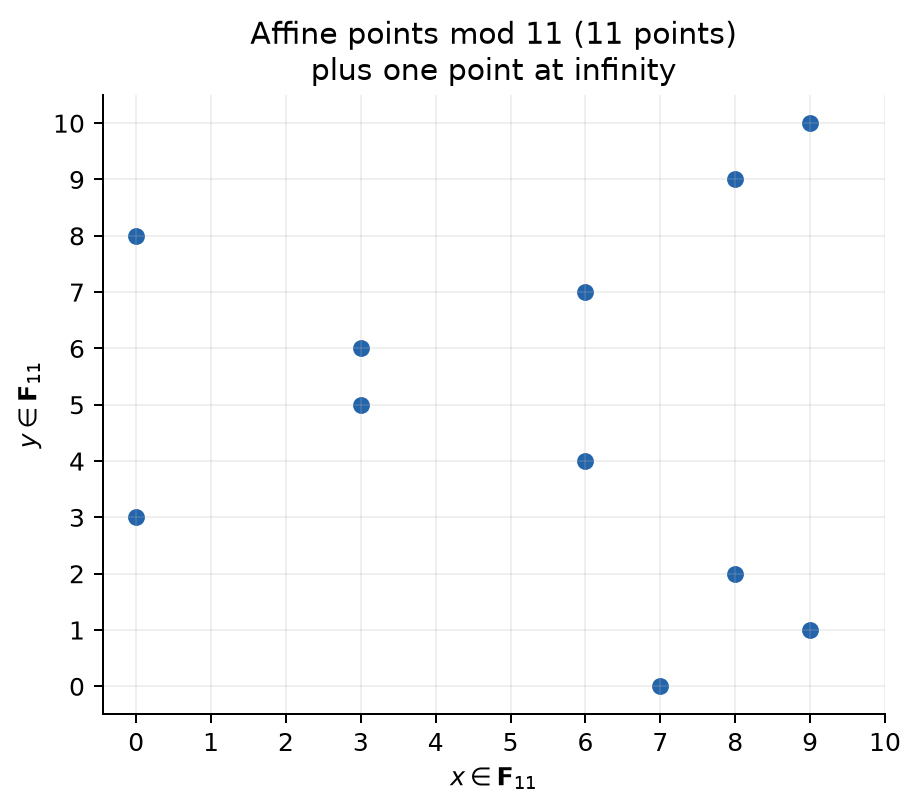
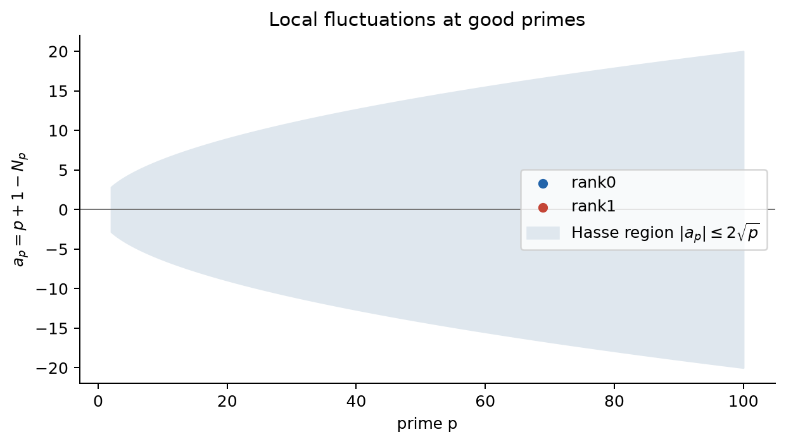

整数係数の式を素数 $p$ で割った余りだけにすると、$x,y$ は有限体 $\mathbf F_p$ の $p$ 個の値しか取らない。大域的な有理数問題を、有限個ずつ調べられる剰余体上の影へ投影するのである。これは前章の $\mathbb Q_p$ 上の局所可解性とは別の操作で、目的も異なる。ここでは各素数から $L$ 関数の係数を取り出す。

## 4.1 分母を持つ点をどう mod $p$ へ落とすか

整数 $b$ が $p$ で割れなければ、$\mathbf F_p$ では逆元 $b^{-1}$ があるため

$$
\frac{a}{b}\bmod p=(a\bmod p)(b^{-1}\bmod p)
$$

と定義できる。主例の

$$
2P=\left(\frac{129}{100},-\frac{383}{1000}\right)
$$

を $p=7$ で還元しよう。$100\equiv2$ の逆元は4、$1000\equiv6$ の逆元は6だから

$$
x\equiv3\cdot4\equiv5,\qquad
y\equiv2\cdot6\equiv5\pmod7.
$$

実際、$5^2\equiv5^3-2\equiv4\pmod7$ なので $(5,5)\in E_1(\mathbf F_7)$ である。

では分母が $p$ で割れる場合はどうするか。アフィン座標だけで無理に割らず、点を整数の射影座標 $[X:Y:Z]$ で表し、三座標を mod $p$ にする。共通因子を除いた座標なら三つが同時に0にはならない。良い還元の素数では、この方法で

$$
\operatorname{red}_p:E(\mathbb Q)\longrightarrow E(\mathbf F_p)
$$

という群準同型が定まる。$Z\equiv0\pmod p$ となる点は無限遠点 $\mathcal O$ へ落ちることがある。異なる有理点が同じ有限体上の点へ落ちることもあるので、この写像だけから rank を読み取ることはできない。

主例を $p=5$ で数えてみよう。平方 $y^2$ の値は

$$
0^2=0, 1^2=1, 2^2=4, 3^2=4, 4^2=1\pmod5.
$$

各 $x$ で $x^3-2$ を計算すると次の表になる。

| $x$ | $x^3-2\pmod5$ | 対応する $y$ | 個数 |
|---:|---:|:---|---:|
| 0 | 3 | なし | 0 |
| 1 | 4 | 2, 3 | 2 |
| 2 | 1 | 1, 4 | 2 |
| 3 | 0 | 0 | 1 |
| 4 | 2 | なし | 0 |

アフィン点は5個。無限遠点 $\mathcal O$ を加えて

$$
N_5=\#E_1(\mathbf F_5)=6
$$

である。$p=11$ でも点は連続曲線ではなく有限個の格子点として現れる。

{fig-alt="有限体 F_11 上の y^2=x^3-2 のアフィン点と無限遠点の説明"}

## 4.2 良い還元と悪い還元

係数を mod $p$ にしても滑らかさが保たれるのは $p\nmid\Delta$ のときで、これを**良い還元**という。$p\mid\Delta$ では重根や特異点が現れ得るため**悪い還元**と呼ぶ。主例は $\Delta=-1728=-2^6 3^3$ なので、悪い素数は2と3である。

悪い素数を無視してよいわけではない。後の $L$ 関数では局所因子が変わる。最小 Weierstrass 模型に対し、乗法的還元なら $(1-a_p\,p^{-s})^{-1}$（$a_p=\pm1$）、加法的還元なら因子を1とする。有限個の悪い素数は収束の大勢を変えないが、導手、関数等式、強い BSD の定数には不可欠である。

## 4.3 なぜ点の配置でなく個数 $N_p$ を見るのか

有限体上では座標や群構造の全情報を保存することもできる。それでもまず個数を数えるのは、$N_p$ が Frobenius 写像の固定点数であり、曲線ごと・素数ごとに比較できる一つの整数へ圧縮されるからである。後で見るように、$\mathbf F_{p^n}$ 上の点数をすべて集めても、楕円曲線の場合は二次多項式 $1-a_pT+pT^2$ に整理される。

ここで捨てた情報が無意味なのではない。$L$ 関数が読む特定の影として、Frobenius の trace を抽出しているのである。これは descent の局所条件から rank の上界を作る経路とは異なる。点数データは Euler 積を通じて解析的 rank へ向かう。

## 4.4 平均からの揺らぎ $a_p$

Hasse の定理は良い素数で

$$
|N_p-(p+1)|\le2\sqrt{p}
$$

と述べる。そこで

$$
a_p=p+1-N_p
$$

と定めれば

$$
|a_p|\le2\sqrt{p}.
$$

なぜ中心が $p$ でなく $p+1$ なのか。最も単純な射影曲線 $\mathbf P^1$ には、$p$ 個のアフィン座標に無限遠点を加えた $p+1$ 個の点がある。楕円曲線の局所ゼータ関数でも、$1-T$ と $1-pT$ がこの基準部分を担い、残る二次式が曲線固有のずれを担う。したがって $N_p$ はおよそ $p+1$ 個で、$a_p$ はそこからの符号付きの揺らぎを抽出する。先ほどは $N_5=6$ なので $a_5=5+1-6=0$ である。$p=7$ では $N_7=7$、したがって $a_7=1$ となる。

{fig-alt="二つの楕円曲線について素数ごとの a_p と Hasse 境界を示す散布図"}

Frobenius の二つの固有値 $\alpha_p,\beta_p$ が

$$
\alpha_p+\beta_p=a_p,\qquad \alpha_p\beta_p=p,
$$

を満たし、Hasse の評価は $|\alpha_p|=|\beta_p|=\sqrt{p}$ の帰結として理解できる。「何に作用する固有値か」は、次章で局所ゼータ関数を導入した後に明示する。

証明の骨格も見ておこう。有限体上の点の座標を $p$ 乗する Frobenius 写像 $\pi:(x,y)\mapsto(x^p,y^p)$ を考える。$\mathbf F_p$ 上の点はちょうど $\pi(P)=P$ となる点なので、$N_p$ は写像 $1-\pi$ の核の大きさ、適切にはその次数として表される。自己準同型の次数を二次形式と見て、その偏極を

$$
\langle\phi,\psi\rangle
=\deg(\phi+\psi)-\deg\phi-\deg\psi
$$

と置く。この形式は正定値で、Cauchy–Schwarz 型評価

$$
|\langle\phi,\psi\rangle|^2
\le 4\deg\phi\deg\psi
$$

を満たす。$\deg\pi=p$、$\deg(1-\pi)=N_p$ なので

$$
a_p=p+1-N_p=\langle1,\pi\rangle.
$$

ここで上の評価を $\phi=1,\psi=\pi$ に適用すると

$$
|p+1-N_p|\le2\sqrt{p}
$$

が出る。次数形式の正定値性と Cauchy–Schwarz 型評価の証明には、楕円曲線の自己準同型環と分離可能次数が必要である。本教材ではこの二点を発展事項として用い、「点数を Frobenius の固定点数へ翻訳し、次数形式を評価する」という論理だけを押さえる。

ここで扱った $E(\mathbf F_p)$ は有限体上の点集合である。$\mathbb Q_p$ 上の点、すべての場所での局所可解性、torsor に対する局所・大域原理とは区別する。これらは強い BSD の $\Sha$ を導入するときに改めて接続する。

## ここまでで分かったこと

各良い素数で有限個の点を数え、曲線固有の揺らぎ $a_p$ を得られる。Hasse の定理はその大きさを厳しく制御する。

## まだ分からないこと

一つの $p$ の影だけでは大域的 rank は決まらない。無数の $a_p$ をどう統合するかが残る。

## 次に必要になる発想

素数ごとの情報を、Euler 積で一つの解析関数へ圧縮する。

## 理解確認

1. $N_p=p+1$ のとき $a_p$ はいくつか。
2. $N_p$ に無限遠点を含め忘れると $a_p$ はどうずれるか。
3. $E(\mathbf F_p)$ と $E(\mathbb Q_p)$ は何が違うか。

**解答。** 1. $a_p=0$ で、平均的中心からずれていない。2. $N_p$ を1小さく数えるため、$a_p=p+1-N_p$ を1大きく誤る。3. 前者は mod $p$ の有限体上の点、後者は全 $p$-冪精度を持つ $p$-進体上の点である。点数と局所可解性で役割も異なる。
