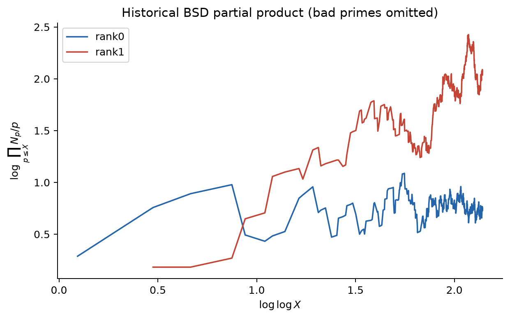

## 5.1 一つの素数でも、拡大体まで数える

$N_p=\#E(\mathbf F_p)$ だけでなく、$\mathbf F_{p^2},\mathbf F_{p^3},\ldots$ 上の点数も考える。これらを一つの母関数へまとめたものが局所ゼータ関数

$$
Z(E/\mathbf F_p,T)
=\exp\!\left(
\sum_{n\ge1}
\#E(\mathbf F_{p^n})\frac{T^n}{n}
\right)
$$

である。ここで閉点とは、幾何学的な点を Frobenius で動かして得る有限軌道であり、その軌道の大きさを次数 $d$ と呼ぶ。次数 $d$ の一つの閉点と、その $m$ 回の反復が指数の中へ $T^{dm}/m$ を寄与するとき、恒等式

$$
\exp\!\left(\sum_{m\ge1}\frac{T^{dm}}{m}\right)
=\frac{1}{1-T^d}
$$

により一つの Euler 因子になる。係数 $1/m$ は反復回数による重複を補正し、指数関数は閉点ごとの和を積へ変える。このため局所ゼータ関数は

$$
Z(E/\mathbf F_p,T)=\prod_{x\in|E|}(1-T^{\deg x})^{-1}
$$

とも書ける。楕円曲線では、この一見無限な点数列が驚くほど小さな有理式

$$
Z(E/\mathbf F_p,T)
=\frac{1-a_pT+pT^2}{(1-T)(1-pT)}
$$

に圧縮される。分母 $(1-T)(1-pT)$ が $p^n+1$ という基準部分を、分子が曲線固有の揺らぎを記録する。

分子を

$$
1-a_pT+pT^2=(1-\alpha_pT)(1-\beta_pT)
$$

と因数分解すれば

$$
\#E(\mathbf F_{p^n})
=p^n+1-\alpha_p^n-\beta_p^n
$$

となる。$n=1$ で $N_p=p+1-(\alpha_p+\beta_p)$ だから

$$
\alpha_p+\beta_p=a_p,
\qquad
\alpha_p\beta_p=p
$$

が再び現れる。

初等的には $\alpha_p,\beta_p$ をこの二次式の根と思ってよい。より深い立場では、$p$ と異なる素数 $\ell$ に対する $\ell$-進 Tate 加群（Tate module）

$$
T_\ell(E)
=\varprojlim_{k,\,[\ell]}E[\ell^k](\overline{\mathbf F}_p)
$$

である。これは幾何学的閉包 $\overline{\mathbf F}_p$ 上の $\ell^k$-torsion 点を、遷移写像 $[\ell]:E[\ell^{k+1}]\to E[\ell^k]$ でつないだ逆極限で、二次元の $\mathbb Z_\ell$-加群になる。ここへ Frobenius が作用し、その特性多項式が $X^2-a_pX+p$ になる。$\alpha_p,\beta_p$ はこの作用の固有値である。「点数を数える」ことが線形作用の trace $a_p$ を測っているので、素数ごとのデータを同じ形式で比較できる。

## 5.2 $T=p^{-s}$ が局所 $L$ 因子を作る

複素変数を

$$
s=\sigma+it
$$

と書く。$s$ は時間や曲線上の座標ではない。Dirichlet 級数の係数 $a_n$ を $n^{-s}$ でどれだけ減衰させて観測するかを調整する解析変数である。絶対値は $|n^{-s}|=n^{-\sigma}$ なので、実部 $\sigma$ が大きいほど大きな $n$ の寄与を強く抑え、級数は収束しやすい。$\sigma$ を左へ動かすほど遠くの算術情報が強く効く一方、収束は難しくなる。虚部 $t$ は $e^{-it\log n}$ という振動を与える。

局所ゼータ関数の分子へ $T=p^{-s}$ を代入し、その逆数を取ると、良い素数 $p$ の局所因子

$$
L_p(E,s)=\left(1-a_p\,p^{-s}+p^{1-2s}\right)^{-1}
$$

が得られる。先ほどの固有値を使えば分母は

$$
\begin{aligned}
(1-\alpha_p\,p^{-s})(1-\beta_p\,p^{-s})
&=1-(\alpha_p+\beta_p)p^{-s}+\alpha_p\beta_p\,p^{-2s}\\
&=1-a_p\,p^{-s}+p^{1-2s}
\end{aligned}
$$

となる。局所因子の二次式は便宜的に発明されたのではなく、$\mathbf F_{p^n}$ 上の全点数を記録する局所ゼータ関数の分子である。全素数の局所因子を掛けた

$$
L(E,s)=\prod_pL_p(E,s)
$$

が楕円曲線の Hasse–Weil $L$ 関数である。悪い素数では前章の修正因子を使う。

## 5.3 なぜ和でなく積なのか

Riemann ゼータ関数には

$$
\zeta(s)=\sum_{n\ge1}\frac1{n^s}
=\prod_p(1-p^{-s})^{-1}
$$

という二つの姿がある。整数が素数冪へ一意に分解するため、素数ごとの選択を積で組み合わせると整数全体の係数になる。同様に楕円曲線の Euler 積を展開すると

$$
L(E,s)=\sum_{n\ge1}\frac{a_n}{n^s}
$$

という Dirichlet 級数が現れ、素数の係数 $a_p$ から乗法的規則で一般の $a_n$ が組み立てられる。良い素数について具体的には

$$
a_{mn}=a_ma_n\quad(\gcd(m,n)=1)
$$

であり、素数冪では

$$
a_{p^k}=a_pa_{p^{k-1}}-p\,a_{p^{k-2}}
\qquad(k\ge2)
$$

となる。たとえば $a_{p^2}=a_p^2-p$ である。積は、異なる素数の局所情報を素因数分解に沿って一つの大域的係数列へ統合する自然な演算である。

## 5.4 歴史的部分積と $s=1$ が接続する

良い素数で $s=1$ を形式的に代入すると

$$
\begin{aligned}
L_p(E,1)^{-1}
&=1-\frac{a_p}{p}+\frac1p\\
&=\frac{p+1-a_p}{p}\\
&=\frac{N_p}{p}.
\end{aligned}
$$

つまり Birch と Swinnerton-Dyer が初期の計算機で観察した

$$
\prod_{p\le X}\frac{N_p}{p}
$$

は、形式的には $L(E,1)^{-1}$ の有限部分積である。彼らは曲線族について、この量が概略

$$
\prod_{p\le X}\frac{N_p}{p}\sim C(\log X)^r
$$

のように成長し、指数 $r$ が有理点群の rank に対応することを見いだした。対数を取れば

$$
\log\prod_{p\le X}\frac{N_p}{p}
\sim\log C+r\log\log X,
$$

だから横軸を $\log\log X$、縦軸を部分積の対数にすれば、長期的な傾きが rank を示す。有限範囲では揺れが大きく、次図は証明ではなく発見の仕組みを再現する数値実験である。悪い素数を除くことは定数 $C$ を変えるが、予想される傾きは変えない。

{fig-alt="rank 0 と rank 1 の曲線に対する歴史的 BSD 部分積の比較"}

## 5.5 計算実験

付属の [`scripts/bsd_experiment.py`](../scripts/bsd_experiment.py) は、巨大な数論ライブラリを使わず次を実行する。

```python
def count_points(curve, prime):
    square_counts = [0] * prime
    for y in range(prime):
        square_counts[(y * y) % prime] += 1

    affine = 0
    for x in range(prime):
        rhs = (x**3 + curve.a * x + curve.b) % prime
        affine += square_counts[rhs]
    return affine + 1  # projective point at infinity
```

各 $y$ の平方剰余を先に数え、各 $x$ の右辺に一致する $y$ の個数を足す。最後の1が $\mathcal O$ である。実行例は次の通り。

```text
python scripts/bsd_experiment.py --limit 2000 --output data/experiment.csv
python scripts/generate_figures.py
```

## 5.6 Euler 積を $s=1$ へ直接代入してはいけない

Hasse の評価から局所因子の誤差は概ね $p^{1/2-\operatorname{Re}(s)}$ であり、Euler 積の絶対収束は

$$
\operatorname{Re}(s)>\frac32
$$

で保証される。知りたい $s=1$ はこの領域の外である。したがって上の $L_p(E,1)^{-1}=N_p/p$ は各有限素数で正しいが、その無限積を通常の収束積として $L(E,1)^{-1}$ と同一視するのは正しくない。

ここで新しい問いが生じる。$L(E,s)$ を、最初に収束する領域から $s=1$ まで一意に解析接続できるか。

## ここまでで分かったこと

各素数の $N_p$ は $a_p$、局所因子、Euler 積を通じて一つの $L$ 関数になる。歴史的部分積は $s=1$ の局所因子と直接つながる。

## まだ分からないこと

Euler 積は $s=1$ で素朴には収束しない。中心値や零点を語るには解析接続が必要である。

## 次に必要になる発想

楕円曲線の $a_p$ を Fourier 係数にもつモジュラー形式（保型形式の一種）を使い、解析接続と関数等式を得る。

## 理解確認

1. 局所因子の二次式 $1-a_pT+pT^2$ は、どのデータを圧縮しているか。
2. $s=\sigma+it$ の実部 $\sigma$ を大きくすると、Dirichlet 級数の収束がよくなるのはなぜか。
3. $a_{p^2}$ を $a_p$ と $p$ で表せ。

**解答。** 1. $\mathbf F_{p^n}$ 上の点数を全 $n\ge1$ についてまとめた局所ゼータ関数の曲線固有部分である。2. $|n^{-s}|=n^{-\sigma}$ なので、大きな $n$ の寄与が強く減衰する。3. $a_{p^2}=a_p^2-p$。
