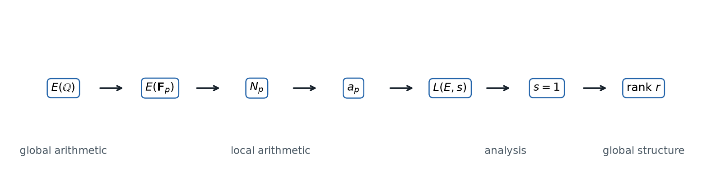

> **この教材の中心問題**
>
> 有理数係数の三次方程式に、有理数解はいくつあるのか。その答えを、各素数で有限個の点を数えて作った解析関数が、なぜ知っているのか。

研究状況と曲線データは **2026年10月4日** に確認した。Birch–Swinnerton-Dyer 予想（以下 BSD 予想）は現在も未解決であり、定理・条件付き結果・数値的証拠を区別して述べる。

{fig-alt="有理点から局所データと L 関数を経て rank へ戻る流れ"}

## 想定読者

理工系大学生から大学院生を想定する。微積分、線形代数、複素関数、初歩的な群論を前提とする。

## 読み方

第1章から順に読むと、有理点の具体的な計算から出発し、有限体上の局所データと解析的な $L$ 関数を経て BSD 予想へ到達する。各章末の「ここまでで分かったこと」「まだ分からないこと」「次に必要になる発想」が、次章への接続を示す。

## 全体の流れ

1. [有理点を探す問いを、作る問いへ変える](chapters/01-rational-points.qmd)
2. [無限遠点を加えると、点は群になる](chapters/02-group-law.qmd)
3. [無限個の有理点を有限個の方向で記述する](chapters/03-mordell-weil-rank-height.qmd)
4. [各素数で曲線の有限な影を見る](chapters/04-reduction-and-hasse.qmd)
5. [局所情報を Euler 積で一つに束ねる](chapters/05-euler-product-and-l-function.qmd)
6. [モジュラー性が中心点 $s=1$ を見えるようにする](chapters/06-modularity-and-center.qmd)
7. [Birch–Swinnerton-Dyer 予想](chapters/07-bsd-conjecture.qmd)
8. [最初の問いへ戻る](chapters/08-synthesis.qmd)
9. [参考文献](chapters/references.qmd)

[第1章から読み始める](chapters/01-rational-points.qmd)
