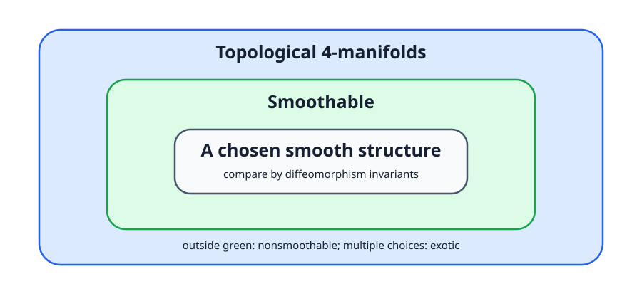

<!-- contract: contracts/01-smooth-structures.json -->

# 地図だけでは微分できない

球面をゴムの膜として連続に変形しても、球面であることは変わらない。位相幾何が保存するのは、この「切らず貼らずに変形できる」という情報である。しかしゲージ理論で扱う接続、曲率、Hodge star、偏微分方程式は微分を要求する。同じ点集合と同じ位相を持つ二つの多様体でも、どの関数を滑らかと認めるかが異なれば、同じ微分方程式を書けるとは限らない。

位相多様体 $X$ 上の **smooth structure** とは、座標変換が $C^\infty$ になるatlasの極大同値類である。二つのsmooth structureが同じとは、恒等写像が滑らかという意味ではなく、両者の間にdiffeomorphismが存在するという意味である。したがって比較すべき三段階は明確に異なる。

1. 位相空間としてhomeomorphicか。
2. smooth structureを少なくとも一つ持つか。
3. 二つのsmooth structureはdiffeomorphicか。

第2問が否定なら「非平滑化可能」であり、第3問が否定なら同じ位相多様体上の **exotic smooth structures** である。後者を示すには、homeomorphismの存在とdiffeomorphismの不存在を別々に証明しなければならない。

{#fig-category fig-alt="位相、PL、滑らかな構造と、それらの間に現れる存在・一意性の障害を示す図"}

# 何が「同じ」なら同じ滑らかさか

読者が最初に混乱しやすい点は、同じ位相空間上に二つのsmooth atlasがあるとき、恒等写像で比較しなければならないと思ってしまうことである。そうではない。smooth structureの同一性は、あるhomeomorphism

$$
f:(X,\mathcal S_0)\longrightarrow (X,\mathcal S_1)
$$

が両向きに滑らか、つまりdiffeomorphismになるかどうかで判定する。恒等写像が滑らかでなくても、別の写像がdiffeomorphismなら、二つのsmooth structureは同じと見る。

したがってexotic smooth structureを示すには、次の二段階が必要である。

1. 位相的には同じ対象であることを示す。
2. どのhomeomorphismを選んでもdiffeomorphismにはならないことを示す。

第二段階は直接調べにくい。そこでdiffeomorphismで保存される量を作り、その値が異なることを示す。ゲージ理論の役割はここにある。

# 比較の順序を間違えると何が破綻するか

ここで、よくある誤った証明を一つ見ておく。二つのsmooth manifold $X_0,X_1$ に対し、あるゲージ不変量の値が違うことが分かったとする。この事実だけから言えるのは

$$
X_0\not\cong_{\mathrm{diff}}X_1
$$

である。まだ

$$
X_0\cong_{\mathrm{homeo}}X_1
$$

は言えていない。したがって、これだけでは「同じ位相多様体上の異なるsmooth structure」とは言えない。単に別の位相多様体を区別しただけかもしれない。

逆に、Freedman型の分類で $X_0$ と $X_1$ がhomeomorphicだと分かったとしても、それだけではexoticとは言えない。diffeomorphicである可能性が残るからである。したがってexotic smooth structureの証明は、必ず次の形を持つ。

```text
topological dataを照合する
→ homeomorphismを得る
→ smooth invariantを比較する
→ diffeomorphismを否定する
```

この順序は以後何度も出てくる。読者が「どちらの圏の主張をしているのか」を見失わないことが、4次元トポロジーを読む最初の安全装置である。

# なぜ4次元だけが難しいのか

低次元では位相構造と滑らかな構造が強く結びつき、高次元では手術理論が働く。4次元では、局所的には $\mathbb R^4$ に見えるという条件と、大域的な貼り合わせを滑らかに制御する条件の間に特有のずれが生じる。ここで重要なのは「4次元は不思議だ」という標語ではない。後で二つの具体的な機構が同時に現れる。

- 中間次元が2なので、2次元cycle同士の交点が数になり、intersection formを作る。
- 2形式に対するHodge starが再び2形式へ戻るので、曲率方程式を自己双対・反自己双対に分けられる。

前者は位相的な入力、後者は解析的な入力である。教材全体の中心は、この二つが同じ整数を介して接続することにある。

# 何を観測量にすればよいか

滑らかな構造を直接一覧にすることは難しい。そこで、smooth structureが与えられたときだけ定義でき、diffeomorphismでは変わらない量を作る。その量が二つのstructureで異なれば、両者はdiffeomorphicではない。

ゲージ理論の戦略は次の通りである。多様体 $X$ の上に主束 $P$ を置き、接続 $A$ に楕円型方程式を課す。解を座標表示の冗長性であるgauge変換で割り、有限次元のmoduli spaceを作る。その向き付けられた交点数や積分から整数・多項式を得る。補助計量を変えても値が変わらないことを示せれば、それはsmooth invariantになる。

この説明にはまだ空白が多い。なぜ解空間は有限次元なのか、なぜcompactなのか、数え上げが補助計量に依存しないのかは、どれも自動ではない。以後の章はこの空白を順に埋める。

ここで大事なのは、ゲージ理論がsmooth structureそのものを「見る」のではないという点である。見るのは、smooth structureが許す微分方程式の解空間である。smooth構造が変わると、接続、曲率、Hodge star、楕円作用素の意味が変わり、その結果としてmoduli spaceの数え上げが変わりうる。

# 観測量の条件

smooth invariantとして使える量には、最低限三つの条件がある。

第一に、定義がsmooth categoryに依存している必要がある。単なるhomologyやintersection formだけでは、homeomorphismで保存されるため、同じ位相型の中のsmooth構造の違いを検出できない。

第二に、diffeomorphismで保存されなければならない。座標や計量を選んで作った量が、その選択に依存したままなら、不変量ではなく補助データの測定値にすぎない。

第三に、実際に計算または比較できなければならない。非常に抽象的に存在するだけの不変量では、具体的な多様体の滑らかさを区別できない。Donaldson理論が重く、Seiberg--Witten理論が急速に使われた理由の一つは、この第三条件に関係する。

以後、各章で作る道具はこの三条件に照らして読むとよい。接続と曲率はsmooth依存性を与え、moduli spaceの不変性証明はdiffeomorphism不変性を与え、具体的なindexやcompactnessは計算可能性を支える。

# 最初に残る問い

解析へ急ぐ前に、ゲージ理論が区別すべき位相的データを知る必要がある。4次元で2次元cycle同士を交差させると整数が出る。この整数を双線形形式として束ねたintersection formは、なぜ分類問題の中心になるのだろうか。
