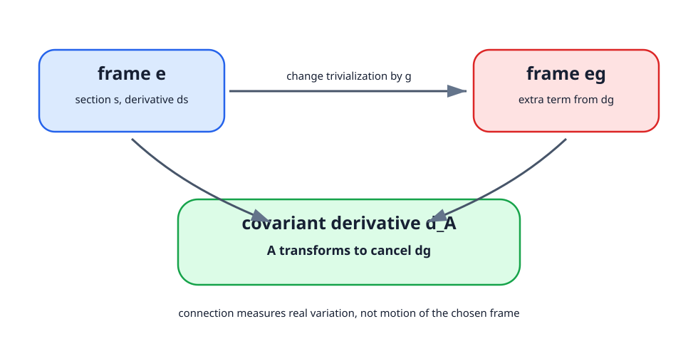

<!-- contract: contracts/04-connections-curvature.json -->

# 微分を束の上へ持ち上げる

intersection formだけではsmooth categoryへの強い制約を説明できなかった。そこで多様体上に補助的な主 $SU(2)$ 束 $P\to X$ を置く。局所自明化を選ぶと接続は $\mathfrak{su}(2)$ 値1形式 $A$ として見えるが、$A$ 自身は幾何学的対象ではない。自明化を $g:U\to SU(2)$ で変えると

$$
A\longmapsto A^g=g^{-1}Ag+g^{-1}dg
$$

と非斉次に変換する。最後の項があるため、単に行列値tensorとは呼べない。

随伴束のsection $s$ に対する共変微分を

$$
d_A s=ds+[A,s]
$$

と置くと、変換後には $d_{A^g}(g^{-1}sg)=g^{-1}(d_As)g$ が成り立つ。これが接続を導入する理由である。通常の微分 $d$ は局所表示の変更と両立しないが、$d_A$ は両立する。

# なぜ普通の微分では足りないか

局所自明化を一つ固定すれば、sectionは関数のように見える。すると「ただ $ds$ を使えばよいのではないか」と思える。しかし別の自明化へ移ると、同じsectionは $s'=g^{-1}sg$ と表示される。普通に微分すると

$$
ds'=d(g^{-1}sg)
$$

となり、$dg$ を含む項が余分に出る。この余分な項は、sectionそのものの変化ではなく、局所フレームを動かしたことによる見かけの変化である。接続 $A$ は、この見かけの変化を補正し、「束の中で本当に変化した分」を測るための道具である。

したがって接続は、微分を複雑にするための装飾ではない。局所表示に依存しない微分を可能にする最小限の追加データである。ゲージ理論では、この追加データそのものを未知量として動かす。

{#fig-connection-trivialization fig-alt="二つの局所自明化の間でsection表示が変わり、普通の微分にdg項が出て、接続Aが補正して共変微分になる図"}

# 二回微分した失敗が曲率になる

$d_A^2$ を計算すると

$$
d_A^2s=[F_A,s],\quad F_A=dA+A\wedge A.
$$

$A\wedge A$ を落とすとgauge共変性が壊れる。非可換群を使う代価がこの二次項であり、同時に理論の非線形性の源でもある。曲率は

$$
F_{A^g}=g^{-1}F_Ag
$$

と斉次に変換するので、Ad不変内積でノルムを取った量は自明化に依存しない。

Bianchi恒等式も定義から出る。graded Leibniz則とJacobi恒等式により

$$
d_AF_A=0.
$$

これは後でASD解がYang--Mills方程式を満たすことを導く一行になる。

# 可換な場合との比較

もし構造群が $U(1)$ ならLie algebraは可換であり、局所的には $A\wedge A$ に対応する交換子項は消える。曲率はほぼ $F_A=dA$ と読める。これに対し $SU(2)$ では、接続成分同士が非可換に相互作用するため、$A\wedge A$ が残る。

この差は後でDonaldson理論とSeiberg--Witten理論の差になる。Donaldson側では非可換曲率の非線形性がbubblingやgluingを難しくする。SW側では接続は可換だが、spinorとの連成が別の非線形性を作る。したがって「非可換だから難しい」「可換だから線形」という短絡は避けなければならない。

# gauge変換公式を確認する

接続の変換式

$$
A^g=g^{-1}Ag+g^{-1}dg
$$

は暗記するものではなく、共変微分が局所表示の変更と両立するように強制される。sectionを $s'=g^{-1}sg$ と書くと、

$$
d_{A^g}s'=d(g^{-1}sg)+[A^g,g^{-1}sg].
$$

$d(g^{-1})=-g^{-1}(dg)g^{-1}$ を使って展開すると、$dg$ を含む余分な項が現れる。この余分な項をちょうど打ち消すために $g^{-1}dg$ が必要になる。計算後には

$$
d_{A^g}(g^{-1}sg)=g^{-1}(d_As)g
$$

が残る。したがって非斉次項は不自然な飾りではなく、「微分してから座標を変える」と「座標を変えてから微分する」を一致させるための項である。

# 曲率変換で二次項が必要になる

$F_A=dA+A\wedge A$ の二次項も同じ理由で避けられない。もし $dA$ だけを曲率と呼ぶと、gauge変換後の $dA^g$ には $dg$ と $d^2g$ に由来する項が残り、$g^{-1}(dA)g$ という斉次な変換則にならない。

$A\wedge A$ を加えると、これらの余分な項が相殺される。結果として

$$
F_{A^g}=g^{-1}F_Ag
$$

が成り立つ。曲率が斉次に変換するからこそ、$\operatorname{tr}(F_A\wedge F_A)$ や $|F_A|^2$ のような量が大域的に意味を持つ。

# 局所的な曲率から大域的整数へ

規約を $\langle\xi,\eta\rangle=-\operatorname{tr}(\xi\eta)$ とし、$SU(2)$ 束のsecond Chern numberを

$$
k=c_2(P)[X]=\frac{1}{8\pi^2}\int_X\operatorname{tr}(F_A\wedge F_A)
$$

の符号規約に合わせて固定する。符号は文献のtrace規約で変わるが、一度選べばenergy identityまで同じ規約を保つ必要がある。

なぜ右辺は接続 $A$ に依らないのか。$A_t$ を接続のpath、$\dot A_t=a_t$ とすると $\frac d{dt}F_{A_t}=d_{A_t}a_t$ なので、Bianchi恒等式とtraceの不変性から

$$
\frac d{dt}\operatorname{tr}(F_{A_t}\wedge F_{A_t})
=2d\,\operatorname{tr}(a_t\wedge F_{A_t}).
$$

$X$ が閉ならStokesの定理により積分の微分は0である。解析的に変化する接続から、離散的な位相数が取り出された。

この導出はChern--Weil理論の最小形である。接続 $A$ は無限次元空間の中で連続に動かせるが、積分

$$
\frac{1}{8\pi^2}\int_X\operatorname{tr}(F_A\wedge F_A)
$$

は動かない。後のenergy identityでは、この動かない整数と動く解析量 $\|F_A^\pm\|^2$ を同じ式に入れる。そこから、位相数がenergyの床になる。

# なぜ閉多様体を仮定するか

上の不変性でStokesの定理を使った。$X$ に境界があると

$$
\int_X d\,\operatorname{tr}(a_t\wedge F_{A_t})
=\int_{\partial X}\operatorname{tr}(a_t\wedge F_{A_t})
$$

という境界項が残る。この境界項を消すには境界条件を入れるか、境界上の別の理論を同時に扱う必要がある。本書が閉4多様体を基本対象にするのは、単に話を短くするためではない。まず、Chern--Weil数、energy identity、moduliの数え上げが境界項なしで閉じる状況を作るためである。

# まだ方程式は選ばれていない

曲率を得ただけでは、どの接続を数えるべきか決まらない。$F_A=0$ は強すぎて、多くの束で解がない。Yang--Mills方程式は二階で、moduliの構造を直接読むには複雑である。4次元ではHodge starが2形式を同じ次数に保つ。この偶然から、位相数とenergyを結ぶ一次方程式が現れる。
