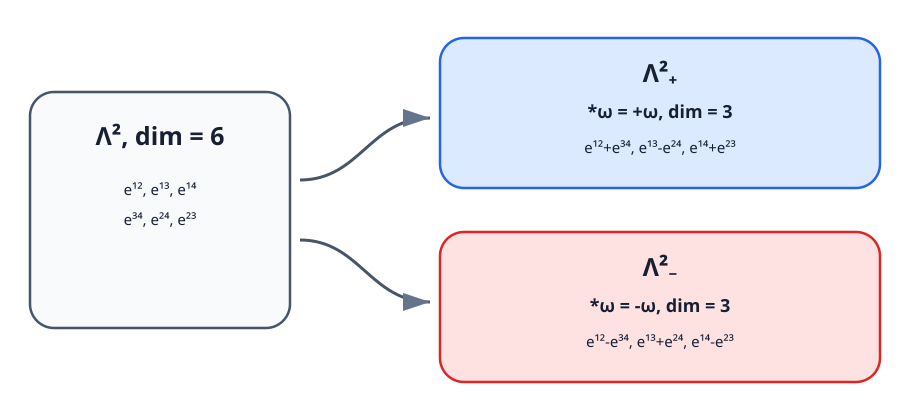

<!-- contract: contracts/05-why-four-dimensions.json -->

# 2形式を同じ次数のまま分ける

向き付けられたRiemannian $n$ 多様体では、Hodge starは $p$ 形式を $(n-p)$ 形式へ送る。曲率は2形式なので、$*F_A$ を再び曲率と同じ型として比較できるのは $n=4$ のときである。Riemannian 4次元では $*^2=1$ が成り立ち、

$$
\Lambda^2=\Lambda^2_+\oplus\Lambda^2_-,\qquad
\omega^\pm=\frac12(\omega\pm *\omega)
$$

と直交分解できる。

正向きorthonormal coframe $(e^1,e^2,e^3,e^4)$ を取り、$e^{ij}=e^i\wedge e^j$ と書くと

$$
*e^{12}=e^{34},\quad *e^{13}=-e^{24},\quad *e^{14}=e^{23}.
$$

したがって $\Lambda^2_+$ と $\Lambda^2_-$ はそれぞれ3次元である。

{#fig-hodge-split fig-alt="4次元の2形式が自己双対部分と反自己双対部分へ3次元ずつ分かれる図"}

# wedge積の符号を読む

$\omega=\omega^++\omega^-$ に対し、自己双対・反自己双対部分の直交性から

$$
\omega\wedge\omega
=\bigl(|\omega^+|^2-|\omega^-|^2\bigr)\,d\mathrm{vol}.
$$

一方、$\omega\wedge *\omega=|\omega|^2d\mathrm{vol}$ なので

$$
|\omega|^2=|\omega^+|^2+|\omega^-|^2.
$$

同じ二成分が「差では位相的な積」「和では解析的なノルム」を与える。これが次章のenergy identityの線形代数的核心である。

# conformal invarianceという第二の一致

計量を $g'=e^{2f}g$ と変えると、$p$ 形式上のHodge starは $*_{g'}=e^{(n-2p)f}*_g$ と変わる。$n=4,p=2$ では指数が0となり、$\Lambda^2_\pm$ の分解はconformal classだけに依存する。

同じことはenergyのスケーリングにも現れる。Euclid空間で $x\mapsto \lambda x$ とし、接続を $A_\lambda(x)=\lambda A(\lambda x)$ と縮尺すると、$F_{A_\lambda}(x)=\lambda^2F_A(\lambda x)$ だから

$$
\int_{\mathbb R^n}|F_{A_\lambda}|^2dx
=\lambda^{4-n}\int_{\mathbb R^n}|F_A|^2dx.
$$

$n=4$ でのみenergyがscale invariantになる。この臨界性は美点だけではない。解列が小さなscaleへenergyを集中させても全energyを失わず、bubblingを起こせることを意味する。

# 三つの4次元性

ここまでに三つの一致が見えた。

- 中間次元cycleの交点が整数になる。
- 曲率2形式が $\Lambda^2_+\oplus\Lambda^2_-$ に分かれる。
- $L^2$ 曲率energyがscale invariantになる。

これらは別々の偶然ではない。Chern--Weil積分が曲率の二次式であり、4形式として $X$ 上で積分されるため、代数・解析・位相が同じ次数に集まる。次章ではこの一致を一つの等式へまとめ、ASD方程式を「思いつき」でなくenergy最小化から導く。

