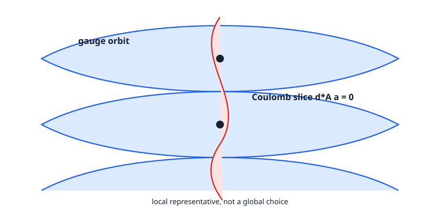

<!-- contract: contracts/07-gauge-quotient.json -->

# 同じ場の別表示を除く

ASD方程式はenergy最小解を選んだが、解 $A$ と $A^g$ は同じ幾何を異なるframeで表示している。接続全体のaffine空間を $\mathcal A(P)$、gauge群を $\mathcal G(P)$ と書けば、調べたいのは

$$
\mathcal M_k=\{A\in\mathcal A(P):F_A^+=0\}/\mathcal G(P)
$$

である。これは単なる集合の商では不十分で、局所座標、接空間、向き、compactificationを持つ解析的な商でなければならない。

無限小gauge変換を確認する。$g_t=\exp(t\phi)$ とすると

$$
\frac d{dt}A^{g_t}\Big|_{t=0}=d_A\phi.
$$

従ってorbitの接方向は $\operatorname{im}d_A\subset\Omega^1(X;\operatorname{ad}P)$ である。接続 $A+a$ をorbitに横断させる自然な条件は

$$
d_A^*a=0
$$

であり、これをCoulomb gauge conditionと呼ぶ。

{#fig-gauge-slice fig-alt="接続空間内の曲線状のgauge軌道と、それを横切るCoulomb sliceの局所図"}

# sliceはなぜ存在するか

$A+a$ に小さなgauge変換 $e^\phi$ を施し、Coulomb条件を満たす $\phi$ を探す。一次近似では

$$
d_A^*(a-d_A\phi)=0,\qquad
d_A^*d_A\phi=d_A^*a.
$$

左辺は0形式上の楕円作用素である。$A$ がirreducible、すなわち共変定数な随伴sectionが中心から来るもの以外にないなら、適切な中心の処理後に逆作用素を持つ。非線形項はSobolev乗法評価で制御し、implicit function theoremを適用する。

::: {.callout-important title="局所slice定理（証明アーキテクチャ、深度C）"}
$A$ の近傍で、各gauge orbitは小さなCoulomb sliceと一意に交わる。ただしstabilizerが非自明なら一意性はその有限次元作用を除いた意味になる。解析にはSobolev completion、楕円評価、非線形写像の滑らかさが必要である。[@freedUhlenbeck1991]
:::

# Sobolev完備化は何をしているか

ここで一度、解析の足場を明示しておく。$\mathcal A(P)$ は滑らかな接続の空間としてはFréchet空間であり、そのままでは通常のBanach空間のimplicit function theoremを使えない。そこで固定した滑らかな接続 $A_0$ を基点に

$$
\mathcal A_k=A_0+L^2_k\Omega^1(X;\operatorname{ad}P),
\qquad
\mathcal G_{k+1}=L^2_{k+1}(X,G)
$$

と完備化する。$4$ 次元では $k>2$ を選ぶと $L^2_k\hookrightarrow C^0$ であり、積や合成が連続に扱える。gauge群を一階高い $k+1$ にするのは、$g(A)=g^{-1}Ag+g^{-1}dg$ に微分 $dg$ が現れるからである。

この選択は「粗い接続を本当に研究対象にする」という意味ではない。Banach多様体上で解いたあと、楕円正則性により、滑らかなデータから来る弱解は適切なgaugeで滑らかになる。完備化は、無限次元の微分を正当化するための足場である。

# slice方程式の非線形項

一次近似だけを見ると、$d_A^*d_A\phi=d_A^*a$ を解けばよいように見える。しかし実際のgauge変換は線形ではない。$u=e^\phi$ として

$$
u(A+a)-A
=a-d_A\phi+\frac12[\phi,d_A\phi]-[\phi,a]+\text{higher terms}
$$

という形の項が現れる。従って求める方程式は

$$
\Psi(\phi,a)=d_A^*(u(A+a)-A)=0
$$

であり、$\phi$ についての微分が $-d_A^*d_A$ になる、というのが本当の入力である。$d_A^*d_A$ のkernelは $H_A^0$、つまり無限小stabilizerである。irreducible性を仮定する理由は、ここで逆写像を得るためであり、単なる技術的な好みではない。

読者がここで持つ自然な疑問は「なぜ $d_A^*a=0$ という条件だけでorbitと一回だけ交わると言えるのか」である。答えは、$d_A^*$ がorbit方向 $d_A\phi$ の形式的随伴であり、$L^2$ 内積に関して

$$
\langle a,d_A\phi\rangle_{L^2}
=\langle d_A^*a,\phi\rangle_{L^2}
$$

となるからである。Coulomb条件は「orbit方向に直交する」という幾何的条件を微分方程式で書いたものに他ならない。

# reducibleが作る特異性

$A^g=A$ を満たすgauge変換全体をstabilizer $\Gamma_A$ と呼ぶ。$SU(2)$ 接続がirreducibleなら典型的に中心 $\{\pm1\}$ だけだが、reducible接続ではより大きい。商の局所模型はsliceそのものではなく $S_A/\Gamma_A$ になるため、stabilizerが増える点でorbifold型またはより悪い特異性が現れる。

従って「gaugeで割れば冗長性が消える」だけでは足りない。irreducibility条件を確保するか、特異stratumを別に管理する必要がある。また全体でsliceを一枚選べない問題は残り、局所chartを貼るという通常の多様体と同じ発想を使う。

# 例：平坦な自明接続で何が壊れるか

閉4多様体上の自明 $SU(2)$ 束を考え、平坦な自明接続 $A=d$ を取る。このとき定数写像 $X\to SU(2)$ は $A$ を固定する。つまりstabilizerは中心だけではなく、少なくとも全体の $SU(2)$ を含む。無限小にも、定数 $\mathfrak{su}(2)$ 値関数は $d_A\phi=0$ を満たすので $H_A^0\ne0$ である。

この例では、slice方程式の線形化 $d^*d$ は定数関数をkernelに持つ。従って逆作用素は存在しない。商の局所構造は「Banach空間を滑らかに割ったもの」ではなく、stabilizer作用を持つ特異な局所模型になる。Donaldson理論でしばしばirreducible接続に制限するのは、見た目を整えるためではなく、商空間を多様体として扱える地点を確保するためである。

# 何を次章へ渡したか

この章で得たものは、moduli空間そのものではなく、moduliを局所的に調べるための座標候補である。

1. 接続の変化は $a\in\Omega^1(\operatorname{ad}P)$ で表す。
2. gauge方向は $d_A\phi$ で表す。
3. それに横断する代表は $d_A^*a=0$ で選ぶ。
4. この選択はirreducible性とSobolev解析に支えられる。

残った方程式はASD条件である。sliceを入れたあと、ASD方程式の線形化がどのような有限次元情報を持つかを調べなければならない。

# 次の線形化

sliceはgauge方向を除いた。次にASD方程式を $A+a$ で展開すると

$$
F_{A+a}^+=F_A^++d_A^+a+(a\wedge a)^+.
$$

線形項 $d_A^+a$ とgauge方向 $d_A\phi$ が連続して並ぶ。$d_A^+d_A=0$ がASD条件から従うため、この二つは複体を作る。次章では「方程式を線形化した作用素」だけでなく、「対称性も含めた複体」が正しい変形問題であることを見る。
