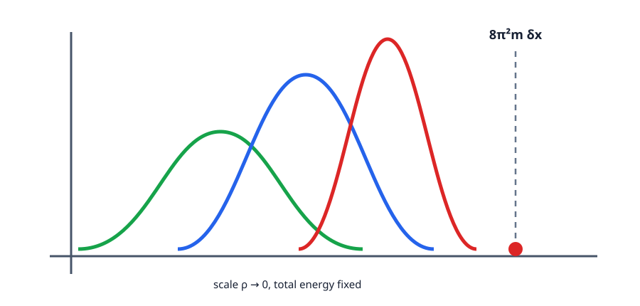

<!-- contract: contracts/11-bubbling.json -->

# 有界energyだけでは強収束しない

固定charge $k$ のASD接続はenergy $8\pi^2k$ を持つため、一様な $L^2$ boundがある。しかし4次元では $L^2$ 曲率energyがscale invariantなので、BPST instantonを半径 $\rho_n\to0$ へ縮めてもboundは改善しない。曲率は一点へ集中し、接続列はその点を含む通常の位相では収束しない。

曲率測度

$$
\mu_n=|F_{A_n}|^2d\mathrm{vol}
$$

を考えると、弱極限は滑らかな部分と原子部分へ分かれる。

$$
\mu_n\rightharpoonup |F_{A_\infty}|^2d\mathrm{vol}
+8\pi^2\sum_{i=1}^\ell m_i\delta_{x_i},\quad m_i\in\mathbb N.
$$

整数 $m_i$ は局所的に拡大した極限が $S^4$ 上のinstantonを作ることから現れる。

{#fig-bubbling fig-alt="幅が狭く高さが増す三つの曲率密度曲線と、極限の集中点を示す図"}

# BPST instantonが示すscaleの消失

$\mathbb R^4$ 上の基本instantonは、中心 $x_0$ とscale $\rho>0$ を持つ。局所式を細部まで使わなくても、曲率密度が

$$
|F_{A_{\rho,x_0}}(x)|^2
\sim \frac{\rho^4}{(\rho^2+|x-x_0|^2)^4}
$$

の形を持つことを覚えておけばよい。積分は $\rho$ に依存せず一定だが、$\rho\to0$ とすると密度は $x_0$ に集中する。

これはcompactness失敗の模型である。接続の係数そのものが単に大きくなるのではない。energyが一点へ集まり、極限でscale情報が消える。Uhlenbeck compactificationが記録するのは、失われたinstantonの位置とchargeであり、消えたscaleや向きの全てではない。

# scale不変性を積分で確認する

上の密度模型

$$
e_\rho(r)=C\frac{\rho^4}{(\rho^2+r^2)^4}
$$

を4次元極座標で積分すると、体積要素は $r^3dr\,d\Omega_3$ である。$r=\rho s$ と置けば

$$
\int_0^\infty \frac{\rho^4}{(\rho^2+r^2)^4}r^3\,dr
=\int_0^\infty
\frac{\rho^4}{\rho^8(1+s^2)^4}\rho^3s^3\,\rho\,ds
=\int_0^\infty \frac{s^3}{(1+s^2)^4}\,ds.
$$

$\rho$ が完全に消える。これが4次元の臨界性である。半径を小さくしても総energyは減らず、ただ集中する。したがってenergy boundだけでは、scaleが0へ落ちる現象を防げない。

# 小energyならgaugeを選べる

compactnessの核心は、曲率が小さいballでは接続をCoulomb gaugeへ入れ、

$$
d^*a=0,\quad
\|a\|_{L_1^2(B)}\le C\|F_A\|_{L^2(B)}
$$

のようなestimateを得ることである。有限個のballでのみsmall-energy thresholdを超えられるため、その中心を除けば一様estimateとRellich compactnessが使える。対角列を取り、gauge変換後に $A_n$ は $X\setminus\{x_1,\dots,x_\ell\}$ 上で $A_\infty$ へ収束する。

::: {.callout-important title="Uhlenbeckコンパクト性（引用定理を含む証明の骨格、深度C）"}
一様な $L^2$ 曲率boundを持つ接続列から、有限個の集中点を除いてgauge収束する部分列を取れる。ASD列では極限もASDで、removable singularity theoremにより低いchargeの束へ延長される。失われたchargeは有限個の整数multiplicityとして記録される。難所はsmall-energy gauge fixingとremovable singularityである。[@freedUhlenbeck1991]
:::

# energy量子化の読み方

なぜ集中するenergyが $8\pi^2$ の整数倍になるのか。ASD接続ではenergy identityにより

$$
\|F_A\|_{L^2}^2=8\pi^2 k
$$

である。集中点の周りを拡大して見ると、極限は $\mathbb R^4$、一点compactification後には $S^4$ 上の有限energy ASD接続になる。removable singularity theoremにより、それは $S^4$ 上の滑らかなinstantonへ延長される。従って局所的に失われたenergyは、そのinstantonのsecond Chern numberに対応し、$8\pi^2m$ となる。

ここで使っているのは、単なる測度収束ではない。PDE、gauge fixing、除去可能特異点、特性類が連動して、連続的に見えたenergy lossを整数に量子化している。

# ideal instantonで閉じる

通常のmoduli $\mathcal M_k$ に、低いchargeのASD接続と点のunordered tupleを加え、

$$
\overline{\mathcal M}_k^{U}
=\bigsqcup_{\ell=0}^k
\mathcal M_{k-\ell}\times\operatorname{Sym}^{\ell}(X)
$$

というUhlenbeck compactificationを作る。右辺の点は「粒子を追加した」のではなく、接続から消えたscaleと位置のうち、極限で残る位置とchargeだけを記録するideal objectである。

stratum間のcodimensionが十分大きければ、低次元countはbubbling境界の影響を受けない。一方、1次元parameterized moduliでは端として現れる可能性をdimension countで毎回確認しなければならない。

# codimensionを実際に見積もる

$SU(2)$ のASD moduliでchargeを一つ落とすと、expected dimensionは

$$
d(k)-d(k-1)=8
$$

だけ下がる。一方、bubbleの位置 $x\in X$ を記録することで $4$ 次元が戻る。従って一つのbubbleを持つstratumは、粗く言えば主stratumに比べてcodimension $4$ である。

この数が重要である。0次元moduliのcompactificationでは、codimension $4$ のstratumは一般には現れない。1次元parameterized moduliでも、dimension count上は端になりにくい。もちろん、これはregularityやreducibleの問題が別途制御されている場合の話である。dimension countだけで全てを証明したことにはならないが、なぜ低次元のDonaldson不変量でbubblingを避けられる場面があるのかを説明する。

# removable singularityは何を保証するか

集中点を除いた $X\setminus\{x_i\}$ 上で極限接続 $A_\infty$ が得られても、そのままでは元の閉多様体上の接続ではない。除去可能特異点定理は、有限energy ASD接続が孤立特異点を越えて、適切な束上の滑らかな接続へ延長されることを保証する。

この結果がなければ、compactificationの境界は「穴の空いた多様体上の解」という扱いにくい対象になってしまう。延長定理により、低いchargeの通常のASD moduliと点の情報だけで境界を記述できる。

# compactificationは目的でなく次の入力

compact spaceを得ただけでは不変量にならない。計量を変えたときのparameterized moduliが向き付きcobordismを作り、その境界が両端のmoduliだけであることを示す必要がある。reducible、bubbling、wall-crossingが余分な境界を作らない条件は何か。次章で「PDE解空間から数を取る」一般機械を組み立てる。
