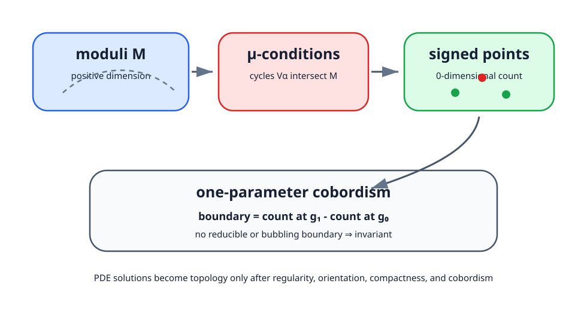

<!-- contract: contracts/12-invariant-machine.json -->

# 0次元なら点を数える

regularでcompactな0次元moduli space $\mathcal M$ は有限集合である。各点のdeterminant lineの向きから $\varepsilon([A])=\pm1$ を定め、

$$
n=\sum_{[A]\in\mathcal M}\varepsilon([A])
$$

と数える。向きを無視した点数は、parameterを動かしたとき点が対生成・対消滅する現象を相殺できない。符号付きcountなら局所birth/deathで寄与が $+1-1=0$ になる。

# 符号付きcountの有限次元模型

写像族

$$
f_t(x)=x^2-t
$$

を考える。$t>0$ では零点が二つ、$t<0$ では零点がない。向きを無視した点数は $2$ から $0$ へ変わるので不変ではない。これは1次元の零点問題で、$t=0$ に非正則な零点が現れる。

一方、写像

$$
g_s(x)=x-s
$$

では零点は常に一つで、導関数は正なので符号は常に $+1$ である。より一般に、0次元moduliの点の符号は、線形化のdeterminantの向きで決まる。点が対生成するとき、二つの点は反対符号で現れるため、符号付き和は変わらない。

Donaldson理論のorientationは、この有限次元の「導関数の符号」を、楕円作用素のdeterminant lineへ拡張したものである。

付録Aでは、このdeterminant lineをFredholm作用素のkernelとcokernelから定義した。本文で使う符号付きcountは、単に点へ任意に符号を付ける操作ではなく、Fredholm族のorientationから強制される符号である。このため、orientationの選択は不変量の定義の一部であり、後から好みで変える装飾ではない。

# 計量依存性をcobordismへ変える

二つのgeneric metric $g_0,g_1$ をpath $g_t$ で結び、

$$
\mathcal W=\bigcup_{t\in[0,1]}\{t\}\times\mathcal M(g_t)
$$

を考える。universal transversalityが成り立てば $\mathcal W$ は1次元向き付きmanifoldになる。compactで余分な境界がなければ

$$
\partial\mathcal W=\mathcal M(g_1)\sqcup(-\mathcal M(g_0))
$$

なので、向き付き境界の総数が0であることから $n(g_1)=n(g_0)$ を得る。

ここでcompactnessを確認せずに「cobordismだから不変」と結論してはいけない。bubbling stratumやreducible locusへ列が逃げれば、compactification後の境界に新成分が加わる。

# compactification後にgluingが必要な理由

compactificationで境界stratumを付け加えただけでは、まだ不変量の証明は終わらない。付け加えたstratumが、本当にmoduliの端として現れているかを知る必要がある。ここでgluing解析が使われる。

たとえばbubbleを持つideal instantonがcompactificationの境界に現れたとする。gluing theoremは、bubbleのscaleを小さく選び、背景解と標準instantonを貼り合わせ、誤差を補正して真のASD解を作る。これにより、境界stratumの近くのmoduliがどのような局所形を持つかが分かる。

したがってcompactnessは「逃げた列の極限を記録する」定理であり、gluingは「記録された極限の近くに実際の解が存在する」ことを戻す定理である。境界寄与を数える議論では、この二つが対になって働く。

# parameterized moduliの線形化

$g_t$ を動かすとき、方程式は

$$
F_A^{+,g_t}=0
$$

である。線形化には接続方向 $a$ だけでなく、計量方向 $\dot g$ も現れる。

$$
(a,\dot g)\longmapsto d_A^{+,g}a+\dot\pi_+(F_A)
$$

ここで $\dot\pi_+$ はHodge star、したがって自己双対射影の変化である。固定計量で $d_A^+$ が全射でなくても、計量方向が余核を埋めればuniversal moduliはregularになりうる。これがgeneric metricの横断性の中身である。

ただし、$F_A$ の形によっては計量方向が十分に効かない。特にreducibleや低いchargeの特殊解では、計量を動かすだけで全射性を得られないことがある。その場合、方程式への摂動を導入するか、対象を避ける仮定を置く必要がある。

# $b_2^+>1$ の役割

reducibleが現れる条件は、概略的にはあるcohomology classのself-dual harmonic部分が0になることとして書ける。計量空間内でその条件は $b_2^+$ 個の実条件を課す。1-parameter pathがこの壁を避けるにはcodimensionが2以上、すなわち $b_2^+>1$ が自然な安全条件になる。

$b_2^+=1$ では壁はcodimension 1で、pathが横切る可能性がある。この場合、不変量は計量から完全に独立ではなくchamberに依存し、wall-crossing formulaが差を記述する。「例外」ではなく、仮定を弱めたときに何が境界へ現れるかを示す構造である。

# wall crossingを境界として見る

$b_2^+=1$ のとき、二つの計量を結ぶpathはreducibleの壁を横切ることがある。parameterized moduliをcompact化すると、境界は

$$
\mathcal M(g_1)\sqcup(-\mathcal M(g_0))
$$

だけではなく、壁上のreducibleを中心とする局所模型から来る成分を持つ。この余分な境界の符号付き寄与がwall-crossing termである。

この見方をすると、$b_2^+>1$ の仮定は突然の魔法ではない。1-parameter cobordismが避けるべき悪い集合のcodimensionを上げ、余分な境界を消すための仮定である。

# 正次元moduliではclassを積分する

Donaldson理論ではuniversal bundleから得る $\mu$-map

$$
\mu:H_i(X)\longrightarrow H^{4-i}(\mathcal B^*)
$$

を用い、moduliのfundamental classとのpairing

$$
D_X(z)=\langle \mu(z),[\overline{\mathcal M}_k]\rangle
$$

を作る。次数の和がmoduliのdimensionと一致しなければ値は0である。幾何的には、cycleに対応する条件をmoduli上で課し、それらの横断交点を数えている。

# $\mu$-mapは何を測るか

$\mu$-mapは、$X$ 内のcycleを「そのcycle上で接続が満たす条件」としてmoduli上のcohomology classへ移す装置である。定義にはuniversal bundleのPontryagin class、またはChern classを使う。形式的には

$$
\mu(\alpha)=-\frac14 p_1(\mathbb P)/\alpha
$$

のように、universal bundleの特性類を $\alpha\in H_i(X)$ に対してslant productする。ここで $\mathbb P$ は $X\times\mathcal B^*$ 上のuniversal $SO(3)$ 束である。

直感的には、点class $\mathrm{pt}\in H_0(X)$ からは次数4の条件、曲面class $\Sigma\in H_2(X)$ からは次数2の条件が出る。moduliの次元と挿入次数が一致したときだけ、有限個の交点を数える形になる。

この説明で重要なのは、Donaldson不変量が「ASD接続の個数」だけではないことである。正次元moduliでは、幾何的条件を何個か課して0次元へ切り下げ、その符号付き交点数を取っている。

# 一つのDonaldson不変量を最後まで追う

ここまでの説明は一般形だったので、定義がまだ宙に浮いて見える。そこで、典型的な状況を一つ固定して、不変量が本当に数になるまでを追う。完全な計算例ではないが、どの入力がどの段階で必要になるかを明確にするための模型である。

閉・向き付き・単連結な滑らかな4多様体 $X$ を取り、$b_2^+(X)>1$ とする。$SO(3)$ 束 $P\to X$ を固定し、$w=w_2(P)$ と $p_1(\operatorname{ad}P)$ により位相型を固定する。irreducible ASD接続のmoduliを $\mathcal M_P$ と書き、generic metricによりregularで実次元 $2r$ になっていると仮定する。

このときDonaldson不変量の一つの値は、homology class

$$
\alpha_1,\dots,\alpha_m\in H_0(X)\oplus H_2(X)
$$

を選び、

$$
\sum_{j=1}^m \deg \mu(\alpha_j)=2r
$$

が成り立つ場合に

$$
D_X^w(\alpha_1\cdots\alpha_m)
=\left\langle
\mu(\alpha_1)\cdots\mu(\alpha_m),[\overline{\mathcal M}_P]
\right\rangle
$$

として定義される。ここで $\overline{\mathcal M}_P$ はUhlenbeck compactificationであり、pairingが境界stratumに邪魔されない次数範囲を選ぶ。$\mathbb P$ は $X\times\mathcal B_P^*$ 上のuniversal $SO(3)$ 束で、$\mathcal B_P^*$ はirreducible接続をgaugeで割った空間である。full gauge群で割ると中心やuniversal bundleの定義に細工が要るため、文献ではbased gauge群を通して作ってから必要な商へ降ろす、またはuniversal adjoint bundleを使う、という処理を行う。本書ではこの構成上の細部を丸ごと引用定理へ送らず、値の定義に必要な入力として明示しておく。

幾何的には、$\mu(\alpha_j)$ を代表するcycleを $\mathcal B_P^*$ 上に選び、それらを $\mathcal M_P$ と横断に交わらせる。交わり

$$
\mathcal M_P\cap V_{\alpha_1}\cap\cdots\cap V_{\alpha_m}
$$

が0次元になれば、その点をorientationで符号付きに数える。これが上のcohomology pairingである。

{#fig-cutdown-cobordism fig-alt="正次元moduliに複数の条件面を交差させて有限個の点を得て、二つの計量の間のcobordismで境界の符号付き数が一致する図"}

補助計量を $g_0$ から $g_1$ へ動かしたときは、同じ挿入cycleをparameterized moduliへ引き上げる。regularなら切り下げ後の空間は1次元向き付き多様体になり、その境界は

$$
\left(\mathcal M_{P,g_1}\cap V_{\alpha_1}\cap\cdots\cap V_{\alpha_m}\right)
\sqcup
-\left(\mathcal M_{P,g_0}\cap V_{\alpha_1}\cap\cdots\cap V_{\alpha_m}\right)
$$

に、もしあればbubbling境界やreducible境界を加えたものになる。$b_2^+>1$ は1-parameter pathでreducibleの壁を避けるための標準仮定であり、次元条件はbubbling stratumが切り下げ後の1次元cobordismへ余分な端として入らないように選ぶ。余分な境界がなければ、向き付き境界の総数が0であることから、$D_X^w$ は計量に依存しない。

この段階で、PDEの解空間がsmooth invariantへ変わる理由を一文で言える。方程式と商はsmooth構造に依存して定義されるが、regularity、orientation、compactification、cobordismにより、補助計量や代表cycleを変えても同じ数を返すからである。したがってdiffeomorphismはこの構成全体を対応させるが、単なるhomeomorphismには同じ対応を期待できない。

# 一つの不変量を作る九段階

ここまでの機械は、方程式、対称性、線形化、複体、index、regularity、orientation、compactification、countの順で動く。どれか一段を省くと「有限次元か」「滑らかか」「符号を付けられるか」「逃げないか」のいずれかが未解決になる。

# 失敗モードの対応表

最後に、このPartで出てきた失敗を一覧にしておく。これは後のDonaldson定理とSW理論を読むための点検表でもある。

| 失敗 | 数学的な場所 | 対応する道具 |
|---|---|---|
| 同じ接続を何度も数える | gauge orbit | 商、slice |
| 商が特異になる | stabilizer、$H_A^0$ | irreducible条件、特異stratum管理 |
| 一次解が本物の解にならない | obstruction、$H_A^2$ | Kuranishi模型、摂動 |
| expected dimensionが実次元でない | regularity failure | Sard--Smale、generic metric |
| 点数の符号が決まらない | determinant line | homology orientation |
| 解列が逃げる | bubbling | Uhlenbeck compactification |
| 計量を変えると値が変わる | 余分な境界 | cobordism、$b_2^+>1$、wall-crossing |

次章ではこの共通機械から得られるDonaldsonの二つの出力を分離する。対角化定理はdefinite intersection formへの制約であり、Donaldson多項式はより精密なsmooth invariantである。同じ解析基盤を使うが、同じ主張ではない。
