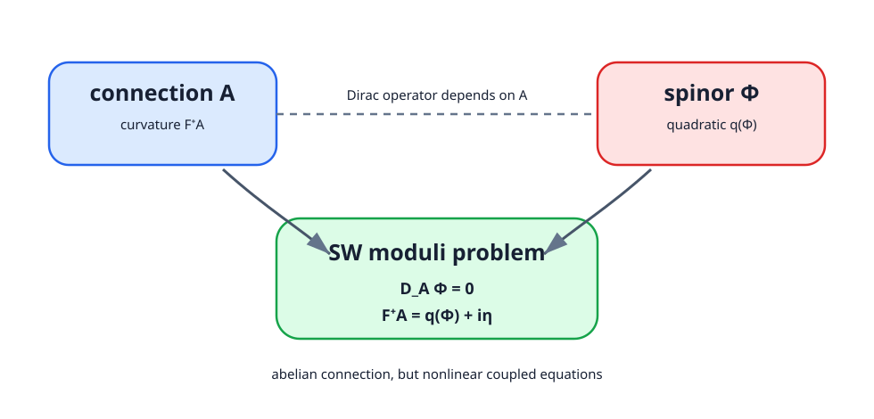

<!-- contract: contracts/16-seiberg-witten-equations.json -->

# 方程式と摂動

$\mathrm{Spin}^c$ 構造 $\mathfrak s$ を固定し、determinant line $L$ の接続 $A$ と正spinor $\Phi$ を未知量とする。第15章の規約に従い、$F_A^+$ と $q(\Phi)$ はどちらも $i\Lambda^2_+$ のsectionである。実自己双対2形式 $\eta$ を摂動として

$$
\begin{cases}
D_A\Phi=0,\\
F_A^+=q(\Phi)+i\eta
\end{cases}
$$

をSeiberg--Witten方程式とする。係数は $q$ の規格化に吸収されるため、文献間で式を比較するときは、Clifford同一視、$i$ の位置、二次写像の係数を同時に確認する。[@witten1994; @morgan1996]

{#fig-sw-equations fig-alt="左にconnection A、右にspinor Phiを置き、下にD_A Phi equals zeroとF_A plus equals q(Phi) plus perturbationを示す図"}

$\Phi=0$ の解はreducibleであり、第二式は $F_A^+=i\eta$ となる。generic perturbationと $b_2^+>0$ の条件を用いてreducibleを避けるのが、smooth moduliを作る基本方針である。

# 線形化とexpected dimension

無限小gauge変換 $f\in\Omega^0(i\mathbb R)$ は $(-df,f\Phi)$ を与える。方程式の線形化とgauge fixingを合わせた作用素は、概略的に

$$
\Omega^1(i\mathbb R)\oplus\Gamma(W^+)
\longrightarrow
\Omega^0(i\mathbb R)\oplus\Omega^2_+(i\mathbb R)\oplus\Gamma(W^-)
$$

となる。principal symbolは $d^*\oplus d^+$ とDirac作用素の直和なので楕円的である。index theoremから実expected dimension

$$
d(\mathfrak s)=\frac{c_1(L)^2-(2\chi(X)+3\sigma(X))}{4}
$$

を得る。

この式もactual dimensionを無条件には与えない。regular perturbationでcokernelを消し、reducibleを避けたときにsmooth manifoldのdimensionになる。

# expected dimensionの代入例

式だけでは、$d(\mathfrak s)$ が何を測っているか見えにくい。そこで $\mathbb{CP}^2$ で形式的に代入してみる。$\chi(\mathbb{CP}^2)=3$、$\sigma(\mathbb{CP}^2)=1$ なので

$$
2\chi+3\sigma=2\cdot3+3\cdot1=9.
$$

前章の通り、許される $c_1(L)$ は $(2m+1)h$ の形である。従って

$$
c_1(L)^2=(2m+1)^2
$$

であり、

$$
d(\mathfrak s_m)=\frac{(2m+1)^2-9}{4}.
$$

$m=1$ または $m=-2$ なら $(2m+1)^2=9$ で、expected dimensionは0になる。$m=0$ なら $d=-2$ であり、genericには解が存在しない方向を示す。ここで得た数は、ただちに不変量の値ではない。orientation、regularity、reducible回避、chamberの問題を処理して初めて、点を符号付きに数える段階へ進める。

この計算例は、SW理論がなぜ計算可能に見えるかも示している。Donaldson polynomialでは非可換ASD moduliと$\mu$-挿入を扱う必要があった。一方、SW側ではまず $\mathrm{Spin}^c$ 構造ごとのexpected dimensionを、特性類と $\chi,\sigma$ から直接読める。ただし、方程式が簡単になったわけではなく、計算の入口が明瞭になったというのが正確である。

# Weitzenböck公式からコンパクト性評価を得る

Dirac作用素には

$$
D_A^*D_A\Phi
=\nabla_A^*\nabla_A\Phi+\frac{s}{4}\Phi+\frac12\rho(F_A^+)\Phi
$$

というWeitzenböck公式がある。方程式 $F_A^+=q(\Phi)+i\eta$ を代入し、$D_A\Phi=0$ との $L^2$ pairingを取ると、$|\Phi|^4$ の正項を含む評価が得られる。最大値原理により $\|\Phi\|_{L^\infty}$ をscalar curvatureと摂動から抑えられる。

# Weitzenböck estimateを少し開く

未摂動の場合を模式的に見る。$D_A\Phi=0$ なら

$$
0=\langle D_A^*D_A\Phi,\Phi\rangle
=|\nabla_A\Phi|^2+\frac{s}{4}|\Phi|^2
+\frac12\langle \rho(F_A^+)\Phi,\Phi\rangle
$$

を積分して得る。第二方程式で $F_A^+=q(\Phi)$ を代入すると、最後の項は規格化定数を除いて $|\Phi|^4$ になる。

$$
0=\int_X
\left(
|\nabla_A\Phi|^2+\frac{s}{4}|\Phi|^2+c|\Phi|^4
\right)d\mathrm{vol}
$$

という形を想像すればよい。scalar curvatureが負の場所では中間項は助けにならないが、四次項は大きなspinorを抑える。摂動 $\eta$ がある場合は右辺に $\eta$ に依存する項が加わり、Young不等式で吸収する。これがSW compactnessの中心である。

ASD理論では、energy boundだけではscale collapseを防げなかった。SW理論ではspinor方程式とWeitzenböck公式が未知量の点wise boundを与えるため、固定した $\mathfrak s$ ではcompactnessがはるかに扱いやすい。

曲率のself-dual部分は第二式で抑えられ、cohomology classが全曲率の調和部分を固定する。可換gauge fixingと楕円estimateから接続も制御される。ASD理論で現れたnon-abelian bubblingに比べ、固定 $\mathfrak s$ のSW moduliはcompactnessが直接的である。

この最後の一文は少し速いので、接続側の制御を分解しておく。$L$ 上の二つのunitary connectionの差は虚数値1形式である。gaugeをCoulomb条件に固定すれば、$d^*\alpha=0$ と $d^+\alpha$ の評価から、楕円評価で $\alpha$ のSobolev normを抑えられる。調和成分は $c_1(L)$ と摂動のcohomology classで固定される。従って、spinorの上界、曲率方程式、Coulomb gauge、楕円評価を順に組み合わせることで、接続とspinorの列から収束部分列を取り出せる。Weitzenböck公式だけが単独でコンパクト性を「作る」のではなく、この四段階の最初の強い評価を与えるのである。

# reducibleを避ける条件

$\Phi=0$ なら、方程式は $F_A^+=i\eta$ になる。左辺のcohomology classは $2\pi i\,c_1(L)$ のself-dual harmonic partと結びついている。したがってreducibleが存在する条件は、摂動 $\eta$ と $c_1(L)^+$ が特定の関係を満たすこととして表れる。

$b_2^+>0$ なら、genericなself-dual perturbationでこの条件を避けられる。$b_2^+=1$ では避け方がchamberに依存し、wall-crossingが現れる。これはDonaldson理論の壁と同じ構造を持つが、SWでは$\mathrm{Spin}^c$ 構造ごとの壁として見える。

# 不変量

$d(\mathfrak s)=0$ でorientationを選ぶと、regular moduliの点を符号付きで数え

$$
SW_X(\mathfrak s)\in\mathbb Z
$$

を得る。$b_2^+>1$ ではmetric・generic perturbationに依存しない。$b_2^+=1$ ではchamberを指定する。正次元の場合はcohomology classを挿入する拡張が必要である。

次章では「SWはDonaldsonより簡単」という言い方を分解する。compactnessと計算が簡潔になる面はあるが、nonlinear coupling、transversality、orientation、wall-crossingは残る。
