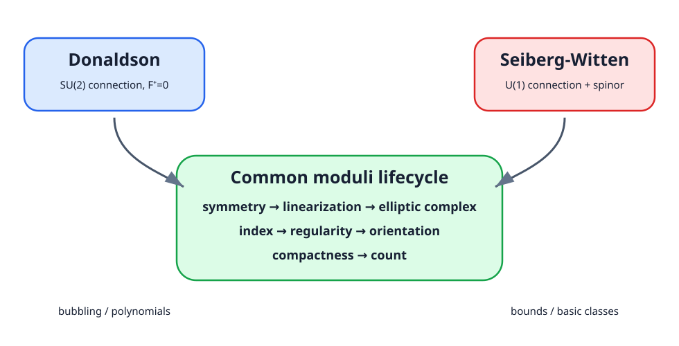

<!-- contract: contracts/17-donaldson-vs-sw.json -->

# 同じ九段階を二度通す

Donaldson理論とSeiberg--Witten理論は、異なる方程式から同じsmooth 4-manifoldへ不変量を返す。比較の単位は結論だけでなく、moduli構成の各段階である。

{#fig-donaldson-sw fig-alt="左にASD接続、右にU(1)接続とspinorを置き、中央に線形化、index、compactification、countの共通段階を示す比較図"}

| 段階 | Donaldson | Seiberg--Witten |
|---|---|---|
| 未知量 | non-abelian connection $A$ | $U(1)$ connection $A$ とspinor $\Phi$ |
| 方程式 | $F_A^+=0$ | $D_A\Phi=0$, $F_A^+=q(\Phi)+i\eta$ |
| 非線形性 | $A\wedge A$ | $A$ と $\Phi$ の連成、$q(\Phi)$ |
| compactness | bubblingをideal instantonで回収 | Weitzenböck boundと可換gauge fixing |
| 出力 | 多項式・交点形式制約 | $\mathrm{Spin}^c$ 構造ごとの整数 |

# 「可換だから簡単」の限界

$U(1)$ 曲率は $F_A=dA$ であり、接続単独なら線形である。しかしDirac作用素は $A$ に依存し、曲率方程式は $q(\Phi)$ を含む。従ってSW方程式全体は非線形である。さらにreducible、orientation、wall-crossing、gluingは消えない。

簡潔になるのは主にcompactnessである。spinorの四次項がa priori estimateを与え、ASD接続のような任意小scaleのnon-abelian instantonを固定 $\mathfrak s$ 内で追跡する必要がない。この差が計算可能性を大きく変える。

# 両不変量は常に同じか

Wittenは物理的双対性から、simple typeなどの条件下でDonaldson seriesをSW basic classesから表す公式を予想した。[@witten1994] これは任意の4多様体について無条件に二つの不変量が同じ、という定理ではない。成立が証明されている範囲、仮定、正規化を区別する必要がある。

本書で厳密に使うのは、それぞれがdiffeomorphism invariantを与える枠組みと、特定の幾何でSW invariantが非消滅するという結果である。両理論の完全な同値を前提にはしない。

# connected sumとbasic class

$b_2^+>0$ の二つの多様体のconnected sumではSW invariantが消える。この消滅はsymplectic構造の存在を排除する道具になる一方、smooth structuresを区別する情報も失う。Donaldson側にも類似の消滅・gluing現象がある。操作に対する振る舞いは不変量の能力と盲点を同時に示す。

# 幾何へ戻す

ここまで不変量はsmooth structureを区別する観測量だった。最終章では向きを逆転し、非零のSW invariantから埋め込み曲面のgenusやsymplectic structureへ具体的制約を返す。解析的解が、もとの幾何にどの情報を強制するかを見る。

