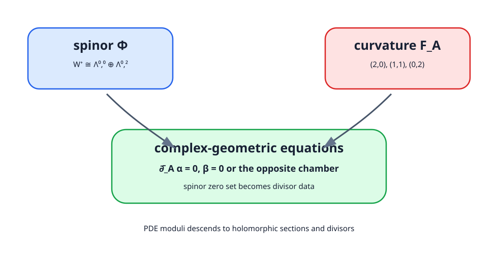
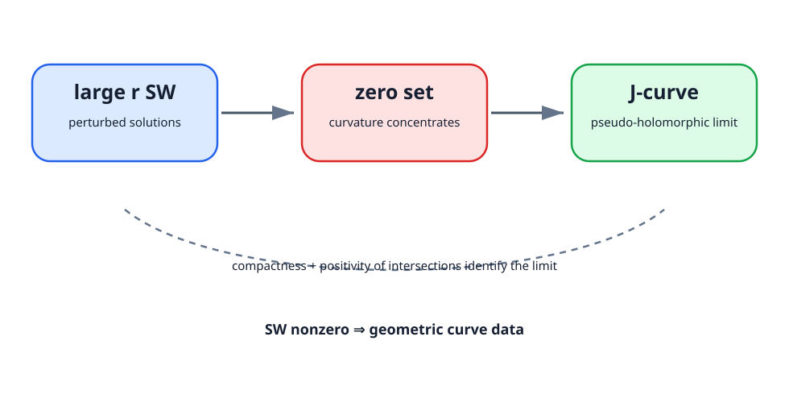
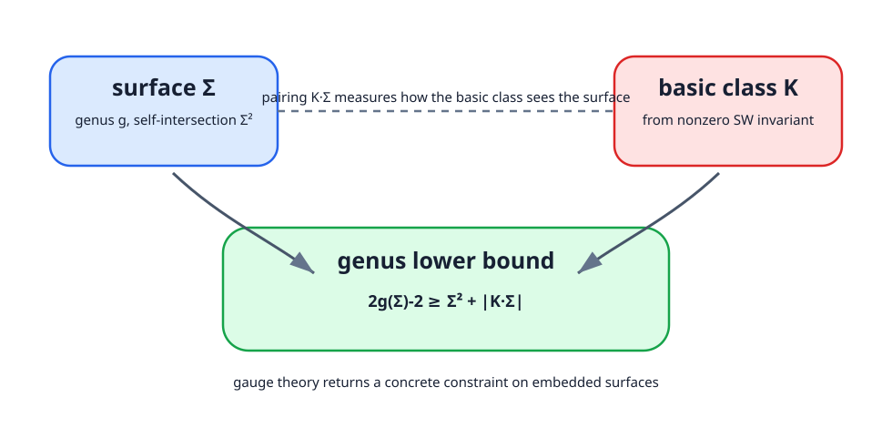

<!-- contract: contracts/18-kahler-symplectic.json -->

# Kähler面では方程式が分解する

Kähler surfaceではpositive spinor bundleが型分解を持ち、適切な $\mathrm{Spin}^c$ 構造で

$$
W^+\cong \Lambda^{0,0}\oplus\Lambda^{0,2}
$$

と書ける。spinorを $(\alpha,\beta)$ と表すとDirac方程式は $\bar\partial_A$ と $\bar\partial_A^*$ の組へ分かれ、曲率方程式も型 $(1,1)$ と $(0,2)$ の条件へ分解する。摂動の符号に応じて一方の成分が消え、残る方がholomorphic sectionとして解釈される。

この具体化により、抽象的なspinor解とdivisor・line bundleの複素幾何が接続する。解析から得たmoduliが、既知のholomorphic dataで計算可能になる。

# Kähler還元の意味

Kähler面でSW方程式が扱いやすくなるのは、単に複素記法が使えるからではない。Dirac作用素が

$$
\sqrt2(\bar\partial_A+\bar\partial_A^*)
$$

の形に分解し、曲率も型分解

$$
F_A=F_A^{2,0}+F_A^{1,1}+F_A^{0,2}
$$

を持つからである。摂動をKähler form方向に取ると、方程式はしばしば

$$
\bar\partial_A\alpha=0,\quad \beta=0
$$

またはその反対側へ還元される。するとspinorの片方の成分はholomorphic sectionとして読め、その零点集合がdivisorを作る。

ここで抽象的なPDE moduliが、複素幾何の線形系やdivisorへ翻訳される。SW理論が強力なのは、不変量が存在するだけでなく、特別な幾何では計算可能な対象へ降りるからである。

{#fig-kahler-reduction fig-alt="spinorの型分解と曲率の型分解が、複素幾何の方程式へ矢印で接続される図"}

# 小さな計算例：複素曲線のadjunction formula

代数曲面内の滑らかな複素曲線 $C$ では、古典的なadjunction formula

$$
2g(C)-2=C\cdot C+K_X\cdot C
$$

が成り立つ。SW理論のadjunction inequalityは、複素曲線に限らないsmooth embedded surfaceへ、これに似た下界を与える。複素曲線では等号が出る場合があり、SW不変量による下界が既知の複素幾何の値と一致する。

例えば $\mathbb{CP}^2$ の次数 $d$ の滑らかな複素曲線を考える。hyperplane classを $H$ とすれば $[C]=dH$、$C\cdot C=d^2$、canonical classは $K_{\mathbb{CP}^2}=-3H$ である。従って

$$
2g(C)-2=d^2-3d,
\quad
g(C)=\frac{(d-1)(d-2)}2.
$$

この計算はSW不変量を使ったものではない。しかし、adjunction inequalityを読む基準になる。ゲージ理論は、複素曲線で見慣れたgenus制約を、より一般のsmooth曲面へ拡張する役割を持つ。

# Taubesの反転：解から曲線へ

閉symplectic 4-manifold $(X,\omega)$ はcompatible almost complex structureを通じてcanonical class $K=-c_1(TX,J)$ を持つ。Taubesの $SW\Rightarrow Gr$ は、適切なSW解のlarge-perturbation極限から擬正則曲線を取り出し、SW invariantとGromov invariantを結ぶ。[@taubes1996]

::: {.callout-important title="Taubesの定理（引用定理、深度D）"}
$b_2^+(X)>1$ の閉symplectic 4-manifold $(X,\omega)$ では、$\omega$ とcompatibleなalmost complex structureから定まるcanonical class $K=-c_1(TX,J)$ に対応するcanonical $\mathrm{Spin}^c$ 構造のSW invariantが非零である。さらに、適切な摂動を入れたSW解の大摂動極限は、homology classを持つ擬正則曲線のデータと対応する。$b_2^+=1$ ではchamberを指定する必要があるため、本書ではまず $b_2^+>1$ の版を基準に使う。本書ではstatement、摂動scale、曲率集中から曲線を抽出する証明骨格、下流の帰結を示し、解析的極限の全証明は引用する。
:::

# 証明アーキテクチャ：SW解から曲線を取り出す

Taubesの証明を引用定理として使う場合でも、何が起きているかの輪郭は必要である。大きな摂動parameter $r$ を入れたSW方程式を考えると、spinorの一成分は多くの場所で大きくなり、その零点近くに曲率が集中する。零点集合を適切に拡大して見ると、almost complex structureに対する擬正則曲線が現れる。

論理の骨格は次のように読める。

1. canonical $\mathrm{Spin}^c$ 構造に対して、大摂動SW方程式を置く。
2. Weitzenböck型評価でspinorの大きさと曲率集中を制御する。
3. spinorの零点集合に沿ってenergyが集中することを示す。
4. 極限として擬正則曲線、またはcurrentを得る。
5. compactnessとpositivity of intersectionsにより、Gromov invariantとSW invariantを対応させる。

難所は、零点集合がただの測度論的な集合ではなく、擬正則曲線として十分な構造を持つことを示す点である。本書ではこの解析を証明しないが、Taubesの結果が「SW非零なら曲線がある」という幾何的出力を返すことを明示して使う。

{#fig-taubes-limit fig-alt="large perturbation Seiberg-Witten solutionsからspinor zero setとcurvature concentrationを経てpseudo-holomorphic curveへ至る図"}

# adjunction inequality

$SW_X(\mathfrak s)\ne0$ とし、対応するbasic classを $K_{\mathfrak s}=c_1(L)$ とする。ここでも使う版を固定する。$X$ を閉・連結・向き付きで $b_2^+(X)>1$ とし、$\Sigma\subset X$ を滑らかに埋め込まれた連結閉曲面とする。$[\Sigma]\ne0$ で、典型的には $g(\Sigma)>0$ かつ $\Sigma\cdot\Sigma\ge0$ の場合に、SW basic classから

$$
2g(\Sigma)-2\ge \Sigma\cdot\Sigma+
|K_{\mathfrak s}\cdot[\Sigma]|
$$

というadjunction inequalityが成り立つ。self-intersectionが負の場合やsphereの場合には、使う定理の版に応じて仮定や結論を調整する必要がある。本書で使うのは「非零basic classが、非自明な埋め込み曲面のgenusを下から制限する」という標準的な $b_2^+>1$ の形である。左辺はgenus、右辺はhomologyとbasic classだけで書かれる。従って、同じhomology classを表すsmooth surfaceの最小genusへ下界を与える。[@kronheimerMrowka1994; @morgan1996]

このstatementで隠してはいけない点は三つある。第一に、$SW_X(\mathfrak s)\ne0$ が入力であり、不等式そのものがbasic classの存在を作るわけではない。第二に、$[\Sigma]$ の非torsion性やself-intersectionの符号条件は、曲面挿入をmoduli問題へ反映するための仮定である。第三に、$b_2^+=1$ ではchamber依存を無視できない。したがって、adjunction inequalityを使うときは、曲面、basic class、chamberを同時に確認する。

{#fig-adjunction fig-alt="曲面シグマとbasic class Kから、2g minus 2 greater than or equal to Sigma squared plus absolute K dot Sigmaという不等式へ矢印が向かう図"}

複素曲線ではadjunction formulaが等号を与える場合があり、解析的不変量の下界が代数幾何の値と一致する。ここでゲージ理論はsmooth structureの識別器から、埋め込み問題の定量的道具へ変わる。

# adjunction inequalityの読み方

この不等式は、曲面のgenusをhomology classだけから完全に決めるものではない。しかし、あるclassを低いgenusで表せるかどうかに強い制約を与える。例えば $\Sigma\cdot\Sigma$ が大きく、basic classとのpairingも大きければ、右辺が大きくなり、低genus代表は排除される。

Donaldson理論がintersection formの整数格子へ制約を返したのに対し、SW理論はbasic classを通じて埋め込み曲面の最小genusへ制約を返す。この違いが、後期4次元トポロジーでSW理論が急速に使われた理由の一つである。

# 正scalar curvatureへの障害

未摂動SW方程式にWeitzenböck formulaを用いると、scalar curvature $s>0$ が至る所で正ならirreducible解を排除する方向に働く。非零SW invariantを持つ多様体では、このvanishing argumentと矛盾するため、正scalar curvature計量の存在に障害が生じる。正確な結論にはperturbation・chamber・basic classの条件を添える必要がある。

# 中心問題への回答

楕円型ゲージ方程式の解空間がsmooth structureを検出できる理由は、一つの奇跡ではなく連鎖である。

1. 4次元では曲率2形式が自己双対に分かれ、topological chargeがenergy下限になる。
2. gauge対称性を含む線形化が楕円複体を作り、indexが有限次元のexpected dimensionを与える。
3. regularity、orientation、compactificationを加えると、解空間から変形不変な数を取れる。
4. その数はsmoothなPDEを使うためhomeomorphismでは保存されず、diffeomorphismでは保存される。
5. 非零・消滅・basic classの配置が、intersection form、smooth structure、曲面、symplectic幾何へ制約を返す。

FreedmanとDonaldsonの衝突から始まった問いは、Taubesによって再び幾何へ戻った。4次元ゲージ理論は、位相と解析の間に補助構造を置く理論ではない。両者が同じ次数で出会う4次元において、解析的compactnessの壊れ方まで含めて位相情報へ翻訳する機械である。
