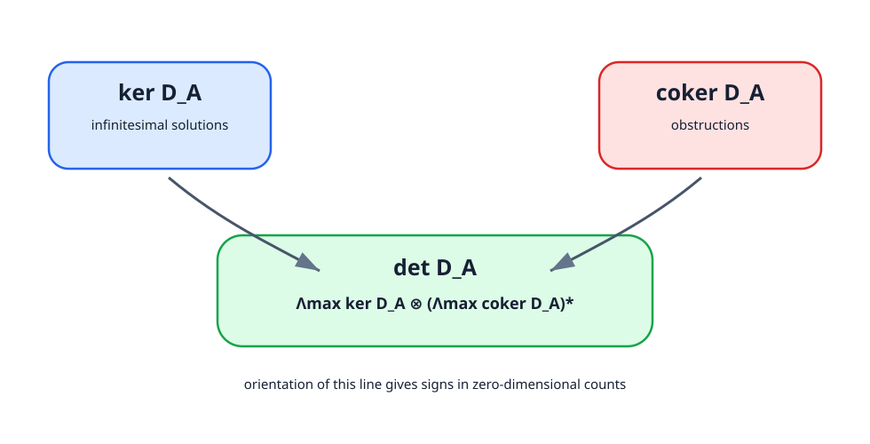
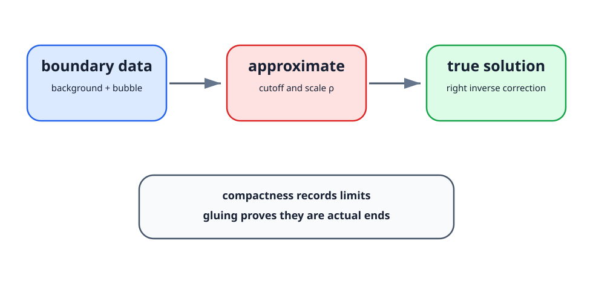

# Sobolev indexの選び方

4次元で接続のgauge作用をBanach Lie群作用として扱うには、通常 $k>2$ を選び $L_k^2\hookrightarrow C^0$ を使う。積写像が連続になる範囲を確認し、$\mathcal A_k=A_0+L_k^2\Omega^1$ と $\mathcal G_{k+1}=L_{k+1}^2(X,G)$ を組み合わせる。微分で一階失うため、gauge群側を一階高く取る。

なぜ $k>2$ が自然かを、4次元のSobolev embeddingで見る。一般に $L^2_k$ は $k-2>0$ のとき連続関数へ埋め込まれる。gauge変換 $g$ を接続へ作用させる式

$$
g(A)=g^{-1}Ag+g^{-1}dg
$$

では、$g$ 自身の積、逆元、微分、そして $A$ との積が同時に出る。$g\in L^2_{k+1}$、$A-A_0\in L^2_k$ としておくと、$dg\in L^2_k$ で接続のSobolev次数と揃う。これは「群を一階高く取る」という慣習の理由である。

# Sobolev乗法で何を制御するか

ASD方程式を $A+a$ で展開すると

$$
F_{A+a}^+=F_A^+ + d_A^+a + (a\wedge a)^+
$$

となる。Banach空間でimplicit function theoremを使うには、写像

$$
a\longmapsto d_A^+a+(a\wedge a)^+
$$

が必要な回数だけ微分可能でなければならない。ここで問題になるのは二次項である。4次元で $k>2$ とすると、$L^2_k$ は代数になり、概略

$$
\|uv\|_{L^2_k}\le C\|u\|_{L^2_k}\|v\|_{L^2_k}
$$

の形の評価が使える。接続の曲率では一階微分が出るため、実際には対象ごとに $L^2_k\to L^2_{k-1}$ の写像として評価する。本文で「Sobolev乗法で非線形項を制御する」と言うとき、少なくともこの積写像の連続性と滑らかさを含んでいる。

# Coulomb gaugeの楕円系

局所sliceで $d_A^*a=0$ を課すと、ASD方程式は

$$
d_A^+a=-(a\wedge a)^+
$$

と組み合わさり、

$$
D_Aa=(d_A^*a,d_A^+a)
$$

という楕円作用素が主部になる。楕円評価は局所的に

$$
\|a\|_{L^2_k(U')}
\le C\bigl(\|D_Aa\|_{L^2_{k-1}(U)}+\|a\|_{L^2(U)}\bigr)
$$

という形を持つ。$U'\Subset U$ とするのは、cutoff関数を使う内部評価で境界効果を避けるためである。閉多様体全体では有限個のchartとpartition of unityで貼り合わせる。

この評価の読み方は単純である。$D_Aa$ が一階微分を制御し、残った有限次元kernel方向だけが $\|a\|_{L^2}$ として残る。したがって、方程式を満たす列に一様boundがあれば、高いSobolev normの制御へ進める。

# 三つのcompactnessを区別する

- Rellich compactness: boundedなSobolev列から低い次数で強収束する部分列を取る。
- elliptic compactness: 方程式とgauge条件から高階estimateを得て収束を改善する。
- Uhlenbeck compactness: 曲率集中点を除き、列ごとに異なるgaugeを選んで収束させる。

三つ目は最初の二つにsmall-energy gauge theoremとenergy量子化を加えた非線形な結論である。

# Fredholm作用素の実用的な判定

閉多様体上の楕円作用素

$$
D:\Gamma(E)\to\Gamma(F)
$$

をSobolev空間

$$
D:L^2_k(E)\to L^2_{k-r}(F)
$$

として見ると、$D$ はFredholm作用素になる。ここで $r$ は作用素の階数である。Fredholm性とは、kernelとcokernelが有限次元で、像が閉であることをいう。

Donaldson理論で重要なのは、Fredholm index

$$
\operatorname{ind}D=\dim\ker D-\dim\operatorname{coker}D
$$

が摂動で安定であることだ。計量や接続を連続的に動かしても、楕円性が失われない限りindexは変わらない。この安定性により、解析的に定義された差が特性類で計算される位相量へ変換される。Atiyah--Singer index theoremはこの最後の変換を与える。[@atiyahSinger1968]

# implicit function theoremの入力

非線形写像 $F:E\to Y$ の零点集合を調べるとき、$DF_0$ が全射でsplit kernelを持てば、零点集合は局所的に $\ker DF_0$ を接空間とするBanach submanifoldになる。全射でないときはcokernelへ射影した有限次元Kuranishi mapが残る。

有限次元のimplicit function theoremと違い、Banach空間ではkernelが補空間を持つことを明示する必要がある。楕円Fredholm作用素ではkernelが有限次元なので、閉補空間を取れる。全射性がない場合、余核も有限次元なので、方程式を「解ける無限次元方向」と「残る有限次元obstruction方向」へ分けられる。これがKuranishi模型の解析的な背景である。

# Sard--Smaleの役割

parameterを含むuniversal equationが横断的なら、parameter空間への射影のregular valueに対して個々のmoduliがregularになる。結論を使う前に、写像のFredholm性、必要な微分可能性、可分性、reducibleの除外を確認する。

通常のSard theoremは有限次元の滑らかな写像に対し、critical valueの集合が小さいことを述べる。moduli問題では、計量空間や摂動空間が無限次元なので、そのままでは使えない。Sard--Smale theoremは、Fredholm写像に対してregular valueが残留集合をなす、という形でこの役割を担う。[@smale1965]

ここで残留集合とは、可算個のopen dense集合の共通部分である。測度の概念ではなく、Baire categoryの意味で「generic」と言っている。本文でgeneric metricを使うたびに、実際には次を確認している。

1. universal moduliがBanach多様体として定義できる。
2. universal sectionが横断的である。
3. parameter空間への射影がFredholmである。
4. reducibleやcompactness failureが別に制御されている。

# determinant lineとorientation

0次元moduliを符号付きで数えるには、各点に $+1$ または $-1$ を付けなければならない。この符号は、有限次元多様体なら接空間のorientationから来る。ASD moduliでは接空間が直接与えられるのではなく、Fredholm作用素

$$
D_A=d_A^*\oplus d_A^+
$$

のkernelとcokernelから局所模型を作る。そこでorientationはdeterminant line

$$
\det D_A
=\Lambda^{\max}\ker D_A\otimes
\left(\Lambda^{\max}\operatorname{coker}D_A\right)^*
$$

の向きとして定義される。regularなirreducible解ではcokernelが消え、$\ker D_A$ がmoduliの接空間になるので、この定義は通常のorientationと一致する。

なぜdeterminant lineを使うのか。moduli全体で $A$ を動かすと、kernelとcokernelの次元は特異点近くで跳ぶことがある。しかしFredholm族のdeterminant lineは、適切に扱えば連続なline bundleとして振る舞う。したがって、orientation問題は「各点で接空間に向きを付ける」問題ではなく、「Fredholm族のdeterminant line bundleを向き付ける」問題として定式化される。

Donaldson理論では、単連結などの仮定のもとでhomology orientationを選ぶと、ASD moduliのorientationが誘導される。本文で「orientationを選んで符号付きcountを取る」と言うとき、背後ではこのdeterminant lineの向き付けが行われている。

{#fig-orientation-line fig-alt="kernelとcokernelからdeterminant lineを作り、そのorientationで符号を決める図"}

# gluingは何を逆にする操作か

compactificationでbubbleやbroken configurationが現れると、moduliの境界や端を理解する必要がある。gluingは、その境界データから実際の近似解を作り、さらに真の解へ補正する操作である。

典型的な流れは次の通りである。

1. 既知の解 $A_0$ と、標準的なbubble解 $I_\rho$ を用意する。
2. cutoff関数で二つを貼り合わせ、近似解 $A_{\mathrm{app}}$ を作る。
3. 誤差 $F_{A_{\mathrm{app}}}^+$ を評価する。
4. 線形化作用素の右逆を使い、補正項 $a$ を解く。
5. contraction mappingまたはimplicit function theoremで真の解 $A_{\mathrm{app}}+a$ を得る。

この手順は「絵として貼る」だけではない。誤差が十分小さいこと、右逆のnormが制御されること、obstructionがないか有限次元方程式として管理されることが必要である。gluing theoremは、compactificationの端が本当にmoduliの端として現れることを保証する役割を持つ。

Donaldson対角化定理や多項式不変量の深い証明でgluingが必要になるのは、境界stratumを数え上げや交点計算と結びつけるためである。本書ではgluing解析を完全証明しないが、端の構造を使う主張では、常に「近似解から真の解へ戻す解析」が背後にある。

{#fig-gluing fig-alt="boundary dataからapproximate solutionを作り、right inverse correctionでtrue solutionへ補正する図"}

# characteristic classの最小整理

本文では $c_2(P)$、$p_1(\operatorname{ad}P)$、$w_2$、$c_1(L)$ が現れる。ここで役割だけを整理する。

| 記号 | 使う場所 | 役割 |
|---|---|---|
| $c_2(P)$ | $SU(2)$ Donaldson理論 | chargeやASD moduliのindexに入る |
| $p_1(\operatorname{ad}P)$ | $SO(3)$ 束 | index公式やDonaldson不変量の型を決める |
| $w_2(TX)$ | Spin / Spin-c の存在条件 | spin構造の障害、Spin-c合同条件の右辺 |
| $c_1(L)$ | SW理論 | Spin-c構造のdeterminant line、expected dimension、basic class |

重要なのは、これらが単なるラベルではなく、moduli問題の入力を固定することである。Donaldson側では束の特性類がASD moduliのchargeと次元を決める。SW側では $\mathrm{Spin}^c$ 構造、特にdeterminant lineの $c_1(L)$ が方程式の添字になる。

例えばSW expected dimension

$$
d(\mathfrak s)=\frac{c_1(L)^2-(2\chi+3\sigma)}{4}
$$

では、$c_1(L)^2$ はintersection formで計算する。ここで第2章の交点形式と、第15--16章のSpin-c構造がつながる。

# Spin-c構造の実用チェック

$\mathrm{Spin}^c$ 構造を使うとき、本文では次を確認する。

1. determinant line $L$ の $c_1(L)$ が
   $$
   c_1(L)\equiv w_2(TX)\pmod2
   $$
   を満たす。
2. $c_1(L)^2$ をintersection formで計算する。
3. $d(\mathfrak s)$ が0か正か負かを確認する。
4. reducibleやwall-crossingが問題になるかを $b_2^+$ と摂動で確認する。
5. 非零不変量が得られた場合、その $c_1(L)$ をbasic classとして幾何的制約へ使う。

このチェックリストにより、SW理論の記号を「spinorが出てくる別理論」としてではなく、Donaldson理論と同じmoduli lifecycleの別入力として読める。

# 読者のための最小チェックリスト

解析の道具を使う箇所で、次の問いに答えられれば本文の論理を追える。

| 問い | 見るべき場所 |
|---|---|
| なぜBanach空間で扱えるか | Sobolev完備化と乗法評価 |
| なぜ有限次元になるか | 楕円性、Fredholm性、Rellich compactness |
| なぜ弱解が滑らかか | Coulomb gauge、楕円正則性、bootstrapping |
| なぜgenericに滑らかか | universal moduli、Sard--Smale |
| なぜ数え上げが不変か | compactification、orientation、cobordism |

この付録は完全な関数解析の教科書ではない。しかし本文で引用定理として借りる解析結果が、どの仮定からどの結論を返しているかを追跡するための地図である。
