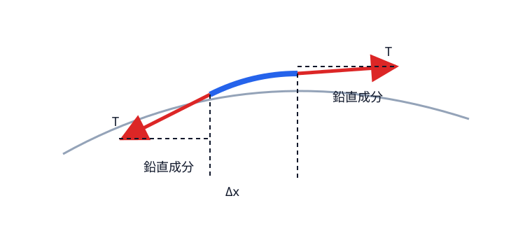
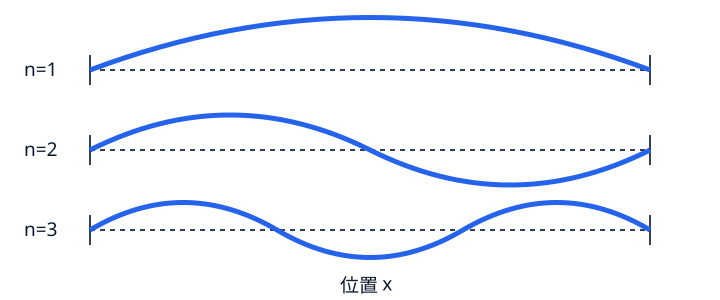

# 音から長さを測る――一本の弦と最初の逆問題

二次元の膜へ進む前に、答えを完全に計算できる一次元模型で「音から幾何を戻す」とは何かを確認する。ここで得たいのは正弦波の公式だけではない。力学から微分方程式が生まれ、境界条件が許される空間模様を選び、その模様に付く数が時間振動数を決める、という三段階である。

## 微小区間に働く力

長さ $L$、線密度 $\mu\,[\mathrm{kg/m}]$、一定張力 $T\,[\mathrm N]$ の細い弦を考える。平衡位置からの横変位を $u(x,t)$ とし、変位と傾きが小さい範囲に限る。区間 $[x,x+\Delta x]$ の両端では、張力ベクトルは弦の接線方向を向く。傾斜角を $\theta$ とすると鉛直成分は $T\sin\theta$ である。

小傾斜なら

$$
\sin\theta\simeq\tan\theta=u_x.
$$

左右の鉛直成分を引くと

$$
F_y=T\{u_x(x+\Delta x,t)-u_x(x,t)\}
=T u_{xx}(x,t)\Delta x+o(\Delta x).
$$

ここで一階微分 $u_x$ ではなく二階微分 $u_{xx}$ が残る理由は、力が「両端の傾きの差」だからである。弦全体が同じ傾きの直線なら両端の鉛直成分は打ち消し合い、加速度は生じない。傾きが場所によって変化するときだけ復元力が生じる。

微小区間の質量は $\mu\Delta x$。Newton の運動方程式 $ma=F$ より

$$
\mu\Delta x\,u_{tt}=T\Delta x\,u_{xx}+o(\Delta x).
$$

$\Delta x$ で割って極限を取ると

$$
u_{tt}=c^2u_{xx},\qquad c^2=\frac{T}{\mu}.
\tag{1.1}
$$

単位も整合する。$T/\mu$ の単位は $\mathrm{m^2/s^2}$ なので、$c$ は速度である。小傾斜・一様張力・曲げ剛性を無視するという仮定を外せば、この方程式は変わる。

{#fig-string-force}

## 固定端が波長を選ぶ

両端固定は $u(0,t)=u(L,t)=0$ を意味する。$u=X(x)\tau(t)$ を式 (1.1) に代入すると

$$
X\tau''=c^2X''\tau.
$$

非零の領域で割って

$$
\frac{\tau''}{c^2\tau}=\frac{X''}{X}.
$$

左辺は $t$ だけ、右辺は $x$ だけの関数である。任意の $x,t$ で等しいには共通の定数でなければならない。これを $-\lambda$ と置く。

負号を付けるのは後の答えを正にするための便宜だけではない。固定端で部分積分すれば

$$
\lambda\int_0^L|X|^2\,dx
=\int_0^L|X'|^2\,dx\ge0
$$

となり、$-d^2/dx^2$ が非負の作用素であることが分かる。非零モードでは右辺が正なので $\lambda>0$ である。

$\lambda<0$ なら時間解は指数的で通常振動にならず、空間側も固定端を満たす非零解を持たない。$\lambda=0$ でも空間解は一次関数で、両端ゼロなら零関数である。したがって $\lambda>0$ のみが残り、

$$
-X''=\lambda X,\qquad \tau''+c^2\lambda\tau=0.
$$

境界条件から

$$
X_n(x)=\sin\frac{n\pi x}{L},\quad
\lambda_n=\left(\frac{n\pi}{L}\right)^2,\qquad n=1,2,\ldots
$$

を得る。弦長に半波長が整数個入るという図形的説明と同じ条件である。

{#fig-string-modes}

時間解の角振動数は $\omega_n=c\sqrt{\lambda_n}$。一秒あたりの周期数 $f_n=\omega_n/(2\pi)$ は

$$
f_n=\frac{n}{2L}\sqrt{\frac{T}{\mu}}.
\tag{1.2}
$$

単一モードは一つの形を保って振動する。一般の初期変位は正弦級数に展開され、多数のモードの重ね合わせになる。線形方程式だから和も解である。

この時点で用語を固定する。$X_n$ は空間的な固有振動モード、$\lambda_n$ は $-d^2/dx^2$ の固有値、その全体 $\{\lambda_n\}$ がスペクトルである。耳が直接受け取る周波数 $f_n$ と $\lambda_n$ は同じ数ではなく、既知の波速 $c$ を介して $2\pi f_n=c\sqrt{\lambda_n}$ と結ばれる。

## 最初の逆問題

$T$ と $\mu$ が既知なら、基本振動数から

$$
L=\frac{1}{2f_1}\sqrt{\frac{T}{\mu}}
$$

と長さを戻せる。しかし $T/\mu$ も未知なら $f_1$ だけでは分離できない。逆問題では「未知量」と「観測量」の契約が答えを決める。

この一次元問題では一本の固有値から長さが戻った。次章では弦を膜へ広げる。二方向の曲がりを足すとラプラシアンが現れ、同じ「空間モード→固有値→時間周波数」の鎖が二次元でも保たれる。

::: {.callout-check title="確認"}
1. 張力を4倍にすると周波数は何倍か。2. 長さを2倍にすると固有値と周波数はどう変わるか。3. 弦の端を固定しなければ、波長選択はどう変わるか。
:::

::: {.callout-note title="解答・ヒント" collapse="true"}
1. 式 (1.2) の $f_n\propto\sqrt T$ より2倍。2. $\lambda_n\propto L^{-2}$ なので $1/4$、$f_n\propto L^{-1}$ なので $1/2$。3. 境界条件を指定しない限り許される波数は決まらない。自由端なら $X'(0)=X'(L)=0$ となり、余弦モードに加えて周波数0の剛体移動が現れる。
:::
