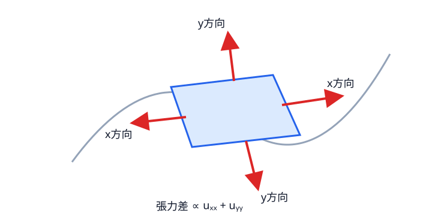

# 膜の運動方程式――なぜ Laplacian か

## 四辺の力を足す

膜の単位面積あたり質量を $\rho\,[\mathrm{kg/m^2}]$、単位長さあたりの等方張力を $\tau\,[\mathrm{N/m}]$ とする。微小長方形 $[x,x+\Delta x]\times[y,y+\Delta y]$ の質量は $\rho\Delta x\Delta y$ である。

右辺と左辺の長さは $\Delta y$。それぞれの鉛直張力成分は小傾斜近似で $\tau\Delta y\,u_x$ だから、差は

$$
\tau\Delta y\{u_x(x+\Delta x,y)-u_x(x,y)\}
=\tau u_{xx}\Delta x\Delta y+o(\Delta x\Delta y).
$$

同様に上辺と下辺から $\tau u_{yy}\Delta x\Delta y$ を得る。二方向を足し、Newton 則を使えば

$$
\rho\Delta x\Delta y\,u_{tt}
=\tau(u_{xx}+u_{yy})\Delta x\Delta y+o(\Delta x\Delta y),
$$

したがって

$$
u_{tt}=c^2\Delta u,\qquad c^2=\frac{\tau}{\rho},\qquad
\Delta u=u_{xx}+u_{yy}.
\tag{2.1}
$$

$\tau/\rho$ の単位も $\mathrm{m^2/s^2}$ である。$x,y$ 方向で張力が異なれば $u_{xx}+u_{yy}$ ではなく係数付き和になる。Laplacian は等方性を反映している。

{#fig-membrane-force}

## 周囲平均との差としての Laplacian

Taylor 展開により、小さい $h$ について

$$
\frac{u(x+h,y)+u(x-h,y)+u(x,y+h)+u(x,y-h)-4u(x,y)}{h^2}
=\Delta u(x,y)+O(h^2).
$$

つまり $\Delta u$ は「近傍四点の平均と中心値の差」を測る。山では周囲平均が低く $\Delta u<0$ なので下向き加速度、谷では $\Delta u>0$ なので上向き加速度になる。局所的な曲がりを平らに戻す力という説明が式で確かめられた。

## 境界条件

枠に固定した膜では

$$
u|_{\partial\Omega}=0
$$

という Dirichlet 条件を課す。法線方向勾配をゼロにする

$$
\partial_nu|_{\partial\Omega}=0
$$

が Neumann 条件である。後者は熱なら断熱境界として直接的だが、実在膜の自由端を完全に表すわけではない。二つは異なる数学モデルであり、同じ領域でもスペクトルは変わる。

## 空間の形と時間振動を分ける

$u(x,y,t)=\phi(x,y)T(t)$ を式 (2.1) に代入する。

$$
\phi T''=c^2T\Delta\phi
\quad\Longrightarrow\quad
\frac{T''}{c^2T}=\frac{\Delta\phi}{\phi}=-\lambda.
$$

零点では割り算を文字通り行えないが、等式 $\phi T''=c^2T\Delta\phi$ と連続性から、非零な開集合で得た定数関係を全体へ延長できる。こうして

$$
-\Delta\phi=\lambda\phi,\qquad T''+c^2\lambda T=0.
\tag{2.2}
$$

$\lambda>0$ なら

$$
T(t)=A\cos(c\sqrt\lambda t)+B\sin(c\sqrt\lambda t),
$$

ゆえに

$$
\boxed{\omega=c\sqrt\lambda},\qquad f=\frac{c\sqrt\lambda}{2\pi}.
\tag{2.3}
$$

形 $\phi$ の曲がりの強さ $\lambda$ が時間振動の速さになる。これが本書全体の最初の橋である。

一つの分離解だけでは一般の初期変位を表せない。有限個の質点系で初期ベクトルを固有ベクトルへ分解したのと同様に、膜では

$$
u(x,t)=\sum_{k=1}^{\infty}
\left(a_k\cos(c\sqrt{\lambda_k}t)
+b_k\sin(c\sqrt{\lambda_k}t)\right)\phi_k(x)
$$

とモードを重ねる。初期変位 $u(x,0)$ は $a_k$、初期速度 $u_t(x,0)$ は $c\sqrt{\lambda_k}b_k$ の係数を決める。この展開が任意の有限エネルギー初期値を表す根拠は、次章の「固有関数の完全性」で説明する。

::: {.callout-check title="確認"}
異方的な張力 $\tau_x,\tau_y$ の膜で運動方程式を作れ。Laplacian がそのまま現れない理由も説明せよ。
:::

::: {.callout-note title="解答・ヒント" collapse="true"}
四辺の鉛直成分を方向別に足すと $\rho u_{tt}=\tau_xu_{xx}+\tau_yu_{yy}$ となる。$\tau_x=\tau_y$ のときだけ右辺は定数倍の $\Delta u=u_{xx}+u_{yy}$ である。異方性がある場合は座標方向ごとの曲率に異なる重みが掛かる。
:::
