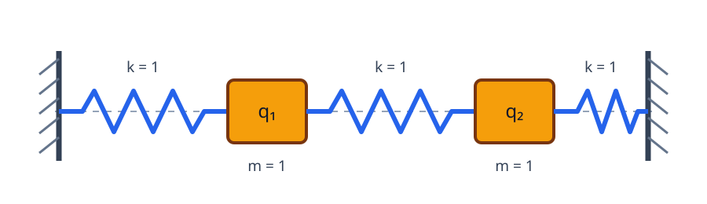

# 固有値・固有関数・スペクトル

前章までで各分離モードの式は得た。しかし一般の初期変位を本当にモードへ分解できるのか、固有値はなぜ飛び飛びに並ぶのか、波以外の方程式に同じ固有値がどう現れるのかは未解決である。この章では、有限次元の対称行列から出発し、逆作用素をPDE solverとして作ることで三つの疑問を一度に整理する。

## 有限次元から考える

対称行列 $A$ の固有値問題 $Av=\lambda v$ では、固有ベクトルは変形の型、固有値はその型に対する応答の強さを表す。ラプラシアンの問題

$$
-\Delta\phi=\lambda\phi
$$

は、無限次元の対称行列に相当する。境界条件を含めて初めて作用素が定まる。

具体的に、質量1の二つの質点を、左右の壁と質点どうしの間に置いた三本の同じばね（ばね定数1）で一直線につなぐ。平衡位置からの変位を $q_1,q_2$ とすると、Hooke の法則から

$$
\ddot q_1=-q_1-(q_1-q_2)=-2q_1+q_2,
\qquad
\ddot q_2=-(q_2-q_1)-q_2=q_1-2q_2.
$$

したがって

$$
\ddot q=-Kq,\qquad
q=\begin{pmatrix}q_1\\q_2\end{pmatrix},\qquad
K=\begin{pmatrix}2&-1\\-1&2\end{pmatrix}
$$

と書ける。$(1,1)^T$ は同位相モードで固有値1、$(1,-1)^T$ は逆位相モードで固有値3を持つ。初期変位を二固有ベクトルへ分解すれば、各成分が固有値の平方根に比例する角振動数で独立に振動する。膜では有限個の座標が関数 $\phi(x,y)$ に、行列 $K$ が $-\Delta$ に変わる。

{fig-alt="左壁、ばね、質点q1、ばね、質点q2、ばね、右壁を一直線に結んだ図"}

有界で十分正則な連結領域の Dirichlet スペクトルは

$$
0<\lambda_1\le\lambda_2\le\cdots\to\infty
$$

と並ぶ。Neumann では定数関数が $\lambda_0=0$ を与える。同じ値が複数回現れるとき、その固有空間の次元を重複度という。固有値は数、固有関数は空間的な模様である。

## なぜ離散で、なぜ無限個か

区間では境界条件が許す波数を整数に量子化した。一般の有界領域でも、有限の箱に波を収める境界条件が連続な波数を離散化する。厳密にはエネルギー空間 $H_0^1(\Omega)$ から $L^2(\Omega)$ への Rellich 埋め込みがコンパクトで、ラプラシアンのリゾルベントがコンパクトになる。スペクトル定理により有限重複度の固有値だけが並び、固有関数は $L^2$ の完全正規直交系を作る。付録で各語を導入する。

この一文の用語を順にほどく。$L^2$ は $\int_\Omega|u|^2<\infty$ を満たす関数の空間で、変位の二乗平均が有限という条件である。$H_0^1$ はさらに $\int_\Omega|\nabla u|^2<\infty$ を要求し、境界値0を弱い意味で組み込む。後者の積分は膜の勾配エネルギーに対応する。したがって $H_0^1$ は、Dirichlet 膜の有限エネルギー状態を入れる自然な空間である。

領域が非有界なら波が逃げられ、連続スペクトルが現れ得る。有界性は技術的飾りではない。固有値が無限個なのは、波長を短くして独立な高周波模様をいくらでも作れるからである。

実直線上の $-d^2/dx^2$ では、平面波 $e^{i\xi x}$ が形式的に固有値 $\xi^2$ を持ち、$\xi\in\mathbb R$ は連続に動く。平面波は $L^2(\mathbb R)$ に入らないので通常の固有関数ではないが、Fourier 変換は作用素を連続変数 $\xi^2$ による掛け算へ変える。区間に壁を置くと $\xi=n\pi/L$ だけが許される。この比較が「有界な箱が波数を離散化する」を具体化する。

## 完全性までの最短経路

「固有関数を全部足せば任意の初期変位になる」という結論は、境界条件だけから自動的に出るのではない。Dirichlet Laplacian $A=-\Delta_D$ に対し、まず $A+I$ を逆に解く作用素

$$
K=(A+I)^{-1}:L^2(\Omega)\longrightarrow L^2(\Omega)
$$

を考える。

「逆作用素」を抽象語のままにしない。$f$ を与えて

$$
(A+I)u=f,\qquad u|_{\partial\Omega}=0
$$

という境界値問題を解き、その解 $u$ を返す写像が $K$ である。すなわち

$$
\boxed{K:f\longmapsto\text{PDE }(-\Delta+1)u=f\text{ の解}}
$$

であり、$K$ はPDE solverである。$+I$ を加えるのは、ゼロが固有値になる場合にも逆を取りやすくし、エネルギー評価に $\int|u|^2$ を加えるためである。

一階微分しか保証されない $u$ に二階微分 $-\Delta u$ を直接要求できない場合がある。そこで滑らかな試験関数 $v$ を掛け、境界値0を使って部分積分し、

$$
\int_\Omega\nabla u\cdot\nabla v
+\int_\Omega uv
=\int_\Omega fv
\tag{3.1}
$$

を全ての $v\in H_0^1(\Omega)$ に要求する。これが弱解である。別の方程式へ変更したのではなく、同じPDEを一階微分までで意味づけ直した。$u$ が十分滑らかなら逆向きに部分積分して $(-\Delta+1)u=f$ と境界条件へ戻る。存在・一意性の詳細は解析付録で示す。

弱解のエネルギー評価は $Kf$ を $H_0^1(\Omega)$ に入れ、有界領域上の Rellich コンパクト性が $H_0^1\hookrightarrow L^2$ をコンパクトにする。したがって $K$ はコンパクト自己共役作用素である。

固有モードで見ると平滑化の意味はさらに直接的である。

$$
K\phi_k=\frac1{\lambda_k+1}\phi_k.
$$

$A$ は細かく振動する高周波モードほど大きな $\lambda_k$ を掛けるが、$K$ は同じモードを $1/(\lambda_k+1)$ だけに縮める。高周波の細かなギザギザを強く潰すため、エネルギーが抑えられた像は $L^2$ で収束部分列を持つ。これが「平滑化」と「コンパクト性」を結ぶ直感である。

有限次元の実対称行列と同じく、コンパクト自己共役作用素には正規直交固有基底がある。$K\phi_k=\mu_k\phi_k$ なら

$$
A\phi_k=(\mu_k^{-1}-1)\phi_k,\qquad
\lambda_k=\mu_k^{-1}-1.
$$

コンパクト作用素の非零固有値は0へしか集積できないので、$\mu_k\to0$、したがって $\lambda_k\to\infty$ となる。さらに任意の $f\in L^2(\Omega)$ は

$$
f=\sum_{k=1}^{\infty}\langle f,\phi_k\rangle\phi_k
\quad\text{（$L^2$ 収束）}
$$

と展開できる。これが第2章のモード和を正当化する論理の鎖である。弱解、自己共役性、Rellich 定理の証明と仮定は解析付録に置くが、本編で使う結論と依存関係はここで固定した。

## 同じスペクトルを別の関数で観測する

固有基底が得られると、作用素 $A$ に関数 $f$ を代入する発想が使える。有限次元で対角行列 $\operatorname{diag}(\lambda_k)$ に $f$ を施すのと同じく、

$$
A\phi_k=\lambda_k\phi_k
\quad\Longrightarrow\quad
f(A)\phi_k=f(\lambda_k)\phi_k
\tag{3.2}
$$

と定める。これを functional calculus と呼ぶ。代表例は

$$
\cos(t\sqrt A)\phi_k=\cos(t\sqrt{\lambda_k})\phi_k,
$$

$$
e^{-tA}\phi_k=e^{-t\lambda_k}\phi_k,
\qquad
(A+I)^{-1}\phi_k=\frac1{\lambda_k+1}\phi_k.
$$

第一式は波、第二式は熱、第三式は楕円型PDE solverである。物理的な時間発展は別々だが、どれも同じ固有関数を保ち、固有値だけを異なる重みへ変える。

区間 $(0,\pi)$ なら $\phi_n(x)=\sin(nx)$、$\lambda_n=n^2$ なので、一つのモードは波では $\cos(nt)$ と振動し、熱では $e^{-n^2t}$ と減衰し、PDE solverでは $1/(n^2+1)$ 倍になる。以後、新しい作用素が現れたら「各固有モードへどの数を掛けるか」を確認すれば役割が見える。

## 観測データの階層

|データ|含むもの|失うもの|
|---|---|---|
|固有値列|音高と重複度|モードの位置・符号・節線|
|固有値＋領域内固有関数|モード形状|観測座標の同定が必要|
|境界スペクトルデータ|固有値と境界上の法線微分など|通常の音より強い|
|Dirichlet-to-Neumann 写像|境界入力に対する全応答|周波数列よりはるかに強い|

重複固有値では固有空間内の基底は一意でない。たとえば正方形の $(1,2)$ と $(2,1)$ モードは任意の直交線形結合に取り替えられる。したがって「固有関数を知る」と言うときも、基底依存でないスペクトル射影として何を観測するかを決める必要がある。

Chladni 図形や打点ごとの応答は固有関数側の情報を含む。本書で「音を聞く」とは、原則として固有値列のみを重複度込みで知ることを指す。

完全系とは、任意の $L^2$ 初期変位を固有関数の有限和で任意精度に近似できるという意味である。単に固有関数が無限個あるだけでは足りない。完全性があるから、単一モードの計算を重ね合わせて一般の波動・熱の解へ戻れる。

次章ではこの抽象的な枠組みを区間・長方形・円板へ戻し、添字、重複度、節線が実際にどう見えるかを計算する。そこで得た明示式が、Weyl則の格子点計数にもつながる。

::: {.callout-check title="確認"}
対角行列 $\mathrm{diag}(1,2)$ を45度回転する直交行列で共役せよ。行列要素は変わるのに固有値が変わらないことを確認し、固有値だけが作用素の全情報でない理由を説明せよ。
:::

::: {.callout-note title="解答・ヒント" collapse="true"}
$R=2^{-1/2}\begin{pmatrix}1&-1\\1&1\end{pmatrix}$ とすれば $R\operatorname{diag}(1,2)R^T=\frac12\begin{pmatrix}3&-1\\-1&3\end{pmatrix}$ である。二行列の成分と固有ベクトルは異なるが固有値はともに $1,2$。固有値列は直交座標変換で失われる「方向」の情報を持たない。
:::
