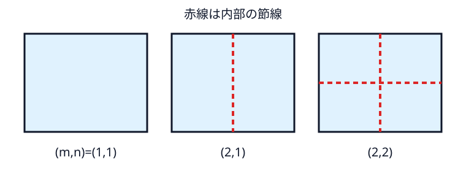
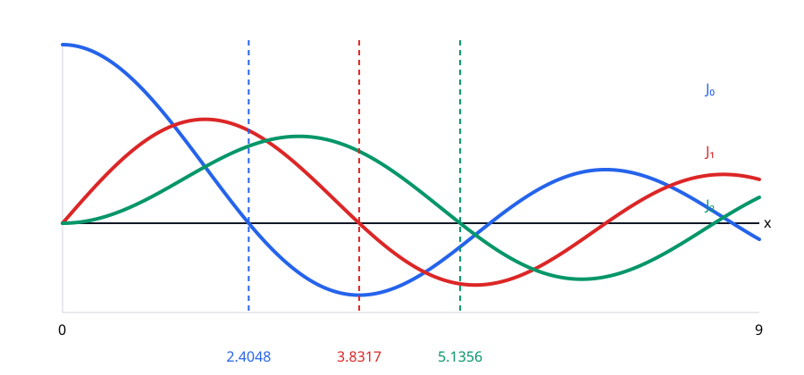
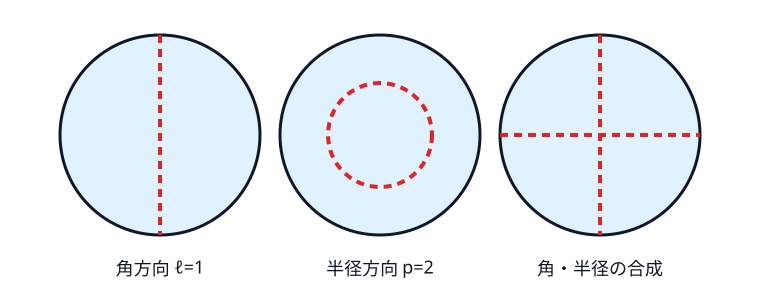

# 解ける形――区間・長方形・円板

抽象的な固有値列を、添字・重複度・節線・スケーリングという目で読めるようにする章である。区間は境界条件、長方形は変数分離、円板は対称性による縮退をそれぞれ可視化する。

## 区間

$-X''=\lambda X$, $X(0)=X(L)=0$ を解く。もし $\lambda=-\mu^2<0$ なら $X=Ae^{\mu x}+Be^{-\mu x}$ で、二つの端点条件から自明解しかない。$\lambda=0$ なら $X=A+Bx$ で、同じく自明解しかない。$\lambda=k^2>0$ のとき

$$
X=A\cos kx+B\sin kx
$$

となり、$X(0)=0$ から $A=0$、$X(L)=0$ から $\sin kL=0$ である。非自明解には $kL=n\pi$, $n\ge1$ が必要なので

$$
X_n=\sin(n\pi x/L),\qquad \lambda_n=(n\pi/L)^2.
$$

Neumann 条件なら $X_n=\cos(n\pi x/L)$, $n=0,1,\ldots$。正の固有値は同じでもゼロモードが加わる。初期変位 $f(x)$ と初期速度 $g(x)$ に対する Dirichlet 波動解は

$$
u(x,t)=\sum_{n\ge1}\left[
\langle f,X_n\rangle_N\cos(cn\pi t/L)
+\frac{L\langle g,X_n\rangle_N}{cn\pi}\sin(cn\pi t/L)
\right]X_n(x),
$$

ここで $\langle h,X_n\rangle_N=(2/L)\int_0^Lh(x)X_n(x)\,dx$ は正規化した正弦係数である。固有値問題を解くことが初期値問題を解くことへどう戻るかが、この式で見える。

## 長方形

$\Omega=(0,a)\times(0,b)$ で $\phi=XY$ と置けば

$$
-\frac{X''}{X}-\frac{Y''}{Y}=\lambda.
$$

二項は独立な変数の関数なので定数であり、一次元問題を二つ解いて

$$
\phi_{m,n}=\sin\frac{m\pi x}{a}\sin\frac{n\pi y}{b},\qquad
\lambda_{m,n}=\pi^2\left(\frac{m^2}{a^2}+\frac{n^2}{b^2}\right),\qquad m,n\ge1.
\tag{4.1}
$$

正方形では $(m,n)$ と $(n,m)$ が同じ値を与える。単位正方形の最初は $2\pi^2$, $5\pi^2$（重複度2）, $8\pi^2$, $10\pi^2$（重複度2）である。辺を $1\times1.03$ に変えると $(1,2)$ と $(2,1)$ は分裂する。対称性が縮退を生む様子が数値で見える。

{#fig-rectangle-modes}

## 極座標 Laplacian

$x=r\cos\theta,y=r\sin\theta$ とする。$r_x=\cos\theta,r_y=\sin\theta,\theta_x=-\sin\theta/r,\theta_y=\cos\theta/r$ なので、一階微分は

$$
\partial_x=\cos\theta\,\partial_r-\frac{\sin\theta}{r}\partial_\theta,\qquad
\partial_y=\sin\theta\,\partial_r+\frac{\cos\theta}{r}\partial_\theta.
$$

これらをもう一度作用させて足す。$\partial_r\partial_\theta$ の交差項は相殺し、係数自身を微分する項から $r^{-1}\partial_r$ が残る。その結果

$$
\Delta=\partial_r^2+\frac1r\partial_r+\frac1{r^2}\partial_\theta^2.
$$

係数 $1/r$, $1/r^2$ は円周方向の尺度が半径とともに伸びることから生じる。半径 $R$ の円板で $\phi=F(r)\Theta(\theta)$ と置き、$-\Delta\phi=\lambda\phi$ に代入して $r^2/(F\Theta)$ を掛けると

$$
-\frac{r^2F''+rF'}F-\frac{\Theta''}{\Theta}=\lambda r^2.
$$

角度は $2\pi$ 周期なので $\Theta''+\ell^2\Theta=0$, $\ell=0,1,2,\ldots$。半径側は

$$
r^2F''+rF'+(\lambda r^2-\ell^2)F=0.
\tag{4.2}
$$

$s=\sqrt\lambda r$ と置けば Bessel 方程式になる。二つの独立解 $J_\ell(s),Y_\ell(s)$ のうち、$Y_\ell$ は $r=0$ で発散するため、円板全体で有限な振動形から除く。Dirichlet 条件 $F(R)=0$ は

$$
J_\ell(\sqrt\lambda R)=0
$$

を要求する。第 $p$ 正零点を $j_{\ell,p}$ と書けば

$$
\lambda_{\ell,p}=j_{\ell,p}^2/R^2.
\tag{4.3}
$$

実固有関数は

$$
\phi_{\ell,p}^{c}(r,\theta)
=C_{\ell,p}J_\ell(j_{\ell,p}r/R)\cos(\ell\theta),\qquad
\phi_{\ell,p}^{s}(r,\theta)
=C_{\ell,p}J_\ell(j_{\ell,p}r/R)\sin(\ell\theta)
$$

と書ける。定数 $C_{\ell,p}$ は $\int_{B_R}|\phi|^2=1$ となるよう選ぶ正規化で、固有値自体には影響しない。$\ell=0$ では正弦側がゼロなので重複度1、$\ell\ge1$ では余弦・正弦が独立なので重複度2である。角番号 $\ell$ は中心を通る節直径の本数、半径番号 $p$ は境界を含めて半径方向に何番目の零点を選ぶかを表す。$p\ge2$ なら内部に $p-1$ 本の節円がある。

最初の零点は次のように並ぶ。

|角番号 $\ell$|$j_{\ell,1}$|$j_{\ell,2}$|円板での重複度（$\ell>0$）|
|---:|---:|---:|---:|
|0|2.4048|5.5201|1|
|1|3.8317|7.0156|2|
|2|5.1356|8.4172|2|

半径1の円板では第一固有値は $j_{0,1}^2\approx5.783$、次は $j_{1,1}^2\approx14.682$ で重複度2となる。$J_\ell$ のグラフが横軸を横切る位置が半径方向の許容波数であり、その順序が実際の音の順序を決める。

{#fig-bessel-functions}

{#fig-disk-modes}

## スケーリング

$\psi(y)=\phi(y/r)$ と置けば微分二回で $r^{-2}$ が出るため

$$
\lambda_k(r\Omega)=r^{-2}\lambda_k(\Omega),\qquad f_k(r\Omega)=r^{-1}f_k(\Omega).
\tag{4.4}
$$

この法則は Weyl 則の指数を予告する。

## 前向き計算と逆向き推定

辺長 $a,b$ から式 (4.1) の固有値を作る前向き計算は直接的である。逆に、数値 $5\pi^2$ を一つ見ただけでは、それが $(1,2)$ か $(2,1)$ か、別の辺長から来たのか分からない。モード番号まで同定できれば $\lambda_{11},\lambda_{21},\lambda_{12}$ は $a^{-2},b^{-2}$ の線形方程式になるが、番号を失ったスペクトルは並べ替えられた数列である。この「前向きは式、逆向きは対応付けも未知」という差を次章で定式化する。

::: {.callout-check title="演習：可解領域"}
1. 単位正方形を3倍に拡大した正方形の第一 Dirichlet 固有値を求めよ。
2. 単位円板で $\ell=1,p=1$ の固有値が重複度2になる理由を、回転対称性と固有関数から説明せよ。
:::

::: {.callout-note title="解答・ヒント" collapse="true"}
1. 単位正方形では $\lambda_{11}=2\pi^2$。式 (4.4) より $2\pi^2/9$。
2. $J_1(j_{1,1}r)\cos\theta$ と $J_1(j_{1,1}r)\sin\theta$ が独立で同じ固有値を持つ。回転するとこの二次元固有空間の中で混ざる。
:::
