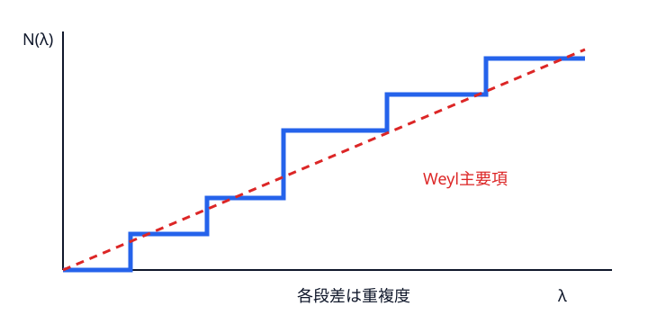
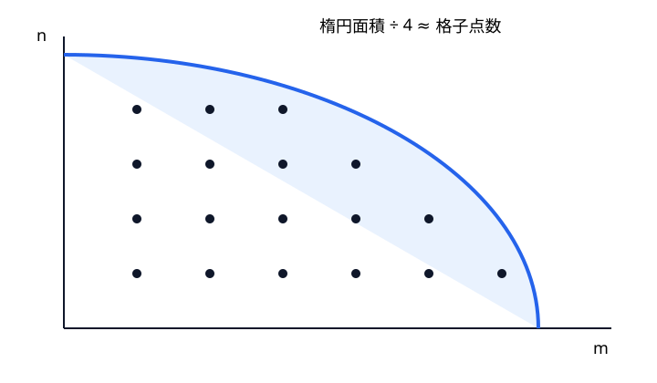
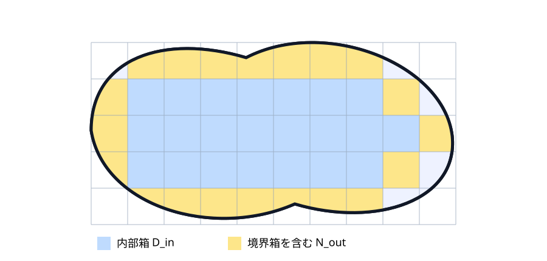

# Weyl 則――高い音の個数から面積を聞く

## 計数関数

$$
N(\lambda)=\#\{k:\lambda_k\le\lambda\}
\tag{6.1}
$$

は重複度込みで数える階段関数である。個々の高次固有値は揺らぐが、累積個数には安定した平均則が現れる。

{#fig-counting-function}

## 長方形を格子点へ翻訳する

式 (4.1) より $\lambda_{m,n}\le\lambda$ は

$$
\frac{m^2}{a^2}+\frac{n^2}{b^2}\le\frac\lambda{\pi^2},\qquad m,n\ge1.
\tag{6.2}
$$

各モード $(m,n)$ は第一象限の格子点一個に対応する。同じ固有値を与える別の格子点も別々に数えるので、重複度も自動的に入る。楕円の半軸は $a\sqrt\lambda/\pi,b\sqrt\lambda/\pi$。格子点一個に単位正方形を対応させれば、内部升目と境界を横切る升目で上下から挟める。境界升目数は楕円周長と同じ $O(\sqrt\lambda)$、楕円面積は $O(\lambda)$ なので相対誤差は消える。

{#fig-weyl-lattice}

全楕円面積の四分の一は

$$
\frac14\pi\frac{a\sqrt\lambda}{\pi}\frac{b\sqrt\lambda}{\pi}
=\frac{ab}{4\pi}\lambda.
$$

したがって

$$
N(\lambda)\sim\frac{|\Omega|}{4\pi}\lambda.
\tag{6.3}
$$

たとえば $a=2,b=1$ で実際に数えると次のようになる。

|$\lambda$|実際の $N(\lambda)$|主要項 $\lambda/(2\pi)$|二項近似 $\lambda/(2\pi)-6\sqrt\lambda/(4\pi)$|
|---:|---:|---:|---:|
|100|12|15.92|11.14|
|400|55|63.66|54.11|
|1600|236|254.65|235.55|

主要項との差は増えても、比 $N(\lambda)/(\lambda/(2\pi))$ は1へ近づく。長方形では周長 $6$ を使う二項近似が有限範囲で改善するが、次節のとおり一般定理の仮定は別に確認する必要がある。

## 一般領域へ

領域内部を小長方形で敷き詰める。各小箱の境界を固定すると許容関数が減り固有値は上がる。小箱境界を自由にすると許容関数が増え固有値は下がる。内部箱の直和を $D_{\mathrm{in}}$、境界を覆う箱まで含めた直和を $N_{\mathrm{out}}$ と略記すれば、min–max 原理から計数関数は概念的に

$$
N_{D_{\mathrm{in}}}(\lambda)\le N_\Omega(\lambda)
\le N_{N_{\mathrm{out}}}(\lambda)
$$

と挟まれる。箱を細かくすると内部箱の総体積は $|\Omega|$ へ近づき、境界に触れる箱の総体積は0へ近づく。各箱では長方形の格子点計算が使えるため、上下界が同じ主要項へ収束する。

この不等号の向きは min–max 原理から分かる。内部箱の境界にも Dirichlet 条件を課すと、許される試験関数は各人工境界で0になるので変分空間が小さくなり、固有値は上がって計数関数は下がる。反対に外側箱を Neumann 境界で切り離すと、人工境界を越える値の一致条件を外した直和空間まで試験関数が増え、固有値は下がって計数関数は上がる。つまり「条件を増やすと固有値は上がる」を計数関数へ言い換えたのが上の挟み撃ちである。

{#fig-bracketing-boxes}

次元 $d$ では

$$
N(\lambda)\sim
\frac{\omega_d}{(2\pi)^d}\operatorname{Vol}(\Omega)\lambda^{d/2},
\tag{6.4}
$$

$\omega_d$ は単位球体積である [@weyl1911]。二次元なら

$$
|\Omega|=4\pi\lim_{\lambda\to\infty}\frac{N(\lambda)}\lambda.
$$

面積は聞こえる。

## 主要項と二項目を混同しない

滑らかな境界では形式的に

$$
N_D(\lambda)=\frac{|\Omega|}{4\pi}\lambda
-\frac{|\partial\Omega|}{4\pi}\sqrt\lambda+o(\sqrt\lambda)
$$

が予想されるが、計数関数の鋭い二項展開には周期 billiard 軌道集合の測度ゼロ条件など追加仮定が関わる。主要項の Weyl 則より強い主張である。次章の熱トレースには滑らかな境界で周長係数が現れるが、それを無条件に計数関数の二項式へ移してはならない。

::: {.callout-check title="演習：Weyl 則"}
1. 平面領域で $N(10^6)=79580$ と観測されたとき、主要項だけから面積を推定せよ。
2. Dirichlet bracketing で人工境界を増やすと、なぜ $N(\lambda)$ は増えないのかを変分空間の包含で説明せよ。
:::

::: {.callout-note title="解答・ヒント" collapse="true"}
1. $|\Omega|\approx4\pi N(\lambda)/\lambda\approx1.0000$。有限 $\lambda$ なのでこれは漸近推定である。
2. 人工境界でも0を課す関数空間は元の $H_0^1(\Omega)$ より小さい。min–max 値は上がるため、閾値 $\lambda$ 以下に入る固有値数は増えない。
:::
