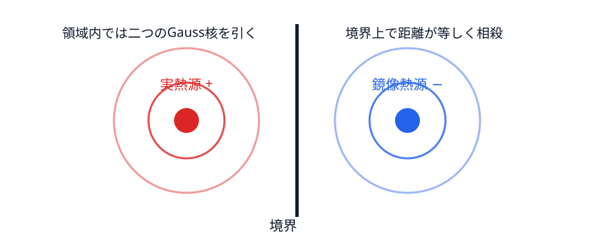

# 熱核と熱トレース――局所幾何をまとめて読む

## 自由空間の熱から始める

$\partial_tu=\Delta u$ の $\mathbb R^d$ 上の基本解は

$$
K_0(t,x,y)=(4\pi t)^{-d/2}\exp\left(-\frac{|x-y|^2}{4t}\right).
\tag{7.1}
$$

幅は $\sqrt t$ 程度で、質量積分は1。短時間の熱は遠くへ行かず、局所幾何だけを見る。

領域上で固有関数を正規直交化し、初期温度 $u_0=\sum a_k\phi_k$ とすると

$$
u(x,t)=\sum_ka_ke^{-t\lambda_k}\phi_k(x).
$$

これを積分核で書けば

$$
K(t,x,y)=\sum_ke^{-t\lambda_k}\phi_k(x)\phi_k(y),\qquad
u(x,t)=\int_\Omega K(t,x,y)u_0(y)\,dy.
$$

作用素のトレースは正規直交基底で対角行列要素を足したものだから

$$
Z(t)=\operatorname{Tr}(e^{t\Delta})
=\sum_ke^{-t\lambda_k}
=\int_\Omega K(t,x,x)\,dx.
\tag{7.2}
$$

最後の等号では固有関数の正規化 $\int|\phi_k|^2=1$ を使った。固有関数の位置情報は対角積分で消え、固有値だけが残る。

## Weyl 則との橋

計数測度 $dN$ を使うと

$$
Z(t)=\int_0^\infty e^{-t\lambda}\,dN(\lambda)
=t\int_0^\infty e^{-t\lambda}N(\lambda)\,d\lambda,
\tag{7.3}
$$

境界項は部分積分で消える。二次元 Weyl 主要項 $N(\lambda)\sim A\lambda/(4\pi)$ を代入すると

$$
Z(t)\sim\frac{A}{4\pi t}.
$$

小 $t$ が高周波を見る理由と、二つの漸近則が同じ情報を持つ理由がここにある。逆向きには Tauberian 定理という追加道具が要る。

## 境界帯と鏡像

{#fig-heat-mirror}

内部点では式 (7.1) の対角値 $(4\pi t)^{-1}$ を積分して面積項が出る。境界から距離 $O(\sqrt t)$ の帯だけが壁を感じる。Dirichlet 境界では鏡像熱源を引いて温度ゼロを作るため戻り確率が減り、Neumann では足すため増える。帯面積 $L\sqrt t$ と対角核 $t^{-1}$ を掛けて $L t^{-1/2}$ の次数が得られる。

半平面で境界からの距離を $r$ とすると、鏡像点までの距離は $2r$ なので

$$
K_D(t,x,x)=\frac1{4\pi t}\left(1-e^{-r^2/t}\right).
$$

自由空間核との差を境界に垂直な方向へ積分すると

$$
-\frac{L}{4\pi t}\int_0^\infty e^{-r^2/t}\,dr
=-\frac{L}{4\pi t}\cdot\frac{\sqrt{\pi t}}2
=-\frac{L}{8\sqrt{\pi t}}.
$$

これで符号・次数だけでなく係数まで出た。Neumann は鏡像を足すので符号が正になる。曲がった境界では短時間に小さな半平面として見え、次の次数で曲率補正が現れる。

ここから穴数を読む議論では、対象を **滑らか・有界・連結な平面領域** に固定する。この仮定の下で

$$
Z_D(t)\sim\frac A{4\pi t}
-\frac L{8\sqrt{\pi t}}
+\frac1{12\pi}\int_{\partial\Omega}\kappa\,ds+\cdots.
\tag{7.4}
$$

Neumann では周長項の符号が正になる [@gilkey1995]。滑らかな連結平面領域で境界成分数を $b$ とすると Euler 標数は $\chi=2-b=1-h$（$h=b-1$ は穴の数）。Gauss–Bonnet により $\int\kappa ds=2\pi\chi$ なので、この対象クラスでは定数項から $\chi$、したがって穴の数が聞こえる。

多角形では滑らかな曲率公式を使わず、内角 $\alpha_j$ ごとに

$$
\frac{\pi^2-\alpha_j^2}{24\pi\alpha_j}
$$

が Dirichlet 定数項へ寄与する。閉多様体には境界項がなく、

$$
Z(t)\sim(4\pi t)^{-d/2}
\left(\operatorname{Vol}(M)+\frac t6\int_M R\,dV+\cdots\right).
$$

対象クラスが違えば係数の意味も違う。

## 三種類の「全部」を区別する

- 全熱係数とは、$t\downarrow0$ の漸近級数に現れる係数列である。局所曲率量の積分を多く含むが、漸近級数だけから固定した $t>0$ の関数値が一意に戻るとは限らない。
- 全熱トレースとは、関数 $Z(t)$ を全ての $t>0$ で知ることである。正の離散固有値列に対しては Laplace 変換の一意性により、重複度込みの全スペクトルと同値な情報を持つ。
- 全スペクトルとは $\{\lambda_k\}$ の全列である。それでも第9章の等スペクトル非合同領域を区別できない。

したがって、全熱係数は一般に全熱トレースより弱く、全熱トレースと全スペクトルはこの設定で同値だが、どちらも形の完全不変量ではない。熱係数は局所量の積分で配置を失い、等スペクトル例ではより強い熱トレース全体まで一致する。

漸近係数が関数を決めない最小例は $e^{-1/t}$ である。$t\downarrow0$ で任意の $N$ に対し $e^{-1/t}=o(t^N)$ なので、その冪級数型漸近展開の全係数は0である。それでも全ての $t>0$ で関数は正であり、恒等的な0関数とは違う。「全係数」と「関数全体」の差はこの flat term にすでに現れる。

::: {.callout-check title="演習：熱係数"}
1. 面積 $A=4$、周長 $L=10$ の滑らかな平面領域について、Dirichlet 熱トレースの先頭二項を書け。
2. $e^{-1/t}$ と0が同じ冪級数型漸近係数を持つのに、同じ関数でない理由を説明せよ。
:::

::: {.callout-note title="解答・ヒント" collapse="true"}
1. $Z_D(t)\sim 1/(\pi t)-10/(8\sqrt{\pi t})+\cdots$。
2. 漸近係数は任意の有限冪より速く0へ行く差を検出しない。$e^{-1/t}>0$ は各 $t>0$ で直接区別できる。
:::
