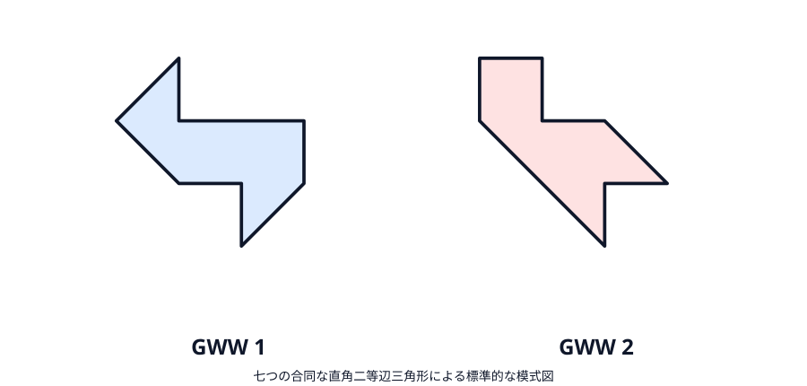
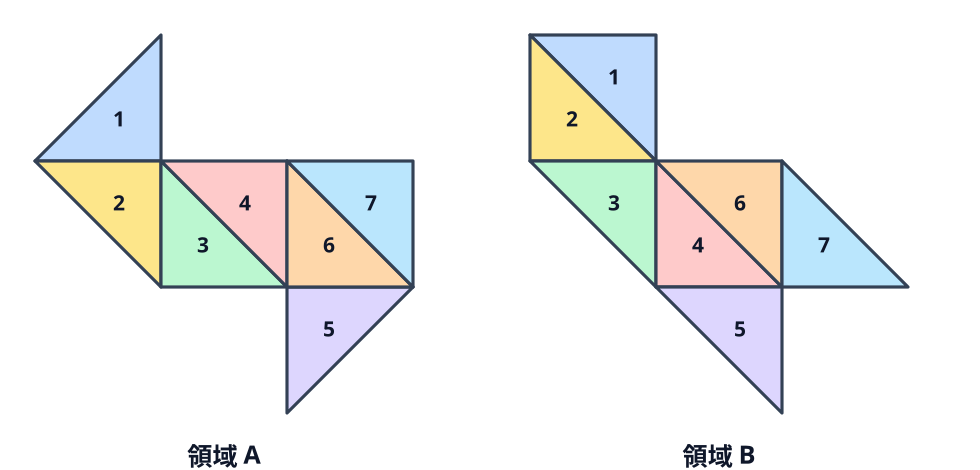
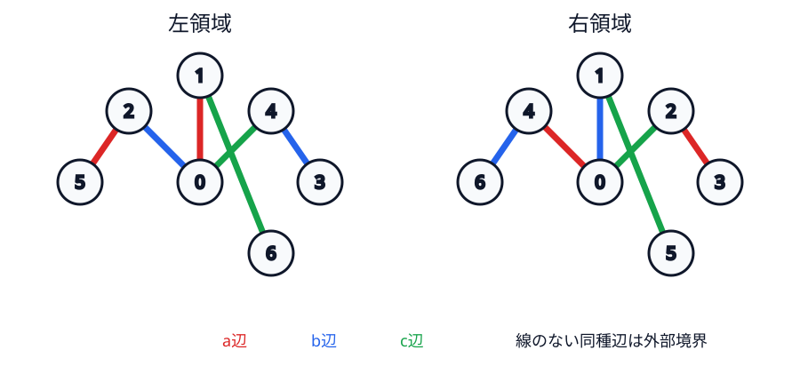
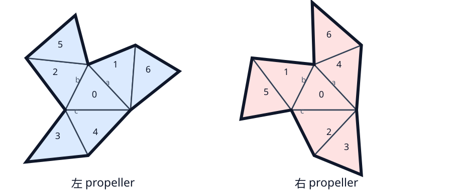
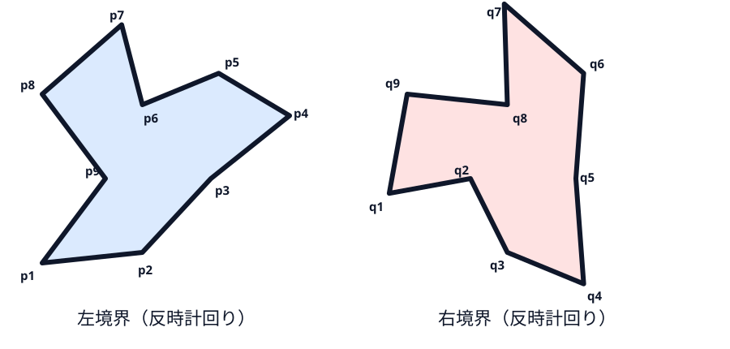

# Kac の問いと実際の等スペクトル drum

前章では円板という特定の形が聞こえることを示した。ここでは量称を変え、「任意の二領域で、等スペクトルなら合同か」という全称命題を検討する。一組でも非合同・等スペクトルな対があれば全称命題は否定される。この章では歴史的反例と、本書で完全に検算する別の7タイル例を区別する。

## 等スペクトルの意味

二領域が Dirichlet 等スペクトルであるとは、全 Dirichlet 固有値が重複度込みで一致することをいう。有限個が近いだけではない。Neumann 等スペクトルは別の条件である。

等スペクトルなら、Weyl則と熱トレースから得た面積・周長・該当する熱不変量はすべて一致する。しかし、それらの一致が先に分かっても等スペクトルとは限らない。必要条件と十分条件を逆に読まないことが、この章の最初の注意点である。

Weyl（1911）、Milnor の16次元 flat torus（1964）、Kac（1966）、Sunada（1985）を経て、Gordon–Webb–Wolpert は1992年に非等長な単連結平面領域で Dirichlet と Neumann の双方がそれぞれ等スペクトルになる組を構成した [@gordon1992]。論理式で書けば、彼らは

$$
\operatorname{Spec}_D(\Omega_1)=\operatorname{Spec}_D(\Omega_2)
\quad\text{だが}\quad
\Omega_1\not\cong\Omega_2
$$

となる $\Omega_1,\Omega_2$ を与え、「全ての平面領域についてスペクトル写像が合同類上で単射か」という問いを否定した。一般多様体の非一意性より平面領域の実現が難しかったのは、作用素だけでなく Euclid 平面内の輪郭として実現する必要があったためである。

## GWW の歴史的反例

GWW の標準的な図は、七つの合同な直角二等辺三角形を異なる仕方で貼った二つの八角形である。最初の図は領域そのものの外周、次の図は同じ外周に七枚の構成三角形を重ねたものである。

{#fig-gww-domains}

{fig-alt="二つの非合同な八角形がそれぞれ番号付きの七つの合同直角二等辺三角形へ分割された図"}

GWW の出発点は、有限群 $G$ が作用する共通の被覆空間と、各共役類との交点数が等しい二部分群 $H_1,H_2$ である。通常の Sunada 定理なら、商の上の不変関数を比較して $H_i\backslash M$ の Laplace スペクトルが一致する。鏡面を持つ orbifold 商では、この不変関数の議論が直接与えるのは鏡面で法線微分が消える Neumann 側である。

Dirichlet 側を「同じ商で奇反射を選ぶだけ」と済ませるのは不十分である。GWW の完全な構成では、まず適切な二重被覆を取り、境界成分に Dirichlet 条件と Neumann 条件を割り当てた混合境界問題を比較する。被覆の involution に関する関数空間の不変部分と反不変部分へ分解すると、一方が Neumann 商、他方が Dirichlet 商に対応する。この二重被覆と偶奇分解を介して、Dirichlet と Neumann の双方について等スペクトル性が得られる [@gordon1992full]。

この construction が重要なのは、二領域が単連結である点である。穴や別成分を使ってスペクトルを合わせたのではなく、通常の一枚膜と同じ位相型のまま Kac の問いを否定した。速報 [@gordon1992] と完全版 [@gordon1992full] は、両領域が非等長で、Dirichlet スペクトルも Neumann スペクトルもそれぞれ一致することを示した。

ただし、orbifold 被覆から平面図までを初学者が全て手で検算するには群作用と鏡面商の準備が多い。本書では歴史的解答を GWW として明記したうえで、同じ七枚構造を具体的な関数片の加減だけで追える BCDS $7_1$ を完全計算の対象にする。

|役割|GWW|本書で計算する BCDS $7_1$|
|---|---|---|
|歴史的位置|Kac の平面領域問題を最初に否定|後に整理された直接移植可能な例|
|基礎図形|標準図では直角二等辺三角形7枚|任意の適切な鋭角不等辺三角形7枚|
|証明の入口|Sunada の orbifold 拡張|7×7 transplantation 行列|
|本書での深さ|構成原理と結論|全行列・符号・可逆性を検算|

## 本書で証明する BCDS propeller

次章では Buser–Conway–Doyle–Semmler（BCDS）の1994年の propeller pair $7_1$ を扱う [@buser1994]。これは GWW の歴史的な最初の図そのものではなく、同じ現象を直接的な transplantation で検証できる公刊例である。鋭角不等辺三角形を7枚、各辺を $a,b,c$ と名付けて反射接着する。

図では基準三角形の頂点を厳密に $A=(0,0),B=(2,0),C=(7/10,7/5)$ とした。三辺長は $a=\sqrt{365}/10,b=7\sqrt5/10,c=2$ で互いに異なり、最大辺の平方4は他二辺の平方和 $49/20+73/20$ より小さいので鋭角三角形である。接着表に従い、直線 $UV$ に関する点 $X$ の鏡映

$$
\rho_{UV}(X)=2\left(U+
\frac{(X-U)\cdot(V-U)}{|V-U|^2}(V-U)\right)-X
$$

を有理座標のまま繰り返した。図の小数はこの厳密座標を表示用に丸めたものにすぎず、数学上の正本は接着表・基準座標・上の鏡映式である。

左右の接着は次の置換で完全に指定される。互換 $(ij)$ はタイル $i,j$ がその種類の辺で隣接することを表し、置換で動かない番号の辺は外部境界である。

|辺|左領域|右領域|
|---|---|---|
|$a$|$(0\,1)(2\,5)$|$(0\,4)(2\,3)$|
|$b$|$(0\,2)(4\,3)$|$(0\,1)(4\,6)$|
|$c$|$(0\,4)(1\,6)$|$(0\,2)(1\,5)$|

{#fig-propeller-adjacency}

{#fig-propeller-outlines}

この表は図の装飾でなく領域を再構成できる組合せデータである。同じ鋭角不等辺三角形から反射して貼れば、重なりのない二つの propeller 領域が得られる。

## 外周だけを使う非合同性証明

内部の三角形分割は領域そのものの幾何データではない。したがって「中央タイルが中央タイルへ移る」と仮定して非合同性を証明してはいけない。ここでは外周多角形だけの不変量を使う。

反時計回りの境界頂点を左で $p_1,\ldots,p_9$、右で $q_1,\ldots,q_9$ とする。各頂点から出る辺長の種類を $e_i\in\{a,b,c\}$、入る辺ベクトルから出る辺ベクトルへの符号付き外角を

$$
\tau_i=\operatorname{atan2}\!\left(
\det(p_i-p_{i-1},p_{i+1}-p_i),
(p_i-p_{i-1})\cdot(p_{i+1}-p_i)\right)
$$

とする。右辺でも同様である。合同な多角形なら $(e_i,\tau_i)$ の巡回列は、始点の巡回移動と向きの反転を除いて一致しなければならない。

{#fig-propeller-boundary-signature}

鏡映式から得る左の頂点列は

$$
\begin{aligned}
&(-6/5,-8/5),(7/10,-7/5),(2,0),(12747/3650,2177/1825),\\
&(784/365,728/365),(7/10,7/5),(112/365,1064/365),\\
&(-6/5,8/5),(0,0),
\end{aligned}
$$

右は

$$
\begin{aligned}
&(-77/50,-7/25),(0,0),(7/10,-7/5),(784/365,-728/365),\\
&(2,0),(784/365,728/365),(234/365,1208/365),\\
&(7/10,7/5),(-6/5,8/5).
\end{aligned}
$$

これらは全て厳密な有理数である。外角だけを小数表示すると、左の巡回列は辺長順が $aaa\,bbb\,ccc$ で、各三辺に対応する外角は次の通りである。

|辺の三連|第1外角|第2外角|第3外角|
|---|---:|---:|---:|
|$aaa$|2.319174|0.717541|-0.148080|
|$bbb$|1.929567|0.927295|-1.706510|
|$ccc$|2.034444|1.496756|-1.287002|

となる。右を辺長列が $aaa\,bbb\,ccc$ となるよう唯一巡回移動すると

|辺の三連|第1外角|第2外角|第3外角|
|---|---:|---:|---:|
|$aaa$|2.319174|-1.706510|1.496756|
|$bbb$|1.929567|-1.287002|0.717541|
|$ccc$|2.034444|-0.148080|0.927295|

である。第二外角は一方が正、他方が負なので、丸め誤差では一致し得ず、向きを保つ合同写像はない。向きを反転すると右の辺長順は巡回移動まで $aaa\,ccc\,bbb$ となり、左の $aaa\,bbb\,ccc$ と一致しない。ゆえに反射を含む合同写像もなく、二領域は外形だけから非合同である。

接着グラフにも同じ非対称性が見える。中央タイルを固定する色付きグラフ同型を試すと左タイル1の内部 $c$ 辺が右タイル4の外部辺へ対応する。ただしこれは分割データの相違を説明する補助観察であり、上の外周不変量が領域そのものの非合同性証明である。

七つの合同タイルを持つので面積は自動的に等しい。境界辺の種類別本数も置換の固定点数から一致するため、対応辺長を足した周長も同じである。しかし「同じ部品」だけでは全スペクトル一致を保証しない。次章で、三つの接着置換を同時に保つ可逆行列を構成する。

等スペクトル性は現実の録音波形が常に同じという意味ではない。打点と観測点に依存する固有関数係数、空気、損失、材料非一様性は固有値列の外にある。

この章では「同じスペクトルを持つ」と主張すべき二領域と、その非合同性を確定した。残る核心は、なぜ無限個すべての固有値と重複度が一致するのかである。次章では各固有関数を7個の関数片へ切り、可逆な線形写像で他方へ移す。
