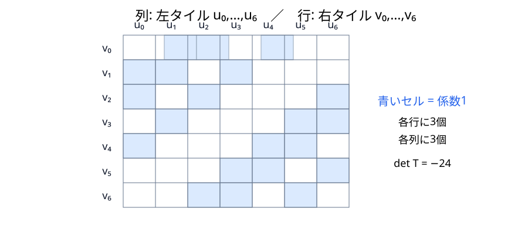
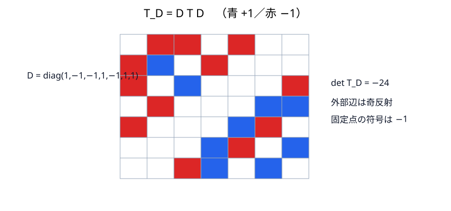
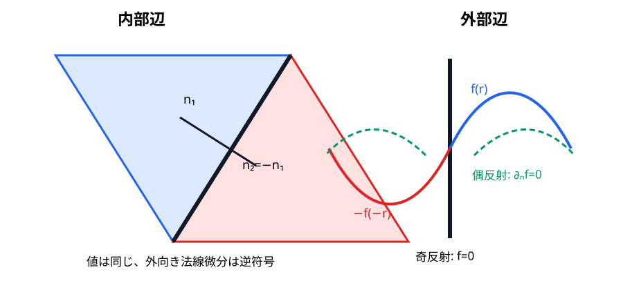

# transplantation――7枚の関数片を完全に移す

## 関数片をベクトルにする

左領域の固有関数 $u$ をタイル $0,\ldots,6$ に制限し、各タイルを基準三角形へ反射で戻した関数を $u_j$ とする。

$$
U=(u_0,u_1,\ldots,u_6)^T.
$$

右領域の各タイルへ置く関数 $V=TU$ を、次の incidence 行列で定める。

$$
T=\begin{pmatrix}
0&1&1&0&1&0&0\\
1&1&0&1&0&0&0\\
1&0&1&0&0&0&1\\
0&1&0&0&0&1&1\\
1&0&0&0&1&1&0\\
0&0&0&1&1&0&1\\
0&0&1&1&0&1&0
\end{pmatrix}.
\tag{10.1}
$$

たとえば

$$
v_0=u_1+u_2+u_4,\qquad
v_1=u_0+u_1+u_3,\qquad
v_4=u_0+u_4+u_5.
$$

第一式は BCDS が中央タイルで用いる $\mathbf1+\mathbf2+\mathbf4$ そのものである。式 (10.1) は Neumann の偶反射に対応する正符号版である。

{#fig-transplantation-matrix}

## Dirichlet の符号付き行列

外部辺では奇反射するため、接着相手のない固定点を $+1$ でなく $-1$ とする符号付き置換行列 $P_s^D,Q_s^D$ を使う。前章のラベル規約で

$$
D=\operatorname{diag}(1,-1,-1,1,-1,1,1),\qquad T_D=DTD
$$

と置くと

$$
T_D=\begin{pmatrix}
0&-1&-1&0&-1&0&0\\
-1&1&0&-1&0&0&0\\
-1&0&1&0&0&0&-1\\
0&-1&0&0&0&1&1\\
-1&0&0&0&1&-1&0\\
0&0&0&1&-1&0&1\\
0&0&-1&1&0&1&0
\end{pmatrix}.
\tag{10.2}
$$

{#fig-transplantation-dirichlet}

直接の行列積で

$$
Q_s^DT_D=T_DP_s^D,\qquad s=a,b,c
\tag{10.3}
$$

が成り立つ。例として $a$ 辺では、左で $0\leftrightarrow1,2\leftrightarrow5$ を交換し、外部 $a$ 辺を持つ固定タイルには $-1$ を掛ける。右では $0\leftrightarrow4,2\leftrightarrow3$ を交換し、残る固定タイルに $-1$ を掛ける。式 (10.2) の列へ左操作を行う結果と、行へ右操作を行う結果が一致する。他の $b,c$ も同じ49成分の検算である。

実際、Dirichlet 版の右タイル0は $w_0=-u_1-u_2-u_4$ である。左の符号付き $a$ 反射を作用させると

$$
-u_1-u_2-u_4\longmapsto -u_0-u_5+u_4
=-u_0+u_4-u_5=w_4.
$$

これは右で $a$ 辺を越えてタイル $0\to4$ へ移る結果と一致する。固定された外部片 $u_4$ だけが奇反射で符号を変える点が、正符号版との違いである。

## なぜ内部方程式を保つか

反射は Euclid 等長写像なのでラプラシアンと可換する。各 $u_j$ が基準三角形内部で $-\Delta u_j=\lambda u_j$ を満たせば、線形結合 $v_i$ も同じ方程式を満たす。

Neumann 接着を表す7×7置換行列を左で $P_a,P_b,P_c$、右で $Q_a,Q_b,Q_c$ とする。前章の置換を代入すると式 (10.1) は

$$
Q_sT=TP_s,\qquad s=a,b,c
\tag{10.4}
$$

を満たす。たとえば右の $a$ 辺でタイル0は4へ移り、$v_0=u_1+u_2+u_4$ は

$$
v_4=u_0+u_4+u_5
$$

へ続く。左側で $a$ 反射は $1\leftrightarrow0$, $2\leftrightarrow5$ を行い、Neumann 外辺の4は偶反射でそのままなので一致する。Dirichlet では式 (10.3) が同じ役割を担う。

## 外部辺

Dirichlet 境界を越える滑らかな奇反射では関数値が符号反転するため、境界上では $f=-f$、したがって $f=0$。Neumann 境界では偶反射を使い、法線微分が反転して $\partial_nf=-\partial_nf$、したがって $\partial_nf=0$。内部辺では一方の外向き法線が他方の内向き法線なので、反射された片の法線微分が滑らかに整う。これが「辺でうまく合う」の計算内容である。

{#fig-edge-matching}

内部辺 $\Gamma_{ij}$ で必要な接着条件を明記すると

$$
v_i|_{\Gamma_{ij}}=v_j|_{\Gamma_{ij}},\qquad
\partial_{n_i}v_i+\partial_{n_j}v_j=0,
\tag{10.5}
$$

である。二つの外向き法線が逆向きなので、第二式は一つの滑らかな関数の法線微分が両側で整合することを表す。

区分的に作った $V$ が大域固有関数になる点も確認する。各タイルで $-\Delta v_i=\lambda v_i$ を満たすので、試験関数 $\eta$ に対しタイルごとに部分積分すると内部辺の境界項が二回現れる。式 (10.5) によりその二項は相殺する。外部辺では Dirichlet の値0または Neumann の法線微分0により消える。頂点の有限集合は面積測度も辺測度も0なので追加項を生まない。ゆえに

$$
\int_{\Omega_R}\nabla V\cdot\nabla\eta
=\lambda\int_{\Omega_R}V\eta
$$

が全試験関数について成り立ち、$V$ は大域的な弱固有関数である。多角形上の楕円正則性により、頂点を除く内部では通常の滑らかな固有関数へ戻る。

## 可逆性と重複度

行列計算で

$$
TT^T=2I+J,
$$

$J$ は全成分1の行列となる。固有値は $\mathbf1$ 方向で9、その直交補空間で2だから $TT^T$ は正定値で、$T$ は可逆である。実際 $\det T=-24$。

$D^2=I$ なので $\det T_D=(\det D)^2\det T=-24$。したがって Dirichlet では各 $\lambda$ について

$$
T_D:E_\lambda^D(\Omega_L)\longrightarrow E_\lambda^D(\Omega_R)
$$

は単射であり、逆方向の同じ構成から全射でもある。Neumann には $T$、Dirichlet には $T_D$ を用い、双方で全固有値の重複度一致が個別に証明された。

三辺種全ての $P_s,Q_s,P_s^D,Q_s^D$ を接着表から組み立て、式 (10.3)–(10.4)、行列式、$TT^T$ を一括検算する短いコードを数値付録に収録した。本文の一例と付録の全成分検査を合わせれば、残る辺種を読者自身が再現できる。

::: {.callout-check title="演習：transplantation"}
1. $TT^T=2I+J$ から $T$ の特異値を求め、可逆性を確認せよ。
2. intertwining だけでなく $T$ の可逆性が重複度一致に必要な理由を説明せよ。
:::

::: {.callout-note title="解答・ヒント" collapse="true"}
1. $J$ の固有値は $\mathbf1$ 方向で7、直交補空間で0。したがって $TT^T$ の固有値は9が一個、2が六個で、特異値は3と $\sqrt2$（六個）。全て正である。
2. intertwining だけなら固有空間から固有空間への写像は得るが、核があり得る。可逆性が両方向の次元を保ち、重複度一致を保証する。
:::
