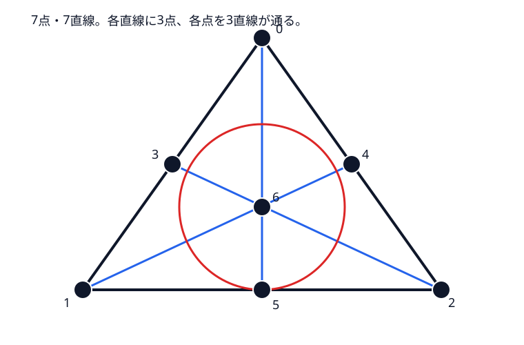
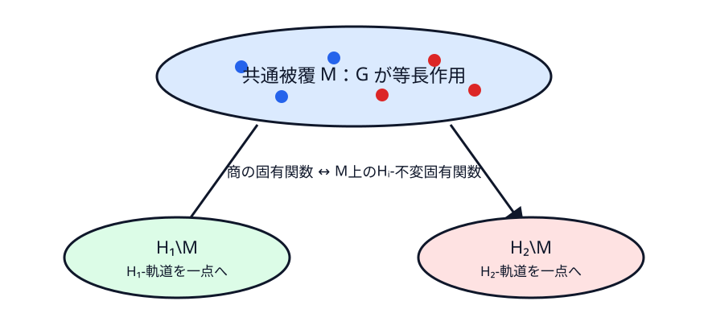

# Sunada 法――群作用が重複度をそろえる理由

前章では一個の7×7行列が三種類の接着を同時に保った。この章の問いは「なぜそのような行列が存在するのか」である。タイル番号の置換を群作用として捉えると、個別の固有関数計算をせず、各固有空間の不変部分の次元が一致することから重複度をそろえられる。

## 群作用を有限集合で見る

群 $G$ が集合 $X$ に作用するとは、各 $g\in G$ が点を置換し、積が置換の合成に対応することだ。点 $x$ の軌道は $\{gx:g\in G\}$、固定する元の集合は安定化群 $G_x$。部分群 $H$ の軌道ごとに点を同一視した集合が商 $H\backslash X$ である。

最小例として $G=S_3$ を $X=\{1,2,3\}$ に置換で作用させ、$H=\{e,(12)\}$ とする。$H$-軌道は $\{1,2\}$ と $\{3\}$ の二つなので、商 $H\backslash X$ は二点集合である。$X$ 上の関数 $(f_1,f_2,f_3)$ が $H$-不変である条件は $f_1=f_2$ であり、これは商上の関数 $(a,b)$ を $(a,a,b)$ と持ち上げたものにちょうど一致する。「商上の関数＝被覆上の不変関数」という後の対応は、この有限例の連続版である。

共役 $aga^{-1}$ は、同じ対称操作を基準位置だけ変えて見たものと考えられる。二部分群 $H_1,H_2$ が almost conjugate であるとは、任意の共役類 $C\subset G$ について

$$
|C\cap H_1|=|C\cap H_2|
\tag{11.1}
$$

となること。共役な部分群なら商は明白に同じだが、almost conjugate で非共役なら、異なる商が同じスペクトルを持つ余地が生まれる。

三段階を区別する。$H_2=gH_1g^{-1}$ なら二つの商はラベルを変えただけで、本質的に同じである。各共役類との交点数だけ等しく、実際には共役でない場合が Sunada の有用な状況である。位数が同じというだけでは足りず、ある共役類との交点数が違えば式 (11.3) の指標和が表現によって変わり得る。

BCDS propeller では $G\cong PSL(3,2)$（位数168）が Fano 平面の7点と7直線へ作用する。Fano 平面は各直線に3点、各点を3直線が通る最小の有限射影平面である。

{#fig-fano-plane}

点安定化群 $H_p$ と直線安定化群 $H_\ell$ はどちらも指数7、位数24である。共役類ごとの交点数は次のように一致する。

|元の位数|共役類の大きさ|$|C\cap H_p|$|$|C\cap H_\ell|$|
|---:|---:|---:|---:|
|1|1|1|1|
|2|21|9|9|
|3|56|8|8|
|4|42|6|6|
|7|24|0|0|
|7|24|0|0|

なぜ位数の一致より共役類ごとの一致が必要かは、後の指標和に理由がある。表現の trace は各元で同じ値ではなく、共役類ごとに一定である。したがって総人数 $|H_i|$ だけをそろえても、異なる重みの共役類から何人ずつ選ぶかが違えば不変部分の次元は変わり得る。

交点数の列の和はともに24で、式 (11.1) を直接満たす。一方、内側からの共役は点安定化群を別の点安定化群へ送るので、直線安定化群へは送らない。点と直線を交換する双対性は外部自己同型であり、両者は almost conjugate だが共役ではない。

点と直線の incidence 行列が前章の $T$ である。各直線上に3点あるので各行に3個、各点を3直線が通るので各列に3個の1がある。点置換と直線置換を intertwine する式は有限幾何の双対性を具体化する。

表現論の言葉では、7点上の関数空間は自明表現を $H_p$ から $G$ へ誘導した置換表現 $\operatorname{Ind}_{H_p}^G\mathbf1$、7直線側は $\operatorname{Ind}_{H_\ell}^G\mathbf1$ である。incidence 行列 $T$ はこの二表現の間の具体的 intertwiner である。前章の一個の行列計算は、誘導表現が同型になる現象を座標で書いたものに当たる。

{#fig-sunada-orbits}

## 平均射影

固有値 $\lambda$ の固有空間 $E_\lambda$ に $G$ が表現 $\rho$ として作用するとする。部分群 $H$ に対し

$$
P_H=\frac1{|H|}\sum_{h\in H}\rho(h)
\tag{11.2}
$$

と置く。左から $\rho(k)$, $k\in H$ を掛けても和の順番が変わるだけなので $P_Hv$ は $H$-不変。逆に $v$ が不変なら $P_Hv=v$。さらに二回平均しても同じなので $P_H^2=P_H$。したがって像は $E_\lambda^H$ で、射影の固有値は0か1。よって

$$
\dim E_\lambda^H=\operatorname{rank}P_H=\operatorname{tr}P_H
=\frac1{|H|}\sum_{h\in H}\chi_\lambda(h).
\tag{11.3}
$$

指標 $\chi(g)=\operatorname{tr}\rho(g)$ は共役類上一定である。実際

$$
\rho(aga^{-1})=\rho(a)\rho(g)\rho(a)^{-1}
$$

で、相似行列の trace は等しい。式 (11.1) は各共役類から和に入る個数を一致させるため、式 (11.3) は $H_1,H_2$ で等しい。

## 定理の仮定

::: {.callout-important title="Sunada の多様体版"}
$M$ をコンパクト Riemann 多様体、有限群 $G$ が等長に作用するとする。almost conjugate な部分群 $H_1,H_2$ が自由に作用するなら、滑らかな商 $H_1\backslash M,H_2\backslash M$ は関数上の Laplace–Beltrami 作用素について等スペクトルである。境界がある場合は作用が境界を保つ等の条件を置き、Dirichlet または Neumann を固定する。自由性を外すと商は一般に orbifold となり、別版の定理として扱う。
:::

商上の固有関数は被覆 $M$ 上の $H_i$-不変固有関数に対応するので、その重複度は式 (11.3) で一致する [@sunada1985]。GWW の平面領域構成は orbifold と反射を用いる拡張であり、この滑らかな閉多様体版を無条件に一行適用するものではない [@gordon1992]。

|具体的 transplantation|Sunada の抽象化|
|---|---|
|7個の関数片|剰余類上の置換表現|
|接着置換 $P_s,Q_s$|群作用|
|行列 $T$ の intertwining|同型な誘導表現|
|$T$ の可逆性|全表現で不変部分空間次元が一致|

具体的 transplantation は固有関数を実際に移す「写像の証明」、Sunada 法は各固有空間の次元が等しいことを指標で数える「重複度の証明」である。両者は競合する別証明ではなく、同じ表現論的構造を座標と抽象化の二つの解像度で見ている。

次章では再び逆問題の観測へ戻る。等スペクトル反例がある状況で、固有関数に関する追加データは何を加えるか、有限個・雑音付き固有値から何が安定に推定できるかを分けて考える。

::: {.callout-check title="演習：群作用と Sunada 条件"}
1. 上の $S_3$ の例で平均射影 $P_H(f_1,f_2,f_3)$ を具体的に求めよ。
2. $|H_1|=|H_2|$ だけでは almost conjugate と言えない理由を説明せよ。
:::

::: {.callout-note title="解答・ヒント" collapse="true"}
1. $P_Hf=\frac12(f+(12)f)=((f_1+f_2)/2,(f_1+f_2)/2,f_3)$。像は $f_1=f_2$ の部分空間である。
2. 位数の一致は全共役類との交点数の総和しか合わせない。式 (11.3) では指標が共役類ごとに異なり得るため、各交点数の一致が必要である。
:::
