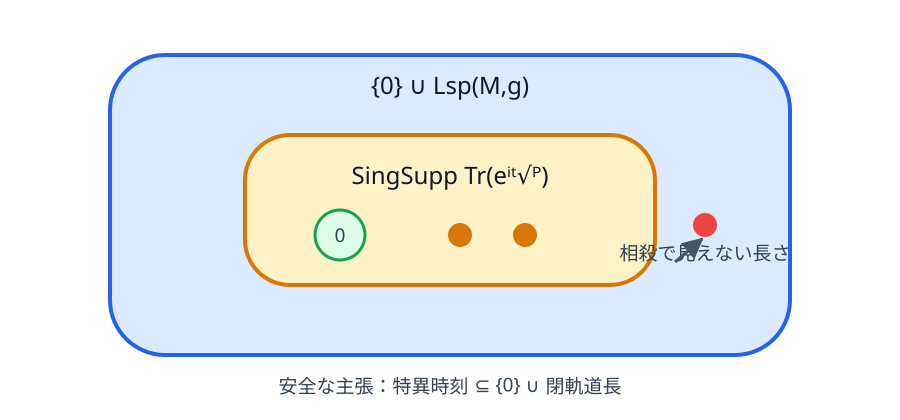

# 発展――wave trace と条件付き剛性

## Riemann 多様体

計量 $g$ が長さと角度を決め、非負 Laplace–Beltrami 作用素を $P=-\Delta_g$ と書く。閉多様体では境界条件が不要で、定数関数による0固有値から始まる。Milnor の16次元 flat tori は曲率ゼロでも大域格子が違う非等長・等スペクトル例である [@milnor1964]。

## wave trace

符号規約を保つため

$$
\operatorname{Tr}(e^{it\sqrt P})
=\sum_ke^{it\sqrt{\lambda_k}},\qquad P=-\Delta_g\ge0
\tag{13.1}
$$

と書く。この和は普通の関数として収束するとは限らず、分布として扱う。閉多様体では、閉測地線の長さの集合を $\operatorname{Lsp}(M,g)$ とすると Poisson 関係

$$
\operatorname{SingSupp}\operatorname{Tr}(e^{it\sqrt P})
\subseteq \{0\}\cup\operatorname{Lsp}(M,g)
\tag{13.2}
$$

が成り立つ。したがって「特異時刻ならば、0または閉測地線長である」が安全な向きであり、逆包含は一般には成り立たない。同じ長さを持つ軌道族の寄与が相殺し、長さが特異台に現れない可能性があるからである。非退化性、clean intersection、同じ長さでの相殺がないことなどを追加すると、特定の軌道長が実際に特異性として現れることを主項から読める。境界付き領域では周期 billiard 軌道が対応するが、glancing ray や境界特異性の扱いが加わる。

{fig-alt="長さスペクトルの大きな集合の内側に wave trace の特異時刻の集合があり、一部の長さが相殺で見えないことを示す包含図"}

熱トレースが局所積分量を見るのに対し、波は大域的な往復経路を見る。ただしこの違いは、スペクトルから全閉軌道長を無条件に復元できることを意味しない。

## zeta 関数

$\Re s>d/2$ では

$$
\zeta_P(s)=\sum_{\lambda_k>0}\lambda_k^{-s},\qquad
\Gamma(s)\zeta_P(s)=\int_0^\infty t^{s-1}(Z(t)-\dim\ker P)\,dt.
$$

後者は Mellin 変換で、最初は収束域で成立する。熱漸近を使って右辺を正則化し、zeta 関数を有理型解析接続するのは次の段階である。

## 仮定を加えると何が戻るか

Zelditch は、特定の $\mathbb Z_2$ 反射対称性を持つ単連結有界解析平面領域について、対称軸上の bouncing-ball 軌道の非退化性、長さスペクトル内での孤立性、反復軌道に関する一般位置条件などを課し、Dirichlet または Neumann スペクトルが領域をそのクラス内で決める結果を示した [@zelditch2009]。これは「解析的対称領域なら常に聞こえる」という無条件主張ではない。仮定が wave invariants を境界 Taylor 係数へ順に戻す座標軸を与えるのである。

## 2026年時点の見取り図

「スペクトル」という語は作用素ごとに別のデータを指す。次の結果は互いに関連するが、一方を他方の解答として読み替えてはいけない。

|対象とデータ|肯定的結果の例|必要な仮定・射程|
|---|---|---|
|平面領域の Dirichlet/Neumann Laplace スペクトル|小離心率の楕円は全ての滑らかな領域の中でスペクトル的に一意 [@hezari2022]|十分小さい離心率。一般領域の単射性を意味しない|
|周期 billiard 軌道の長さスペクトル|円に十分近い $\mathbb Z_2$ 対称な滑らかな狭義凸領域は、同じクラス内で動力学的スペクトル剛性を持つ [@desimoi2017]|近円・反射対称・高い滑らかさを仮定する。任意の別形を排除する大域 Laplace 定理ではない|
|凸 billiard の rational integrability|楕円に十分近い滑らかな狭義凸領域が rationally integrable なら楕円である [@kaloshin2018]|局所 Birkhoff 予想の結果であり、長さスペクトル剛性そのものではない|
|Steklov スペクトル（境界上の Dirichlet-to-Neumann 作用素）|ほとんど全ての凸多角形について等スペクトル合同類が有限 [@dryden2025]|出版済み Part I。Laplace 固定端膜とは別の作用素|
|Steklov スペクトル|凸多角形のスペクトル的特徴づけと剛性をさらに扱う [@dryden2026]|出版済み Part II。多角形クラス内の結果|
|Steklov スペクトル|円板に任意に近い、互いに非合同な狭義凸実解析平面領域の等スペクトル対が存在する [@hu2026]|2026年プレプリント。Dirichlet Laplace スペクトルではない|
|Steklov スペクトル|円環は平面領域の中で一意とする結果 [@jin2026]|2026年プレプリント。非単連結領域に対する Steklov 結果|
|一般の閉 Riemann 多様体の Laplace スペクトル|体積・熱不変量などは決まるが、等スペクトル非等長例も多数|次元・曲率・解析性・対称性などで結論が変わる|

長さスペクトルは周期軌道長の集合、Steklov スペクトルは境界作用素の固有値列であり、本書の中心である Dirichlet Laplacian の固有値列とは同じではない。「面積スペクトル」と呼ばれるデータも、極小曲面の面積列など文脈ごとに定義が異なるため、面積という一個の熱不変量と混同してはならない。現代的な肯定結果の多くは、対象クラスや作用素を絞ることで成立する。

結論は二層ある。一般にはスペクトルは形の完全な指紋ではない。しかし体積、境界、曲率積分、周期軌道、変分的剛性など驚くほど多くを符号化する。逆スペクトル幾何は Yes/No の問題ではなく、どのクラス・どのデータ・どの安定性なら何を復元できるかを分類する学問である。
