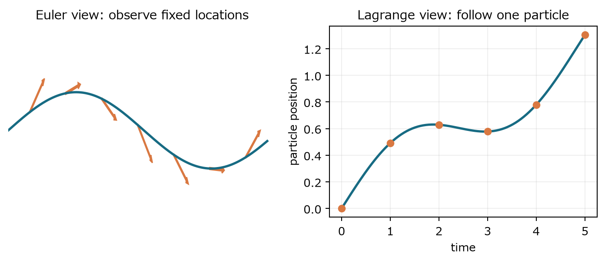
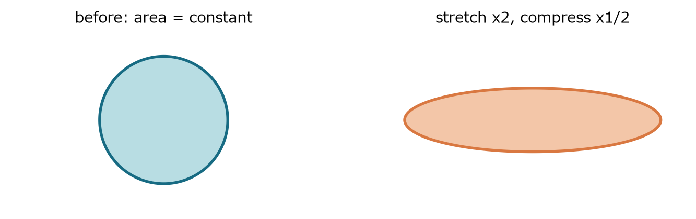

速度場を粒子の加速度へ変換し、圧力・粘性・非圧縮条件の役割を分ける

### 1　一般形から始める

> **この章で知りたいこと**
>
> Navier-Stokes 方程式の各項は何を測るのか。どの記号が物性値で、どれが未知関数なのか。

#### 問題設定

密度が一定の非圧縮ニュートン流体を考える。未知量は速度ベクトルと圧力である。密度、動粘性係数、外力は与えられている。圧力を密度で割った量を小文字の p と書くと、単位質量あたりの式になる。

$$
\partial_t\boldsymbol{u}+(\boldsymbol{u}\cdot\nabla)\boldsymbol{u}=-\nabla p+\nu\Delta\boldsymbol{u}+\boldsymbol{f}
$$

$$
\nabla\cdot\boldsymbol{u}=0,\qquad p=P/\rho,\qquad \nu=\mu/\rho
$$

| 項 | 次元 | 役割 |
|---|---|---|
| 時間変化 | 長さ/時間² | 固定点で見た速度の変化 |
| 移流 | 長さ/時間² | 粒子が空間的に異なる速度領域へ移る効果 |
| 圧力勾配 | 長さ/時間² | 圧力差による加速と非圧縮拘束の維持 |
| 粘性 | 長さ/時間² | 速度差を空間的に平滑化 |
| 発散ゼロ | 1/時間 | 微小体積の膨張率をゼロに拘束 |

#### 式を読む

左辺は加速度、右辺は単位質量あたりの力である。重要なのは、速度が未知であるだけでなく、その速度自身が移流係数として式に戻ってくる点である。これが非線形性である。圧力には独立な時間発展式がなく、発散ゼロを満たすよう全体の速度場から決まる。

> **次元チェック**
>
> 速度の次元を L/T とする。時間微分は L/T²、移流は (L/T)(1/L)(L/T)=L/T²、粘性は (L²/T)(1/L²)(L/T)=L/T²。各項は確かに加速度で揃う。

> **確認問題**
>
> 一様速度場では、移流項と粘性項はどうなるか。

#### 解答と意味

空間微分がすべてゼロなので、両方ともゼロになる。時間にも依存しなければ加速度はない。

非線形項があることと、常に非線形効果が現れることは別である。速度勾配がなければ自己移流は働かない。

### 2　物質微分

> **この章で知りたいこと**
>
> 固定点での変化と、流体粒子が感じる変化はなぜ違うのか。移流項はどこから来るのか。

#### 粒子経路に沿って合成関数を微分する

流体粒子の位置を X(t) とする。粒子は、その瞬間にいる場所の流速で動く。粒子が感じる第 i 成分の速度は、時間と位置の合成関数である。

$$
\frac{d\boldsymbol{X}}{dt}=\boldsymbol{u}(\boldsymbol{X}(t),t)
$$

$$
\frac{d}{dt}u_i(\boldsymbol{X}(t),t)=\partial_tu_i+\sum_{j=1}^{3}\frac{\partial u_i}{\partial x_j}\frac{dX_j}{dt}
$$

$$
\frac{D\boldsymbol{u}}{Dt}=\partial_t\boldsymbol{u}+(\boldsymbol{u}\cdot\nabla)\boldsymbol{u}
$$

*図1　固定点で観測するEuler表示と、一つの粒子を追うLagrange表示。物質微分は両者をつなぐ。*

#### 一行ずつ読む

第1項は時計を進めたために速度が変わる分である。第2項は、粒子が別の位置へ移動したために速度が変わる分である。定常流でも第1項がゼロなだけであり、流線が曲がる、または流速が場所で変われば第2項は残る。

> **よくある誤解**
>
> 定常流は加速度ゼロとは限らない。例えば円運動では速さが一定でも方向が変わるため、向心加速度がある。定常性が消すのは固定点での時間微分だけである。

> **確認問題**
>
> 一次元の定常速度が位置に比例するとき、粒子加速度を求めよ。

#### 解答と意味

時間微分はゼロ。速度はax、空間微分はaなので、移流加速度はaの二乗とxの積になる。

場所によって速度が増す流れでは、粒子は速い領域へ運ばれながらさらに加速する。

### 3　非圧縮条件と圧力

> **この章で知りたいこと**
>
> 発散ゼロは速度の大きさを固定するのか。圧力はなぜ未知量として必要なのか。

#### 微小体積の変化

速度勾配行列の対角和が発散である。微小直方体の各辺の相対伸び率を足すと、体積の相対変化率になる。したがって発散ゼロは体積を保つが、形の変化を禁じない。

$$
\frac{1}{\delta V}\frac{D(\delta V)}{Dt}=\nabla\cdot\boldsymbol{u}
$$

*図2　非圧縮でも伸長と圧縮は同時に起こり得る。面積は同じだが形は変わる。*

#### 圧力は拘束力である

速度方程式だけを自由に進めると、一般には発散ゼロが壊れる。圧力勾配は速度の勾配成分を取り除き、発散ゼロ部分へ投影する役割を持つ。後で方程式の発散を取り、圧力Poisson方程式として具体的に導く。

> **極端な場合**
>
> 密度一定の非圧縮模型では圧力は状態方程式から独立に進化する熱力学変数ではない。速度拘束を実現するLagrange乗数として現れる。ただし実在流体の圧縮性を無視できる範囲での説明である。
