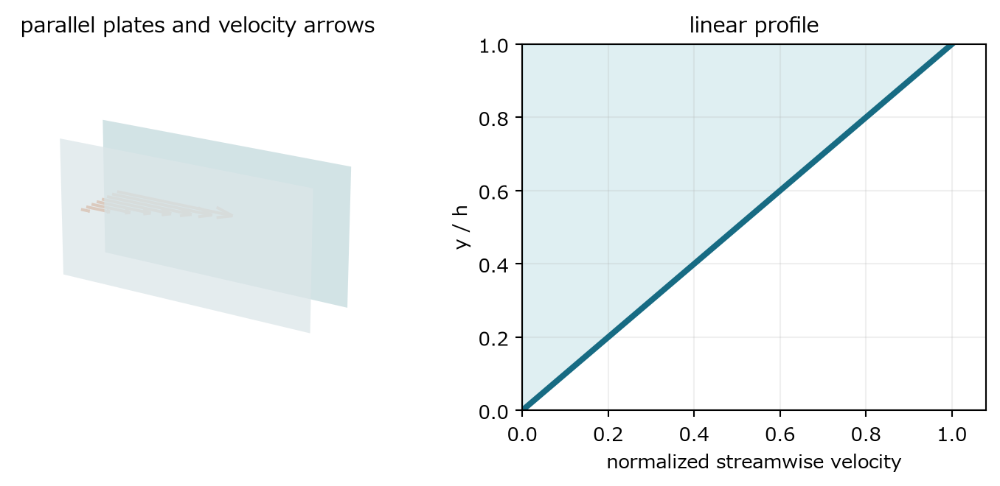
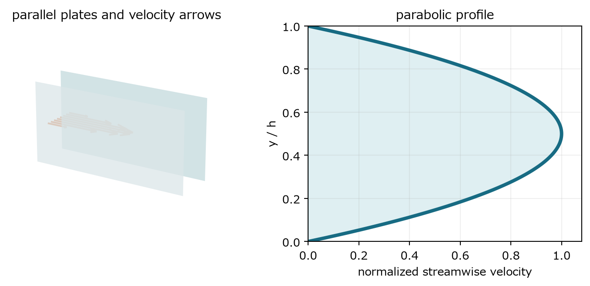
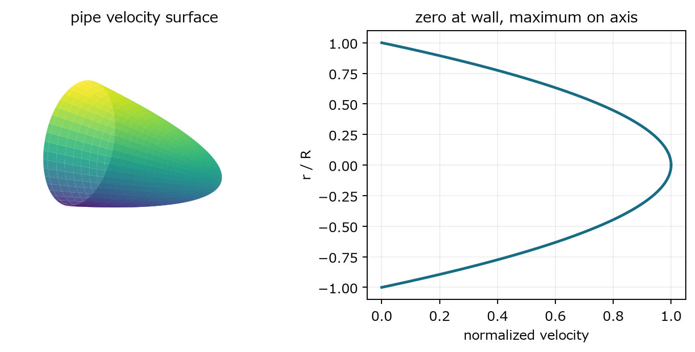
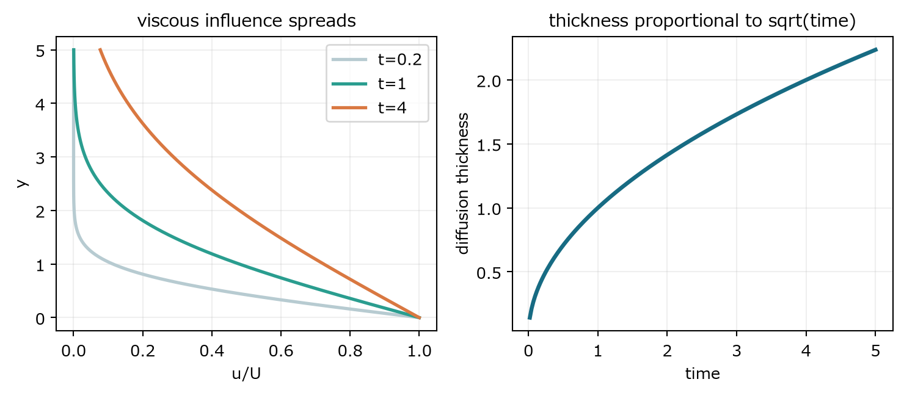
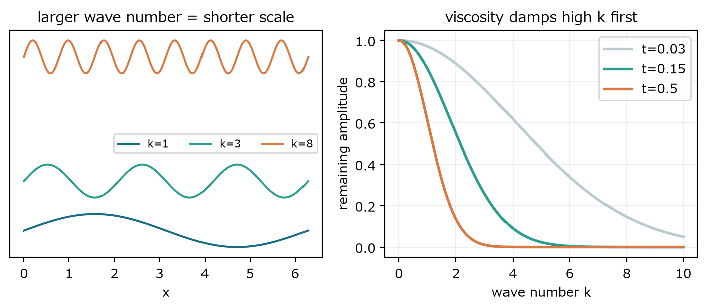

仮定するたびに、一般の方程式のどの項が消えるかを明示する

### 4　平面Couette流

> **この章で知りたいこと**
>
> 壁が一枚動くと、なぜ速度分布は直線になるのか。粘性があるのに粘性力がゼロとはどういう意味か。

*図3　平行板の設定と解の速度場。下板は静止、上板は一定速度で動く。*

#### 一般形から簡約する

板を y=0 と y=h に置き、上板だけを x 方向へ速度 U で動かす。定常、流れ方向と奥行き方向に一様、外力なし、圧力勾配なしを仮定する。速度は x 成分だけを持つ。

$$
\boldsymbol{u}=(v(y),0,0),\qquad v(0)=0,\quad v(h)=U
$$

時間微分は定常性で消える。移流項は v が x に依存しないため v∂x u=0。圧力勾配も仮定でゼロ。したがって x 成分だけが残る。

$$
0=\nu\frac{d^2v}{dy^2}
$$

#### 積分して境界条件を入れる

$$
\frac{d^2v}{dy^2}=0\ \Longrightarrow\ \frac{dv}{dy}=C_1\ \Longrightarrow\ v=C_1y+C_2
$$

$$
C_2=0,\qquad C_1h=U,\qquad v(y)=\frac{U}{h}y
$$

$$
\tau_{xy}=\mu\frac{dv}{dy}=\frac{\mu U}{h}
$$

粘性応力は一定でゼロではない。しかし体積要素の上面と下面に同じ大きさの応力が働くため、その差、すなわち粘性による正味の体積力はゼロである。上板の仕事は定常的に熱へ散逸する。

$$
\tau_{xy}U=\frac{\mu U^2}{h}=\int_0^h\mu\left(\frac{dv}{dy}\right)^2dy
$$

> **確認問題**
>
> 上板速度を2倍、間隔を半分にすると壁面せん断応力は何倍か。

#### 解答と意味

せん断応力は μU/h に比例するので4倍。

速度差が増え、同時に同じ差がより短い距離に押し込まれるため、速度勾配が4倍になる。

### 5　平面Poiseuille流

> **この章で知りたいこと**
>
> 圧力で押すとなぜ放物線になるのか。中心が速い理由を力の釣り合いとしてどう読むか。

*図4　静止した平行板間の圧力駆動流。速度は壁でゼロ、中心で最大となる。*

#### 一般形から簡約する

両板を静止させ、x 方向に一定の圧力降下を与える。Couette流と同じ定常平行流を仮定するが、今回は圧力勾配を残す。圧力降下の正の大きさを G と置く。

$$
G=-\frac{dP}{dx}>0,\qquad \boldsymbol{u}=(v(y),0,0),\qquad v(0)=v(h)=0
$$

$$
0=G+\mu\frac{d^2v}{dy^2}
$$

#### 二回積分する

$$
\frac{d^2v}{dy^2}=-\frac{G}{\mu}
$$

$$
\frac{dv}{dy}=-\frac{G}{\mu}y+C_1,\qquad v=-\frac{G}{2\mu}y^2+C_1y+C_2
$$

$$
C_2=0,\qquad C_1=\frac{Gh}{2\mu}
$$

$$
v(y)=\frac{G}{2\mu}y(h-y)
$$

放物線になる直接の理由は、圧力勾配が一定なので速度の曲率が一定になるからである。圧力は各流体要素へ運動量を与え、その運動量は粘性せん断を介して壁へ受け渡される。中心で速度が最大なのは、壁から遠いという言い換えだけではなく、対称性により中心で速度勾配とせん断応力がゼロになり、no-slip境界まで一定曲率でつながる結果である。

$$
\tau_{xy}(y)=\mu\frac{dv}{dy}=G\left(\frac{h}{2}-y\right)
$$

> **符号を読む**
>
> Gが正なら速度の曲率は負であり、グラフは下向きに曲がる。圧力勾配を逆にすれば速度も逆向きになる。

> **確認問題**
>
> 最大速度と断面平均速度の比を求めよ。

#### 解答と意味

最大速度は y=h/2 で Gh²/(8μ)。平均速度は h で積分して Gh²/(12μ)。比は3/2。

放物線分布では中央付近の広い領域が比較的速く、最大値だけでは流量を推定できない。

### 6　円管Poiseuille流

> **この章で知りたいこと**
>
> 円筒の幾何はLaplacianをどう変え、なぜ流量に半径の4乗が現れるのか。

*図5　円管内の放物面型速度分布。半径方向の面積要素が流量計算で効く。*

半径 R の円管で、軸方向速度 w(r) だけを持つ定常完全発達流を考える。軸方向圧力降下を G とすると、一般形は円筒座標の半径方向Laplacianへ簡約される。

$$
0=G+\mu\frac{1}{r}\frac{d}{dr}\left(r\frac{dw}{dr}\right)
$$

$$
\frac{d}{dr}\left(r\frac{dw}{dr}\right)=-\frac{G}{\mu}r
$$

$$
r\frac{dw}{dr}=-\frac{G}{2\mu}r^2+C_1
$$

軸で速度勾配が有限であるため、C1/r という特異項を生む積分定数はゼロでなければならない。壁でno-slipを課す。

$$
w(r)=\frac{G}{4\mu}(R^2-r^2)
$$

$$
Q=\int_0^R w(r)\,2\pi r\,dr=\frac{\pi G R^4}{8\mu}
$$

半径の2乗は速度振幅から、もう2乗は断面積から来る。したがって少し太い管でも流量は大きく変わる。これは模型の仮定が成り立つ層流域での結果であり、高Reynolds数の乱流へそのまま外挿してはいけない。

> **確認問題**
>
> 半径を2倍にし、圧力勾配と粘性を一定に保つと流量は何倍か。

#### 解答と意味

16倍。速度振幅が4倍、断面積が4倍になる。

4乗則は単なる暗記項目ではなく、力学と幾何の積として読める。

### 7　Stokesの第1問題

> **この章で知りたいこと**
>
> 突然動いた壁の影響はなぜ距離の平方ではなく、時間の平方根で広がるのか。

*図6　壁の運動量が粘性で拡散する。相似変数により各時刻の曲線が一つに重なる。*

半無限領域 y>0 の流体が静止しており、時刻0で壁 y=0 を速度 U へ瞬時に動かす。平行流を仮定すると、一般のNavier-Stokes方程式から対流項と圧力勾配が消え、熱方程式だけが残る。

$$
\partial_tu=\nu\partial_{yy}u,\quad u(0,t)=U,\quad u(y,0)=0,\quad u(y,t)\to0\ (y\to\infty)
$$

#### 相似変数を選ぶ

粘性係数の次元は長さ²/時間である。y と t から無次元量を作るには y/√(νt) とするしかない。係数2は後の式を簡単にするためである。

$$
\eta=\frac{y}{2\sqrt{\nu t}},\qquad u(y,t)=U F(\eta)
$$

ここではプライムを使わず、Fは相似変数ηの関数であることを偏微分記号で明示する。まずηをtとyで微分する。

$$
\partial_t\eta=-\frac{y}{4\sqrt{\nu}\,t^{3/2}}=-\frac{\eta}{2t},\qquad \partial_y\eta=\frac{1}{2\sqrt{\nu t}}
$$

$$
\partial_tu=U\frac{\partial F}{\partial\eta}\partial_t\eta=-U\frac{\eta}{2t}\frac{\partial F}{\partial\eta}
$$

$$
\partial_yu=\frac{U}{2\sqrt{\nu t}}\frac{\partial F}{\partial\eta},\qquad \partial_{yy}u=\frac{U}{4\nu t}\frac{\partial^2F}{\partial\eta^2}
$$

$$
\frac{\partial^2F}{\partial\eta^2}+2\eta\frac{\partial F}{\partial\eta}=0
$$

最終式のプライムは読みづらいので、以後はH(η)=∂F/∂ηと置く。このHはFそのものではなく、相似プロフィールのη方向勾配である。

$$
H(\eta)=\frac{\partial F}{\partial\eta},\qquad \frac{\partial H}{\partial\eta}+2\eta H=0
$$

$$
\frac{1}{H}\frac{\partial H}{\partial\eta}=-2\eta\ \Longrightarrow\ \log|H|=-\eta^2+C_0\ \Longrightarrow\ H=C_1e^{-\eta^2}
$$

$$
F(\eta)=C_2+C_1\int_0^\eta e^{-s^2}\,ds
$$

壁条件u(0,t)=UはF(0)=1を与えるのでC2=1。遠方条件F(∞)=0からC1=-2/√πが決まる。したがってGaussianの積分である相補誤差関数が現れる。Gaussianは熱方程式の基本解の形であり、偶然の特殊関数ではない。

$$
F(\eta)=1-\frac{2}{\sqrt{\pi}}\int_0^\eta e^{-s^2}\,ds=\operatorname{erfc}(\eta)
$$

$$
\frac{u(y,t)}{U}=\operatorname{erfc}\left(\frac{y}{2\sqrt{\nu t}}\right)
$$

速度が同じ割合まで伝わる位置は相似変数一定の位置なので、y は √(νt) に比例する。時間を4倍にして初めて影響距離が2倍になる。拡散は一定速度で前線が進む現象ではない。

> **確認問題**
>
> 粘性係数を9倍にすると、同じ時刻の影響厚さは何倍か。

#### 解答と意味

3倍。厚さは√(νt)に比例する。

粘性は速度差を遠くへ伝える能力でもある。大きい粘性は局所勾配を弱めるが、影響範囲は広げる。

### 8　Fourierモードと粘性

> **この章で知りたいこと**
>
> 粘性はなぜ細かい構造ほど速く消すのか。小スケールと高波数はどう対応するのか。

*図7　波数が大きいほど波長は短く、粘性による減衰率は波数の2乗で増える。*

熱方程式に一つのFourierモードを代入する。空間二階微分は波数の2乗を取り出し、符号を反転する。

$$
u(x,t)=a(t)e^{ikx}
$$

$$
\partial_tu=\frac{da}{dt}e^{ikx},\qquad \partial_{xx}u=-k^2a(t)e^{ikx}
$$

$$
\frac{da}{dt}=-\nu k^2a(t)
$$

$$
a(t)=a(0)e^{-\nu k^2t}
$$

波長は 2π/|k| であり、代表長さはおよそ1/|k|である。したがって短い距離で変化する構造ほど波数が大きく、指数減衰が速い。粘性は全スケールを同じ速さで弱めるのではなく、高波数を選択的に強く消す。

> **次への接続**
>
> 非線形項はモード同士を結合して別の波数へエネルギーを移す。一方、粘性は高波数ほど強く消す。この二つの役割の違いが、正則性問題の中心にある。
