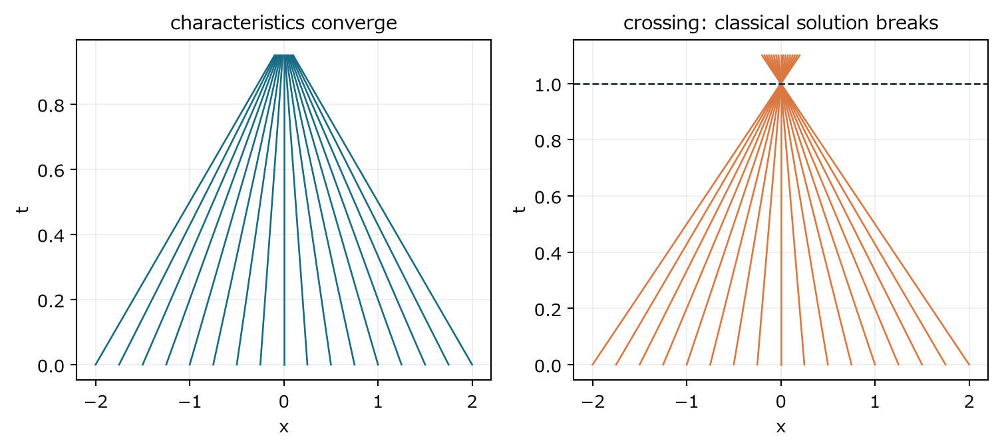
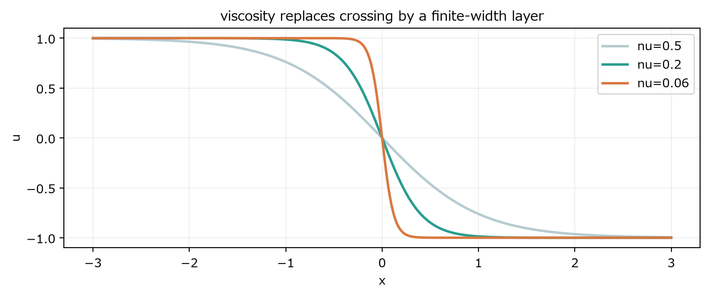

Burgers方程式で、移流が自分自身の勾配を強める仕組みを計算する

### 9　非粘性Burgers方程式

> **この章で知りたいこと**
>
> 後ろの速い粒子が前の遅い粒子へ追いつくと、古典解に何が起こるのか。自己増幅とは何か。

一次元のBurgers方程式はNavier-Stokesそのものではない。しかし、速度が自分自身を移流するという非線形構造だけを取り出した最小模型である。

$$
\partial_tu+u\partial_xu=0,\qquad u(x,0)=u_0(x)
$$

#### 特性線を導く

曲線 x(t) に沿って u を微分し、その曲線の速度を u 自身に選ぶ。するとPDEの左辺が合成関数の全微分になる。

$$
\frac{d}{dt}u(x(t),t)=\partial_tu+\frac{dx}{dt}\partial_xu
$$

$$
\frac{dx}{dt}=u\quad\Longrightarrow\quad\frac{du}{dt}=0
$$

初期位置 a から出た粒子は速度 u0(a) を保つので、軌道は直線になる。

$$
x(a,t)=a+u_0(a)t
$$

*図8　特性線が集まり、交差する。交差後に滑らかな一価関数を続けることはできない。*

#### 勾配が発散する計算

a を変えたとき x がどれだけ変わるかを計算する。写像 a↦x が逆関数を持つ限り、連鎖律で速度勾配を求められる。

$$
\frac{\partial x}{\partial a}=1+t\frac{du_0}{da}
$$

$$
\partial_xu=\frac{\partial_a u_0}{\partial_a x}=\frac{du_0/da}{1+t\,du_0/da}
$$

初期勾配が負の場所では分母が減り、最初にゼロになる時刻で勾配が負の無限大へ向かう。速度値そのものが先に無限大になる必要はない。滑らかな一価解を支える座標写像が潰れる。

#### 自己増幅を別ルートで見る

元のPDEを x で微分し、g=∂x u と置く。

$$
\partial_tg+u\partial_xg+g^2=0
$$

$$
\frac{Dg}{Dt}=-g^2
$$

現在の勾配 g 自身が、その後の変化率を決める。gが負なら右辺も負なので、勾配はさらに負になる。この意味で自己増幅と呼べる。ただし三次元Navier-Stokesの渦伸長とは同一の式ではなく、非線形自己作用の類比である。

> **追い越した後は戻る、ではない**
>
> 特性線が交差する点では一つの位置と時刻に複数の速度値が必要になる。古典的な滑らかな一価解はその瞬間に破綻する。交差後を記述するには弱解とエントロピー条件が必要であり、単純な粒子の追い越し像だけでは足りない。

> **確認問題**
>
> u0(a)=-a の特性線が交差する時刻を求めよ。

#### 解答と意味

x=a(1-t) なので、t=1で全ての特性線がx=0へ集まる。勾配は -1/(1-t)。

速度は有限でも勾配が発散するという、正則性問題の基本的な危険像が見える。

### 10　粘性Burgers方程式

> **この章で知りたいこと**
>
> 粘性は特性線交差をどう置き換えるか。急峻化と平滑化の競争を最小模型でどう見るか。

$$
\partial_tu+u\partial_xu=\nu\partial_{xx}u
$$

*図9　粘性は不連続な交差の代わりに有限幅の遷移層を作る。粘性が小さいほど層は薄い。*

移流は後方の速い値を前方へ運び、勾配を急にする。粘性は二階微分により大きな曲率を強くならし、層の幅を有限に保つ。定常進行波を考えると、代表速度差を U として層厚はおよそ ν/U になる。

#### Cole-Hopf変換

正の関数 θ を使い、φ=log θ と置いて速度を対数微分で表す。相殺を言葉だけで済ませず、一度展開する。

$$
\phi=\log\theta,\qquad u=-2\nu\partial_x\phi=-2\nu\frac{\partial_x\theta}{\theta}
$$

$$
\partial_tu=-2\nu\partial_{xt}\phi,\qquad u\partial_xu=4\nu^2(\partial_x\phi)(\partial_{xx}\phi),\qquad \nu\partial_{xx}u=-2\nu^2\partial_{xxx}\phi
$$

三項をBurgers方程式の左辺へ集めると、全体がx微分として因数分解される。ここが特殊な相殺である。

$$
\partial_tu+u\partial_xu-\nu\partial_{xx}u=-2\nu\partial_x\left(\partial_t\phi-\nu(\partial_x\phi)^2-\nu\partial_{xx}\phi\right)
$$

θが熱方程式を満たすなら、対数微分の時間変化は次の形になる。括弧内がゼロなのでBurgers方程式が成立する。空間定数が残る一般形も、θの時間依存する倍率へ吸収できる。

$$
\partial_t\theta=\nu\partial_{xx}\theta\quad\Longrightarrow\quad \partial_t\phi=\frac{\partial_t\theta}{\theta}=\nu\left(\partial_{xx}\phi+(\partial_x\phi)^2\right)
$$

$$
u=-2\nu\partial_x\log\theta=-2\nu\frac{\partial_x\theta}{\theta}
$$

$$
\partial_t\theta=\nu\partial_{xx}\theta
$$

Burgers方程式は特殊な変換で熱方程式へ線形化できる。Navier-Stokesに同じ万能変換は知られていない。それでも、非線形急峻化対粘性平滑化という競争を具体的に見せる点で重要である。

> **次への接続**
>
> 三次元Navier-Stokesでは、速度勾配と渦度が非局所に結びつく。Burgersのように一本の勾配方程式だけで閉じないことが難しさを増す。
