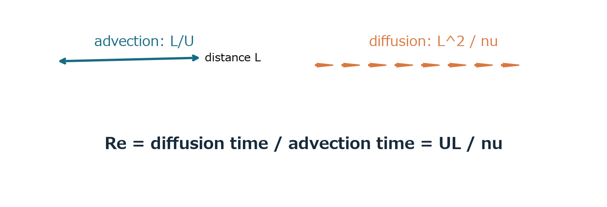
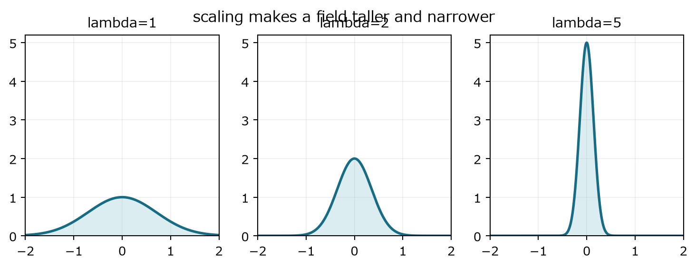

## 第IV部　Reynolds数・無次元化・スケール

時間尺度、項の大きさ、模型相似、PDEの対称性を一つの構造として見る

### 11　Reynolds数を二つの時間尺度から導く

> **この章で知りたいこと**
>
> なぜ移流時間と粘性時間を比べるのか。大きいReは何を意味し、何を意味しないのか。

*図10　移流が距離Lを運ぶ時間と、粘性が同じ距離を拡散する時間の比がReynolds数である。*

代表長さを L、代表速度を U とする。移流で距離 L を進む時間は距離/速度である。粘性拡散では L² が νt と同程度になる。

$$
T_{\mathrm{adv}}\sim\frac{L}{U},\qquad T_{\mathrm{visc}}\sim\frac{L^2}{\nu}
$$

$$
\frac{T_{\mathrm{visc}}}{T_{\mathrm{adv}}}=\frac{UL}{\nu}=\mathrm{Re}
$$

この比を見る理由は、速度差が移流で運ばれる前に粘性が均すか、それとも粘性が均す前に移流が構造を運ぶかを判定したいからである。Reが小さいと粘性の応答が相対的に速く、Reが大きいと移流が先行しやすい。

#### 方程式の項の比からも導く

$$
(\boldsymbol{u}\cdot\nabla)\boldsymbol{u}\sim\frac{U^2}{L},\qquad \nu\Delta\boldsymbol{u}\sim\frac{\nu U}{L^2}
$$

$$
\frac{\text{inertia}}{\text{viscosity}}\sim\frac{U^2/L}{\nu U/L^2}=\frac{UL}{\nu}=\mathrm{Re}
$$

> **重要な限定**
>
> Reが大きいことは乱流を保証しない。形状、境界条件、初期撹乱、線形・非線形安定性、観測時間が関係する。Reは項の相対規模を表すが、流れの状態を一語で決める判定器ではない。

> **確認問題**
>
> 同じ流体・同じ形の模型を長さ1/6にした。Reを同じに保つには速度を何倍にするか。

#### 解答と意味

速度を6倍にする。ULを一定に保つ必要がある。

小さい模型を同じReで動かすには速く流す。この模型相似は、後のPDEスケール対称性と同じ積ULの不変性を映す。

### 12　無次元化

> **この章で知りたいこと**
>
> 単位を消すと何が見えるのか。Reynolds数はどの係数として現れるのか。

無次元変数に星印を付ける。時間尺度には移流時間 L/U を使い、圧力尺度には密度を除いた U² を使う。

$$
\boldsymbol{x}=L\boldsymbol{x}^{*},\quad \boldsymbol{u}=U\boldsymbol{u}^{*},\quad t=\frac{L}{U}t^{*},\quad p=U^2p^{*}
$$

微分演算子は逆の尺度を持つ。

$$
\nabla=\frac{1}{L}\nabla^{*},\qquad \partial_t=\frac{U}{L}\partial_{t^{*}},\qquad \Delta=\frac{1}{L^2}\Delta^{*}
$$

各項へ代入する。

$$
\partial_t\boldsymbol{u}=\frac{U^2}{L}\partial_{t^{*}}\boldsymbol{u}^{*}
$$

$$
(\boldsymbol{u}\cdot\nabla)\boldsymbol{u}=\frac{U^2}{L}(\boldsymbol{u}^{*}\cdot\nabla^{*})\boldsymbol{u}^{*}
$$

$$
\nabla p=\frac{U^2}{L}\nabla^{*}p^{*},\qquad \nu\Delta\boldsymbol{u}=\frac{\nu U}{L^2}\Delta^{*}\boldsymbol{u}^{*}
$$

全体を U²/L で割ると、慣性項の係数は1、粘性項の係数だけが1/Reとなる。

$$
\partial_{t^{*}}\boldsymbol{u}^{*}+(\boldsymbol{u}^{*}\cdot\nabla^{*})\boldsymbol{u}^{*}=-\nabla^{*}p^{*}+\frac{1}{\mathrm{Re}}\Delta^{*}\boldsymbol{u}^{*}
$$

無次元化は単位を消すだけではない。異なる大きさ・速度・流体の実験を、同じ無次元方程式で比較できるようにする。Reが等しく、形状と無次元境界条件も等しければ、力学的相似が期待できる。

### 13　Navier-Stokesのスケール対称性

> **この章で知りたいこと**
>
> なぜ時間は空間の2乗で変わるのか。空間を6倍に見たら速度は本当に1/6なのか。

外力なしの全空間方程式を考える。ある解から別の解を作る候補を、空間引数λx、時間引数λ²t、速度振幅λで定義する。

$$
\boldsymbol{u}_{\lambda}(\boldsymbol{x},t)=\lambda\boldsymbol{u}(\lambda\boldsymbol{x},\lambda^2t),\qquad p_{\lambda}(\boldsymbol{x},t)=\lambda^2p(\lambda\boldsymbol{x},\lambda^2t)
$$

時間微分は振幅λと時間の連鎖律λ²からλ³を得る。移流項は速度λ、空間微分λ、もう一つの速度振幅λからλ³を得る。Laplacianも空間微分二回でλ²、速度振幅と合わせてλ³になる。

$$
\partial_t\boldsymbol{u}_{\lambda}=\lambda^3(\partial_t\boldsymbol{u})(\lambda\boldsymbol{x},\lambda^2t)
$$

$$
(\boldsymbol{u}_{\lambda}\cdot\nabla)\boldsymbol{u}_{\lambda}=\lambda^3((\boldsymbol{u}\cdot\nabla)\boldsymbol{u})(\lambda\boldsymbol{x},\lambda^2t)
$$

$$
\Delta\boldsymbol{u}_{\lambda}=\lambda^3(\Delta\boldsymbol{u})(\lambda\boldsymbol{x},\lambda^2t)
$$

時間が空間の2乗で変わるのは、粘性項が二階空間微分だからである。拡散の関係 L²≈νT と同じ構造であり、任意の取り決めではない。

*図11　λを大きくすると、対応解は高く細くなる。同じ一つの解が時間発展で必ずこの形へ集中する、という主張ではない。*

#### 空間6倍なら速度1/6か

物理長さを6倍に広げる向きで同じ相似族を読むなら、代表長さは6倍、代表速度は1/6、時間は36倍となる。逆に式 uλ(x,t)=λu(λx,λ²t) は、元の長さを1/λに縮めて振幅をλ倍にした表現である。どちらの言い方も同じ対応を逆向きに読んでいる。

$$
U\mapsto\lambda U,\qquad L\mapsto\frac{L}{\lambda},\qquad T\mapsto\frac{T}{\lambda^2},\qquad UL\mapsto UL
$$

したがってReynolds数は不変である。模型相似とPDEスケール対称性は、同じ構造を実験側と方程式側から見たものだ。ただし固定された容器境界はスケールで別の容器へ移るため、同一装置内の単なる座標変更ではない。

> **次部への橋**
>
> ここまでで方程式が自然に比較する縮尺は分かった。次に必要なのは、実際の時間発展で必ず制御できる量である。第14章では総運動エネルギーを導き、その制御が小スケール配置までは決めないことを見る。
