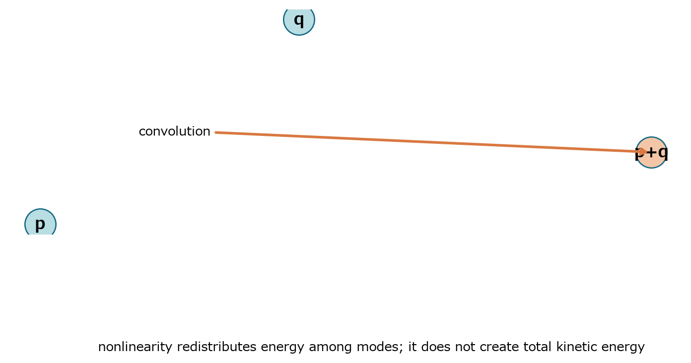
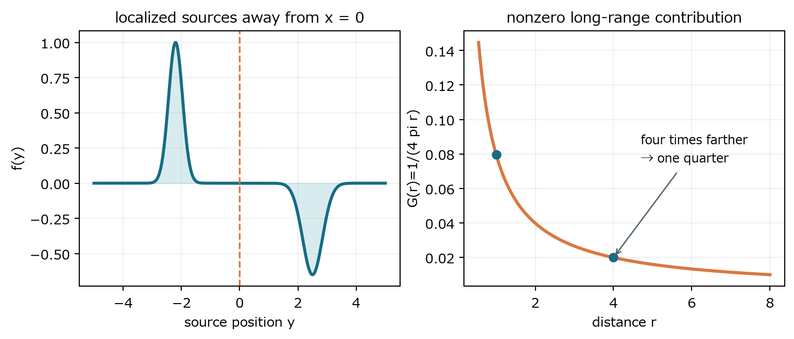

保存される総量と、再配分される空間構造を区別する

### 14　エネルギー等式

> **この章で知りたいこと**
>
> 非線形項は総運動エネルギーを作らないのに、なぜ危険な小スケールを作れるのか。

外力なし、全空間で十分減衰する滑らかな解、または周期境界を考える。速度方程式と速度の内積を取り、空間積分する。

$$
\int\boldsymbol{u}\cdot\partial_t\boldsymbol{u}\,dx+\int\boldsymbol{u}\cdot(\boldsymbol{u}\cdot\nabla)\boldsymbol{u}\,dx=-\int\boldsymbol{u}\cdot\nabla p\,dx+\nu\int\boldsymbol{u}\cdot\Delta\boldsymbol{u}\,dx
$$

#### 時間項

$$
\int\boldsymbol{u}\cdot\partial_t\boldsymbol{u}\,dx=\frac{1}{2}\frac{d}{dt}\int|\boldsymbol{u}|^2dx
$$

#### 非線形項

$$
\boldsymbol{u}\cdot(\boldsymbol{u}\cdot\nabla)\boldsymbol{u}=\frac{1}{2}\boldsymbol{u}\cdot\nabla|\boldsymbol{u}|^2
$$

$$
\int\frac{1}{2}\boldsymbol{u}\cdot\nabla|\boldsymbol{u}|^2dx=\frac{1}{2}\int\nabla\cdot(|\boldsymbol{u}|^2\boldsymbol{u})dx-\frac{1}{2}\int|\boldsymbol{u}|^2\nabla\cdot\boldsymbol{u}\,dx=0
$$

第1項は境界からの流出で、仮定によりゼロ。第2項は非圧縮条件でゼロになる。非線形項が点wiseにゼロなのではなく、空間全体で符号が相殺する。

#### 圧力項と粘性項

$$
-\int\boldsymbol{u}\cdot\nabla p\,dx=-\int\nabla\cdot(p\boldsymbol{u})dx+\int p\nabla\cdot\boldsymbol{u}\,dx=0
$$

$$
\nu\int\boldsymbol{u}\cdot\Delta\boldsymbol{u}\,dx=-\nu\int|\nabla\boldsymbol{u}|^2dx
$$

$$
\frac{1}{2}\frac{d}{dt}\|\boldsymbol{u}\|_2^2+\nu\|\nabla\boldsymbol{u}\|_2^2=0
$$

総運動エネルギーは増えず、速度勾配の二乗に比例して散逸する。しかしこの式はエネルギーがどの空間スケールに分布するかを直接は制御しない。総量を保ったまま、滑らかな大規模構造から細かな構造へ組み替える余地が残る。

> **確認問題**
>
> 非線形項を削除したStokes方程式でも同じエネルギー等式は得られるか。

#### 解答と意味

得られる。非線形項はもともと積分で消え、粘性散逸が同じ形で残る。

エネルギー等式だけを見ると、線形Stokesと非線形Navier-Stokesの差が見えにくい。難しさは総量ではなく再配分の仕方にある。

### 15　小スケールとFourier相互作用

> **この章で知りたいこと**
>
> 『非線形項が小スケールを作る』とは、物理空間とFourier空間で何を意味するか。

*図12　積のFourier変換は畳み込みとなり、モードpとqがモードp+qへ結合する。*

小スケールとは、短い距離で速度が大きく変わること、速度勾配が大きいこと、高波数成分が強いことを結びつけた言葉である。代表長さ ℓ と波数 k はおよそ逆数関係にある。

$$
\ell\sim\frac{1}{|k|},\qquad |\nabla\boldsymbol{u}|\sim |k|\,|\widehat{\boldsymbol{u}}(k)|
$$

物理空間での積はFourier空間で畳み込みになる。したがって非線形移流は単一モードを独立に進めず、複数モードを結合する。

#### 二つのモードだけで新しい波数を作る

まず一次元の実数値条件を気にせず、計算構造だけを見る。u=a exp(ipx)+b exp(iqx) と置くと、微分は各モードへ波数を掛ける。

$$
u=a e^{ipx}+b e^{iqx},\qquad \partial_xu=ip\,a e^{ipx}+iq\,b e^{iqx}
$$

$$
u\partial_xu=ip\,a^2e^{2ipx}+i(p+q)ab\,e^{i(p+q)x}+iq\,b^2e^{2iqx}
$$

元にはpとqしかなかったのに、積には2p、p+q、2qが現れる。実数値の場では共役モードも入り、差p-qも現れる。一般のベクトル場では、この『添字が足し合わされる』規則が畳み込みになる。

$$
\widehat{(\boldsymbol{u}\cdot\nabla)\boldsymbol{u}}(k)=i\sum_{p+q=k}(q\cdot\widehat{\boldsymbol{u}}(p))\widehat{\boldsymbol{u}}(q)
$$

pとqの組からp+qが現れるため、より大きい波数を生成し得る。ただし個々のtriadは双方向に交換し、これだけではenergy fluxの向きは決まらない。forward cascadeや二次元のinverse transferは多数モードの統計・保存量・乱流極限の議論であり、本書では方向決定機構を証明しない。正則性問題の厳密数学とも区別する。

> **エネルギーとの両立**
>
> 非線形項はモード間でエネルギーを交換させるが、全モードの和としての運動エネルギーは増やさない。粘性は高波数へ移ったエネルギーを強く散逸する。

### 16　圧力の非局所性

> **この章で知りたいこと**
>
> 一点の圧力が、なぜその点の速度だけでは決まらないのか。

*図13　局在sourceから離れても3次元Green核はゼロにならない。距離4倍なら単位sourceの寄与は1/4になる。*

速度方程式の発散を取る。発散ゼロなので時間項と粘性項の発散はゼロになる。非線形項を添字で展開する。

$$
\partial_i(\partial_tu_i)+\partial_i(u_j\partial_ju_i)=-\Delta p+\nu\partial_i\Delta u_i
$$

$$
\partial_i(u_j\partial_ju_i)=\partial_i\partial_j(u_i u_j)
$$

$$
-\Delta p=\partial_i\partial_j(u_i u_j)
$$

形式的に逆Laplacianを作用させると圧力を表せる。三次元全空間ではGreen関数が距離の逆数型なので、積分核を通じて遠方も寄与する。

$$
p=(-\Delta)^{-1}\partial_i\partial_j(u_i u_j)
$$

$$
(( -\Delta)^{-1}f)(x)=\frac{1}{4\pi}\int_{\mathbb{R}^3}\frac{f(y)}{|x-y|}\,dy
$$

#### 最小具体例：離れたsourceも消えない

まず圧力sourceの特殊構造を外し、-Δp=fだけを見る。体積積分が1の小さなsourceが点y0の近くに局在し、観測点xからの距離をRとする。sourceの直径がRより十分小さければ、核はほぼ一定なので次の近似になる。

$$
p(x)\simeq\frac{1}{4\pi R}\int f(y)\,dy=\frac{1}{4\pi R}
$$

R=1なら約0.0796、R=4なら約0.0199である。遠方寄与は小さくなるがゼロではなく、複数sourceの寄与は全空間から足し合わされる。これが『非局所』の最小像である。

NSへ戻るとf=∂i∂j(uiuj)である。微分をGreen核へ移すと3次元では二階微分核が遠方で|x-y|のマイナス3乗程度に減衰する。ただし原点で特異なので主値積分と局所項が必要である。単純な1/R則を、そのままNS圧力の最終kernel減衰率と取り違えてはいけない。

圧力は局所的な状態方程式ではなく、発散ゼロを全空間的に満たすための非局所応答である。一方、Poisson方程式右辺の生成は各点の速度勾配から起こる。localなsource生成とnonlocalな復元を分けて読む。

> **次部への橋**
>
> 圧力の非局所性を見たので、次はcurlを取り圧力勾配を消す。ただし非局所性そのものは消えず、渦度から速度勾配を復元するBiot-Savart型作用に姿を変えて戻る。
