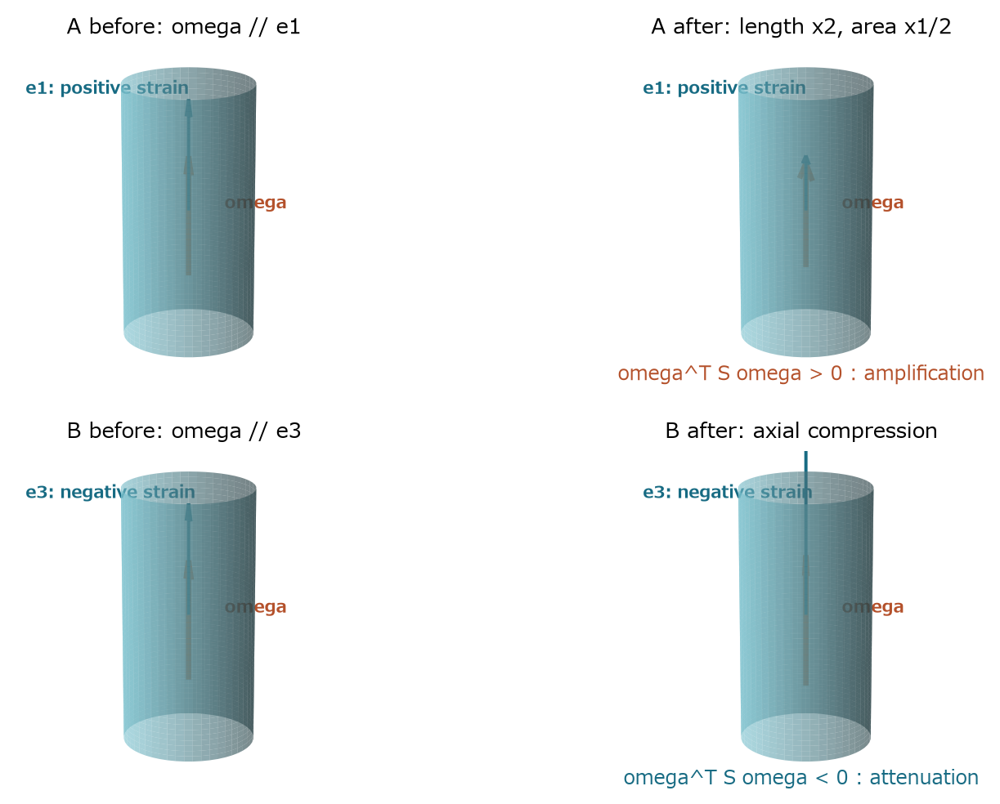
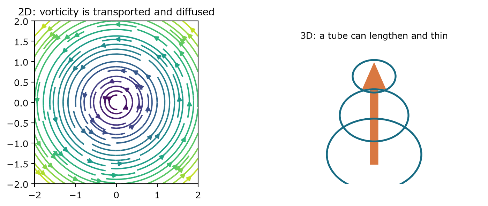

## 第VI部　渦度と次元

渦が運ばれ、傾き、伸び、拡散する過程を分離する

### 17　渦度方程式を導く

> **この章で知りたいこと**
>
> 圧力を消すと何が見えるか。移流・伸長・拡散はどう分かれるか。

渦度を速度の回転として定義する。Navier-Stokes方程式のcurlを取ると、勾配のcurlはゼロなので圧力が消える。

$$
\boldsymbol{\omega}=\nabla\times\boldsymbol{u}
$$

$$
\partial_t\boldsymbol{\omega}+\nabla\times((\boldsymbol{u}\cdot\nabla)\boldsymbol{u})=\nu\Delta\boldsymbol{\omega}
$$

非線形項を扱うため、次の恒等式を使う。発散ゼロと、curlの発散がゼロであることも使う。

$$
\nabla\times(\boldsymbol{u}\times\boldsymbol{\omega})=(\boldsymbol{\omega}\cdot\nabla)\boldsymbol{u}-(\boldsymbol{u}\cdot\nabla)\boldsymbol{\omega}
$$

$$
(\boldsymbol{u}\cdot\nabla)\boldsymbol{u}=\nabla\left(\frac{|\boldsymbol{u}|^2}{2}\right)-\boldsymbol{u}\times\boldsymbol{\omega}
$$

$$
\partial_t\boldsymbol{\omega}+(\boldsymbol{u}\cdot\nabla)\boldsymbol{\omega}=(\boldsymbol{\omega}\cdot\nabla)\boldsymbol{u}+\nu\Delta\boldsymbol{\omega}
$$

$$
\frac{D\boldsymbol{\omega}}{Dt}=(\boldsymbol{\omega}\cdot\nabla)\boldsymbol{u}+\nu\Delta\boldsymbol{\omega}
$$

| 項 | 読み方 |
|---|---|
| 物質微分 | 流体粒子に乗って見た渦度の変化 |
| 渦伸長・傾斜 | 渦軸方向に速度がどう変わるかが、渦度の向きと大きさを変える |
| 粘性拡散 | 近接する渦度差をならし、高波数を減衰させる |

> **圧力が消えた意味**
>
> 圧力が力学から不要になったのではない。速度場を発散ゼロに保つ働きは速度を通じて渦度運動へ間接的に残る。curlを取ると勾配成分だけが見えなくなる。

#### Burgersから一般3D速度勾配へ

Burgersのg=∂x uでは、Dg/Dt=-g²が勾配の自己作用を示した。一般3Dでも速度勾配A=∇uを物質微分すると、成分ごとに積の連鎖律から二次項A²が現れる。

$$
\frac{D}{Dt}(\partial_j u_i)=\partial_j\left(\frac{Du_i}{Dt}\right)-(\partial_j u_k)(\partial_k u_i)
$$

$$
\frac{DA}{Dt}=-A^2-\nabla^2p+\nu\Delta A+\nabla\boldsymbol{f}
$$

-A²はBurgersの-g²に対応する非線形自己作用である。ただし3Dでは圧力Hessianが方向間を非局所に結合し、粘性も行列全体を拡散する。したがってBurgersは機構の模型であって、3D NSを一つのRiccati方程式へ還元するものではない。

### 18　vortex stretchingを行列で読む

> **この章で知りたいこと**
>
> 渦度がどの向きに並ぶと増幅するのか。回転と変形をどう分けるのか。

#### 二粒子間ベクトルからstrainを定義する

時刻tに近接する二つの流体粒子の位置差をδxとする。速度差を一次Taylor展開すると、δuは速度勾配行列Aの作用になる。両粒子を同時に追えば位置差の物質微分はその速度差である。

$$
\delta\boldsymbol{u}=\boldsymbol{u}(x+\delta x)-\boldsymbol{u}(x)\simeq(\nabla\boldsymbol{u})\delta\boldsymbol{x}=A\delta\boldsymbol{x}
$$

$$
\frac{D}{Dt}\delta\boldsymbol{x}=A\delta\boldsymbol{x}
$$

次に向きではなく長さを見る。A=S+Ωと対称・反対称部分へ分ける。反対称部分の二次形式は転置すると符号が反転する一方、実数スカラーなので自分自身と等しい。したがってゼロである。

$$
A_{ij}=\partial_j u_i,\qquad ((\boldsymbol{\omega}\cdot\nabla)\boldsymbol{u})_i=\sum_jA_{ij}\omega_j
$$

$$
A=S+\Omega,\qquad S=\frac{A+A^T}{2},\qquad \Omega=\frac{A-A^T}{2}
$$

$$
\delta x^T\Omega\delta x=(\delta x^T\Omega\delta x)^T=\delta x^T\Omega^T\delta x=-\delta x^T\Omega\delta x=0
$$

$$
\frac{1}{2}\frac{D}{Dt}|\delta\boldsymbol{x}|^2=\delta\boldsymbol{x}^TA\delta\boldsymbol{x}=\delta\boldsymbol{x}^TS\delta\boldsymbol{x}
$$

これがSをstrain-rate tensorと呼ぶ運動学的理由である。Sだけが微小物質線の瞬間的長さを変える。Ωはその瞬間の長さを変えず、向きを回す。

#### 非圧縮が固有値へ課す制約

$$
\operatorname{tr}S=\operatorname{tr}A=\nabla\cdot\boldsymbol{u}=0
$$

$$
\lambda_1+\lambda_2+\lambda_3=0
$$

したがって全方向を同時に正の率で伸ばせない。ある方向へ伸ばすなら、少なくとも別方向で縮める必要がある。これは体積保存の線形代数表示である。

#### 渦度の配向を一般式で読む

Sの正規直交固有ベクトルをe_iとし、渦度をその基底で展開する。完全に一つの固有方向へ一致しなくても、各方向成分の二乗を重みとして符号を判定できる。

$$
\boldsymbol{\omega}=\sum_{i=1}^3\alpha_i\boldsymbol{e}_i,\qquad S\boldsymbol{e}_i=\lambda_i\boldsymbol{e}_i
$$

$$
\boldsymbol{\omega}^TS\boldsymbol{\omega}=\sum_{i,j}\alpha_i\alpha_j\boldsymbol{e}_i^TS\boldsymbol{e}_j=\sum_i\lambda_i\alpha_i^2
$$

$$
\frac{1}{2}\frac{D|\boldsymbol{\omega}|^2}{Dt}=\boldsymbol{\omega}^TS\boldsymbol{\omega}+\nu\boldsymbol{\omega}\cdot\Delta\boldsymbol{\omega}
$$

正固有値方向の成分が優勢なら増幅へ、負固有値方向の成分が優勢なら減衰へ寄与する。したがって『渦があれば必ず増幅する』は誤りで、配向が本質である。乱流中の統計的配向は別の研究課題であり、この局所恒等式だけから一意に決まらない。

*図14　同じ渦度でもstrain固有方向との配向で増幅と減衰が分かれる。上段Aは正固有値方向、下段Bは負固有値方向。長さ2倍・断面積1/2・渦度2倍は、非粘性かつ一様な軸対称伸長という直感模型に限る。*

#### 循環と渦束の直感

細い渦管の断面積を A、軸方向渦度を代表値 ω とすると、渦束はおよそωAである。非粘性の理想化では循環保存と対応して渦束が保たれる。管が伸び、非圧縮により断面が小さくなるなら、ωが増える直感を得る。ただし粘性・境界・非一様性がある実際の場では、これだけで定量的結論は出せない。

#### 自己増幅の正確な意味

ここでは、全空間R³で十分速く減衰する場、または平均速度を固定した周期場T³を考える。この条件が必要なのは、curlだけでは定数速度や境界に由来する成分を決められないからである。境界付き領域では、境界条件と調和成分を含む別の楕円復元が必要になる。

渦度と速度勾配は独立な外部データではない。ω=curl uにもう一度curlを作用させ、div u=0を使うとPoisson方程式が現れる。

$$
\nabla\times\boldsymbol{\omega}=\nabla(\nabla\cdot\boldsymbol{u})-\Delta\boldsymbol{u}=-\Delta\boldsymbol{u}
$$

したがって上のsettingでは逆Laplacianにより速度を復元できる。増大した渦度が新しいstrainを作り、そのstrainがさらに渦度へ作用し得る。この閉じたフィードバックを自己増幅と呼ぶ。ただし符号は幾何配置に依存し、blow-upを意味しない。

$$
\boldsymbol{u}=\nabla\times(-\Delta)^{-1}\boldsymbol{\omega}
$$

$$
\nabla\boldsymbol{u}=\mathcal{R}\mathcal{R}\boldsymbol{\omega}
$$

記号R RはRiesz変換型の0階特異積分を表す。つまり微分階数の意味では∇uとωは同じ次数だが、ある点のSはその点のωだけでは決まらず、全空間の渦度配置に依存する。stretching項Aωは点xではlocalな積だが、Aをωから復元する写像はnonlocalである。

> **確認問題**
>
> Sの固有値が (2,-1,-1)、渦度が第1固有ベクトル方向なら、粘性を無視した渦度の二乗の瞬間増加率はどうなるか。

#### 解答と意味

渦度方向の二次形式は、渦度の二乗の2倍である。したがって渦度の二乗の物質微分は、その値の4倍になる。

増幅率は速度の大きさではなく、渦度方向に見たstrainの固有値で決まる。

### 19　2次元と3次元の分岐

> **この章で知りたいこと**
>
> 2次元ではなぜ渦伸長が恒等的に消え、それが大域制御へどうつながるのか。

*図15　2次元では渦度は面に垂直なスカラー。3次元では渦管方向にも速度が変化できる。*

二次元速度を三次元に埋め込んで書く。速度はz成分を持たず、zにも依存しない。curlを取ると渦度はz成分だけになる。

$$
\boldsymbol{u}=(u_1(x,y,t),u_2(x,y,t),0),\qquad \partial_z\boldsymbol{u}=0
$$

$$
\boldsymbol{\omega}=(0,0,\zeta),\qquad (\boldsymbol{\omega}\cdot\nabla)\boldsymbol{u}=\zeta\partial_z\boldsymbol{u}=0
$$

$$
\partial_t\zeta+\boldsymbol{u}\cdot\nabla\zeta=\nu\Delta\zeta
$$

#### 最大値原理

まず境界項のない周期面T²、または十分減衰する全平面R²に限定する。ζが空間最大値を取る内点では勾配がゼロ、Laplacianは0以下である。したがってその点で移流項は消え、粘性項は最大値を増やさない。同じ議論を-ζへ適用する。

$$
\|\zeta(t)\|_{\infty}\leq\|\zeta(0)\|_{\infty}
$$

#### 渦度から速度を復元する

最大値原理だけでは、まだ速度の全高階微分を制御したことにならない。二次元非圧縮流では流れ関数ψを使い、渦度から速度をPoisson方程式で復元できる。周期面では平均ゼロ条件のもとFourier係数ごとに明示できる。

$$
-\Delta\psi=\zeta,\qquad \boldsymbol{u}=\nabla^\perp\psi=(\partial_y\psi,-\partial_x\psi)
$$

$$
\widehat{\psi}(k)=\frac{\widehat{\zeta}(k)}{|k|^2},\qquad \widehat{\nabla\boldsymbol{u}}(k)=\frac{k\otimes k^\perp}{|k|^2}\widehat{\zeta}(k)\quad(k\neq0)
$$

この倍率は波数に関して0次である。したがって1<p<∞では楕円型評価、同値にRiesz変換の有界性により、速度勾配のLpノルムを渦度のLpノルムで制御できる。L∞端点では単純な同じ形の有界性は成り立たないので、有限p評価とSobolev埋め込み、粘性平滑化を組み合わせる。

$$
\|\nabla\boldsymbol{u}\|_{L^p}\leq C_p\|\zeta\|_{L^p}\qquad(1<p<\infty)
$$

#### 大域正則性への論理骨格

渦度方程式には正符号の自己増幅源がなく、最大値原理とLpエネルギー評価が全時間で保たれる。Poisson復元で速度勾配を制御し、放物型平滑化と高階エネルギー評価を順に適用すると、局所滑らか解の継続規準に必要な量が有限に保たれる。これが『stretchingが消えるから大域正則』の間を埋める論理である。完全証明には楕円正則性、積評価、局所存在・継続定理が必要であり、一行の最大値原理だけで完了するわけではない。

三次元ではstretching termが残り、渦度自身が渦度の最大値を増やす符号不定のsourceになるため、この鎖の最初が閉じない。差は単に成分が一つ増えることではない。

> **境界付き領域の注意**
>
> no-slip壁では境界で渦度が生成・供給され、周期面の最大値原理をそのまま貼り付けられない。二次元有界領域にも大域正則性理論はあるが、境界条件に適合したStokes作用素・楕円評価・境界渦度の扱いが別途必要である。

> **何が解決し、何が解決しないか**
>
> 平面・周期面・適切な二次元領域では大域正則性が確立している。球面S²も二次元多様体なので同じ本質的利点を持つ。しかし薄い三次元球殻や一般の三次元流れへその結論を自動的に移せない。
