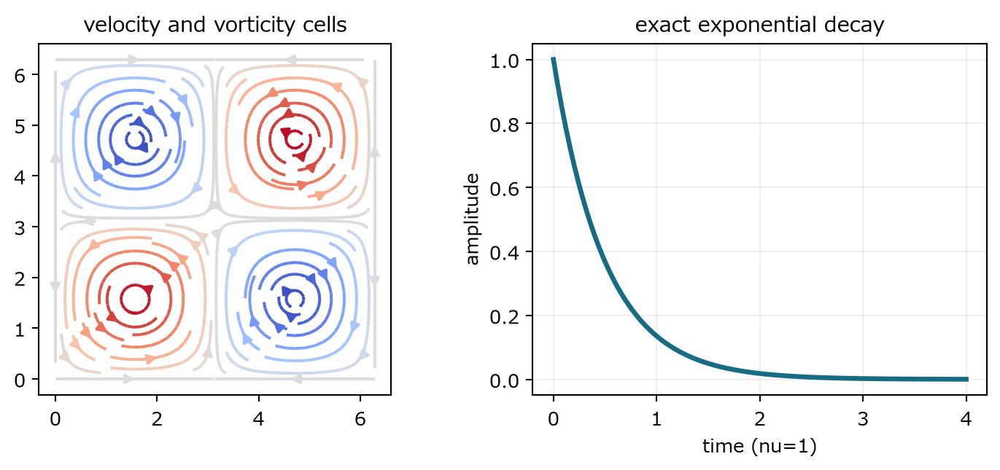
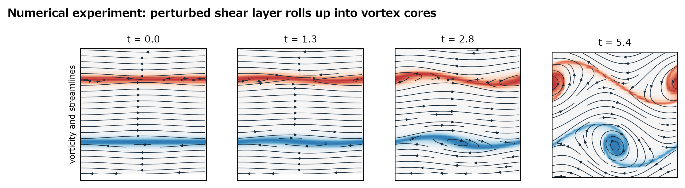
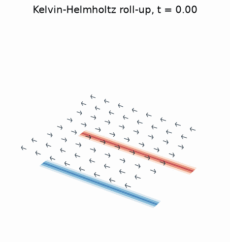

## 第VII部　渦を計算して見る

厳密解と数値実験で、渦の存在・減衰・集中・渦核形成を区別する

### 20　Taylor-Green渦：厳密に解ける渦あり流れ

> **この章で知りたいこと**
>
> 渦が存在することと、三次元渦伸長が起きることはどう違うか。

*図16　周期箱の二次元Taylor-Green渦。渦セルは存在するが、振幅は粘性で指数減衰する。*

二次元周期領域で次の速度候補を考える。A(t)は時間だけの振幅である。

$$
u_1=A(t)\sin x\cos y,\qquad u_2=-A(t)\cos x\sin y
$$

発散を直接計算するとゼロになる。

$$
\partial_xu_1+\partial_yu_2=A\cos x\cos y-A\cos x\cos y=0
$$

Laplacianは各成分を-2倍する。振幅をA(t)=exp(-2νt)と選べば、時間微分と粘性項が一致する。残る非線形項はゼロではないので、成分ごとに圧力と照合する。

$$
\Delta\boldsymbol{u}=-2\boldsymbol{u},\qquad \frac{dA}{dt}=-2\nu A(t)
$$

$$
(\boldsymbol{u}\cdot\nabla)u_1=A^2\sin x\cos x=\frac{A^2}{2}\sin 2x
$$

$$
(\boldsymbol{u}\cdot\nabla)u_2=A^2\sin y\cos y=\frac{A^2}{2}\sin 2y
$$

$$
(\boldsymbol{u}\cdot\nabla)\boldsymbol{u}=\frac{A^2}{2}(\sin 2x,\sin 2y)
$$

$$
p(x,y,t)=\frac{A(t)^2}{4}(\cos 2x+\cos 2y)+C(t)
$$

$$
-\nabla p=\frac{A^2}{2}(\sin 2x,\sin 2y)=(\boldsymbol{u}\cdot\nabla)\boldsymbol{u}
$$

よって時間微分と粘性項、非線形項と圧力勾配がそれぞれ一致し、NSを成分ごとに満たす。学習点は『非線形項が消える』ことではない。非線形加速度が純粋な勾配場になり、圧力がちょうど打ち消すことである。

$$
\zeta=\partial_xu_2-\partial_yu_1=2A(t)\sin x\sin y
$$

これは『渦が存在して粘性で減衰する』厳密例である。zに依存しないため三次元vortex stretchingはない。また新たに渦が生成される例でもない。初期時刻から渦度セルが存在する。

### 21　せん断層の数値実験

> **この章で知りたいこと**
>
> 既に分布している渦度が不安定化し、局在した渦核へ巻き上がる過程をどう計算するか。

*図17　周期二次元せん断層の数値計算。色は渦度、矢印は速度。分布した渦度帯が曲がり、渦核へ組織化される。*

*補助アニメーション　せん断層数値実験の時間発展。配布パッケージ収録の再現計算から生成。*

二次元非圧縮流を渦度と流れ関数で書く。圧力は消え、各時刻でPoisson方程式を解いて速度を戻す。

$$
\partial_t\zeta+(\boldsymbol{u}\cdot\nabla)\zeta=\nu\Delta\zeta
$$

$$
\boldsymbol{u}=(\partial_y\psi,-\partial_x\psi),\qquad -\Delta\psi=\zeta
$$

周期領域0≤x,y<2πで、上下に向きの異なる二本のせん断層を置き、小さな横速度撹乱を加える。初期せん断層は既に渦度を持つ。したがって正確な表現は『静かな無渦流から渦が発生』ではない。

$$
u_1(y,0)=\tanh((y-\pi/2)/\delta)\qquad(0\leq y\leq\pi)
$$

$$
u_1(y,0)=\tanh((3\pi/2-y)/\delta)\qquad(\pi<y<2\pi)
$$

$$
u_2(x,0)=\varepsilon\sin x
$$

#### 数値手法

空間はFourier擬スペクトル法、時間は古典的4次Runge-Kutta法、非線形積のaliasingは2/3則で抑えた。Fourier空間ではPoisson方程式が各波数ごとの割り算になる。

$$
\widehat{\psi}(k)=\frac{\widehat{\zeta}(k)}{|k|^2}\quad(k\neq0)
$$

| 項目 | 採用値 |
|---|---|
| 領域・境界 | [0,2π)²、x/yとも周期境界 |
| 完全初期条件 | 上記u1の二重せん断層、u2=0.055 sin x、ζ=∂x u2-∂y u1、平均ζ=0 |
| 層厚・撹乱 | δ=0.20、ε=0.055 |
| 格子・粘性 | 96×96、ν=2.0×10^-4 |
| 時間積分 | Δt=0.006、RK4、900 step、0≤t≤5.4 |
| 空間離散 | Fourier擬スペクトル、矩形2/3 cutoff |
| 可視化 | 28 frame、渦度色範囲を全時刻で[-7,7]に固定、速度矢印は方向を正規化 |

観察されるのは、渦度の生成一般ではなく、分布していた渦度の不安定化、巻き上がり、集中、渦核形成である。二次元なので渦伸長はなく、三次元正則性問題の数値モデルではない。3D表示は二次元場を高さゼロの空間面へ描いた可視化である。

> **再現性情報**
>
> Zenn版では、上の補助GIFで時間発展を確認できる。再現コード `code/kh_shear_layer_simulation.py` は配布リポジトリに収録する。図17だけでも時間変化を読める。表示上の3D高さは物理変数ではなく、二次元周期面を見やすく傾けただけである。
