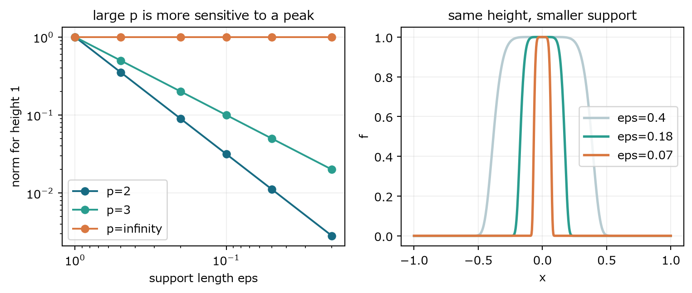
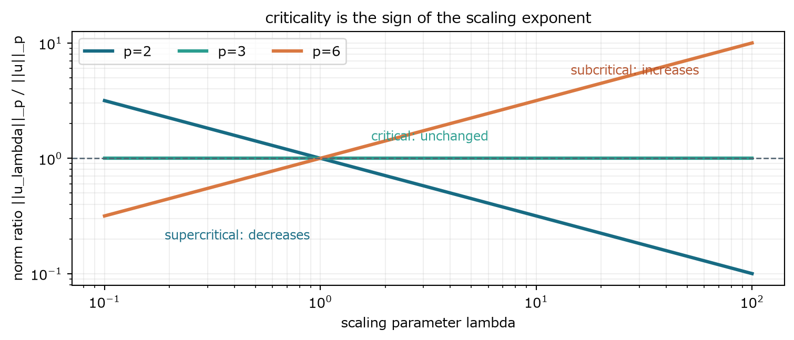

## 第VIII部　解析の物差し

ノルム・臨界性・高階評価・解概念を、何を測るための道具かという順で導入する

### 22　Lpノルムは何を測るか

> **この章で知りたいこと**
>
> 平均的な大きさと局所ピークを、どの物差しで区別するか。

*図18　支持領域が縮むと有限pノルムは小さくなるが、最大値ノルムは高さをそのまま見る。*

三次元で、一辺がおよそεの小領域だけ高さAを持ち、それ以外でゼロの関数を考える。領域体積はおよそε³である。

$$
\|f\|_p^p\sim A^p\varepsilon^3,\qquad \|f\|_p\sim A\varepsilon^{3/p}
$$

$$
\|f\|_2\sim A\varepsilon^{3/2},\qquad \|f\|_3\sim A\varepsilon,\qquad \|f\|_{\infty}=A
$$

pが大きいほど体積因子の指数3/pが小さく、局所ピークに敏感になる。L²は総エネルギーに自然だが、非常に小さい領域の大きな値を平均化して見えにくくすることがある。ノルムは単なる記号ではなく、何を危険とみなすかを選ぶ物差しである。

### 23　臨界性を変数変換から導く

> **この章で知りたいこと**
>
> 小さく激しい構造を見失わないノルムはどれか。critical・subcritical・supercriticalは何を意味するか。

三次元のスケール変換に対してLpノルムを計算する。空間変数をλ倍する変数変換では、体積要素がλのマイナス3乗倍になる。

$$
\|\boldsymbol{u}_{\lambda}\|_p^p=\int|\lambda\boldsymbol{u}(\lambda x)|^pdx=\lambda^{p-3}\int|\boldsymbol{u}(y)|^pdy
$$

$$
\|\boldsymbol{u}_{\lambda}\|_p=\lambda^{1-3/p}\|\boldsymbol{u}\|_p
$$

$$
\|\boldsymbol{u}_{\lambda}\|_3=\|\boldsymbol{u}\|_3,\qquad \|\boldsymbol{u}_{\lambda}\|_2^2=\lambda^{-1}\|\boldsymbol{u}\|_2^2
$$

λが大きいと速度は高く、構造は細くなる。それでもL²エネルギーは小さく見える一方、L³は同じ値を返す。速度勾配はさらにλを一つ得る。

$$
\nabla\boldsymbol{u}_{\lambda}(x)=\lambda^2(\nabla\boldsymbol{u})(\lambda x),\qquad \|\nabla\boldsymbol{u}_{\lambda}\|_2=\lambda^{1/2}\|\nabla\boldsymbol{u}\|_2
$$

| 分類 | 細かいスケールでの挙動 | 意味 |
|---|---|---|
| subcritical | ノルムが強くなる | 小スケール集中をより厳しく制御する |
| critical | 不変 | 方程式の自然なスケールを見失わない |
| supercritical | ノルムが弱くなる | 有界でも微細集中を排除しにくい |

三次元ではエネルギーL²がsupercriticalである。これは特異点が存在する証明ではなく、エネルギーだけでは自然スケールの集中を排除しにくいという診断である。

$$
\|\boldsymbol{u}_{\lambda}\|_{\dot H^s}=\lambda^{s-1/2}\|\boldsymbol{u}\|_{\dot H^s},\qquad s=\frac{1}{2}\ \text{is critical}
$$

*図19　λを変えたときのLpノルム比。p=3だけが水平で、p=2は微細化で弱く、p=6は強くなる。*

### 24　高階評価は何をしようとしているか

> **この章で知りたいこと**
>
> なぜ速度勾配を測り、なぜ-Δuを掛けるのか。各不等式は何を交換しているのか。

ここでは境界項のない三次元周期領域を考え、平均速度を0とする。エネルギーより細かな構造を見るため、速度勾配のL²ノルムを制御したい。速度方程式と-Δuの内積を取ると、時間項が勾配エネルギー、粘性項が二階微分の良い符号になる。圧力項は発散ゼロと周期性で消える。

$$
\frac{1}{2}\frac{d}{dt}\|\nabla\boldsymbol{u}\|_2^2+\nu\|\Delta\boldsymbol{u}\|_2^2=-\int(\boldsymbol{u}\cdot\nabla)\boldsymbol{u}\cdot\Delta\boldsymbol{u}\,dx
$$

#### 評価を後ろから設計する

目標は右辺を、既に追っている量∥∇u∥2と、左辺の粘性項へ吸収できる∥Δu∥2だけで書くことである。三つの因子u、∇u、Δuのうち、ΔuはL2のまま残す。uには3D Sobolev埋め込みH1→L6を使いたい。Hölder指数の残りはL3となる。

#### Hölder：積をノルムへ分解する

$$
\frac{1}{6}+\frac{1}{3}+\frac{1}{2}=1
$$

$$
|\text{nonlinear term}|\leq\|\boldsymbol{u}\|_6\|\nabla\boldsymbol{u}\|_3\|\Delta\boldsymbol{u}\|_2
$$

6,3,2は暗記すべき唯一の組ではない。この経路では、L6をSobolevで一階微分へ、L3をL2とL6の中間へ、L2を粘性項へ割り当てるために逆算して選ぶ。

#### Sobolev：L6を微分のL2へ変える

$$
\|\boldsymbol{u}\|_6\leq C\|\nabla\boldsymbol{u}\|_2
$$

#### 補間：中間ノルムを既知量と高階量の間に置く

L3はL2とL6のちょうど中間である。1/3=(1/2)(1/2)+(1/2)(1/6)なので補間指数は1/2ずつになる。さらに∇uへSobolevを適用し、∥∇u∥6を∥Δu∥2で抑える。

$$
\frac{1}{3}=\frac{1}{2}\frac{1}{2}+\frac{1}{2}\frac{1}{6}
$$

$$
\|\nabla\boldsymbol{u}\|_3\leq\|\nabla\boldsymbol{u}\|_2^{1/2}\|\nabla\boldsymbol{u}\|_6^{1/2}\leq C\|\nabla\boldsymbol{u}\|_2^{1/2}\|\Delta\boldsymbol{u}\|_2^{1/2}
$$

$$
|\text{nonlinear term}|\leq C\|\nabla\boldsymbol{u}\|_2^{3/2}\|\Delta\boldsymbol{u}\|_2^{3/2}
$$

#### Young：高階の良い項を粘性へ吸収する

∥Δu∥2の指数3/2を、左辺と同じ二乗にしたい。そのためp=(4/3)を選ぶ。共役指数はq=4である。粘性係数を含めてaとbを作ると、残りの係数がνのマイナス3乗になる。

$$
p=\frac{4}{3},\quad q=4,\quad \left(\|\Delta\boldsymbol{u}\|_2^{3/2}\right)^{4/3}=\|\Delta\boldsymbol{u}\|_2^2
$$

$$
CXY\leq\frac{\nu}{2}X^{4/3}+C_0\nu^{-3}Y^4,\quad X=\|\Delta\boldsymbol{u}\|_2^{3/2},\quad Y=\|\nabla\boldsymbol{u}\|_2^{3/2}
$$

$$
C\|\nabla\boldsymbol{u}\|_2^{3/2}\|\Delta\boldsymbol{u}\|_2^{3/2}\leq\frac{\nu}{2}\|\Delta\boldsymbol{u}\|_2^2+C_0\nu^{-3}\|\nabla\boldsymbol{u}\|_2^6
$$

元の左辺にはν∥Δu∥2²がある。右辺へ現れたν/2を左へ吸収すると、残る係数はν/2であり、勝手にνへ戻さない。

$$
\frac{1}{2}\frac{d}{dt}\|\nabla\boldsymbol{u}\|_2^2+\frac{\nu}{2}\|\Delta\boldsymbol{u}\|_2^2\leq C_0\nu^{-3}\|\nabla\boldsymbol{u}\|_2^6
$$

$$
\frac{d}{dt}\|\nabla\boldsymbol{u}\|_2^2+\nu\|\Delta\boldsymbol{u}\|_2^2\leq 2C_0\nu^{-3}\|\nabla\boldsymbol{u}\|_2^6
$$

最後の式は全体を2倍しただけである。以後C=2C0とまとめるが、粘性係数の受け渡しはこの行で追跡できる。

Z=||∇u||²₂と置けば、良い項を捨てた比較不等式は次の形になる。

$$
\frac{dZ}{dt}\leq C\nu^{-3}Z(t)^3
$$

#### 比較ODEを実際に解く

$$
\frac{dy}{dt}=Ky^3\quad\Longrightarrow\quad \frac{d}{dt}(y^{-2})=-2K
$$

$$
y(t)=\frac{y(0)}{\sqrt{1-2Ky(0)^2t}}
$$

このODEは有限時間発散を許す。したがって得られた上からの評価だけでは全時間有界性を保証できない。重要なのは、この不等式がNavier-Stokesのblow-upを証明したわけではないことである。推定が粗く、blow-upを排除できないだけである。これが『評価が閉じない』の具体的意味である。

> **もう一つの閉じなさ**
>
> 渦度エネルギーを評価すると、制御したい渦度のために速度勾配の最大値が必要になる。未知量を抑えるために、さらに強い未知量を仮定してしまう循環も『閉じない』と呼ぶ。

### 25　解の意味を分ける

> **この章で知りたいこと**
>
> classical・strong・mild・weak・Leray-Hopf解は、何をどの意味で満たすのか。

用語は領域・境界条件・関数空間で変わる。ここでは三次元周期箱T³、外力なし、平均0の発散ゼロ初期値を基本settingとする。矢印だけの包含図は使わず、同じ方程式をどの意味で読むかを軸ごとに比較する。

| 解概念 | PDEの意味 | 典型的な正則性・特徴 | 一意性 |
|---|---|---|---|
| 古典解 | 各項を点ごとに評価 | 必要な時間・空間微分が連続 | 正則な範囲で成立 |
| 強解 | L²の意味で各項が成立 | 例：u∈L∞tH1x∩L²tH2x、∂tu∈L²tL²x | このclassでは成立 |
| mild解 | 熱半群を使う積分方程式 | 放物型平滑化を直接利用 | 局所理論・小データ理論で有効 |
| 弱解 | 試験関数との積分恒等式 | PDEを点ごとに読む微分を要求しない | 一般には定義だけで保証されない |
| Leray-Hopf弱解 | 弱形式＋エネルギー不等式 | 大域有限エネルギー | 三次元一般データでは未確立 |

#### 同じ方程式を三つの意味で読む

古典解は各点で微分して等式を読む。弱解は試験関数を掛けて積分し、微分を試験関数へ移す。mild解は線形熱方程式を先に解き、非線形項を過去からのDuhamel積分として読む。これらは別のPDEではない。十分滑らかな解なら部分積分とDuhamel公式により同じ解を表す。

#### 弱形式

発散ゼロの滑らかな試験関数φを掛けて積分し、微分を解から試験関数へ移す。圧力項は試験関数の発散ゼロにより消える。

$$
\int_0^T\!\int\left[-\boldsymbol{u}\cdot\partial_t\boldsymbol{\varphi}-(\boldsymbol{u}\otimes\boldsymbol{u}):\nabla\boldsymbol{\varphi}+\nu\nabla\boldsymbol{u}:\nabla\boldsymbol{\varphi}\right]dxdt=\int\boldsymbol{u}_0\cdot\boldsymbol{\varphi}(0)dx
$$

#### 最小具体例：Burgers shockは弱い意味で読める

弱解という考えをNSだけで初めて学ぶのは難しい。保存則∂t u+∂x(u²/2)=0を考え、左状態uL、右状態uRを持つ段差が速度sで進むとする。段差上では古典微分できないが、弱形式からRankine–Hugoniot条件が出る。

$$
u(x,t)=u_L\ (x<st),\qquad u(x,t)=u_R\ (x>st)
$$

$$
s[u]=\left[\frac{u^2}{2}\right]
$$

$$
s=\frac{u_L+u_R}{2}\qquad(u_L\neq u_R)
$$

例えばuL=1、uR=0ならs=1/2で進む不連続解である。点wise微分はできないが、試験関数との積分恒等式は満たす。uL>uRならentropy shockとして物理的選択条件にも適合する。これはNS弱解の例ではなく、『微分不能でも積分恒等式は意味を持つ』ことの模型である。

#### mild formulation

Leray射影Pで圧力勾配を消し、線形熱方程式のDuhamel公式として書く。

$$
\boldsymbol{u}(t)=e^{\nu t\Delta}\boldsymbol{u}_0-\int_0^t e^{\nu(t-s)\Delta}\mathbb{P}\nabla\cdot(\boldsymbol{u}\otimes\boldsymbol{u})(s)\,ds
$$

第1項は初期値の粘性拡散、第2項は過去の非線形相互作用が熱半群で平滑化されながら現在へ届く効果である。固定点定理により局所解や臨界空間の小データ大域解を構成する入口になる。

#### Leray–Hopfが追加で要求するもの

$$
\boldsymbol{u}\in L^\infty(0,T;L^2)\cap L^2(0,T;H^1)\cap C_w([0,T];L^2)
$$

CwはL²弱位相での時間連続性を意味する。すなわち任意の固定したv∈L²に対し、内積t↦<u(t),v>が連続である。これによりu(t)の代表を各時刻で選び、u(0)=u0を弱い意味で課せる。

このsettingでLeray–Hopf解とは、上の空間に属し、div u=0、前節の弱形式、弱い初期値、次のenergy inequalityを満たす解である。不等式は通常、ほとんどすべての開始時刻から先について成り立つ形で定式化される。

$$
\frac{1}{2}\|\boldsymbol{u}(t)\|_2^2+\nu\int_0^t\|\nabla\boldsymbol{u}(s)\|_2^2\,ds\leq\frac{1}{2}\|\boldsymbol{u}_0\|_2^2
$$

第1空間は各時刻の総運動エネルギーを一様に抑え、第2空間は速度勾配を時間平均で二乗可積分にする。しかしsup_t∥∇u(t)∥∞は保証しない。弱解へ移ることで、点wiseな二階空間微分、高い正則性、古典的一意性を要求しなくなり、その分だけ大域存在を構成しやすくなる。

#### weak–strong uniqueness

同じ初期値から十分正則なstrong solutionが存在する時間区間では、Leray–Hopf弱解はそのstrong solutionと一致する。これは『正則解がある間は弱解が勝手に別れることはない』という安定性である。しかしstrong solutionが全時間存在することも、正則解が失われた後の弱解一意性も証明しない。

> **最重要の区別**
>
> Leray–Hopf大域弱解の存在は、滑らかな解が永遠に存在することと同じではない。弱形式とenergy inequalityは存在を支えるが、失った点wise微分・高い正則性・一般的一意性を自動的には回復しない。

> **次部への橋**
>
> 解概念を弱めることで大域存在は得られる。しかしsmoothnessと一般的一意性は失われたままである。第IX部では、この差を埋められるか、または本当に破綻例があるかを正則性問題として調べる。
