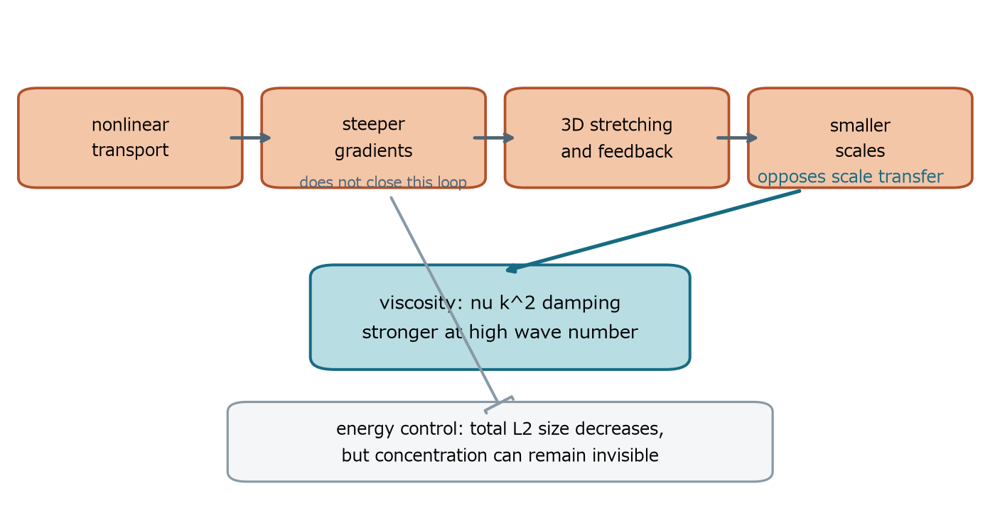

## 第IX部　Navier-Stokes正則性問題

何が問われ、どの危険シナリオがあり、なぜ標準評価で終わらないのか

### 26　問題の核心

> **この章で知りたいこと**
>
> 滑らかな初期値から始めた三次元解は、有限時間で特異になるのか。それとも永遠に滑らかか。

最初に二つの問いを分ける。研究上中心的な外力なし大域正則性問題と、Clayの公式懸賞問題の四選択肢は重なるが同一文ではない。ClayではA/Bが外力なしの全データ大域正則性、C/Dが許容された滑らかな外力と初期値によるbreakdown例の構成である。

| 型 | 量化と外力 | 成立すれば何が決まるか |
|---|---|---|
| A/B型 | 外力0。任意の許容滑らかな発散ゼロ初期値 | 全空間または周期空間で大域滑らか解が存在 |
| C/D型 | 滑らかな初期値と滑らかな外力を一つ構成してよい | 公式条件を満たす大域滑らか解が存在しない例 |

以下でまず学ぶ歴史的な大域正則性問題は、三次元非圧縮Navier-Stokes方程式について、滑らかな発散ゼロ初期値と外力0から出発した解が、任意の有限時間で滑らかに存在し続けるかというA/B側の問いである。

$$
\partial_t\boldsymbol{u}+(\boldsymbol{u}\cdot\nabla)\boldsymbol{u}=-\nabla p+\nu\Delta\boldsymbol{u}+\boldsymbol{f},\qquad \nabla\cdot\boldsymbol{u}=0
$$

危険なのは速度値だけではない。速度勾配・渦度・高階微分が有限時間で制御不能になれば、古典解を延長できない。弱解が残っても、それだけでは滑らかな解の継続を意味しない。

> **2026年9月27日時点の注意**
>
> 9月8日に公表された成果は、滑らかな外力を用いるC/D型breakdownを主張する。Clayは9月11日に apparently been settled と述べたが、公式問題ページはなお Active と表示し、評価・功績認定は意図的に時間をかけるとしている。したがって『公式問題への解決主張』『Clayの審査』『外力なしA/Bの理解』を分ける。

#### 正則性と乱流を混同しない

数学的特異点は、選んだ解概念で微分可能性や有界性が失われることを指す。物理的乱流は有限粘性・有限分解能の複雑な多尺度運動であり、数学的blow-upと同義ではない。乱流が観察されることは特異点の証明ではない。

### 27　危険な因果連鎖

> **この章で知りたいこと**
>
> 非線形集中と粘性散逸は、どの段階で競争するのか。

*図20　危険な自己強化ループと、それに対抗する粘性。総エネルギーの有界性だけではループを止めきれない。*

非線形移流は速度場を再配置し、勾配を急峻化し得る。三次元では渦伸長が渦度を増幅し得る。小スケール化すると速度勾配が大きくなり、strainがさらに強まる可能性がある。一方、粘性は波数kに対してνk²の強さで高波数を消す。

$$
\text{nonlinear concentration}\quad\text{versus}\quad\nu\Delta\boldsymbol{u}\ \text{dissipation}
$$

粘性は小スケールほど強いため、単純に非線形項が勝つとは言えない。難しさは、任意に大きい滑らかな初期値について、集中が粘性より先に無限段階へ進むことを排除できるか、あるいは実現できるかにある。

乱流heuristicでは散逸率を仮定してKolmogorov長さを見積もるが、それは統計的な模型であり、任意の滑らかな解に対する厳密な正則性証明ではない。本章の因果図は証明の代用品ではなく、どの矢印を評価で閉じる必要があるかを示す地図である。

> **Burgersとの違い**
>
> 粘性BurgersはCole-Hopf変換で熱方程式へ帰着できる。三次元Navier-Stokesでは、渦度から速度勾配を復元する非局所演算と幾何学的方向配置が絡み、同じ一変数の閉じた計算にはならない。

### 28　なぜエネルギーでは足りないか

> **この章で知りたいこと**
>
> エネルギーが減るなら、なぜ特異点を排除できないのか。

エネルギー等式はL²ノルムを全時間で制御し、時間積分した速度勾配も制御する。これは大域弱解の構成に決定的である。しかし三次元スケール変換では、細く激しい構造ほどL²が小さく見える。これは第23章で導いた『エネルギーL²はsupercritical』という分類の具体的な帰結である。

$$
\|\boldsymbol{u}_{\lambda}\|_2^2=\lambda^{-1}\|\boldsymbol{u}\|_2^2,\qquad \|\nabla\boldsymbol{u}_{\lambda}\|_2^2=\lambda\|\nabla\boldsymbol{u}\|_2^2
$$

例えばλ=100なら、速度振幅は100倍、長さは1/100、エネルギーは1/100だが、勾配L²の二乗は100倍になる。したがってエネルギー有界性と勾配有界性は別問題である。

#### 時空間平均も瞬間集中を許し得る

エネルギー散逸は時間積分された勾配二乗を制御する。非常に短い時間区間に非常に大きい勾配が集中する可能性を、積分値だけで直ちに排除できない。最小例として、幅ε、高さεのマイナス1/2乗の時間パルスfεを考える。

$$
\max_t f_\varepsilon(t)=\varepsilon^{-1/2}\longrightarrow\infty,\qquad \int f_\varepsilon(t)^2dt\sim\varepsilon\cdot\varepsilon^{-1}=1
$$

積分は一様に有限でも瞬間最大値は発散できる。NSのenergy inequalityが実際にこのパルスを生むと言っているのではない。積分制御だけでは、この型の時間集中を論理的に排除できないという意味である。空間集中と時間集中の両方を自然スケールで測る必要がある。

$$
\int_0^T\|\nabla\boldsymbol{u}(t)\|_2^2dt\leq\frac{\|\boldsymbol{u}_0\|_2^2}{2\nu}
$$

### 29　なぜ高階評価でも終わらないか

> **この章で知りたいこと**
>
> より強いノルムを評価したとき、どこで未知量が再び現れるのか。

第24章の計算は、勾配エネルギーを抑えるために二階微分を使い、最後に比較ODEへ落とした。しかし右辺がZ³となるため、初期値が小さい場合や短時間には使えても、任意の大きい初期値に対する全時間上界を与えない。

$$
\frac{dZ}{dt}\leq C\nu^{-3}Z^3
$$

別の経路では、渦度方程式から次の評価が現れる。

$$
\frac{1}{2}\frac{d}{dt}\|\boldsymbol{\omega}\|_2^2+\nu\|\nabla\boldsymbol{\omega}\|_2^2\leq\|\nabla\boldsymbol{u}\|_{\infty}\|\boldsymbol{\omega}\|_2^2
$$

Gronwall不等式を使うには速度勾配最大値の時間積分を知る必要がある。しかしそれは制御したい正則性と同程度か、より強い量である。推定が自分の前提を生み出せない。これが解析的な壁である。

> **論理を逆転しない**
>
> 上からの評価が有限時間発散を許すことは、実際の解が発散する証明ではない。同様に数値計算で大きな渦度が見えることも、無限大への発散証明ではない。

#### なぜ有限格子はblow-upを直接見られないか

格子幅をΔxとすると、表現できる最大波数は概ねkmax=O(1/Δx)である。真の解が長さℓ(t)の構造を作るなら必要波数はk(t)≈1/ℓ(t)であり、ℓ(t)がΔxより十分小さくなった時点で計算はその構造を解像できない。

$$
\Delta x\downarrow\quad\Longrightarrow\quad k_{\max}\uparrow,\qquad \ell(t)\downarrow0\quad\Longrightarrow\quad k(t)\sim\ell(t)^{-1}\uparrow\infty
$$

したがって格子数Nを増やし、時間刻みも減らし、同じ物理時間までuNとωNが収束するかを調べる必要がある。spectral tailがcutoff付近へ堆積していないか、aliasing、数値粘性、energy/enstrophy収支も確認する。Nを変えるたびに最大渦度の増え方が変わるなら、まだ連続体極限を捉えていない可能性が高い。

これらを通過しても得られるのは強い数値的証拠である。数学的blow-up証明には、有限離散系ではなく連続PDEに対し、有限時刻に正則性規準が必ず破れることを示す必要がある。

### 30　現在までに確立している枠組み

> **この章で知りたいこと**
>
> 局所解・小データ解・弱解・部分正則性は、それぞれ何を保証するか。

| 結果・setting | 仮定とscale | 結論 / 残る穴 |
|---|---|---|
| 3D局所強解、T³またはR³ | 例：発散ゼロH^s, s>5/2 | 短時間は一意で滑らか / 継続量の全時間制御が未確立 |
| 2D、T²またはR² | 任意の滑らかな発散ゼロデータ | 大域正則 / stretchingがない別構造 |
| 3D臨界小データ、R³ | 例：L³やHの1/2乗型ノルムが十分小さい | 大域mild/strong解 / 大きい一般データは含まない |
| Leray–Hopf、T³またはR³ | u0∈L²、有限エネルギー | 大域弱解 / 一般的一意性・正則性は別 |
| Serrin/ESS型規準 | 例：u∈L^q_tL^p_x, 2/q+3/p≤1, p>3、端点L∞_tL³_x | 条件が有限なら正則 / 基本エネルギーからその条件を導けない |
| CKN部分正則性 | 局所energy inequalityを満たすsuitable weak solution | 特異集合の放物型1次元測度0 / 空集合とは言わない |

Caffarelli-Kohn-Nirenberg型の結果は、放物型1次元Hausdorff測度がゼロであることを示す。これは特異点が存在すると言う結果ではなく、存在するとしても時空間内で極めて限られるという結果である。

$$
\mathcal{P}^{1}(\text{singular set})=0
$$

臨界規準の例として、滑らかな解が有限時刻で破綻するならL³ノルムが有界のままではいられない、という型の結果がある。これは臨界量を制御すれば延長できることを示すが、その制御を任意の初期値から導く部分が難しい。

### 31　Clay公式定式化を読む

> **この章で知りたいこと**
>
> 全空間版・周期版・外力・有限エネルギー・A/B/C/Dはどう区別されるか。

Feffermanによる公式記述は、三次元全空間と三次元周期空間について、存在・滑らかさまたは破綻を示す四つの選択肢を与える。ここでは教育的に条件を要約し、原文の番号と区別を保つ。

| 選択肢 | 領域 | 主張 |
|---|---|---|
| A | R³ | 外力ゼロ。任意の滑らかな発散ゼロ・急減衰初期値から、滑らかで有限エネルギーの大域解が存在 |
| B | R³/Z³ | 外力ゼロ。任意の滑らかな周期的発散ゼロ初期値から、滑らかな周期的大域解が存在 |
| C | R³ | 条件を満たす滑らかな初期値と滑らかな外力があり、要求された大域滑らか解が存在しない |
| D | R³/Z³ | 条件を満たす滑らかな周期初期値と滑らかな周期外力があり、要求された大域滑らか解が存在しない |

CとDには滑らかな外力が許される点がA/Bと異なる。『外力なしの任意データがblow-upする』だけが反証の形ではない。公式問題文の正確な条件を読む必要がある。

### 32　2026年9月の状況をどう記述するか

> **この章で知りたいこと**
>
> 『解決した』『未解決』『審査中』をどう区別するか。

2026年9月8日、OpenAIは内部のmulti-agent systemが、滑らかな外力を伴う三次元非圧縮Navier-Stokesについて有限時間blow-upを構成し、CとDを満たすとする解析的証明とLean形式化を公表した。これは公表主体自身の主張であり、教材が独立に証明を検証したという意味ではない。

9月11日のClay公式声明は『apparently been settled』と述べ、同時に証明内容と功績帰属の評価は意図的に急がないと明記した。9月27日に確認した公式問題ページのclassificationはなおActiveである。OpenAIはMillennium Prizeを請求しないとしている。並行研究やpriorityについては各当事者の主張があり、本書は裁定せず、帰属を明示して記述する。

したがって本書では、20世紀から続く古典的正則性問題の数学構造を過去形にせず解説しつつ、現在の外部状態を次のように区別する。

| 層 | 本書の表現 |
|---|---|
| 歴史的問題 | 何を証明・反証する必要があったかを公式定式化どおり説明 |
| 公表された主張 | C/D型blow-upを主張する成果が2026年9月に公表 |
| Clayの反応 | 問題はapparently settledと発表 |
| 形式検証 | OpenAIはLean形式化を公表。これはClayの賞認定と同義ではない |
| 認定状態 | Clay公式問題ページは2026年9月27日時点でActive。審査・功績認定は継続 |
| 外力なしA/B | C/D主張の成否と論理的に分け、一般大データの構造理解を継続 |
| 教育的価値 | 解決状況にかかわらず、エネルギー・臨界性・渦伸長・弱解の構造は基礎として残る |

> **日付依存の記述**
>
> この章の状況記述は2026年9月27日時点。Clay公式ページ・公式声明・OpenAI公式発表を優先した。将来の審査、公式認定、訂正により更新が必要になる。
