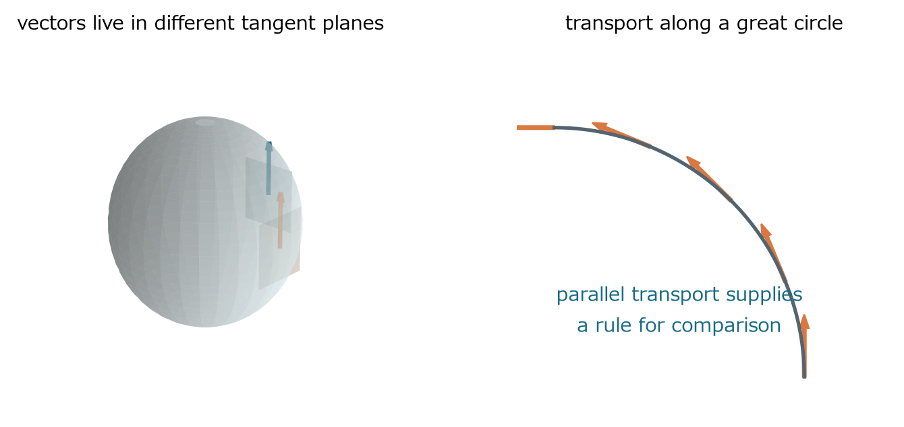
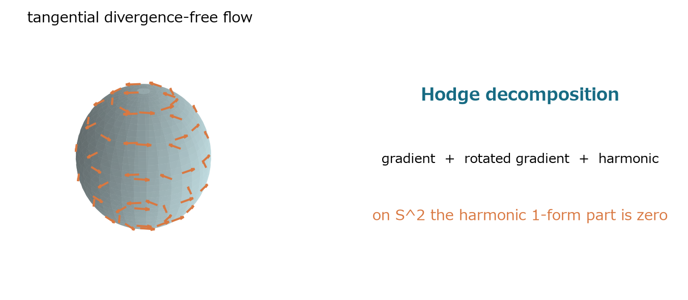
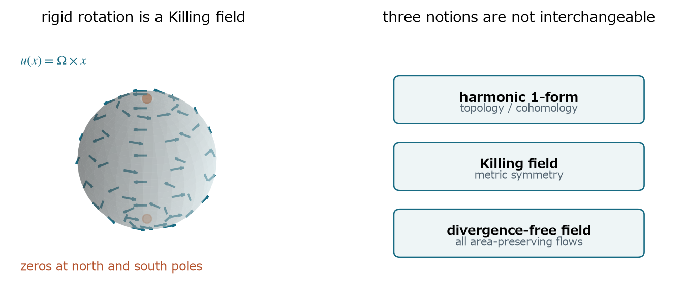
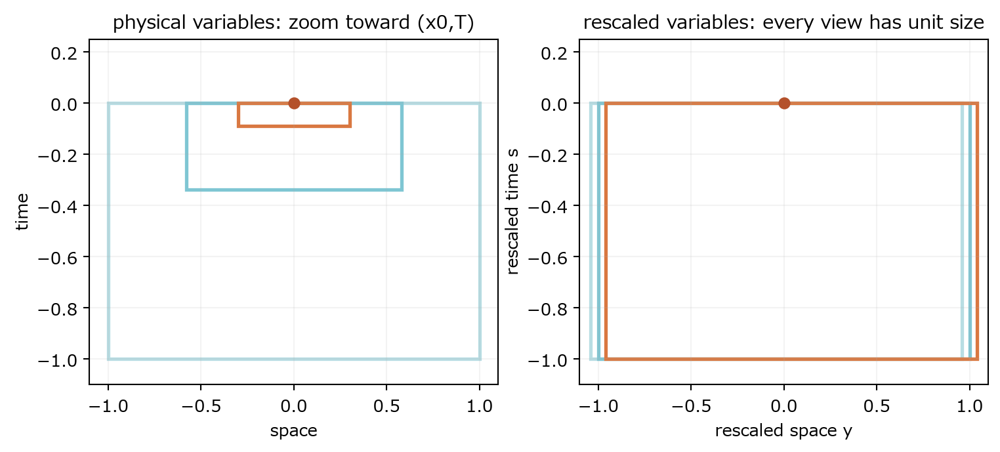
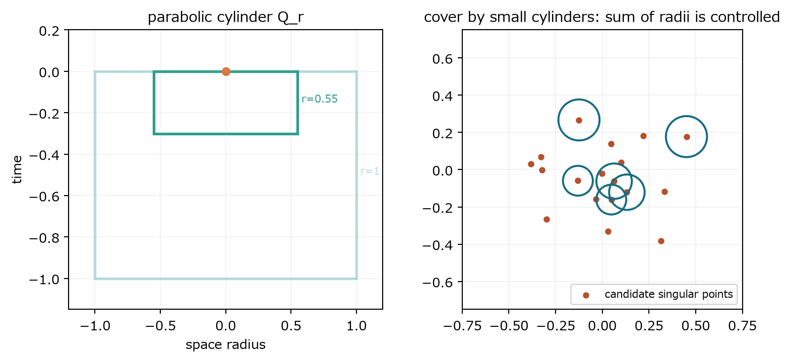

本編の因果関係を壊さず、幾何・自己相似・部分正則性へ進む

### 33　球面S²上のNavier-Stokes方程式

> **この章で知りたいこと**
>
> 曲率とトポロジーは方程式と許される流れをどう変えるか。二次元性は正則性を解決するか。

第19章では平面・周期面の二次元流を扱った。球面でも空間次元は2だが、速度ベクトルを別の点へそのまま平行移動できない。したがって方程式の難しさ以前に、微分・発散・Laplacianを曲面に沿って作り直す必要がある。

*図21　球面上の速度は点ごとに異なる接平面に属する。異なる点のベクトルを比較するには、平行移動という規則が必要になる。*

#### 接空間：速度が存在できる方向

単位球面をS²={x∈R³:|x|=1}とする。点xで球面に接するベクトルvは半径xと直交する。したがって速度は固定したR²ではなく、点に依存する接空間TxS²に属する。

$$
T_xS^2=\{\boldsymbol{v}\in\mathbb{R}^3:\boldsymbol{x}\cdot\boldsymbol{v}=0\},\qquad \boldsymbol{u}(x,t)\in T_xS^2
$$

平面ではu(x+h)-u(x)を同じベクトル空間の差として取れる。球面ではu(x+h)∈T_{x+h}S²、u(x)∈TxS²で、住んでいる平面が異なる。このまま引くと、曲面に沿う本質的な変化と、接平面自体が傾いた効果が混ざる。

#### 共変微分：比較する規則を微分へ組み込む

球面上の曲線γ(s)に沿うベクトル場Y(s)を比較するには、一方を他方の接空間へ平行移動する。平行移動は、曲面内で余計に回さないという規則である。その比較の瞬間変化率が共変微分である。球面をR³へ埋め込んだ表示では、通常微分の接平面成分を取ればよい。

$$
P_x=I-\boldsymbol{x}\otimes\boldsymbol{x},\qquad \nabla_XY=P_x(DY[X])
$$

DY[X]には接方向成分と法線方向成分がある。法線成分は『球面が曲がっているため接平面が回った』分であり、球面上の加速度としては除く。残った接成分が∇XYである。異なる方向への共変微分は一般に可換せず、そのずれを測るのが曲率である。

#### 物質微分と面積保存

流体粒子の軌道γ(t)がγ'=u(γ(t),t)を満たすとき、粒子に沿って速度を比較した加速度は∂t u+∇u uである。平面の(u·∇)uを記号置換したのではなく、異なる接空間にある速度を平行移動して比較した結果である。

$$
\frac{D\boldsymbol{u}}{Dt}=\partial_t\boldsymbol{u}+\nabla_{\boldsymbol{u}}\boldsymbol{u}
$$

面発散divS²uは、流れ写像が微小面積を変える瞬間率である。divS²u=0なら三次元体積ではなく、球面上の二次元面積要素が保存される。

$$
\frac{d}{dt}\log J_{S^2}(t,x)=\operatorname{div}_{S^2}\boldsymbol{u}(\Phi_t(x),t)
$$

#### なぜベクトルLaplacianが複数あるのか

スカラーなら二階微分を縮約してLaplace-Beltrami作用素を作れる。ベクトル場では、成分を微分するたび基底も変化し、二階共変微分と外微分から作る作用素が曲率項だけずれる。どちらも自然なので、単にΔuと書くと規約が隠れる。

本章では符号を固定する。roughまたはBochner Laplacianを非負作用素∇*∇、1-formに作用するHodge Laplacianを非負作用素ΔH=dδ+δdとする。dはスカラーからgradient型1-formを作る外微分、δはそのL²随伴で、1-formではdivergenceに対応する。

$$
\Delta_H=d\delta+\delta d,\qquad \Delta_H=\nabla^*\nabla+\operatorname{Ric}
$$

これがWeitzenböck公式である。単位S²ではRicは恒等写像に一致するので、HodgeとBochnerは同じではなく、曲率由来の0階項だけずれる。曲率項が現れる直感は、二つの方向へ順に共変微分する操作が可換しないことにある。符号規約を逆に取る文献では式全体の符号も変わるので、作用素名だけで比較してはいけない。

#### この章で採るNavier-Stokes方程式

接ベクトル場を計量で1-formへ同一視し、発散ゼロ場へのLeray射影をPとする。粘性はStokes作用素A=PΔHで表し、左辺に+νAuを置く。すると内積<u,Au>は非負で、平面の-νΔuと同じ散逸の役割を持つ。

$$
\partial_t\boldsymbol{u}+\nabla_{\boldsymbol{u}}\boldsymbol{u}+\operatorname{grad}_{S^2}p+\nu A\boldsymbol{u}=\boldsymbol{f},\qquad \operatorname{div}_{S^2}\boldsymbol{u}=0
$$

回転球面ならCoriolis項を加える。これは粘性作用素の選択とは別の物理効果である。

$$
\partial_t\boldsymbol{u}+\nabla_{\boldsymbol{u}}\boldsymbol{u}+2\Omega\cos\theta\,\boldsymbol{n}\times\boldsymbol{u}+\operatorname{grad}_{S^2}p+\nu A\boldsymbol{u}=\boldsymbol{f}
$$

*図22　Hodge分解は平面のHelmholtz分解を閉曲面へ拡張する。S²では調和1-form成分が消えるが、回転勾配成分は豊富に残る。*

#### Hodge分解をHelmholtz分解から理解する

平面ではベクトル場をgradient成分とdivergence-free成分へ分ける。閉じた向き付け可能曲面では、対応する1-form αをexact、coexact、harmonicの三成分へ直交分解する。exactはdφ、coexactはδβ、harmonicはd h=0かつδh=0を同時に満たす成分である。

$$
\alpha=d\phi+\delta\beta+h,\qquad dh=0,\quad\delta h=0
$$

非圧縮条件δα=0は、定数を除くgradient成分を消す。残るcoexact成分は流れ関数ψからn×gradS²ψと書ける。harmonic成分の次元は第一Betti数b1、すなわち一次コホモロジーの次元に等しい。これは『閉じているが大域的gradientではない循環方向が何本あるか』を数える量と考えればよい。

$$
H^1(S^2)=0,\qquad b_1(S^2)=0,\qquad \boldsymbol{u}=\boldsymbol{n}\times\operatorname{grad}_{S^2}\psi
$$

球面にはトーラスの取っ手のような穴がないためb1=0で、非零harmonic 1-formはない。しかしcoexactな発散ゼロ場まで消えるわけではない。

*図23　剛体回転u=Ω×xは非自明なKilling場で、極に零点を持つ。harmonic 1-formがないこと、流れがないこと、毛玉定理は別の主張である。*

#### 剛体回転・Killing場・毛玉定理

一定ベクトルΩに対しu(x)=Ω×xと置く。x·u=0なので接ベクトル場であり、面積を保存する。これは球面の等長回転を生成するKilling場で、対称な変形速度tensorがゼロである。

$$
\boldsymbol{u}(x)=\boldsymbol{\Omega}\times\boldsymbol{x},\qquad \operatorname{Def}\boldsymbol{u}=\frac{1}{2}(\nabla\boldsymbol{u}+\nabla\boldsymbol{u}^{T})=0
$$

Killing場は計量対称性から来る。harmonic 1-formはcohomologyから来る。したがってb1(S²)=0でもKilling場は存在できる。また毛玉定理は『連続接ベクトル場が全点で非零ではあり得ない』と言うだけで、非零の場そのものを禁止しない。剛体回転は北極と南極でゼロになり、定理と両立する。

#### 正則性はなぜ解決するのか

S²はコンパクトな二次元多様体であり、三次元のvortex stretchingに対応する項がない。渦度方程式の最大値原理、楕円復元、粘性平滑化という第19章の骨格が、曲率に適合した作用素とSobolev評価を用いて働く。そのため粘性非圧縮Navier-Stokesには大域正則性がある。主因は二次元性であり、b1=0だけで正則性が出るわけではない。コンパクト性と離散スペクトルは長時間力学の解析を助ける。

> **よくある誤解**
>
> Hodge LaplacianとBochner Laplacianは同じではない。b1(S²)=0は全ての発散ゼロ場が0という意味ではない。毛玉定理は流れを禁止しない。S²上の二次元大域正則性は、厚みを持つ一般三次元球殻を解決しない。

> **確認問題**
>
> S²でH¹(S²)=0なのに剛体回転流が存在するのはなぜか。

#### 解答と意味

H¹(S²)=0が消すのはharmonic 1-form成分である。剛体回転は球面の等長対称性を生成するKilling場であり、coexactな発散ゼロ場として表されるため矛盾しない。

位相的制約、計量対称性、一般の非圧縮場を同じ概念として扱わないことが重要である。

### 34　自己相似性と特異点解析

> **この章で知りたいこと**
>
> 方程式がスケール不変なら、解も自己相似になるのか。blow-up候補をどう縮尺化するか。

第13章で見たuλ(x,t)=λu(λx,λ²t)は、解から別の解を作る方程式の対称性である。個々の解が縮尺を変えても同じ形を保つことは追加条件であり、self-similarityと呼ぶ。対称な方程式の全ての解が対称とは限らない。円形の方程式に非円形の解があり得るのと同じである。

#### 有限時刻特異点を仮定して拡大鏡を作る

時刻T、位置x0で特異性が形成されると仮定する。T-tが小さくなるほど観察領域を縮め、その領域を固定サイズへ拡大して比較したい。NSでは空間長さrと時間長さr²が対応するため、r=√(T-t)が自然である。速度はscalingで1/rの大きさを持つ。

$$
\tau=T-t,\qquad \boldsymbol{y}=\frac{x-x_0}{\sqrt{\tau}},\qquad \boldsymbol{u}(x,t)=\tau^{-1/2}\boldsymbol{U}(\boldsymbol{y}),\qquad p(x,t)=\tau^{-1}P(\boldsymbol{y})
$$

*図24　元の時空間では特異点へ向かう円柱が縮む。rescaling後は全てを同じ大きさで観察でき、縮尺ごとの形を比較できる。*

#### profile方程式を一項ずつ導く

yはtにも依存する。τt=-1なので、連鎖律からyt=(1/2)τのマイナス1乗yとなる。これを使って時間微分を計算する。

$$
\partial_t\boldsymbol{y}=\frac{1}{2\tau}\boldsymbol{y}
$$

$$
\partial_t\boldsymbol{u}=\tau^{-3/2}\left(\frac{1}{2}\boldsymbol{U}+\frac{1}{2}(\boldsymbol{y}\cdot\nabla)\boldsymbol{U}\right)
$$

空間微分一回はτのマイナス1/2乗を一つ生む。したがって移流・粘性・圧力勾配は全てτのマイナス3/2乗で揃う。これが振幅τのマイナス1/2乗を選ぶ理由である。

$$
\nabla_x\boldsymbol{u}=\tau^{-1}\nabla_y\boldsymbol{U},\qquad (\boldsymbol{u}\cdot\nabla_x)\boldsymbol{u}=\tau^{-3/2}(\boldsymbol{U}\cdot\nabla_y)\boldsymbol{U}
$$

$$
\Delta_x\boldsymbol{u}=\tau^{-3/2}\Delta_y\boldsymbol{U},\qquad \nabla_xp=\tau^{-3/2}\nabla_yP
$$

共通因子τのマイナス3/2乗を消すと、定常profile方程式が得られる。

$$
\frac{1}{2}\boldsymbol{U}+\frac{1}{2}(\boldsymbol{y}\cdot\nabla)\boldsymbol{U}+(\boldsymbol{U}\cdot\nabla)\boldsymbol{U}=-\nabla P+\nu\Delta\boldsymbol{U},\qquad \nabla\cdot\boldsymbol{U}=0
$$

非自明で適切に減衰するUが存在すれば、この特別な自己相似blow-up候補になる。逆にそのようなUが存在しないことを示せば、この型だけは排除できる。

#### 一般のblow-up rescalingとancient solution

自己相似形を最初から仮定しない方法では、r_n→0を選び、特異点(x0,T)の近傍を拡大して解列を作る。

$$
\boldsymbol{u}^{(n)}(y,s)=r_n\boldsymbol{u}(x_0+r_ny,T+r_n^2s),\qquad p^{(n)}(y,s)=r_n^2p(x_0+r_ny,T+r_n^2s)
$$

元の解が0<t<Tで定義されるなら、rescaled timeは-T/r_n²<s<0を走る。r_n→0で左端はマイナス無限大へ行く。したがって極限が存在すれば、過去の全時間(-∞,0]で定義されたancient solutionになる。『古代』とは未来まで永遠という意味ではなく、過去へ無限に延びる解という意味である。

$$
-\frac{T}{r_n^2}<s<0\qquad\Longrightarrow\qquad (-\infty,0]\ \text{in the limit}
$$

#### compactnessは何をしているのか

拡大した解列を作るだけでは極限は得られない。臨界ノルムや局所energyがnに依らず有界なら、関数列の一部を捨てた部分列が弱収束するというcompactnessを使える。弱収束は積をそのまま通せないため、非線形項u(n)⊗u(n)を極限へ渡すには、局所的な強収束を得る追加評価が必要になる。時間微分の弱い制御と空間勾配の制御から強収束を引き出すのが典型的な構造である。

| 収束 | 何が言えるか | 非線形項との関係 |
|---|---|---|
| 弱収束 | 線形汎関数に対して極限を取れる | 積の極限は自動ではない |
| 強収束 | ノルムで差が0へ近づく | 局所Lp強収束が積の通過を助ける |
| 部分列 | 全列でなくても収束する列を抽出 | blow-up仮定から一つの極限対象を得る |

方程式、局所energy inequality、規格化による非自明性が極限へ受け継がれれば、blow-upの痕跡を持つlimit solutionが得られる。極限がゼロなら矛盾を作れないため、正規化は『危険量が1』などの形で非自明性を固定する。

#### rigidityで矛盾を作る

Liouville型定理は、指定された有界性・減衰・古代性を満たす解は0しかない、というrigidity statementである。一意継続はある領域での消失がより広い領域へ伝わることを、backward uniquenessは終時刻の消失から過去の消失を導くことを狙う。必要な仮定は定理ごとに異なり、名前だけで適用できない。

$$
\text{blow-up}\Rightarrow\text{nonzero ancient limit},\qquad \text{rigidity}\Rightarrow\text{the same limit is zero}
$$

両方が成立すれば矛盾し、仮定したblow-up型を排除できる。この論法の難所は、一様評価、非線形項を通すcompactness、極限の非自明性、rigidity定理の仮定を同時に満たすことである。

> **排除できる範囲**
>
> 方程式がscale invariantでも解がself-similarとは限らない。定常profileを排除しても、漸近的自己相似、Type II、複数尺度が絡む非自己相似blow-upは残り得る。一つの候補型の排除と全ての特異性排除を同一視しない。

> **確認問題**
>
> NSがscaling invariantであることだけでは、なぜself-similar blow-upを意味しないか。

#### 解答と意味

scaling symmetryは任意の解から縮尺の異なる別の解を作る性質である。self-similarityは一つの解がその変換後の自分と一致する追加条件なので、方程式の対称性だけからは従わない。

対称性は候補の形を教えるが、実際の解がその候補を選ぶかは別の動力学的問題である。

### 35　部分正則性と特異集合

> **この章で知りたいこと**
>
> 弱解が完全に滑らかと証明できなくても、特異点の集合をどこまで小さくできるか。

第25章でLeray–Hopf弱解の大域存在を得ても、全ての点で滑らかとは限らない。そこで問いを弱める。滑らかでない点があるとして、それは時空間のどれほど大きな集合を占め得るか。これがpartial regularityの問いである。

#### suitable weak solutionと局所energy inequality

global energy inequalityは空間全体のエネルギーしか見ない。特異点候補の近くを調べるには、非負の滑らかなcutoff φを掛け、局所エネルギーの流入・流出を追う。Leray–Hopf型の弱解のうち、次の局所energy inequalityも満たすものをsuitable weak solutionと呼ぶ。

$$
\frac{1}{2}\int |\boldsymbol{u}(t)|^2\phi(t)\,dx+\nu\int_0^t\!\int |\nabla\boldsymbol{u}|^2\phi\,dxds
$$

$$
\leq\frac{1}{2}\int |\boldsymbol{u}_0|^2\phi(0)\,dx+\int_0^t\!\int\left[\frac{|\boldsymbol{u}|^2}{2}(\partial_s\phi+\nu\Delta\phi)+\left(\frac{|\boldsymbol{u}|^2}{2}+p\right)\boldsymbol{u}\cdot\nabla\phi\right]dxds
$$

左辺はcutoff内の運動エネルギーと粘性散逸である。右辺のφtとΔφは観測窓の時間変化と粘性が境界層を横切る効果、u·∇φは移流によるエネルギー流束、p u·∇φは圧力仕事を表す。φを滑らかにするのは、鋭い特性関数では境界に分布的微分が生じ、弱解との部分積分を安定に行えないからである。

*図25　左：空間半径rに時間幅r²を組み合わせる放物型円柱。右：各特異点が最低量の集中を必要とするなら、小円柱による被覆の総半径が制約される。*

#### parabolic cylinderとscale invariant量

$$
Q_r(z_0)=B_r(x_0)\times(t_0-r^2,t_0),\qquad z_0=(x_0,t_0)
$$

時間幅がrではなくr²なのは、NS scalingでx→rxに対しt→r²tだからである。空間と時間を同じ長さとして測ると、方程式の自然な拡大率を壊してしまう。

一例として速度三乗と圧力の3/2乗を測る。圧力は空間定数を足しても方程式が変わらないため、各時刻の球平均(p)Brを引く。

$$
E(r)=\frac{1}{r^2}\int_{Q_r(z_0)}\left(|\boldsymbol{u}|^3+|p-(p)_{B_r}|^{3/2}\right)\,dxdt
$$

縮尺rで典型的にuは1/r、pは1/r²、dxdtはr³・r²=r⁵で変化する。したがって|u|³と|p|3/2の積分はどちらもr²となり、前の1/r²で打ち消される。E(r)は拡大しても同じ値を返し、特異点候補を縮尺に依存せず比較できる。

$$
r^{-2}\times r^5\times r^{-3}=1,\qquad r^{-2}\times r^5\times (r^{-2})^{3/2}=1
$$

#### ε-regularity：小さければ内側は滑らか

ε-regularity定理の典型形は、ある普遍的なε*>0があり、ある円柱でE(r)<ε*なら、より小さい同心円柱でuが有界になり、方程式の放物型正則化により滑らかになる、というものである。厳密な定理では量の選択や圧力条件に複数の版がある。

smallnessが効く理由は、rescaling後の単位円柱で非線形項を小さな摂動として扱え、局所energyと圧力評価を反復すると縮小円柱で量がさらに小さくなるからである。energy concentrationがないことがiterationを閉じる。単に値が小さい一点を見ているのではなく、scale invariantな時空間平均が小さいことが重要である。

#### regular pointとsingular point

点z0がregularとは、その近傍でuが本質的に有界になり、さらに滑らかになることをいう。ε-regularityの対偶により、singular pointではどれだけrを小さくしても、選んだgood quantityがε*以上に留まる。つまり特異点は全ての小尺度で最低限の集中コストを払わなければならない。

$$
z_0\in\mathcal{S}\quad\Longrightarrow\quad E(r)\geq\varepsilon_*\ \text{for all sufficiently small }r
$$

#### covering argumentとHausdorff測度

各singular pointの周りに、集中下限を持つ小さな放物型円柱を置く。重なりを制御する被覆補題で本質的に互いに離れた部分族を選ぶ。各円柱は有限な全散逸・局所積分から一定量を消費するので、半径の和を無制限に大きくできない。さらに尺度を小さく選ぶことで、その和を任意に小さくできる。これが特異集合の放物型1次元Hausdorff測度ゼロへ至る骨格である。

Hausdorff測度は、集合を半径riの小球で覆い、Σri^dの下限を見ることでd次元的な大きさを測る。NSでは距離をmax(|x-y|,√|t-s|)のように測る放物型metricを使うため、時間幅r²の円柱が自然な球になる。

$$
\mathcal{P}^{1}(\mathcal{S})=0
$$

#### measure zeroとempty setは違う

実数直線の一点集合{0}は長さ0だが空集合ではない。Cantor集合も通常の長さは0だが無数の点を持つ。同様に、特異集合の放物型1次元測度が0でも、特異点が一つ存在する可能性までは排除していない。

> **Millennium問題との距離**
>
> partial regularityは、特異点が存在するとしても非常に小さい集合にしか存在できないことを示す。full regularityが要求するのはsingular setが空であること。measure zeroをemptyへ強める最後の一歩が残る。

> **確認問題**
>
> 特異集合のHausdorff測度が0でも、なぜ正則性問題は終わらないか。

#### 解答と意味

測度0は集合の大きさに強い制限を与えるが、集合が空であることを意味しない。一点だけの特異点でも大域滑らか性は失敗する。

partial regularityは『悪い点の集合は小さい』、global regularityは『悪い点が一つもない』という異なる結論である。
