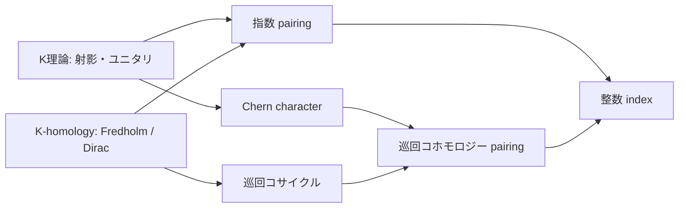

> **Core** — K理論、巡回コホモロジー、Fredholm作用素を統合する。

## 13.1 三本の道を整理する

ここまでに、別々に見える三種類の不変量を作った。

1. **位相・加群側**：射影やユニタリから $K_0(A),K_1(A)$ を作る。
2. **微分・コホモロジー側**：巡回コサイクルが非可換な積分を表す。
3. **解析側**：Fredholm作用素の核と余核から指数を作る。

非可換指数定理の基本構図は、K理論類とK-homology類をpairingして整数を得、その同じ整数を巡回コホモロジーへのChern characterで計算することである。

## 13.2 偶数pairing：射影でFredholm作用素を圧縮する

偶数Fredholm moduleは概略、$A$ の表現を持つ次数付きHilbert空間 $H=H^+\oplus H^-$ と奇作用素

$$
F=\begin{pmatrix}0&F^-\\F^+&0\end{pmatrix}

$$

で、$F^2-1$、$F-F^*$、$[F,a]$ がコンパクトになるものからなる。射影 $p\in M_n(A)$ を表現で $H^{\oplus n}$ 上に作用させると、圧縮

$$
pF^+p:pH^{+\oplus n}\to pH^{-\oplus n}

$$

はFredholmであり、

$$
\langle[p],[F]\rangle=\operatorname{ind}(pF^+p)

$$

を定める。この整数は射影の安定同値とホモトピーで変わらないため、$K_0(A)$ 上の準同型になる。

幾何的には、Dirac作用素をベクトル束 $E$ でtwistした作用素 $D_E$ の指数がこの形に当たる。射影 $p$ はSerre–Swanにより $E$ を表し、圧縮は「Dirac作用素をその束の切断に作用させる」ことを代数的に表す。

## 13.3 奇数pairing：ユニタリとToeplitz型圧縮

奇Fredholm moduleでは次数分けを使わず、自己共役な $F$ を使い、$F^2-1$ と $[F,a]$ がコンパクトであることを要求する。このままでは $(1+F)/2$ はmodulo compactでしか射影でないので、まず正規化する。

$F^2-1$ がコンパクトなら、Calkin環で $q(F)^2=1$ であり、$F$ のessential spectrumは $\{-1,1\}$ に含まれる。0近傍にある孤立固有値の有限次元部分を動かし、連続関数計算で

$$
F_0=\operatorname{sign}(F)
$$

を作れば、$F_0=F_0^*$、$F_0^2=1$、$F_0-F$ はコンパクトとなる。$F$ をこのcompact perturbation $F_0$ で置き換えてもK-homology類は変わらない。そこで

$$
P=\frac{1+F_0}{2}
$$

は真の直交射影になる。ユニタリ $u\in M_n(A)$ に対して

$$
PuP:PH^{\oplus n}\to PH^{\oplus n}

$$

がFredholmとなる。実際、$[P,u]$ はコンパクトなので、$PuP$ のparametrixは $Pu^*P$ modulo compactである。この指数を

$$
\langle[u],[F]\rangle=\operatorname{ind}(PuP)
$$

と定める。正規化の選択を変えても射影の差はコンパクトであり、第8章のcompact perturbation不変性により指数は変わらない。ユニタリのホモトピーと安定化についても指数は不変なので、これは $K_1(A)$ 上の準同型になる。円周上のHardy射影と $u=f$ を使えば、$PuP$ は第8章のToeplitz作用素 $T_f$ そのものである。

したがってToeplitz指数定理は、$K_1(C(S^1))$ と円周の基本K-homology類のpairingである。

## 13.4 Chern characterは何を翻訳するか

K理論は整数的・非線形な情報を持つ。一方、巡回（コ）ホモロジーは複素ベクトル空間で、微分形式に近く計算しやすい。Chern characterは

$$
\operatorname{ch}:K_*(A)\longrightarrow HP_*(A)

$$

によりK理論類を周期巡回ホモロジーへ送る。Fredholm module側にもChern characterがあり、巡回コホモロジー類を与える。

滑らかな可換多様体では、この写像は古典的Chern characterと整合する。ただし複素係数化すると多くの情報を捉える一方、K理論のtorsionは消える。したがって「巡回コホモロジーがK理論と同じ」という意味ではない。

## 13.5 局所指数公式の位置づけ

Atiyah–Singer定理では解析的指数を特性類の積分として局所的に計算できる。非可換幾何ではConnes–Moscoviciの局所指数公式が、適切な正則性とスペクトル次元条件を満たすスペクトル三つ組について、Fredholm moduleのChern characterをresidue traceなどで表す。

本書では公式の完全な記述と証明を行わない。必要な擬微分作用素計算が本筋を大きく超えるためである。ここでの到達点は、次の対応を正確に読むことである。

$$
\begin{array}{c|c}
\text{古典幾何} & \text{非可換側}\\\hline
\text{ベクトル束 }E & K_0(A)\text{ の射影 }p\\
\text{Dirac作用素 }D & K\text{-homology/Fredholm module}\\
\text{特性類} & \text{巡回Chern character}\\
\int_M & \text{trace/residue型汎関数}\\
\operatorname{ind}D_E & K\text{理論とのpairing}
\end{array}
$$

## 13.6 円周で全経路を計算する

$A=C^\infty(S^1)$、$H=L^2(S^1)$、$D=-i\frac d{d\theta}$ とする。$D$ の非負スペクトルへの射影を $P$ とし、$u\in C^\infty(S^1,U(1))$ をユニタリとする。

1. $[u]\in K_1(C(S^1))\cong\mathbb Z$ は巻き数で分類される。
2. $[D,u]=-iu'$ は有界な乗算作用素である。
3. $PuP$ はFredholmである。
4. $\operatorname{ind}(PuP)=-\operatorname{wind}(u)$。
5. 巻き数は $\operatorname{wind}(u)=\frac1{2\pi i}\int_{S^1}u^{-1}du$ と書ける。

左辺の積分は奇Chern characterとのpairing、Fredholm指数は解析的pairingである。これは「K理論 + 微分形式 + 作用素 = 指数」という全体構図を最小の例で完結させる。

## 13.7 指数定理はなぜ幾何なのか

指数自体は整数一つにすぎない。しかしその不変性は、局所的な解析データが大域的な位相だけで決まることを示す。非可換幾何では、点や座標がなくても

- 射影・ユニタリという位相的類、
- 交換子 $[D,a]$ という微分、
- traceや巡回コサイクルという積分、
- Fredholm指数という整数、

を同じ代数上で組み合わせられる。これが単に非可換環を「空間」と呼ぶだけでは得られない、実質的な幾何構造である。

## 13.8 章末の確認

1. $pF^+p$ の指数が $K_0(A)$ の類だけに依存する理由を述べよ。
2. Toeplitz作用素が奇K理論pairingの例であることを説明せよ。
3. Chern characterがtorsionを見失い得る理由を述べよ。
4. 円周の例でK理論、微分、積分、指数を一つの式列にまとめよ。
