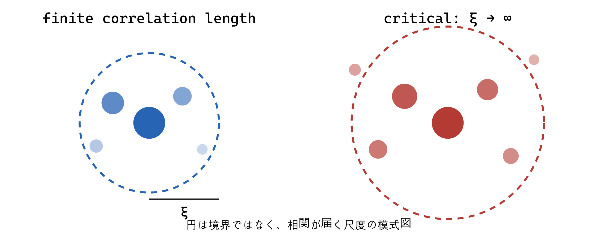

## 1. 二点相関関数が測るもの

$$
G(r)=\langle\phi(x)\phi(x+r)\rangle-
\langle\phi(x)\rangle\langle\phi(x+r)\rangle
$$

の第二項は、平均値が非零なだけで生じる見かけの相関を取り除く。$G(r)>0$ なら、点 $x$ の平均からの上向き変動と、距離 $r$ 離れた点の上向き変動が一緒に起きやすい。これは因果伝播の速度を直接表す時間相関ではなく、平衡分布の空間的統計である。

単一の孤立した massive pole が長距離を支配する等方的な Gaussian 理論、またはそれに連続的につながる相では、大きな $r$ で Ornstein–Zernike 型の漸近形

$$
G(r)\sim \frac{e^{-r/\xi}}{r^{(d-1)/2}}
$$

を取る。連続 spectrum、複数成分、異方性がある場合には前因子や複数の長さが変わりうる。$\xi$ は相関が指数関数的に減衰する長さであり、厳密な定義は模型に応じて exponential correlation length、second-moment correlation length など複数ある。それらは標準的な一尺度 scaling が成り立つ臨界点近傍で同じ指数 $\nu$ を与えるが、有限な非普遍係数は一致しないことがある。異なる定義で得た $\xi$ の振幅比が、同じ普遍性クラス内で普遍量になる場合がある。

## 2. $\xi\to\infty$ は何を意味するか

臨界点近傍の二点関数は、格子間隔 $a$、相関長 $\xi$、観測距離 $r$ の階層

$$
a\ll r,\qquad a\ll \xi
$$

で universal scaling form

$$
G(r,\xi)=\frac1{r^{d-2+\eta}}\Phi_\pm(r/\xi)
$$

をもつと仮定する **[Scaling hypothesis]**。$\phi_\pm(x)$ は $x\ll1$ で有限値へ近づき、$x\gg1$ で指数減衰を含む。格子間隔 $a$ はUV cutoffであり、$r\sim a$ の短距離構造や振幅は非普遍である。臨界極限では $\xi/a\to\infty$ となるため、$a$ による詳細は scaling function の非普遍な正規化や irrelevant 補正へ押し込まれる。

$\xi\to\infty$ から直ちに完全なscale invarianceが定理として出るわけではない。第5部の固定点論法で、粗視化後の作用が固定点へ近づくという力学系的仮定を置くと、固定点で長さの再尺度化が対称性として働く。

$\xi$ の発散は「系のすべての spin が完全に同じ向きになる」ことではない。また有限試料で実際に無限距離が存在するという意味でもない。意味は、熱力学極限で $t\to0$ としたとき、指数減衰を支配する有限の固有長さがなくなることである。有限サイズ $L$ では $\xi$ は事実上 $L$ で頭打ちになり、観測量は $L/\xi$ の関数として有限サイズ scaling を示す。

発散の物理像は、秩序変数の集団的な領域が大小あらゆるスケールに現れることである。局所的な spin flip の振幅が無限になるわけではない。相関する領域の体積が増え、その総和である感受率が大きくなる。

## 3. なぜ特徴的長さがないとべき則か

臨界点で場 $\phi$ の scaling dimension を $\Delta_\phi$ とする。統計的スケール不変性が

$$
\phi(x)\mapsto b^{-\Delta_\phi}\phi(x/b)
$$

を意味するなら、二点関数は

$$
G(br)=b^{-2\Delta_\phi}G(r)
$$

を満たす。座標を基準長 $r_0$ で無次元化し、任意の $b>0$ に対して成立するとする。$b=r/r_0$ と選べば

$$
G(r)=G(r_0)\left(\frac r{r_0}\right)^{-2\Delta_\phi}.
$$

これが連続スケール不変性からべき則が出る最短の導出である。$2\Delta_\phi=d-2+\eta$ と書く。

指数関数 $e^{-r/\xi}$ には $r\sim\xi$ という目盛りがある。拡大 $r\mapsto br$ によって関数の形を定数倍だけで戻せない。対して $r^{-p}$ は $(br)^{-p}=b^{-p}r^{-p}$ なので、形を保つ。

ただし逆は無条件ではない。有限範囲の近似的べき則、重い裾をもつ非臨界分布、離散スケール不変性、保存則が生む hydrodynamic tail などがある。「べき則を見たから臨界固定点」と断定せず、範囲、有限サイズ効果、代替模型を検討する必要がある。

## 4. Fourier 空間の意味

Fourier 変換を

$$
\phi(x)=\int\frac{d^dk}{(2\pi)^d}e^{ik\cdot x}\phi(k)
$$

とする。波数 $|k|$ の mode は波長 $\lambda\sim2\pi/|k|$ の変動を表す。したがって high momentum は short distance、low momentum は long distance に対応する。ただし局在した構造は多数の Fourier mode の重ね合わせなので、一つの mode を一つの粒子や一地点と同一視してはいけない。

Gaussian 近似では

$$
G(k)=\frac1{k^2+\xi^{-2}}
$$

（温度や規格化係数を吸収）である。$k=0$ では $G(0)=\xi^2$。実空間で遠距離相関が伸びるほど、Fourier 空間では $k=0$ 近傍が鋭くなる。臨界点で $\xi^{-1}\to0$ になることは、有効な「質量」がゼロになることに対応する。

## 5. scaling 仮説と熱力学

特異自由エネルギー密度が粗視化倍率 $b$ に対して

$$
f_{\rm s}(t,h)=b^{-d}f_{\rm s}(b^{y_t}t,b^{y_h}h)
$$

と変換すると仮定する。$b^{-d}$ は一辺を $b$ 倍にまとめたとき単位体積当たりの独立な block 数が $b^{-d}$ になることに対応する。$y_t,y_h$ は温度型・磁場型 scaling field の RG 固有値である。

$h=0$ で $b=|t|^{-1/y_t}$ を選ぶと第一引数は $\pm1$ になり、

$$
f_{\rm s}(t,0)\sim |t|^{d/y_t}.
$$

相関長は粗視化で $\xi\mapsto\xi/b$ だから

$$
\xi(t)=b\,\xi(b^{y_t}t)\sim |t|^{-1/y_t},
\qquad \nu=\frac1{y_t}.
$$

さらに $m=-\partial f/\partial h$ より

$$
\beta=\frac{d-y_h}{y_t},\qquad
\gamma=\frac{2y_h-d}{y_t}.
$$

この段階では scaling 仮説を置いただけであり、$y_t,y_h$ の値は分からない。RG は、仮説を固定点近傍の固有値問題へ変え、指数を計算する枠組みを与える。

## 6. hyperscaling の注意

$f_s\sim\xi^{-d}$ を使うと $2-\alpha=d\nu$ が得られる。これは相関体積ごとに有限個の有効自由度があるという hyperscaling 仮説を含む。上部臨界次元より上では dangerously irrelevant な $\phi^4$ coupling のため単純な hyperscaling が破れる。したがって scaling relation をすべて無条件の恒等式として扱ってはいけない。

## 出典案内

相関長、scaling仮説、指数関係、hyperscalingの適用範囲は [Fisher (1998)](https://doi.org/10.1103/RevModPhys.70.653) を参照する。ここでのOrnstein–Zernike形は孤立したmassive poleが支配する場合に限定しており、一般の連続spectrumへの無条件な主張ではない。

## 章末整理

### この章で分かったこと

相関長の発散は有限の減衰長が消えることを意味し、連続スケール不変性は相関関数のべき則を強制する。scaling 仮説は臨界指数を少数の RG 固有値へ還元する。

### よくある誤解

- $\xi=\infty$ は全自由度が同一値という意味ではない。
- scale invariant なら常に conformal invariant とは限らない。
- power law の観測だけで臨界性が証明されたことにはならない。

### 次の疑問

粗視化を実際の格子模型で定義すると、分配関数と Hamiltonian はどう変わるのか。

### その結果、何が説明できるようになったか

指数関数的減衰とべき減衰、有限サイズによる丸め、指数間関係の起源を区別できる。

### まだ説明できていないこと

scaling 仮説を生む具体的変換と固有値の計算法は未説明である。

### 次に自然に出てくる疑問

格子模型の粗視化を確率分布を保つ形でどう定義するか。

