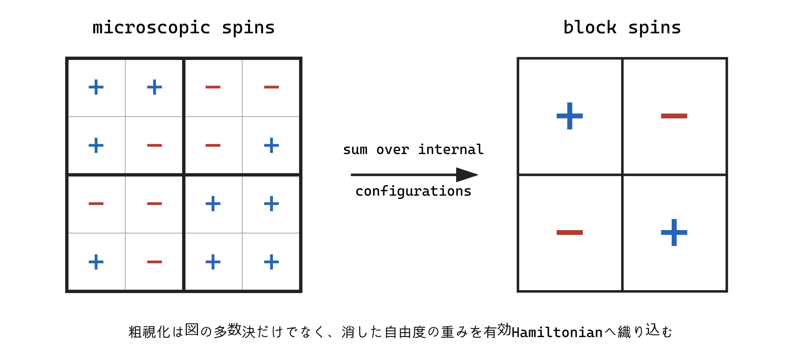

## 1. 最小の格子模型

Ising 模型は格子点 $i$ に $s_i=\pm1$ を置き、

$$
H[s]=-J\sum_{\langle ij\rangle}s_is_j-h\sum_i s_i
$$

とする。$\langle ij\rangle$ は最近接対を一度ずつ数える。$J>0$ なら隣同士が同符号のときエネルギーが低い。無次元 coupling を $K=\beta J$、$H_h=\beta h$ とすれば確率は $P[s]=Z^{-1}\exp(K\sum s_is_j+H_h\sum s_i)$ である。

一次元・有限範囲・有限温度の Ising 模型には相転移がない。domain wall 一個のエネルギー費用は有限だが、その位置のエントロピーが系長とともに増すからである。二次元正方格子の零磁場模型は Onsager により自由エネルギーが exact に解かれ、連続転移をもつ。三次元は高精度に理解されているが closed-form exact solution は知られていない。この対比は、模型が単純でも臨界点の全自由度を直接足し上げるのが難しいことを示す。

## 2. block spin を定義する

一辺 $b$ の block $B_I$ ごとに新しい変数 $S_I=\pm1$ を作る。多数決なら

$$
S_I=\operatorname{sign}\left(\sum_{i\in B_I}s_i\right)
$$

だが、同数時の規則が必要になる。より一般には確率核 $T(S,s)$ を用い、各 $s$ に対して

$$
\sum_{\{S_I\}}T(S,s)=1
$$

を要求する。決定論的多数決は $T$ が 0 または 1 の特殊例である。

粗視化後の Hamiltonian $H'[S]$ を

$$
e^{-\beta H'[S]}=
\sum_{\{s_i\}}T(S,s)e^{-\beta H[s]}
$$

で定義する。両辺を $S$ について和を取ると

$$
Z'=\sum_S e^{-\beta H'[S]}
=\sum_s e^{-\beta H[s]}=Z.
$$

分配関数を保存するのは、捨てたミクロ自由度の寄与を消去するのではなく、条件付きで総和し、残った変数の重みに織り込むためである。相加定数を Hamiltonian に含める規約では $Z$ が一致する。自由エネルギー密度を比較するときは block 数と格子間隔の変化も数える。

## 3. 粗視化は単なる近似か

上の $H'[S]$ の定義自体は有限系なら exact である。情報は $S$ の確率分布を再現する範囲で保持されるが、与えられた $S$ に対応する多数の $s$ を区別できないため写像は不可逆である。

近似は通常、その後に入る。exact な $H'$ は

$$
\beta H'[S]=C-K_1'\sum_{\langle IJ\rangle}S_IS_J
-K_2'\sum_{\langle\!\langle IJ\rangle\!\rangle}S_IS_J
-K_4'\sum_{IJKL}S_IS_JS_KS_L-\cdots
$$

のように、長距離二体相互作用、多体相互作用など、対称性が許すすべての項を一般に生成する。最近接項だけへ射影する real-space RG はここで近似となる。「粗視化」と「truncation」を区別しないと、誤差の出所が見えなくなる。

## 4. 1次元 decimation の exact 例

零磁場一次元 Ising 模型で偶数 site を残し、奇数 site を和から消す。3点 $s_{2i},s_{2i+1},s_{2i+2}$ のうち中央を和すると

$$
\sum_{s_{2i+1}=\pm1}
e^{K s_{2i+1}(s_{2i}+s_{2i+2})}
=2\cosh[K(s_{2i}+s_{2i+2})].
$$

端が同符号なら $2\cosh(2K)$、異符号なら $2$ である。これを

$$
A e^{K's_{2i}s_{2i+2}}
$$

と書けば

$$
Ae^{K'}=2\cosh(2K),\qquad Ae^{-K'}=2.
$$

割り算と掛け算から

$$
K'=\frac12\log\cosh(2K),\qquad
A=2\sqrt{\cosh(2K)}.
$$

この場合は同じ最近接形に閉じる。任意の有限 $K$ で $K'<K$ となり、反復で高温固定点 $K=0$ へ流れる。$K=\infty$ だけが零温度側の固定点で、有限温度相転移がない事実と整合する。

## 5. 再尺度化

block 化後の格子間隔は $a'=ba$ である。このままでは異なる格子上の理論を比較することになる。そこで座標を $x'=x/b$ と再定義して cutoff を元へ戻し、必要なら場の規格化も変える。この「積分消去＋座標再尺度化＋場再尺度化」の合成が一回の RG 変換である。

block size $b$ を変えると有限ステップの写像や coupling の座標表示は変わる。しかし同じ固定点を記述する適切な RG scheme なら、臨界指数のような固有値由来の universal data は一致するはずである。近似 truncation をすると $b$ 依存が残り、それは誤差評価の手掛かりになる。

## 6. なぜ group ではないか

粗視化は失ったミクロ情報から一意に元を復元できないので、一般に逆元をもたない。数学的には semigroup、あるいは scale 間の写像の族と呼ぶ方が正確である。「renormalization group」は歴史的名称であり、連続 RG の微分方程式が形式的に両向きに積分できる場合でも、物理的 UV completion が常に存在することを保証しない。

## 出典案内

cell magnetizationとblock-spin scalingの原型は [Kadanoff (1966)](https://journals.aps.org/ppf/abstract/10.1103/PhysicsPhysiqueFizika.2.263) にある。本章の確率核による現代的定式化をKadanoff原論文へ遡及的に帰属させず、歴史的直観と後の厳密な写像を区別する。

## 章末整理

### この章で分かったこと

粗視化は残す変数の確率分布を exact に定義できるが、effective Hamiltonian には一般に無限個の相互作用が生成される。実用計算の近似は主にその truncation に入る。

### よくある誤解

- partition function の保存は各ミクロ状態を保存することではない。
- coupling の flow は物理定数が時間変化する意味ではない。
- RG は一般には可逆な群ではない。

### 次の疑問

無限個の相互作用をどう整理し、「同じ固定点へ流れる」を数学的に表現するのか。

### その結果、何が説明できるようになったか

「遠くから見る」を条件付き和、有効 Hamiltonian、再尺度化へ翻訳できる。

### まだ説明できていないこと

無限個の coupling のうち長距離物理を変える方向の分類は未説明である。

### 次に自然に出てくる疑問

理論空間上で粗視化の反復をどう幾何学化するか。

