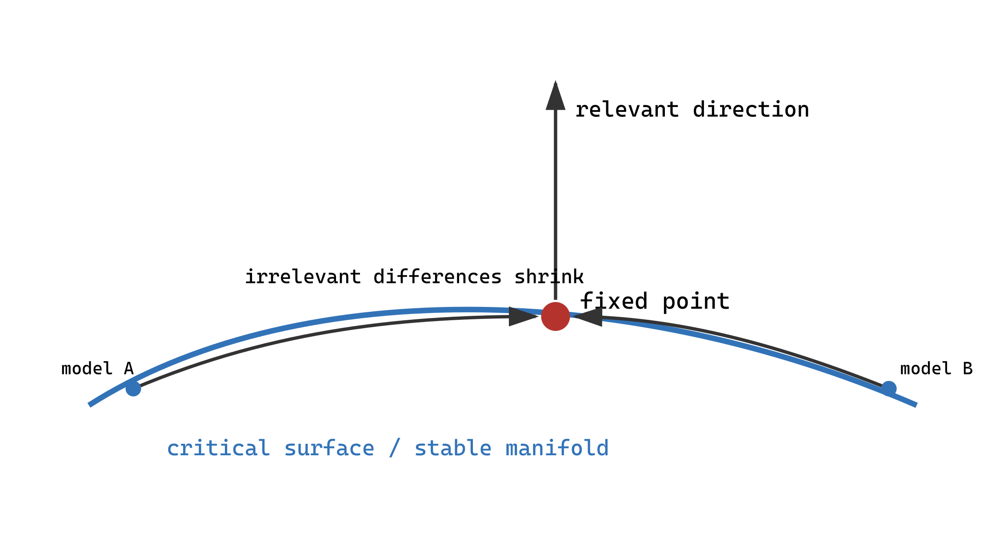

## 1. Hamiltonian を一点として見る

対称性と局所性が許す演算子 $\mathcal O_i$ を並べ、無次元作用を

$$
S[\phi]=\sum_i g_i\mathcal O_i[\phi]
$$

と書く。係数列 $(g_1,g_2,\ldots)$ を座標とみなした空間が theory space である。$\phi^2$、$\phi^4$、$(\nabla\phi)^2$ だけでなく、$\phi^6$、$(\nabla^2\phi)^2$、多体・長距離項など無限個が存在する。

「空間」といっても、すべての係数列が良い確率測度や量子論を定めるわけではなく、冗長演算子や場の再定義で同じ物理を表す点もある。有限次元の紙上の flow 図は、この無限次元構造の射影である。

RG 変換は

$$
R_b:\mathcal T\to\mathcal T,\qquad g_i'={\cal R}_i(\{g_j\};b)
$$

である。流れているのは時間中の物質ではなく、観測尺度を変えたときに同じ長距離物理を表現する action の係数である。

## 2. 固定点

固定点 $g^*$ は

$$
R_b(g^*)=g^*
$$

を満たす。ここで fixed なのは、粗視化と再尺度化の後の無次元作用の形である。格子単位の相関長は $\xi/a\mapsto(\xi/a)/b$ と変わるため、$b>1$ の固定点で取りうるのは $0$ または $\infty$ であり、正の有限値ではない。従って $\xi'=\xi/b$ から直接言えるのは、$\xi=\infty$ で特徴づけられる臨界面がRGで不変でなければならない、という点までである。連続相転移の長距離理論が特定の固定点へ収束することは、RG写像の大域的な力学系的性質に関する追加仮定または個別模型での同定である **[Universality basin assumption]**。第33部で見るように、runaway flow、walking、limit cycle では固定点へ到達しない。

高温独立 spin 固定点のように相関長が格子スケールで消える固定点もある。したがって「固定点はすべて臨界点」は誤りである。臨界固定点は長距離相関を保つ特別な固定点である。

## 3. 線形化と固有演算子

固定点近傍で $g_i=g_i^*+\delta g_i$ と置く。Taylor 展開の一次までなら

$$
\delta g_i'=M_{ij}\delta g_j+O(\delta g^2),
\qquad
M_{ij}=\left.\frac{\partial\mathcal R_i}{\partial g_j}\right|_{g^*}.
$$

$M$ の固有vector $v^{(\alpha)}$ 方向を使えば

$$
\delta g_\alpha'=b^{y_\alpha}\delta g_\alpha.
$$

この指数形は半群性から出る。RG変換は尺度因子について

$$
R_{b_1b_2}=R_{b_1}R_{b_2},\qquad b_1,b_2>1
$$

を満たすよう構成する。固有方向の倍率 $\lambda_\alpha(b)$ は $\lambda_\alpha(b_1b_2)=\lambda_\alpha(b_1)\lambda_\alpha(b_2)$ を満たし、連続性を仮定すれば $\lambda_\alpha(b)=b^{y_\alpha}$ である **[Local linear RG result]**。

線形化する理由は、固定点へ十分近づいた後は二次以上が一次より小さく、異なる方向の混合を固有basisでほどけるからである。固有vectorは単独の裸の monomial とは限らず、演算子の線形結合である。

- $y_\alpha>0$: relevant。IR へ粗視化するとずれが増える。
- $y_\alpha<0$: irrelevant。ずれが減る。
- $y_\alpha=0$: marginal。線形項だけでは判定できず、非線形 beta function が必要。

「relevant＝現実に重要」「irrelevant＝どの観測にも不要」という日常語の解釈は不正確である。これは特定の固定点と flow の向きに関する固有値分類である。

## 4. 臨界面と調整

固定点へ IR で近づく点の集合を stable manifold（臨界面）と呼ぶ。relevant 方向が一つなら、その成分をゼロにする条件が一つ必要で、実験では温度を $T_c$ に合わせる操作に対応する。磁場も許せば Ising 固定点には通常、温度型と磁場型の二つの relevant scalar direction があり、$t=h=0$ を調整する。

異なる格子、相互作用、物質が臨界面上で同じ固定点へ近づくと、irrelevant coupling の差は

$$
\delta g_\alpha^{(n)}=b^{ny_\alpha}\delta g_\alpha^{(0)}\to0
\quad(y_\alpha<0)
$$

となる。これが普遍性の力学系としての説明である。指数は固定点と線形化固有値で決まり、初期点の細部には依存しない。

## 5. marginal と dangerously irrelevant

marginal coupling の例として beta function が

$$
\frac{dg}{d\ell}=-Ag^2+O(g^3),\qquad A>0
$$

なら、$g>0$ は $g(\ell)\sim1/(A\ell)$ とゆっくりゼロへ行く marginally irrelevant である。符号が逆なら増えて摂動領域を離れる。線形固有値ゼロだけでは結論できない。

dangerously irrelevant variable は固定点へはゼロに流れるが、観測量をその coupling の正則 Taylor 展開で置けない場合に現れる。$d>4$ の Ising/$\phi^4$ 理論では quartic coupling $u$ は Gaussian 固定点で irrelevant だが、ordered phase の安定化と $m^2\sim -r/u$ に不可欠である。$u=0$ を早く代入すると発散し、単純 hyperscaling を誤る。

## 6. scheme dependence と不変量

粗視化 kernel、cutoff、coupling の座標変換により beta function の係数や固定点座標は変わりうる。RG変換そのものは一意ではない。例えばblockの形、kernel、場の規格化を変えると、同じ長距離物理を別の座標で表す。滑らかな座標変換 $\tilde g=f(g)$ では flow の成分表示が変わるからである。しかし exact な理論で固定点の線形化固有値、臨界指数、適切に定義された S-matrix や universal amplitude ratio は不変である。truncation 計算で scheme dependence が残るとき、それは物理が曖昧なのではなく近似誤差を反映する。

「RGがgroupと呼ばれる」理由も二層ある。Gell-Mann–Low や Stueckelberg–Petermann の文脈では、renormalization point や有限countertermの再パラメータ化を合成でき、逆変換も持つので群構造が現れる。一方、統計力学の粗視化は短距離自由度を積分して情報を落とすため、一般に逆変換を持たない。現代的には、粗視化RGは $b>1$ の半群、renormalized記述の再パラメータ化は群、と区別する **[Conceptual distinction]**。

## 出典案内

無限次元の理論空間、固定点、irrelevant variableによる普遍性という構成は [Wilson (1971 I)](https://journals.aps.org/prb/pdf/10.1103/PhysRevB.4.3174) と [Wilson (1971 II)](https://journals.aps.org/prb/abstract/10.1103/PhysRevB.4.3184) を参照する。

## 章末整理

### この章で分かったこと

RG は無限次元 theory space 上の力学系であり、臨界固定点の stable manifold が普遍性クラスを組織する。relevant の個数は臨界点へ到達するための調整条件の個数に対応する。

### まだ説明できていないこと

具体的な連続場理論で $M$ や beta function をどう計算するかは次章以降の課題である。

### よくある誤解

- irrelevant coupling は有限スケールの補正や相の安定性に無関係とは限らない。
- 固定点の座標値そのものは普遍的とは限らない。

### その結果、何が説明できるようになったか

異なる Hamiltonian が同じ指数をもつ機構と、普遍性が全情報の一致ではない理由を説明できる。

### 次に自然に出てくる疑問

連続場の operator basis で canonical dimension と loop 補正をどう求めるか。

