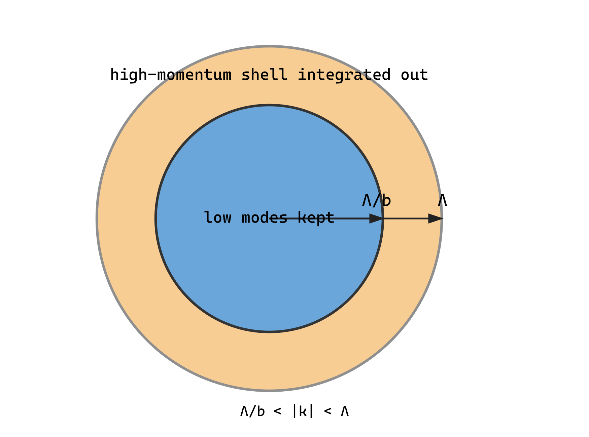

## 1. 何を固定し、何を積分するか

一成分 $\phi^4$ 理論

$$
S[\phi]=\frac12\int_{|k|<\Lambda}\frac{d^dk}{(2\pi)^d}
(k^2+r)|\phi(k)|^2+
\frac u{4!}\int d^dx\,\phi(x)^4
$$

を考える。$b=e^{\ell}>1$ とし、場を $\phi=\phi_<+\phi_>$ に分ける。

$$
\phi_<:\ |k|<\Lambda/b,\qquad
\phi_>:\ \Lambda/b<|k|<\Lambda.
$$

これは場の振幅の大小ではなく Fourier mode の波数による分割である。effective action を

$$
e^{-S_{\rm eff}[\phi_<]}=
\int\mathcal D\phi_>e^{-S[\phi_<+\phi_>]}
$$

で定義する。この等式自体は正則化された有限積分として exact である。

## 2. cumulant 展開

Gaussian 高速 mode の平均を $\langle\cdot\rangle_>$ と書けば

$$
S_{\rm eff}=S_0[\phi_<]
-\log\left\langle e^{-S_{\rm int}[\phi_<+\phi_>]}
\right\rangle_>+\text{定数}.
$$

$X=S_{\rm int}$ として

$$
-\log\langle e^{-X}\rangle
=\langle X\rangle-\frac12
(\langle X^2\rangle-\langle X\rangle^2)+O(X^3).
$$

ここから $u$ の次数で摂動する。近似は、高速 mode を積分する定義ではなく、cumulant を有限次数で切り、生成される演算子を微分展開して一部だけ残す点に入る。

## 3. $r$ の one-loop 補正

$$
(\phi_<+\phi_>)^4=
\phi_<^4+4\phi_<^3\phi_>+6\phi_<^2\phi_>^2
+4\phi_<\phi_>^3+\phi_>^4.
$$

Gaussian 平均で奇数個の $\phi_>$ はゼロ。$6\phi_<^2\phi_>^2$ から

$$
\delta S_r=
\frac u{4!}6\int d^dx\,\phi_<^2(x)
\langle\phi_>^2(x)\rangle_>.
$$

$$
\langle\phi_>^2(x)\rangle_>
=\int_{\Lambda/b<|q|<\Lambda}
\frac{d^dq}{(2\pi)^d}\frac1{q^2+r}
\equiv I_1(r).
$$

$\delta S_r=(\delta r/2)\int\phi_<^2$ と比較して

$$
\delta r=\frac u2 I_1(r).
$$

球対称 cutoff なら $d^dq=S_{d-1}q^{d-1}dq$、

$$
S_{d-1}=\frac{2\pi^{d/2}}{\Gamma(d/2)},\qquad
K_d=\frac{S_{d-1}}{(2\pi)^d},
$$

なので

$$
I_1(r)=K_d\int_{\Lambda/b}^{\Lambda}dq\,
\frac{q^{d-1}}{q^2+r}.
$$

薄い shell では増分を次元 $d$ と区別して $b=e^{\delta\ell}\simeq1+\delta\ell$ と書く。shell 幅は $\Lambda\delta\ell$ だから

$$
I_1(r)=K_d\frac{\Lambda^d}{\Lambda^2+r}\delta\ell
+O((\delta\ell)^2).
$$

この補正が additive なので、相互作用系の臨界点は裸の $r=0$ からずれる。以後の温度型変数は臨界面 $r_c(u)$ からのずれとして取る必要がある。

## 4. $u$ の one-loop 補正

cumulant の二次項で二つの quartic vertex を高速 propagator 二本で結ぶ connected contraction が生じる。係数を飛ばさず数える。各 vertex から低速場を二本、高速場を二本選ぶ項は

$$
A=\frac u{4!}\binom42\int d^dx\,
\phi_<^2(x)\phi_>^2(x)
=\frac u4\int d^dx\,\phi_<^2(x)\phi_>^2(x).
$$

Wick の定理から、二つの高速場を異なる vertex 間で結ぶ connected 部分は

$$
\langle\phi_>^2(x)\phi_>^2(y)\rangle_{>,c}
=2G_>(x-y)^2.
$$

二という係数は $x$ の二本を $y$ の二本へ結ぶ pairing が二通りあるためである。第二 cumulant は従って

$$
-\frac12\langle A^2\rangle_c
=-\frac{u^2}{16}\int d^dx\,d^dy\,
\phi_<^2(x)\phi_<^2(y)G_>(x-y)^2.
$$

低速の外部運動量が shell の代表運動量 $\Lambda$ より十分小さい領域で、vertex function を外部運動量について展開する。sharp な薄い shell の実空間 kernel は振動する長い尾をもちうるため、「$G_>$ が $\Lambda^{-1}$ に厳密に局在する」ことを根拠にはしない。運動量展開の局所項に射影することが、実空間では $\phi_<^2(y)=\phi_<^2(x)+\cdots$ と置く操作に対応する。すると

$$
\int d^dy\,G_>(x-y)^2
=\int_{\rm shell}\frac{d^dq}{(2\pi)^d}
\frac1{(q^2+r)^2}=I_2(r).
$$

得られた $-u^2I_2\int\phi_<^4/16$ を $\delta u\int\phi_<^4/4!$ と比較すると

$$
\delta u=-\frac{3u^2}{2}I_2(r),
$$

$$
I_2(r)=\int_{\rm shell}\frac{d^dq}{(2\pi)^d}
\frac1{(q^2+r)^2}
=K_d\frac{\Lambda^d}{(\Lambda^2+r)^2}\delta\ell+O((\delta\ell)^2).
$$

負符号は $-1/2$ の第二 cumulant、係数 $3/2=4!/16$ は vertex の二項選択と Wick pairing に由来する。この計算では外部運動量を shell 運動量に比べて小さいとして展開し、最低次の局所項を残した。Taylor 展開の次項からは $\phi^2(\nabla\phi)^2$ など高階微分演算子も生成される。

## 5. 再尺度化と場の再規格化

shell を除いた後、$k'=bk$、従って $x'=x/b$ とする。実空間の場を

$$
\phi'(x')=b^{(d-2)/2}\phi_<(x)
$$

と選ぶと、$\int d^dx(\nabla\phi)^2/2$ の係数が 1 に戻る。tree level で

$$
r'=b^2r,\qquad u'=b^{4-d}u.
$$

loop 補正を組み合わせ、無次元量 $\tilde r=r/\Lambda^2$、$g=K_du\Lambda^{d-4}$ を使う一つの規約では

$$
\frac{d\tilde r}{d\ell}
=2\tilde r+\frac{g}{2(1+\tilde r)}+O(g^2),
$$

$$
\frac{dg}{d\ell}
=(4-d)g-\frac{3g^2}{2(1+\tilde r)^2}+O(g^3).
$$

係数は $g$ の定義と cutoff scheme に依存する。この式を別規約の式と数値だけ比較してはいけない。

この二式がどこから来たかも明記する。有限ステップでは

$$
r'=b^2\left[r+\frac u2I_1(r)\right],
\qquad
u'=b^{4-d}\left[u-\frac{3u^2}{2}I_2(r)\right].
$$

$b=e^{\delta\ell}$ を一次展開し、$I_1,I_2$ の $\delta\ell$ 部分を代入してから、$\delta\ell$ で割った極限が上の微分方程式である。積分消去の補正と canonical rescaling の補正を別々に足している。

## 6. 波動関数繰り込み

この一成分理論の one-loop tadpole は外部運動量に依存せず、$(\nabla\phi)^2$ の係数を変えない。従って $\eta=0+O(u^2)$ である。$\eta$ が厳密にゼロという意味ではなく、最初の非零寄与が二 loop に現れるという意味である。

## 7. 近似の台帳

**[Exact definition]** 高速 mode を積分して $S_{\rm eff}$ を定義すること。

**[Perturbative result]** cumulant を $u^2$ まで残した one-loop beta function。

**[Derivative expansion]** 小さい外部運動量で展開し局所演算子を残すこと。

**[Truncation]** $\phi^2,\phi^4,(\nabla\phi)^2$ 以外の生成演算子を捨てること。

**[Infinitesimal-shell approximation]** $d\ell$ の一次だけを残すこと。

## 出典案内

momentum-shell積分、cumulant expansion、再尺度化によるrecursionの歴史的・技術的整理は [Wilson–Kogut (1974)](https://doi.org/10.1016/0370-1573(74)90023-4) を参照する。本章の係数は明示した $g=K_du\Lambda^{d-4}$ 規約に固有である。

## 章末整理

### この章で分かったこと

momentum-shell RG は積分消去、cutoff を戻す座標再尺度化、運動項を規格化する場再尺度化の三段階である。loop により $r,u$ が変化し、他の全許容演算子も生成される。

### 次の疑問

$d=4-\epsilon$ でこの flow はどの固定点をもち、臨界指数をどう与えるのか。

### その結果、何が説明できるようになったか

mass と quartic coupling の beta function を Wick contraction と shell 積分から追跡できる。

### まだ説明できていないこと

固定点の安定行列から臨界指数を取り出す計算は次章へ残る。

### よくある誤解

- exact な shell integration と loop・微分展開・operator truncation は同じ近似ではない。
- one-loop で $\eta=0$ でも exact にゼロとは限らない。

### 次に自然に出てくる疑問

二変数固定点と固有方向を具体的にどう計算するか。

