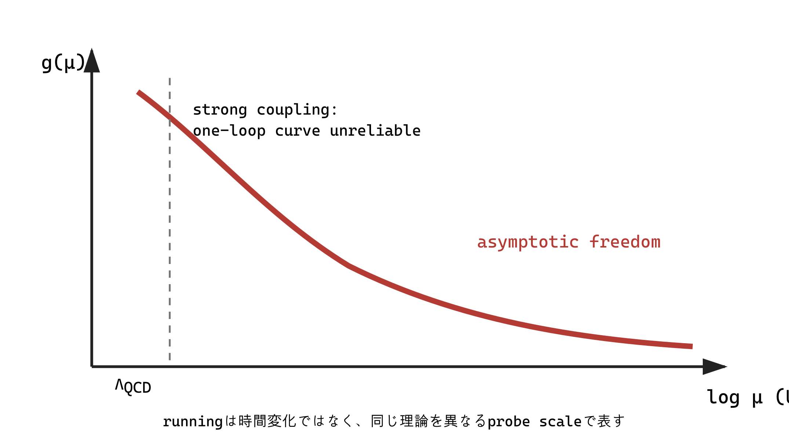

## 1. 統計場理論と量子場理論が出会う理由

$d$ 次元古典統計系の Boltzmann 重み $e^{-S_E}$ と、Euclidean 化した $d$ 次元量子場理論の functional integral は同じ数学的形をもつ。さらに $d$ 次元量子系の零温度問題は虚時間を加えた $d+1$ 次元古典系と関係する。ただし時間の異方性や動的指数 $z$ があるため、常に単純な $d+1$ 次元等方模型になるとは限らない。

## 2. bare と renormalized

正則化 cutoff $\Lambda$ を置いた Lagrangian の $g_0,m_0$ を bare parameter と呼ぶ。これらは「装置が直接測る真の値」ではなく、regulator と cutoff に依存する入力である。観測条件を定め、ある尺度 $\mu$ で Green 関数や散乱振幅が指定値を取るように定義した $g(\mu),m(\mu)$ が renormalized parameter である。

連続極限 $\Lambda\to\infty$ を保つには、bare parameter を cutoff とともに調整することがある。発散する bare quantity が単独で物理量になる必要はない。予言は renormalized observables の有限な関係にある。

## 3. Callan–Symanzik の RG

renormalization scale $\mu$ は計算上導入した任意尺度であり、物理的 Green 関数は裸の理論を固定すればその選択に依存しない。この条件から概略

$$
\left[
\mu\frac{\partial}{\partial\mu}
+\beta(g)\frac{\partial}{\partial g}
-n\gamma_\phi(g)
+\gamma_m(g)m\frac{\partial}{\partial m}
\right]G^{(n)}=0
$$

を得る。定義

$$
\beta(g)=\mu\left.\frac{dg}{d\mu}\right|_{g_0}
$$

で bare parameter を固定することが重要である。

running coupling は時間とともに基本定数が変化する意味ではない。異なる probe scale で同じ物理を少ない対数補正で表すときの有効 coupling である。大きな $\log(Q/\mu)$ を避けるよう $\mu\sim Q$ を選び、RG 方程式で多数次数の logarithm を再総和する。

### 二つの flow parameter の向き

本書の Wilson 流では

$$
\ell=\log\frac{\Lambda_{\rm UV}}k
$$

を使うので、$\ell$ が増えるほど IR、すなわち小さい cutoff $k$ へ進む。一方 Callan–Symanzik の $\beta_{\rm CS}=\mu\,dg/d\mu$ は $\mu$ が増える UV 向きに定義される。同じ coupling 座標を $k=\mu$ と同一視できる場合でも

$$
\frac{dg}{d\ell}=-\mu\frac{dg}{d\mu}=-\beta_{\rm CS}(g)
$$

となる。従って「beta function が正なら relevant」のように、flow parameter の定義を示さず符号だけを読むことはできない。統計力学の粗視化と QCD の高エネルギー極限が逆向きに語られるのはこのためである。

## 4. Wilsonian RG との関係と差

Wilsonian RG は cutoff shell を実際に積分し、cutoff 依存の action $S_\Lambda$ に全許容演算子を生成する。Callan–Symanzik RG は renormalized correlation function の $\mu$ 依存を記述し、minimal subtraction では各段階で物理的 shell を消しているとは限らない。

両者は scale dependence、fixed point、anomalous dimension、universality を共通に捉えるが、操作を逐語的に同一視してはいけない。低エネルギー observables が短距離 regulator に依存しないことを、別の座標系・scheme で表す統合的な視点を与える。

| 観点 | Wilson RG | MS / 摂動論的繰り込み |
|---|---|---|
| 固定するもの | 長距離分配関数・低運動量相関 | bare量を固定したrenormalized相関 |
| 動かすもの | cutoff $\Lambda e^{-\ell}$ と全Wilson係数 | subtraction scale $\mu$ とrenormalized parameter |
| cutoffの役割 | 積分するmodeの境界 | regulatorまたは補助的発散制御 |
| renormalization condition | coarse-graining規則・場の再規格化 | MS、物理点条件など |
| scheme dependence | kernel・cutoff shape・座標 | subtraction scheme・coupling定義 |
| 連続極限/UV completion | cutoffを上げつつ臨界面へtune | bare parameterを調整し有限相関を保つ |
| flowの向き | $\ell$ 増加がIR | $\mu$ 増加がUV |

## 5. scheme dependence

coupling を $\tilde g=g+ag^2+\cdots$ と再定義すれば beta function の高次係数は変わる。固定点座標も変わる。一方、exact な固定点での scaling dimension や正しく計算した observables では scheme dependence が相殺される。有限次数で残る scheme dependence は truncation uncertainty の一部である。

## 6. Effective Field Theory

重い尺度 $M$ と低い観測エネルギー $E\ll M$ があるとき、重い自由度を積分し

$$
\mathcal L_{\rm EFT}=\mathcal L_{\rm light}^{(\le d)}
+\sum_i\frac{C_i(\mu)}{M^{\Delta_i-d}}\mathcal O_i
$$

と書く。対称性が許す演算子をすべて含めるが、$E/M$ の power counting により所望精度で有限個だけ必要になる。高次元演算子は「不整合」ではなく、cutoff 以下で予測精度を系統化する項である。

RG固有値との対応は一行で書ける。静的な局所摂動を $g_i\int d^dx\,\mathcal O_i$ と書くと

$$
y_i=d-\Delta_i,\qquad
g_i(\ell)=g_i(0)e^{y_i\ell}.
$$

EFTで $\Delta_i>d$ の演算子が $E/M$ により

$$
\frac{C_i}{M^{\Delta_i-d}}\mathcal O_i
\quad\Rightarrow\quad
\Delta\mathcal A_i/\mathcal A_{\rm lead}\sim (E/M)^{\Delta_i-d}
$$

と抑制されることは、IRへ進むと $y_i<0$ のirrelevant couplingが $e^{y_i\ell}$ で小さくなることと同じ内容である **[Power-counting equivalence]**。

### matching と running

1. $\mu\sim M$ で UV 理論と EFT の amplitude または Green 関数を一致させ、Wilson coefficient $C_i(M)$ を決める。
2. EFT の RG 方程式で $C_i$ を低尺度へ走らせ、大きな対数を再総和する。
3. 低尺度で matrix element と組み合わせ、$\mu$ 依存が所定次数で消える observable を得る。

mass-independent scheme では重い粒子の寄与が自動的に式から消えないことがあり、threshold matching が必要である。また非 decoupling の条件もあるため「重いものは常に影響ゼロ」とは言えない。

## 7. renormalizable の意味の変化

古い狭い見方では、有限個の counterterm で cutoff を無限大へ送れる理論だけを fundamental とみなしがちだった。Wilsonian/EFT の見方では、cutoff 以下の有限精度の予言に必要な演算子は有限個であり、irrelevant operators の効果は尺度比で抑制される。renormalizability は、低エネルギーで relevant/marginal operators が主導することの表現として理解できる。

## 出典案内

running chargeの歴史は [Gell-Mann–Low (1954)](https://journals.aps.org/pr/abstract/10.1103/PhysRev.95.1300)、renormalized Green関数のscale方程式は [Callan (1970)](https://journals.aps.org/prd/abstract/10.1103/PhysRevD.2.1541) と [Symanzik (1970)](https://doi.org/10.1007/BF01649434) を参照する。EFTの一般的Lagrangianは [Weinberg (1979)](https://cds.cern.ch/record/419611)、重い自由度のdecouplingは仮定付きで [Appelquist–Carazzone (1975)](https://doi.org/10.1103/PhysRevD.11.2856) に基づく。

## 章末整理

### この章で分かったこと

renormalization は発散を隠す技法だけでなく、尺度を変えたときの有効記述を結ぶ構造である。Wilsonian RG は EFT の power counting と UV 詳細の抑制を自然に説明する。

### よくある誤解

- bare parameter は直接観測される真の定数ではない。
- running coupling は時間変化ではない。
- nonrenormalizable operator は禁止項ではない。
- scheme dependence があることは observable が任意という意味ではない。

### その結果、何が説明できるようになったか

発散処理、尺度依存、Wilsonian coarse graining、EFT の matching と running を区別して接続できる。

### まだ説明できていないこと

強結合 QFT、gauge theory の具体的 beta function、非摂動 RG の解法は未説明である。

### 次に自然に出てくる疑問

確率分布の極限定理や CFT は固定点像をどこまで厳密化するか。

